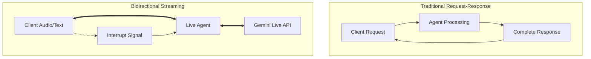
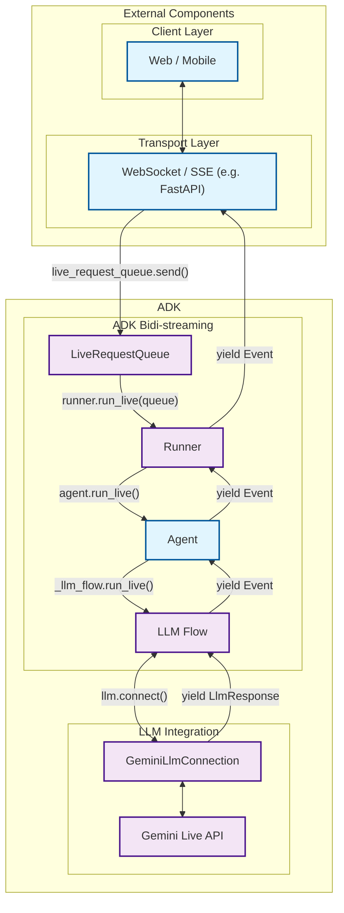
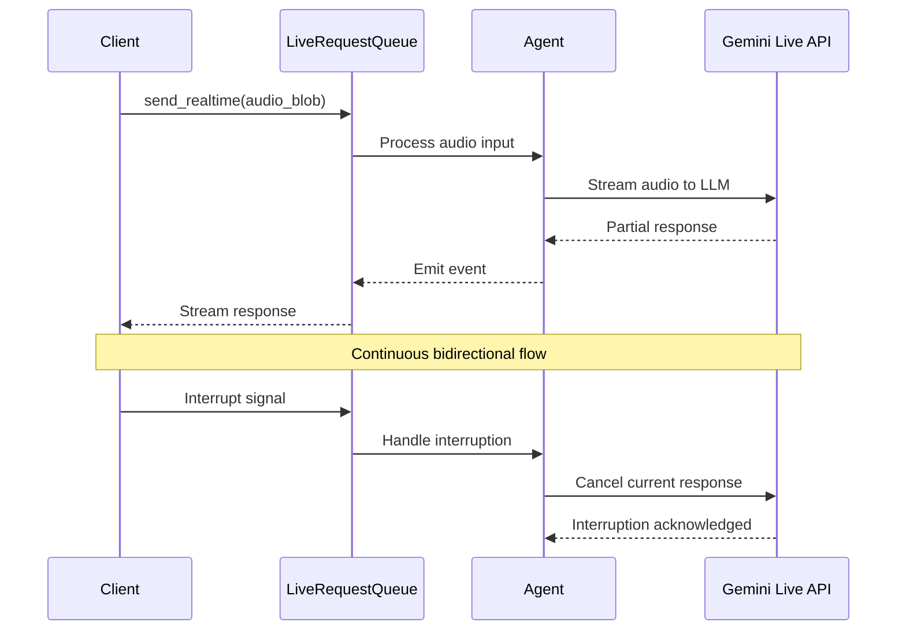

# Chapter 1: Introduction to Bidirectional Streaming

Welcome to the comprehensive guide for bidirectional streaming with Google's Agent Development Kit (ADK). This chapter introduces the fundamental concepts, architecture, and setup required to build real-time, interactive AI agents.

## 1.1 What is Bidirectional Streaming?

Bidirectional streaming enables **real-time, two-way communication** between clients and AI agents, allowing for natural, human-like conversations with immediate responses and the ability to interrupt ongoing interactions.

### Key Characteristics

- **Low Latency**: Near-instantaneous response times for natural conversation flow
- **Interrupt Capability**: Users can interrupt the agent mid-response with new input
- **Multi-Modal**: Supports text, audio, and video inputs simultaneously
- **Real-Time**: Continuous data exchange without waiting for complete responses

### Difference from Other Streaming Types

!!! info "Streaming Types Comparison"

    **Bidirectional Streaming (Live)** differs from other streaming approaches:
    
    - **Server-Side Streaming**: One-way data flow from server to client
    - **Token-Level Streaming**: Sequential text token delivery without interruption
    - **Bidirectional Streaming**: Full two-way communication with interruption support



### Real-World Applications

- **Voice Assistants**: Natural conversation with interruption capability
- **Live Customer Support**: Real-time audio/video support with instant responses
- **Interactive Gaming**: AI NPCs that respond to player actions immediately
- **Live Data Monitoring**: Agents that react to real-time data changes
- **Educational Tutoring**: Interactive learning with immediate feedback

## 1.2 ADK Streaming Architecture Overview

ADK's streaming architecture enables seamless integration with the **Gemini Live API** through a sophisticated pipeline designed for low-latency, high-throughput communication.

### High-Level Architecture



### Core Components

#### LiveRequestQueue
The central communication hub that manages bidirectional message flow between clients and agents.

```python
# Core usage pattern
live_request_queue = LiveRequestQueue()
live_request_queue.send_content(text_content)
live_request_queue.send_realtime(audio_blob)
```

#### Gemini Live API Integration
Direct integration with Google's Gemini Live API for real-time AI processing.

```python
# Configuration for live streaming
run_config = RunConfig(
    response_modalities=["TEXT", "AUDIO"],
    streaming_mode="SSE"
)
```

#### Event-Driven Processing
Asynchronous event processing for handling multiple concurrent streams.

### Data Flow Visualization



## 1.3 Setting Up Your Development Environment

Let's get your development environment ready for building streaming agents with ADK.

### Prerequisites

- **Python 3.8+**: Required for ADK compatibility
- **Google API Key**: For Gemini Live API access
- **FastAPI**: For web-based streaming applications (optional)

### Installation Steps

#### 1. Install ADK with Streaming Support

```bash
# Install the latest stable version
pip install google-adk

# Or install development version for latest features
pip install git+https://github.com/google/adk-python.git@main
```

#### 2. Set Up API Keys

!!! warning "API Key Required"

    You'll need a Google API key to access the Gemini Live API. Get yours at [Google AI Studio](https://aistudio.google.com/).

Create a `.env` file in your project root:

```bash
# Required for Gemini Live API
GOOGLE_API_KEY=your_gemini_api_key_here

# Optional: Google Cloud configuration
GOOGLE_CLOUD_PROJECT=your-project-id
GOOGLE_CLOUD_LOCATION=us-central1
```

#### 3. Verify Installation

Run the environment setup script to validate your configuration:

```python title="Quick verification"
from google.adk.agents import LiveRequestQueue
from google.adk.runners import InMemoryRunner

# This should run without errors
queue = LiveRequestQueue()
runner = InMemoryRunner()
print("✅ ADK streaming components available!")
```

### Project Structure

Organize your streaming project with this recommended structure:

```
your-streaming-project/
├── .env                    # Environment variables
├── .env.example           # Sample environment file
├── requirements.txt       # Python dependencies
├── src/
│   ├── agents/           # Your streaming agents
│   ├── tools/            # Custom tools
│   └── utils/            # Helper functions
├── static/               # Web assets (if using FastAPI)
├── templates/            # HTML templates
└── tests/                # Test files
```

### Essential Imports

Here are the core imports you'll use throughout this guide:

```python title="Essential ADK streaming imports"
# Core streaming components
from google.adk.agents import Agent, LiveRequestQueue
from google.adk.runners import InMemoryRunner
from google.adk.agents.run_config import RunConfig

# Content handling
from google.genai.types import Content, Part, Blob

# Web framework (for web-based streaming)
from fastapi import FastAPI, WebSocket
```

### Environment Validation

Use our complete environment setup script to ensure everything is configured correctly:

!!! example "Complete Setup Script"

    See [`1-3-1_environment_setup.py`](../src/chapter1/1-3-1_environment_setup.py) for a comprehensive environment validation script that checks:
    
    - ADK installation and version
    - Required environment variables
    - API key validation
    - Basic import verification

### Next Steps

With your environment set up, you're ready to dive into the core streaming APIs in Chapter 2. You'll learn about:

- **LiveRequestQueue**: The heart of bidirectional communication
- **run_live() method**: Starting streaming sessions
- **Event processing**: Handling real-time responses
- **Gemini Live API**: Direct integration patterns

!!! tip "Development Workflow"

    As you progress through this guide:
    
    1. **Run the code examples** - Each chapter includes working Python scripts
    2. **Experiment with parameters** - Modify configurations to see the effects
    3. **Check the logs** - Enable debug logging to understand the data flow
    4. **Start simple** - Begin with text-only streaming before adding audio/video

---

**Ready to build your first streaming agent?** Continue to [Chapter 2: Core Streaming APIs](chapter2.md) to explore the fundamental building blocks of ADK's streaming system.
