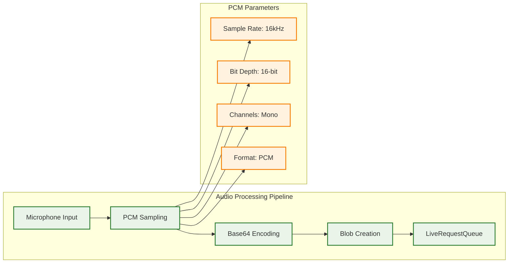
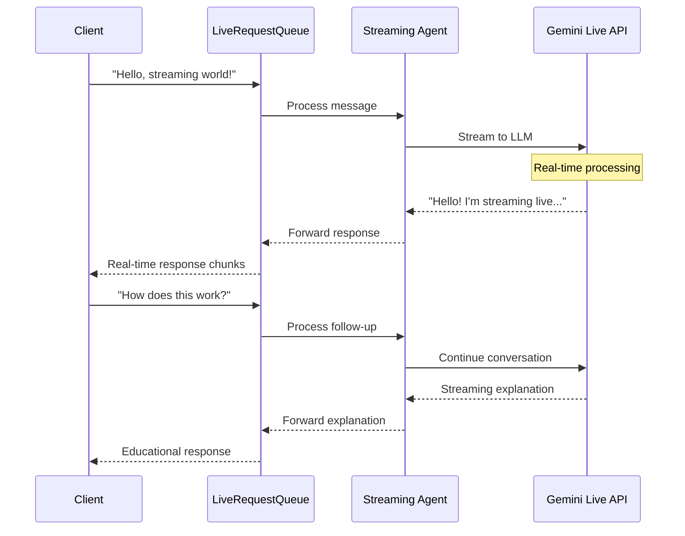
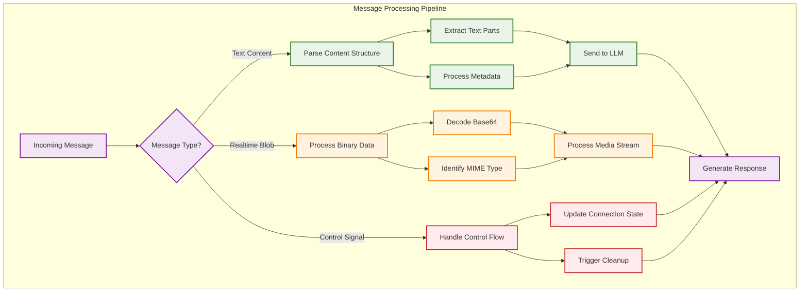

# Chapter 3: Basic Streaming Concepts

Having mastered the core streaming APIs in Chapter 2, you're now ready to explore the fundamental concepts that make streaming applications truly powerful. This chapter bridges the gap between understanding the technical mechanics and building real-world streaming applications that handle audio, video, and multimodal interactions with the finesse of professional streaming platforms.

You'll discover how to handle audio and video data with the same ease as text, create your first complete streaming agent that showcases everything you've learned, and master the different message types that enable rich, interactive conversations. By the end of this chapter, you'll have the practical skills to build streaming applications that feel genuinely magical to users while being grounded in solid engineering principles.

## 3.1 Audio and Video Streaming Fundamentals

Audio and video streaming represents one of the most exciting frontiers in AI agent development, transforming static text conversations into dynamic, multimodal experiences that feel as natural as talking to another person. ADK's approach to multimedia streaming isn't just about moving data—it's about creating seamless experiences where voice, video, and text blend together effortlessly.

The foundation of multimedia streaming in ADK rests on understanding how different types of media are encoded, transmitted, and processed in real-time. Unlike traditional file-based media handling, streaming requires thinking about data as continuous flows rather than discrete objects, with careful attention to timing, synchronization, and quality management.

### PCM Audio Encoding and Blob Structures

**Pulse Code Modulation (PCM)** serves as the foundation for audio streaming in ADK, providing uncompressed, high-quality audio that maintains the fidelity required for AI processing. PCM represents audio as a sequence of digital samples taken at regular intervals, creating a direct digital representation of analog sound waves.



#### Creating Audio Blobs

```python
import base64
from google.genai.types import Blob

# Convert PCM audio data to ADK Blob format
def create_audio_blob(pcm_audio_data: bytes) -> Blob:
    """Convert raw PCM audio data to streaming Blob format."""
    
    # Base64 encode the audio data
    encoded_audio = base64.b64encode(pcm_audio_data).decode('utf-8')
    
    # Create Blob with proper MIME type
    audio_blob = Blob(
        mime_type="audio/pcm",  # Standard PCM MIME type
        data=encoded_audio      # Base64-encoded audio data
    )
    
    return audio_blob

# Send audio to streaming agent
live_request_queue.send_realtime(audio_blob)
```

#### Audio Quality Considerations

**Sample Rate Selection:**
- **16kHz**: Optimal for speech recognition and AI processing, balances quality and performance
- **22kHz**: Higher quality for music or complex audio scenarios
- **44.1kHz**: CD quality, typically unnecessary for voice interactions

**Bit Depth Impact:**
- **16-bit**: Standard for voice applications, provides sufficient dynamic range
- **24-bit**: Higher quality but increased bandwidth and processing requirements

### Video Stream Handling and MIME Types

Video streaming in ADK follows similar principles to audio but involves additional complexity due to the higher data volumes and the need for efficient compression. The system supports various video formats while maintaining real-time processing capabilities.

```python
# Video blob creation example
def create_video_blob(video_data: bytes, format: str = "webm") -> Blob:
    """Create video blob for streaming."""
    
    mime_types = {
        "webm": "video/webm",
        "mp4": "video/mp4",
        "avi": "video/avi"
    }
    
    encoded_video = base64.b64encode(video_data).decode('utf-8')
    
    video_blob = Blob(
        mime_type=mime_types.get(format, "video/webm"),
        data=encoded_video
    )
    
    return video_blob
```

### Media Format Considerations and Chunking

**Chunking Strategy for Real-time Processing:**

```python
def stream_large_media_file(file_path: str, chunk_size: int = 1024 * 64):
    """Stream large media files in chunks for real-time processing."""
    
    with open(file_path, 'rb') as media_file:
        while True:
            chunk = media_file.read(chunk_size)
            if not chunk:
                break
            
            # Create blob for each chunk
            chunk_blob = create_audio_blob(chunk)
            live_request_queue.send_realtime(chunk_blob)
            
            # Small delay to prevent overwhelming the queue
            await asyncio.sleep(0.01)
```

**Format Selection Guidelines:**
- **Audio**: PCM for highest quality, MP3 for bandwidth optimization
- **Video**: WebM for web compatibility, MP4 for broad device support
- **Compression**: Balance quality vs. real-time processing requirements

!!! example "Complete Audio Processing Example"
    
    See [`3-1-1_audio_processing.py`](../src/chapter3/3-1-1_audio_processing.py) for comprehensive demonstrations of:
    
    - PCM audio blob creation and streaming
    - Real-time audio chunk processing
    - Video format handling and optimization
    - Media synchronization techniques

## 3.2 Your First Streaming Agent

Creating your first streaming agent represents a milestone moment in your development journey—the point where theoretical knowledge transforms into practical capability. This isn't just about getting code to work; it's about understanding how to architect streaming applications that feel responsive, natural, and reliable.

Your first streaming agent will demonstrate all the core concepts from previous chapters working together harmoniously: LiveRequestQueue buffering and sequencing user messages, run_live() processing events in real-time, and the entire system responding to user interactions with the immediacy that makes streaming feel magical.

### Simple "Hello World" Streaming Architecture



### Complete Streaming Agent Implementation

```python
from google.adk.agents import Agent, LiveRequestQueue
from google.adk.runners import InMemoryRunner
from google.adk.agents.run_config import RunConfig
from google.genai.types import Content, Part

class HelloStreamingAgent:
    """Your first complete streaming agent implementation."""
    
    def __init__(self):
        # Create agent optimized for streaming
        self.agent = Agent(
            name="hello_streaming",
            model="gemini-2.0-flash",
            instruction="""You are a friendly streaming AI assistant demonstrating 
            real-time conversation capabilities. Keep responses conversational 
            and engaging while showcasing streaming features.""",
            description="First streaming agent for learning purposes"
        )
        
        self.runner = InMemoryRunner(agent=self.agent)
    
    async def start_conversation(self):
        """Start an interactive streaming conversation."""
        
        live_request_queue = LiveRequestQueue()
        
        # Configure for optimal streaming experience
        run_config = RunConfig(
            response_modalities=["TEXT"],
            streaming_mode="SSE"
        )
        
        # Send welcome message
        welcome = Content(parts=[Part(text="Hello! Welcome to streaming AI!")])
        live_request_queue.send_content(welcome)
        live_request_queue.close()
        
        # Process streaming conversation
        async for event in self.runner.run_live(
            user_id="hello_user",
            session_id="hello_session",
            live_request_queue=live_request_queue,
            run_config=run_config
        ):
            # Handle streaming events
            await self._process_event(event)
    
    async def _process_event(self, event):
        """Process individual streaming events."""
        
        if hasattr(event, 'content') and event.content:
            for part in event.content.parts:
                if hasattr(part, 'text') and part.text:
                    print(f"🤖 Streaming: {part.text}")
        
        # Show streaming indicators
        if hasattr(event, 'partial') and event.partial:
            print("   📝 (receiving...)")
        
        if hasattr(event, 'turn_complete') and event.turn_complete:
            print("   ✅ (complete)")
```

### Agent Configuration for Streaming

**Essential Configuration Parameters:**

```python
# Streaming-optimized configuration
run_config = RunConfig(
    # Output modalities
    response_modalities=["TEXT", "AUDIO"],
    
    # Transport method
    streaming_mode="SSE",  # Server-Sent Events
    
    # Real-time input configuration
    realtime_input_config=RealtimeInputConfig(
        voice_activity_detection=VoiceActivityDetectionConfig(
            enabled=True,
            threshold=0.5  # Sensitivity for voice detection
        )
    ),
    
    # Audio transcription
    input_audio_transcription=AudioTranscriptionConfig(enabled=True),
    output_audio_transcription=AudioTranscriptionConfig(enabled=True)
)
```

### Client-Server Communication Pattern

**Basic Client Implementation:**

```python
class StreamingClient:
    """Simple client for testing streaming agent."""
    
    def __init__(self, agent: HelloStreamingAgent):
        self.agent = agent
        self.conversation_active = True
    
    async def send_message(self, message: str):
        """Send a message to the streaming agent."""
        
        live_request_queue = LiveRequestQueue()
        
        # Send user message
        content = Content(parts=[Part(text=message)])
        live_request_queue.send_content(content)
        live_request_queue.close()
        
        print(f"👤 User: {message}")
        
        # Process response
        async for event in self.agent.runner.run_live(
            user_id="test_user",
            session_id="test_session",
            live_request_queue=live_request_queue,
            run_config=RunConfig(response_modalities=["TEXT"])
        ):
            await self._handle_response(event)
    
    async def _handle_response(self, event):
        """Handle streaming responses from agent."""
        
        if hasattr(event, 'content') and event.content:
            for part in event.content.parts:
                if hasattr(part, 'text') and part.text:
                    print(f"🤖 Agent: {part.text}")
```

!!! example "Complete Streaming Agent Example"
    
    See [`3-2-1_hello_streaming.py`](../src/chapter3/3-2-1_hello_streaming.py) for a complete implementation including:
    
    - Full streaming agent setup and configuration
    - Interactive conversation handling
    - Event processing and response management
    - Error handling and graceful degradation

## 3.3 Message Types and Processing

Understanding the different message types in ADK streaming is crucial for building sophisticated applications that can handle the full spectrum of user interactions. Each message type serves a specific purpose and requires different processing strategies, yet they all work together to create seamless streaming experiences.

The three primary message types—text content, realtime blobs, and control signals—form the foundation of all streaming communication. Mastering how to send, receive, and process these messages appropriately is essential for creating responsive, reliable streaming applications.

### Text Content vs Realtime Blob Messages

**Text Content Messages** represent structured, conversational data that forms the backbone of most AI interactions. These messages carry not just raw text, but rich content structures that can include metadata, formatting, and contextual information.

```python
# Text content message structure
text_message = Content(parts=[
    Part(text="What's the weather like today?"),
    Part(text="I'm located in San Francisco.")
])

# Send via LiveRequestQueue
live_request_queue.send_content(text_message)
```

**Realtime Blob Messages** handle binary data streams that require immediate processing without the overhead of structured parsing. These are essential for audio, video, and other media streams where timing is critical.

```python
# Realtime blob message structure
audio_data = capture_microphone_audio()  # Raw PCM audio
audio_blob = Blob(
    mime_type="audio/pcm",
    data=base64.b64encode(audio_data).decode()
)

# Send immediately for real-time processing
live_request_queue.send_realtime(audio_blob)
```

### Processing Different Message Types



### Function Calls and Responses in Streaming

Function calling in streaming contexts requires special handling to maintain real-time responsiveness while executing potentially long-running operations. ADK provides mechanisms to stream intermediate results and handle function calls without blocking the conversation flow.

```python
# Streaming function call pattern
async def handle_streaming_function_call(event):
    """Handle function calls during streaming conversations."""
    
    if hasattr(event, 'function_call'):
        function_name = event.function_call.name
        function_args = event.function_call.arguments
        
        print(f"🔧 Executing function: {function_name}")
        
        # Execute function with streaming results
        async for result in execute_streaming_function(function_name, function_args):
            # Stream intermediate results back to user
            yield f"⚙️ Function progress: {result}"
        
        print(f"✅ Function complete: {function_name}")

# Example streaming function
async def execute_streaming_function(name: str, args: dict):
    """Execute a function with streaming intermediate results."""
    
    if name == "search_web":
        yield "Starting web search..."
        yield f"Searching for: {args.get('query')}"
        
        # Simulate search process
        for i in range(3):
            await asyncio.sleep(1)
            yield f"Found {i+1} results..."
        
        yield "Search complete!"
```

### Control Signals and Connection Management

**Close Signals** indicate the end of a conversation stream and trigger cleanup processes:

```python
# Send close signal
live_request_queue.close()

# Handle close signal in processing
async def handle_close_signal():
    """Gracefully handle conversation end."""
    
    print("🔚 Conversation ending...")
    
    # Clean up resources
    await cleanup_streaming_resources()
    
    # Final response
    farewell = Content(parts=[Part(text="Thank you for the conversation!")])
    return farewell
```

**Interruption Signals** allow users to interrupt ongoing responses:

```python
# Detect and handle interruptions
async def handle_interruption(event):
    """Process interruption signals during streaming."""
    
    if hasattr(event, 'interrupted') and event.interrupted:
        print("⚠️ User interruption detected")
        
        # Stop current processing
        await stop_current_response()
        
        # Acknowledge interruption
        ack = Content(parts=[Part(text="I understand, let me help with that instead.")])
        return ack
```

**Turn Completion Signals** indicate when the agent has finished its response:

```python
# Handle turn completion
async def handle_turn_completion(event):
    """Process turn completion signals."""
    
    if hasattr(event, 'turn_complete') and event.turn_complete:
        print("✅ Agent turn complete")
        
        # Prepare for next user input
        await prepare_for_user_input()
        
        # Optional: Send ready signal to client
        ready_signal = {"status": "ready_for_input"}
        return ready_signal
```

### Message Processing Best Practices

**1. Type-Safe Message Handling:**

```python
async def process_message_safely(event):
    """Type-safe message processing with proper error handling."""
    
    try:
        # Check message type before processing
        if hasattr(event, 'content') and event.content:
            await process_text_content(event.content)
        elif hasattr(event, 'blob') and event.blob:
            await process_blob_data(event.blob)
        elif hasattr(event, 'control') and event.control:
            await process_control_signal(event.control)
        else:
            print(f"⚠️ Unknown message type: {type(event)}")
    
    except Exception as e:
        print(f"❌ Message processing error: {e}")
        await handle_processing_error(e)
```

**2. Streaming Response Management:**

```python
async def manage_streaming_response(events):
    """Manage streaming responses with proper flow control."""
    
    response_buffer = []
    
    async for event in events:
        # Buffer partial responses
        if hasattr(event, 'partial') and event.partial:
            response_buffer.append(event)
        
        # Process complete responses
        elif hasattr(event, 'turn_complete') and event.turn_complete:
            complete_response = combine_response_parts(response_buffer)
            await send_final_response(complete_response)
            response_buffer.clear()
```

!!! example "Complete Message Processing Example"
    
    See [`3-3-1_message_types.py`](../src/chapter3/3-3-1_message_types.py) for comprehensive demonstrations of:
    
    - Handling all message types (text, blob, control)
    - Function call processing in streaming contexts
    - Interruption and turn completion handling
    - Type-safe message processing patterns

## Key Takeaways

Completing this chapter marks a significant milestone in your streaming development journey. You've moved beyond understanding APIs to mastering the fundamental concepts that make streaming applications truly powerful and user-friendly. This knowledge forms the practical foundation you'll build upon as you create increasingly sophisticated streaming applications.

### **Multimedia Streaming Mastery:**

- **Audio Processing**: You understand PCM encoding, blob structures, and how to handle audio data with the same ease as text, enabling voice-driven applications that feel natural and responsive.

- **Video Integration**: You've learned video format considerations, MIME type handling, and chunking strategies that ensure smooth video streaming without overwhelming system resources.

- **Format Optimization**: You can make informed decisions about media formats, balancing quality against performance requirements for optimal user experiences.

### **Complete Streaming Agent Development:**

- **End-to-End Implementation**: You've built your first complete streaming agent that demonstrates all core concepts working together harmoniously, from message handling to real-time response processing.

- **Configuration Mastery**: You understand how to configure agents for optimal streaming performance, including audio transcription, voice activity detection, and multimodal support.

- **Client-Server Architecture**: You can design and implement both agent and client components that communicate effectively through streaming protocols.

### **Message Processing Expertise:**

- **Type Differentiation**: You've mastered the three core message types—text content, realtime blobs, and control signals—and understand when and how to use each appropriately.

- **Function Call Streaming**: You can handle function calls in streaming contexts, maintaining real-time responsiveness while executing complex operations.

- **Control Flow Management**: You understand interruption handling, turn completion, and graceful connection management that makes streaming feel natural rather than mechanical.

### **Production-Ready Patterns:**

- **Error Handling**: You've learned type-safe message processing and robust error handling that prevents streaming failures from degrading user experience.

- **Performance Optimization**: You understand chunking strategies, buffer management, and resource cleanup patterns that ensure your applications scale effectively.

- **Best Practices**: You've internalized the patterns and practices that separate amateur streaming implementations from professional-grade applications.

---

**Ready to enhance your streaming applications?** Continue to [Chapter 4: Streaming Configurations](chapter4.md) where you'll explore advanced configuration options, transport layer alternatives, and optimization techniques that will make your streaming applications faster, more reliable, and more scalable.