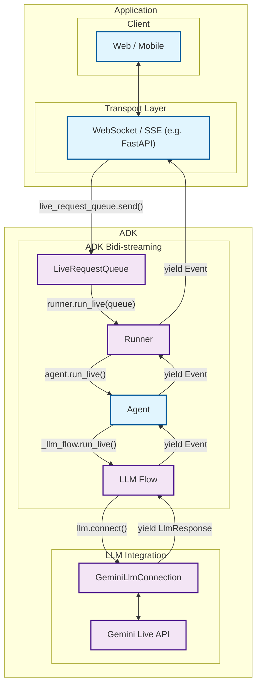
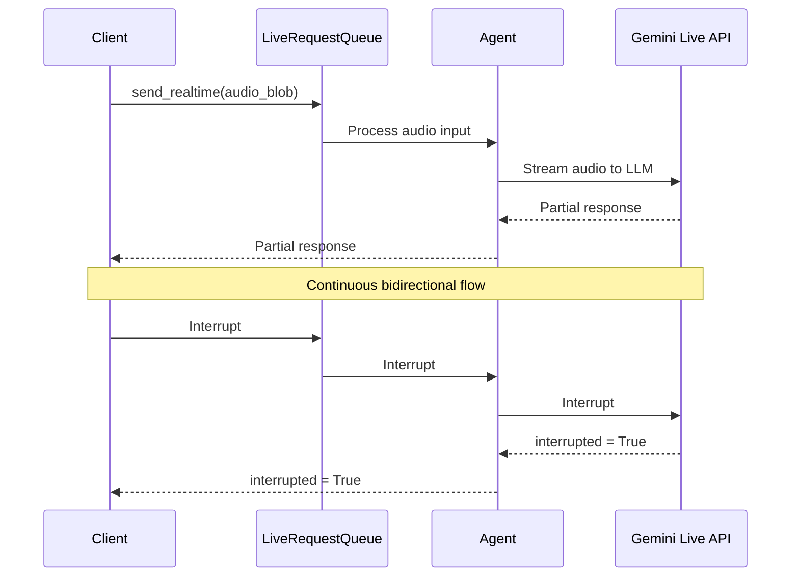

# Part 1: Introduction to ADK Bidi-streaming

Welcome to the world of bidirectional streaming with Google's Agent Development Kit (ADK). This part will transform your understanding of AI agent communication from traditional request-response patterns to dynamic, real-time conversations that feel as natural as talking to another person.

Imagine building an AI assistant that doesn't just wait for you to finish speaking before responding, but actively listens and can be interrupted mid-sentence when you have a sudden thought. Picture creating customer support bots that handle audio, video, and text simultaneously while maintaining context throughout the conversation. This is the power of bidirectional streaming, and ADK makes it accessible to every developer.

## 1.1 What is Bidi-streaming?

Bidi-streaming (Bidirectional streaming) represents a fundamental shift from traditional AI interactions. Instead of the rigid "ask-and-wait" pattern, it enables **real-time, two-way communication** where both human and AI can speak, listen, and respond simultaneously. This creates natural, human-like conversations with immediate responses and the revolutionary ability to interrupt ongoing interactions.

Think of the difference between sending emails and having a phone conversation. Traditional AI interactions are like emails—you send a complete message, wait for a complete response, then send another complete message. Bidirectional streaming is like a phone conversation—fluid, natural, with the ability to interrupt, clarify, and respond in real-time.

### Key Characteristics

These characteristics distinguish bidirectional streaming from traditional AI interactions and make it uniquely powerful for creating engaging user experiences:

- **Low Latency**: Response times measured in milliseconds, not seconds. When a user speaks, the AI begins processing immediately, creating the illusion of instant understanding. This is achieved through streaming protocols that don't wait for complete input before starting processing.

- **Interruption**: Perhaps the most revolutionary feature—users can interrupt the agent mid-response with new input, just like in human conversation. If an AI is explaining quantum physics and you suddenly ask "wait, what's an electron?", the AI stops immediately and addresses your question.

- **Multimodal**: Simultaneous support for text, audio, and video inputs creates rich, natural interactions. Users can speak while showing documents, type follow-up questions during voice calls, or seamlessly switch between communication modes without losing context.

- **Real-time**: Continuous data exchange without waiting for complete responses. The AI can start responding to the first few words of your question while you're still speaking, creating an experience that feels genuinely conversational rather than transactional.

### Difference from Other Streaming Types

Understanding how bidirectional streaming differs from other approaches is crucial for appreciating its unique value. The streaming landscape includes several distinct patterns, each serving different use cases:

!!! info "Streaming Types Comparison"

    **Bidi-streaming** differs fundamentally from other streaming approaches:
    
    - **Server-Side Streaming**: One-way data flow from server to client. Like watching a live video stream—you receive continuous data but can't interact with it in real-time. Useful for dashboards or live feeds, but not for conversations.
    
    - **Token-Level Streaming**: Sequential text token delivery without interruption. The AI generates response word-by-word, but you must wait for completion before sending new input. Like watching someone type a message in real-time—you see it forming, but can't interrupt.
    
    - **Bidirectional Streaming**: Full two-way communication with interruption support. True conversational AI where both parties can speak, listen, and respond simultaneously. This is what enables natural dialogue where you can interrupt, clarify, or change topics mid-conversation.

### Real-World Applications

Bidirectional streaming revolutionizes agentic AI applications by enabling agents to operate with human-like responsiveness and intelligence. These applications showcase how streaming transforms static AI interactions into dynamic, agent-driven experiences that feel genuinely intelligent and proactive:

- **Intelligent Voice Assistants**: Deploy conversational AI agents that don't just respond to commands but actively participate in dialogue. These agents can interrupt themselves to ask clarifying questions ("Wait, did you mean San Francisco or San Jose?"), provide progressive updates during long tasks ("I'm searching your emails... found 12 relevant messages... now checking attachments..."), and handle complex multi-step workflows with natural conversation flow.

- **Proactive Customer Support Agents**: Create AI agents that monitor customer interactions in real-time and proactively intervene when assistance is needed. These agents can join video calls when detecting frustration, share screens to guide users through complex processes, and seamlessly escalate to human agents while maintaining full conversation context and history.

- **Adaptive Learning Agents**: Build AI tutors that continuously assess student understanding through real-time interaction patterns. These agents can detect confusion through speech hesitation or typing patterns, dynamically adjust explanation complexity, interrupt their own explanations to provide examples when sensing confusion, and coordinate with other educational agents to provide comprehensive learning experiences.

- **Autonomous Monitoring and Response Agents**: Deploy intelligent agents that watch complex data streams, financial markets, or system metrics and take proactive action. These agents can explain their reasoning in real-time ("I'm seeing unusual traffic patterns... investigating source... appears to be a marketing campaign spike... adjusting auto-scaling..."), collaborate with human operators through live conversation, and coordinate with other agents to manage complex systems.

- **Multi-Agent Collaboration Platforms**: Create ecosystems where specialized AI agents work together on complex tasks while maintaining live communication with users. For example, a research agent gathering information can stream findings to a writing agent while both provide real-time updates to users, enabling transparent collaboration between multiple AI agents and humans.

- **Interactive Gaming and Simulation Agents**: Build AI NPCs and simulation agents that not only respond to player actions but also pursue their own goals, form relationships, and evolve their behavior based on ongoing interactions. These agents can interrupt their own dialogue to react to environmental changes, coordinate with other NPC agents to create emergent storylines, and maintain persistent relationships across gaming sessions.

- **Real-time Decision Support Agents**: Develop AI agents that assist in high-stakes decision making by continuously processing new information and updating recommendations. Financial trading agents can explain market movements in real-time, medical diagnostic agents can update assessments as new symptoms emerge, and strategic planning agents can adapt recommendations as conditions change during live business meetings.

## 1.2 ADK Streaming Architecture Overview

ADK's streaming architecture represents years of engineering refinement focused on one goal: making bidirectional AI conversations feel as natural as human dialogue. The architecture seamlessly integrates with Google's **Gemini Live API** through a sophisticated pipeline that has been meticulously designed for ultra-low latency and high-throughput communication.

The system handles the complex orchestration required for real-time streaming—managing multiple concurrent data flows, handling interruptions gracefully, processing multimodal inputs simultaneously, and maintaining conversation state across dynamic interactions. What makes ADK special is that it abstracts this complexity into simple, intuitive APIs that developers can use without needing to understand the intricate details of streaming protocols or AI model communication patterns.

### High-Level Architecture



| What the Developer Provides | What ADK Provides | What Gemini Live API Provides |
|:----------------------------|:------------------|:------------------------------|
| **Web / Mobile**: Frontend applications that users interact with, handling UI/UX, user input capture, and response display<br><br>**WebSocket / SSE Server**: Real-time communication server (such as FastAPI) that manages client connections, handles streaming protocols, and routes messages between clients and ADK<br><br>**Agent**: Custom AI agent definition with specific instructions, tools, and behavior tailored to your application's needs | **LiveRequestQueue**: Message queue that buffers and sequences incoming user messages (text content, audio blobs, control signals) for orderly processing by the agent<br><br>**Runner**: Execution engine that orchestrates agent sessions, manages conversation state, and provides the `run_live()` streaming interface<br><br>**LLM Flow**: Processing pipeline that handles streaming conversation logic, manages context, and coordinates with language models<br><br>**GeminiLlmConnection**: Abstraction layer that bridges ADK's streaming architecture with Gemini Live API, handling protocol translation and connection management | **Gemini Live API**: Google's real-time language model service that processes streaming input, generates responses, handles interruptions, supports multimodal content (text, audio, video), and provides advanced AI capabilities like function calling and contextual understanding |

### Data Flow



## 1.3 Setting Up Your Development Environment

Now that you understand the gist of ADK's streaming architecture and the value it provides, it's time to get hands-on experience. This section will prepare your development environment so you can start building the streaming agents and applications described in the previous sections.

By the end of this setup, you'll have everything needed to create the intelligent voice assistants, proactive customer support agents, and multi-agent collaboration platforms we've discussed. The setup process is straightforward—ADK handles the complex streaming infrastructure, so you can focus on building your agent's unique capabilities rather than wrestling with low-level streaming protocols.

### Prerequisites

- **Python 3.8+**: Required for ADK compatibility
- **Google API Key**: For Gemini Live API access
- **FastAPI**: For web-based streaming applications (optional)

### Installation Steps

#### 1. Create Virtual Environment (Recommended)

```bash
# Create virtual environment
python -m venv .venv

# Activate virtual environment
# macOS/Linux:
source .venv/bin/activate
# Windows CMD:
# .venv\Scripts\activate.bat
# Windows PowerShell:
# .venv\Scripts\Activate.ps1
```

#### 2. Install ADK with Streaming Support

Create a `requirements.txt` file in your project root:

```txt
google-adk==1.3.0
python-dotenv>=1.0.0
```

Install all dependencies:

```bash
pip install -r requirements.txt
```

#### 3. Set SSL Certificate Path (macOS only)

```bash
# Required for proper SSL handling on macOS
export SSL_CERT_FILE=$(python -m certifi)
```

#### 4. Set Up API Keys

Choose your preferred platform for running streaming agents:

=== "Google AI Studio"
    
    1. Get an API key from [Google AI Studio](https://aistudio.google.com/apikey)
    2. Create a `.env` file in your project root:
    
    ```env
    GOOGLE_GENAI_USE_VERTEXAI=FALSE
    GOOGLE_API_KEY=your_actual_api_key_here
    ```

=== "Google Cloud Vertex AI"
    
    1. Set up [Google Cloud project](https://cloud.google.com/vertex-ai/generative-ai/docs/start/quickstarts/quickstart-multimodal#setup-gcp)
    2. Install and configure [gcloud CLI](https://cloud.google.com/vertex-ai/generative-ai/docs/start/quickstarts/quickstart-multimodal#setup-local)
    3. Authenticate: `gcloud auth login`
    4. [Enable Vertex AI API](https://console.cloud.google.com/flows/enableapi?apiid=aiplatform.googleapis.com)
    5. Create a `.env` file in your project root:
    
    ```env
    GOOGLE_GENAI_USE_VERTEXAI=TRUE
    GOOGLE_CLOUD_PROJECT=your_actual_project_id
    GOOGLE_CLOUD_LOCATION=us-central1
    ```

#### 5. Create Environment Setup Script

Create the validation script that will verify your installation:

```bash
# Create the directory structure
mkdir -p src/part1
```

Create `src/part1/1-3-1_environment_setup.py`:

```python
#!/usr/bin/env python3
"""
Part 1.3.1: Environment Setup Validation
Comprehensive script to validate ADK streaming environment configuration.
"""

import os
import sys
from pathlib import Path
from dotenv import load_dotenv

def validate_environment():
    """Validate ADK streaming environment setup."""
    
    print("🔧 ADK Streaming Environment Validation")
    print("=" * 45)
    
    # Load environment variables
    env_path = Path(__file__).parent.parent.parent / '.env'
    if env_path.exists():
        load_dotenv(env_path)
        print(f"✓ Environment file loaded: {env_path}")
    else:
        print(f"❌ Environment file not found: {env_path}")
        return False
    
    # Check Python version
    python_version = sys.version_info
    if python_version >= (3, 8):
        print(f"✓ Python version: {python_version.major}.{python_version.minor}.{python_version.micro}")
    else:
        print(f"❌ Python version {python_version.major}.{python_version.minor} - requires 3.8+")
        return False
    
    # Test ADK installation
    try:
        import google.adk
        print(f"✓ ADK import successful")
        
        # Try to get version if available
        try:
            from google.adk.version import __version__
            print(f"✓ ADK version: {__version__}")
        except:
            print("ℹ️ ADK version info not available")
            
    except ImportError as e:
        print(f"❌ ADK import failed: {e}")
        return False
    
    # Check essential imports
    essential_imports = [
        ('google.adk.agents', 'Agent, LiveRequestQueue'),
        ('google.adk.runners', 'InMemoryRunner'),
        ('google.genai.types', 'Content, Part, Blob'),
    ]
    
    for module, components in essential_imports:
        try:
            __import__(module)
            print(f"✓ Import: {module}")
        except ImportError as e:
            print(f"❌ Import failed: {module} - {e}")
            return False
    
    # Validate environment variables
    env_checks = [
        ('GOOGLE_GENAI_USE_VERTEXAI', 'Platform configuration'),
        ('GOOGLE_API_KEY', 'API authentication'),
    ]
    
    for env_var, description in env_checks:
        value = os.getenv(env_var)
        if value:
            # Mask API key for security
            display_value = value if env_var != 'GOOGLE_API_KEY' else f"{value[:10]}..."
            print(f"✓ {description}: {display_value}")
        else:
            print(f"❌ Missing: {env_var} ({description})")
            return False
    
    # Test basic ADK functionality
    try:
        from google.adk.agents import LiveRequestQueue
        from google.genai.types import Content, Part
        
        # Create test queue
        queue = LiveRequestQueue()
        test_content = Content(parts=[Part(text="Test message")])
        queue.send_content(test_content)
        queue.close()
        
        print("✓ Basic ADK functionality test passed")
        
    except Exception as e:
        print(f"❌ ADK functionality test failed: {e}")
        return False
    
    print("\n🎉 Environment validation successful!")
    print("\nNext steps:")
    print("• Start building your streaming agents in src/agents/")
    print("• Create custom tools in src/tools/")
    print("• Add utility functions in src/utils/")
    print("• Test with Part 3 examples")
    
    return True

def main():
    """Run environment validation."""
    
    try:
        success = validate_environment()
        sys.exit(0 if success else 1)
        
    except KeyboardInterrupt:
        print("\n\n⚠️ Validation interrupted by user")
        sys.exit(1)
    except Exception as e:
        print(f"\n❌ Unexpected error: {e}")
        sys.exit(1)

if __name__ == "__main__":
    main()
```

### Project Structure

Your streaming project should now have this structure:

```text
your-streaming-project/
├── .env                              # Environment variables (API keys)
├── .env.example                     # Sample environment file
├── requirements.txt                 # Python dependencies
└── src/
    └── part1/
        └── 1-3-1_environment_setup.py  # Environment validation script
```

### Essential Imports

Here are the essential imports used in this section:

```python title="Section 1.3 imports"
# Environment validation script imports
import os
import sys
from pathlib import Path
from dotenv import load_dotenv

# ADK functionality test imports
from google.adk.agents import LiveRequestQueue

# Google GenAI types (used with ADK for content handling)
from google.genai.types import Content, Part
```

### Run It

Use our complete environment setup script to ensure everything is configured correctly:

    # Test your installation with the script you just created
    python src/part1/1-3-1_environment_setup.py

!!! example "Expected Output"

    When you run the validation script, you should see output similar to this:

    ```
    🔧 ADK Streaming Environment Validation
    =============================================
    ✓ Environment file loaded: /path/to/your-streaming-project/.env
    ✓ Python version: 3.12.8
    ✓ ADK import successful
    ✓ ADK version: 1.3.0
    ✓ Import: google.adk.agents
    ✓ Import: google.adk.runners
    ✓ Import: google.genai.types
    ✓ Platform configuration: FALSE
    ✓ API authentication: AIzaSyAolZ...
    ✓ Basic ADK functionality test passed

    🎉 Environment validation successful!

    Next steps:
    • Start building your streaming agents in src/agents/
    • Create custom tools in src/tools/
    • Add utility functions in src/utils/
    • Test with Part 3 examples
    ```

    This comprehensive validation script checks:
    
    - ADK installation and version
    - Required environment variables
    - API key validation
    - Basic import verification

### Next Steps

With your environment set up, you're ready to dive into the core streaming APIs in Part 2. You'll learn about:

- **LiveRequestQueue**: The heart of bidirectional communication
- **run_live() method**: Starting streaming sessions
- **Event processing**: Handling real-time responses
- **Gemini Live API**: Direct integration patterns

!!! tip "Development Workflow"

    As you progress through this guide:
    
    1. **Run the code examples** - Each part includes working Python scripts
    2. **Experiment with parameters** - Modify configurations to see the effects
    3. **Check the logs** - Enable debug logging to understand the data flow
    4. **Start simple** - Begin with text-only streaming before adding audio/video

