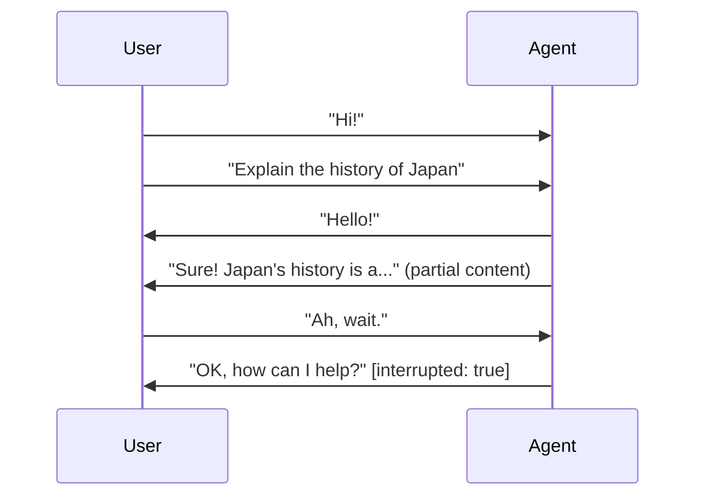
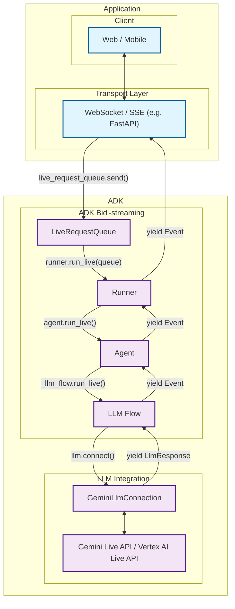

# Part 1: Introduction to ADK Bidi-streaming

Google's Agent Development Kit ([ADK](https://google.github.io/adk-docs/)) provides a production-ready framework for building Bidi-streaming applications with Gemini models. This guide introduces ADK's streaming architecture, which enables real-time, two-way communication between users and AI agents through multimodal channels (text, audio, video).

**What you'll learn**: This part covers the fundamentals of Bidi-streaming, the underlying Live API technology (Gemini Live API and Vertex AI Live API), ADK's architectural components (`LiveRequestQueue`, `Runner`, `Agent`), and a complete FastAPI implementation example. You'll understand how ADK handles session management, tool orchestration, and platform abstraction—reducing months of infrastructure development to declarative configuration.

## 1.1 What is Bidi-streaming?

Bidi-streaming (Bidirectional streaming) represents a fundamental shift from traditional AI interactions. Instead of the rigid "ask-and-wait" pattern, it enables **real-time, two-way communication** where both human and AI can speak, listen, and respond simultaneously. This creates natural, human-like conversations with immediate responses and the revolutionary ability to interrupt ongoing interactions.

Think of the difference between sending emails and having a phone conversation. Traditional AI interactions are like emails—you send a complete message, wait for a complete response, then send another complete message. Bidi-streaming is like a phone conversation—fluid, natural, with the ability to interrupt, clarify, and respond in real-time.

### Key Characteristics

These characteristics distinguish Bidi-streaming from traditional AI interactions and make it uniquely powerful for creating engaging user experiences:

- **Two-way Communication**: Continuous data exchange without waiting for complete responses. Users can interrupt the AI mid-response with new input, creating a natural conversational flow. The AI responds after detecting the user has finished speaking (via automatic voice activity detection or explicit activity signals).

- **Responsive Interruption**: Perhaps the most important feature for the natural user experience—users can interrupt the agent mid-response with new input, just like in human conversation. If an AI is explaining quantum physics and you suddenly ask "wait, what's an electron?", the AI stops immediately and addresses your question.

- **Best for Multimodal**: Bidi-streaming excels at multimodal interactions because it can process different input types simultaneously through a single connection. Users can speak while showing documents, type follow-up questions during voice calls, or seamlessly switch between communication modes without losing context. This unified approach eliminates the complexity of managing separate channels for each modality.



### Difference from Other Streaming Types

Understanding how Bidi-streaming differs from other approaches is crucial for appreciating its unique value. The streaming landscape includes several distinct patterns, each serving different use cases:

!!! info "Streaming Types Comparison"

    **Bidi-streaming** differs fundamentally from other streaming approaches:

    - **Server-Side Streaming**: One-way data flow from server to client. Like watching a live video stream—you receive continuous data but can't interact with it in real-time. Useful for dashboards or live feeds, but not for conversations.

    - **Token-Level Streaming**: Sequential text token delivery without interruption. The AI generates response word-by-word, but you must wait for completion before sending new input. Like watching someone type a message in real-time—you see it forming, but can't interrupt.

    - **Bidi-streaming**: Full two-way communication with interruption support. True conversational AI where both parties can speak, listen, and respond simultaneously. This is what enables natural dialogue where you can interrupt, clarify, or change topics mid-conversation.

### Real-World Applications

Bidi-streaming revolutionizes agentic AI applications by enabling agents to operate with human-like responsiveness and intelligence. These applications showcase how streaming transforms static AI interactions into dynamic, agent-driven experiences that feel genuinely intelligent and proactive.

In a video of the [Shopper's Concierge demo](https://www.youtube.com/watch?v=LwHPYyw7u6U), the multimodal Bidi-streaming feature significantly improve the user experience of e-commerce by enabling a faster and more intuitive shopping experience. The combination of conversational understanding and rapid, parallelized searching culminates in advanced capabilities like virtual try-on, boosting buyer confidence and reducing the friction of online shopping.

<div class="video-grid">
  <div class="video-item">
    <div class="video-container">
      <iframe src="https://www.youtube-nocookie.com/embed/LwHPYyw7u6U?si=xxIEhnKBapzQA6VV" title="Shopper's Concierge" frameborder="0" allow="accelerometer; autoplay; clipboard-write; encrypted-media; gyroscope; picture-in-picture; web-share" referrerpolicy="strict-origin-when-cross-origin" allowfullscreen></iframe>
    </div>
  </div>
</div>

Also, there are many possible real-world applications for Bidi-streaming:

- **Customer Service & Contact Centers**: This is the most direct application. The technology can create sophisticated virtual agents that go far beyond traditional chatbots.

  - Use case: A customer calls a retail company's support line about a defective product.
  - Multimodality (video): The customer can say, "My coffee machine is leaking from the bottom, let me show you." They can then use their phone's camera to stream live video of the issue. The AI agent can use its vision capabilities to identify the model and the specific point of failure.
  - Live Interaction & Interruption: If the agent says, "Okay, I'm processing a return for your Model X coffee maker," the customer can interrupt with, "No, wait, it's the Model Y Pro," and the agent can immediately correct its course without restarting the conversation.

- **E-commerce & Personalized Shopping**: The agent can act as a live, interactive personal shopper, enhancing the online retail experience.

  - Use Case: A user is browsing a fashion website and wants styling advice.
  - Multimodality (Voice & Image): The user can hold up a piece of clothing to their webcam and ask, "Can you find me a pair of shoes that would go well with these pants?" The agent analyzes the color and style of the pants.
  - Live Interaction: The conversation can be a fluid back-and-forth: "Show me something more casual." ... "Okay, how about these sneakers?" ... "Perfect, add the blue ones in size 10 to my cart."

- **Field Service & Technical Assistance**: Technicians working on-site can use a hands-free, voice-activated assistant to get real-time help.

  - Use Case: An HVAC technician is on-site trying to diagnose a complex commercial air conditioning unit.
  - Multimodality (Video & Voice): The technician, wearing smart glasses or using a phone, can stream their point-of-view to the AI agent. They can ask, "I'm hearing a strange noise from this compressor. Can you identify it and pull up the diagnostic flowchart for this model?"
  - Live Interaction: The agent can guide the technician step-by-step, and the technician can ask clarifying questions or interrupt at any point without taking their hands off their tools.

- **Healthcare & Telemedicine**: The agent can serve as a first point of contact for patient intake, triage, and basic consultations.

  - Use Case: A patient uses a provider's app for a preliminary consultation about a skin condition.
  - Multimodality (Video/Image): The patient can securely share a live video or high-resolution image of a rash. The AI can perform a preliminary analysis and ask clarifying questions.

- **Financial Services & Wealth Management**: An agent can provide clients with a secure, interactive, and data-rich way to manage their finances.

  - Use Case: A client wants to review their investment portfolio and discuss market trends.
  - Multimodality (Screen Sharing): The agent can share its screen to display charts, graphs, and portfolio performance data. The client could also share their screen to point to a specific news article and ask, "What is the potential impact of this event on my tech stocks?"
  - Live Interaction: Analyze the client's current portfolio allocation by accessing their account data.Simulate the impact of a potential trade on the portfolio's risk profile.

## 1.2 Gemini Live API and Vertex AI Live API

ADK's Bidi-streaming capabilities are powered by Google's Live API technology, available through two platforms: **[Gemini Live API](https://ai.google.dev/gemini-api/docs/live)** (via Google AI Studio) and **[Vertex AI Live API](https://cloud.google.com/vertex-ai/generative-ai/docs/live-api)** (via Google Cloud). Both provide real-time, low-latency streaming conversations with Gemini models, but serve different development and deployment needs.

Throughout this guide, we use **"Live API"** to refer to both platforms collectively, specifying "Gemini Live API" or "Vertex AI Live API" only when discussing platform-specific features or differences.

### What is the Live API?

The Live API is Google's real-time conversational AI technology that enables **low-latency Bidi-streaming** with Gemini models. Unlike traditional request-response APIs, the Live API establishes persistent WebSocket connections that support:

**Core Capabilities:**

- **Multimodal streaming**: Processes continuous streams of audio, video, and text in real-time
- **Natural conversation flow**: Automatically detects when users finish speaking via Voice Activity Detection (VAD)
- **Immediate responses**: Delivers human-like spoken or text responses with minimal latency
- **Intelligent interruption**: Enables users to interrupt the AI mid-response, just like human conversations
- **Advanced audio features**: Provides native audio generation with emotion-awareness, tone understanding, and proactive responses

**Technical Specifications:**

- **Audio input**: 16-bit PCM at 16kHz (mono)
- **Audio output**: 16-bit PCM at 24kHz (native audio models)
- **Video input**: 1 frame per second, recommended 768x768 resolution
- **Context windows**: Varies by model (typically 32k-128k tokens for Live API models). See [Gemini models](https://ai.google.dev/gemini-api/docs/models/gemini) for specific limits.
- **Languages**: 24+ languages supported with automatic detection

### Gemini Live API vs Vertex AI Live API

Both APIs provide the same core Live API technology, but differ in deployment platform, authentication, and enterprise features:

| Aspect | Gemini Live API | Vertex AI Live API |
|--------|----------------|-------------------|
| **Access** | Google AI Studio | Google Cloud |
| **Authentication** | API key (`GOOGLE_API_KEY`) | Google Cloud credentials (`GOOGLE_CLOUD_PROJECT`, `GOOGLE_CLOUD_LOCATION`) |
| **Best for** | Rapid prototyping, development, experimentation | Production deployments, enterprise applications |
| **Session Duration** | Audio-only: 15 min<br>Audio+video: 2 min<br>With [Part 4: Context Window Compression](part4_run_config.md#context-window-compression): Unlimited | Both: 10 min<br>With [Part 4: Context Window Compression](part4_run_config.md#context-window-compression): Unlimited |
| **Concurrent Sessions** | Tier-based quotas (see [API quotas](https://ai.google.dev/gemini-api/docs/quota)) | Up to 1,000 per project (configurable via quota requests) |
| **Enterprise Features** | Basic | Advanced monitoring, logging, SLAs, session resumption (24h) |
| **Setup Complexity** | Minimal (API key only) | Requires Google Cloud project setup |
| **API Version** | `v1beta` | `v1beta1` |
| **API Endpoint** | `generativelanguage.googleapis.com` | `{location}-aiplatform.googleapis.com` |
| **Labels Support** | ❌ Not supported | ✅ Supported (for billing/organization) |
| **File Upload** | Simplified (display names removed) | Full metadata support |
| **Billing** | Usage tracked via API key | Google Cloud project billing |

> 📖 **Source Reference**: [Gemini Live API Guide](https://ai.google.dev/gemini-api/docs/live-guide) | [Vertex AI Live API Overview](https://cloud.google.com/vertex-ai/generative-ai/docs/live-api)

!!! note "Live API Reference Notes"

    **Labels**: Metadata tags used in Google Cloud for resource organization and billing tracking.

    **Concurrent session limits**: Quota-based and may vary by account tier or configuration. Check your current quotas in Google AI Studio or Google Cloud Console.

### Advanced Live API Features

The Live API provides sophisticated features that go beyond basic streaming:

**Voice Activity Detection (VAD):** Automatically detects when users finish speaking, enabling natural turn-taking without explicit signals. The AI knows when to start responding and when to wait for more input.

**Audio Transcription:** Real-time transcription of both user input and model output, enabling accessibility features and conversation logging without separate transcription services.

**Proactive Audio:** The model can initiate responses based on context awareness, creating more natural interactions where the AI offers help or clarification proactively.

**Affective Dialog:** Advanced models understand tone of voice and emotional context, adapting responses to match the conversational mood and user sentiment.

**Session Management:** Long conversations can span multiple connections through session resumption, with the API preserving full conversation history and context across reconnections.

**Tool Integration:** Function calling works seamlessly in streaming mode, with tools executing in the background while conversation continues.

## 1.3 ADK Bidi-streaming: for Production-ready Streaming Application

Building real-time Bidi-streaming applications from scratch presents significant engineering challenges. While the Live API provides the underlying streaming technology, integrating it into production applications requires solving complex problems: managing WebSocket connections and reconnection logic, orchestrating tool execution and response handling, persisting conversation state across sessions, coordinating concurrent data flows for multimodal inputs, and handling platform differences between development and production environments.

ADK transforms these challenges into simple, declarative APIs. Instead of spending months building infrastructure for session management, tool orchestration, and state persistence, developers can focus on defining agent behavior and creating user experiences. This section explores what ADK handles automatically and why it's the recommended path for building production-ready streaming applications.

### ADK Bidi-streaming vs. Raw Live API

Understanding the differences between using ADK and building directly with the raw Live API helps clarify ADK's value proposition:

**Building with Raw Live API (`google-genai` SDK):**

- ✅ Direct WebSocket connection to Live API
- ✅ Protocol translation handled by SDK
- ❌ Manual tool execution and response handling
- ❌ Manual session state management
- ❌ Custom event persistence logic
- ❌ Manual interruption handling
- ❌ Manual reconnection logic for connection timeouts

**Building with ADK Bidi-streaming (`adk-python` and `adk-java` SDK):**

- ✅ Automatic tool execution
- ✅ Built-in session management with automatic reconnection (see [Part 4: Session Resumption](part4_run_config.md#session-resumption) for configuration details)
- ✅ Unified event model with metadata
- ✅ Session persistence and resumption
- ✅ Multi-agent orchestration
- ✅ Integration with memory, artifacts, and plugins

### Platform Flexibility

One of ADK's most powerful features is its transparent support for both [Gemini Live API](https://ai.google.dev/gemini-api/docs/live) and [Vertex AI Live API](https://cloud.google.com/vertex-ai/generative-ai/docs/live-api). This platform flexibility enables a seamless development-to-production workflow: develop locally with Gemini API using free API keys, then deploy to production with Vertex AI using enterprise Google Cloud infrastructure—all **without changing application code**, only environment configuration.

#### How Platform Selection Works

ADK uses the `GOOGLE_GENAI_USE_VERTEXAI` environment variable to determine which Live API platform to use:

- `GOOGLE_GENAI_USE_VERTEXAI=FALSE` (or not set): Uses Gemini Live API via Google AI Studio
- `GOOGLE_GENAI_USE_VERTEXAI=TRUE`: Uses Vertex AI Live API via Google Cloud

This environment variable is read by the underlying `google-genai` SDK when ADK creates the LLM connection. No code changes are needed when switching platforms—only environment configuration changes.

##### Development Phase: Gemini Live API (Google AI Studio)

```bash
# .env.development
GOOGLE_GENAI_USE_VERTEXAI=FALSE
GOOGLE_API_KEY=your_api_key_here
```

**Benefits:**

- Rapid prototyping with free API keys from Google AI Studio
- No Google Cloud setup required
- Instant experimentation with streaming features
- Zero infrastructure costs during development

##### Production Phase: Vertex AI Live API (Google Cloud)

```bash
# .env.production
GOOGLE_GENAI_USE_VERTEXAI=TRUE
GOOGLE_CLOUD_PROJECT=your_project_id
GOOGLE_CLOUD_LOCATION=us-central1
```

**Benefits:**

- Enterprise-grade infrastructure via Google Cloud
- Advanced monitoring, logging, and cost controls
- Integration with existing Google Cloud services
- Production SLAs and support
- **No code changes required** - just environment configuration

By handling the complexity of session management, tool orchestration, state persistence, and platform differences, ADK lets you focus on building intelligent agent experiences rather than wrestling with streaming infrastructure. The same code works seamlessly across development and production environments, giving you the full power of Bidi-streaming without the implementation burden.

## 1.4 ADK Bidi-streaming Architecture Overview

Now that you understand the Live API technology and why ADK adds value, let's explore how ADK actually works. This section maps the complete data flow from your application through ADK's pipeline to the Live API and back, showing which components handle which responsibilities.

You'll see how key components like `LiveRequestQueue`, `Runner`, and `Agent` orchestrate streaming conversations without requiring you to manage WebSocket connections, coordinate async flows, or handle platform-specific API differences.

> 📖 **Source Reference**: [Official ADK documentation](https://google.github.io/adk-docs/)

### High-Level Architecture



| Developer provides: | ADK provides: | Google's Live APIs provide: |
|:----------------------------|:------------------|:------------------------------|
| **Web / Mobile**: Frontend applications that users interact with, handling UI/UX, user input capture, and response display<br><br>**[WebSocket](https://developer.mozilla.org/en-US/docs/Web/API/WebSocket) / [SSE](https://developer.mozilla.org/en-US/docs/Web/API/Server-sent_events) Server**: Real-time communication server (such as [FastAPI](https://fastapi.tiangolo.com/)) that manages client connections, handles streaming protocols, and routes messages between clients and ADK<br><br>**`Agent`**: Custom AI agent definition with specific instructions, tools, and behavior tailored to your application's needs | **[LiveRequestQueue](https://github.com/google/adk-python/blob/main/src/google/adk/agents/live_request_queue.py)**: Message queue that buffers and sequences incoming user messages (text content, audio blobs, control signals) for orderly processing by the agent<br><br>**[Runner](https://github.com/google/adk-python/blob/main/src/google/adk/runners.py)**: Execution engine that orchestrates agent sessions, manages conversation state, and provides the `run_live()` streaming interface<br><br>**[RunConfig](https://github.com/google/adk-python/blob/main/src/google/adk/agents/run_config.py)**: Configuration for streaming behavior, modalities, and advanced features<br><br>**Internal components** (managed automatically, not directly used by developers): [LLM Flow](https://github.com/google/adk-python/blob/main/src/google/adk/flows/llm_flows/base_llm_flow.py) for processing pipeline and [GeminiLlmConnection](https://github.com/google/adk-python/blob/main/src/google/adk/models/gemini_llm_connection.py) for protocol translation | **[Gemini Live API](https://ai.google.dev/gemini-api/docs/live)** (via Google AI Studio) and **[Vertex AI Live API](https://cloud.google.com/vertex-ai/generative-ai/docs/live-api)** (via Google Cloud): Google's real-time language model services that process streaming input, generate responses, handle interruptions, support multimodal content (text, audio, video), and provide advanced AI capabilities like function calling and contextual understanding |

This architecture demonstrates ADK's clear separation of concerns: your application handles user interaction and transport protocols, ADK manages the streaming orchestration and state, and Google's Live APIs provide the AI intelligence. By abstracting away the complexity of WebSocket management, event loops, and protocol translation, ADK enables you to focus on building agent behavior and user experiences rather than streaming infrastructure.

## 1.5 Get Started with ADK Bidi-streaming

Building a streaming application with ADK follows a clear lifecycle pattern: **initialize once, stream many times**. You set up your core components (agent, runner, session service) during application startup, then for each streaming session, you create a fresh `LiveRequestQueue` and `RunConfig`, start the streaming loop with `run_live()`, and handle bidirectional communication until the session ends.

This section walks through each phase of this lifecycle, showing you exactly when to create each component and how they work together. Understanding this pattern is essential for building robust streaming applications that can handle multiple concurrent sessions efficiently.

### Phase 1: Application Initialization (Once at Startup)

These components are created once when your application starts and shared across all streaming sessions. They define your agent's capabilities, manage conversation history, and orchestrate the streaming execution.

#### Define Your Agent

The `Agent` is the core of your streaming application—it defines what your AI can do, how it should behave, and which AI model powers it. You configure your agent with a specific model (like `gemini-2.0-flash-live-001`), tools it can use (like Google Search or custom APIs), and instructions that shape its personality and behavior.

```python
from google.adk.agents import Agent

agent = Agent(
    model="gemini-2.0-flash-live-001",
    tools=[google_search, calculator],
    instruction="You are a helpful assistant that can search the web and perform calculations."
)
```

The agent instance is **stateless and reusable**—you create it once and use it for all streaming sessions. Agent configuration is covered in the [ADK Agent documentation](https://google.github.io/adk-docs/agent).

!!! note "Agent vs LlmAgent"

    `Agent` is the recommended shorthand for `LlmAgent` (both are imported from `google.adk.agents`). They are identical - use whichever you prefer. This guide uses `Agent` for brevity, but you may see `LlmAgent` in other ADK documentation and examples.

#### Define Your SessionService

The `SessionService` manages conversation state and history across streaming sessions. It stores and retrieves session data, enabling features like conversation resumption and context persistence. For development, ADK provides `InMemorySessionService`, but production applications should use persistent storage.

```python
from google.adk.sessions import InMemorySessionService

# Development: Simple in-memory storage (lost on restart)
session_service = InMemorySessionService()
```

!!! tip "Production Session Services"

    For production applications, use one of these persistent session services:

    - **`DatabaseSessionService`**: Stores sessions in SQL databases (PostgreSQL, MySQL, SQLite). Best for applications with existing database infrastructure.
    - **`VertexAiSessionService`**: Stores sessions in Google Cloud Vertex AI. Best for Google Cloud deployments with built-in integration.

    See the [ADK Session Management documentation](https://google.github.io/adk-docs/session) for configuration details.

#### Define Your Runner

The `Runner` orchestrates agent execution within streaming sessions. It manages the conversation flow, coordinates tool execution, handles events, and integrates with session storage. You create one runner instance at application startup and reuse it for all streaming sessions.

```python
from google.adk.runners import Runner

runner = Runner(
    app_name="my-streaming-app",  # Required: Identifies your application
    agent=agent,
    session_service=session_service
)
```

The `app_name` parameter is required and identifies your application in session storage. All sessions for your application are organized under this name.

### Phase 2: Session Initialization (Once per Streaming Session)

For each new streaming session (e.g., when a user starts a conversation), you create session-specific components: a `RunConfig` that defines streaming behavior, a session record in the session service, and a `LiveRequestQueue` for bidirectional communication.

#### Create RunConfig

`RunConfig` defines the streaming behavior for this specific session—which modalities to use (text or audio), whether to enable transcription, voice activity detection, proactivity, and other advanced features.

```python
from google.adk.agents.run_config import RunConfig, StreamingMode

# Text-only streaming with basic configuration
run_config = RunConfig(
    streaming_mode=StreamingMode.BIDI,
    response_modalities=["TEXT"]  # ["AUDIO"] for voice responses
)
```

`RunConfig` is **session-specific**—each streaming session can have different configuration. For example, one user might prefer text-only responses while another uses voice mode. See [Part 4: Understanding RunConfig](part4_run_config.md) for complete configuration options.

#### Get or Create Session

Before starting a streaming session, you must create (or retrieve) a session record in the session service. This record stores conversation history and enables features like session resumption.

Sessions are identified by three parameters: `app_name`, `user_id`, and `session_id`. This three-level hierarchy enables multi-tenant applications where each user can have multiple concurrent sessions.

##### Session Identifiers Are Application-Defined

Both `user_id` and `session_id` are **arbitrary string identifiers** that you define based on your application's needs. ADK performs no format validation beyond `.strip()` on `session_id`—you can use any string values that make sense for your application:

- **`user_id` examples**: User UUIDs (`"550e8400-e29b-41d4-a716-446655440000"`), email addresses (`"alice@example.com"`), database IDs (`"user_12345"`), or simple identifiers (`"demo-user"`)
- **`session_id` examples**: Custom session tokens, UUIDs, timestamp-based IDs (`"session_2025-01-27_143022"`), or simple identifiers (`"demo-session"`)

**Auto-generation**: If you pass `session_id=None` or an empty string to `create_session()`, ADK automatically generates a UUID for you (e.g., `"550e8400-e29b-41d4-a716-446655440000"`).

**Organizational hierarchy**: These identifiers organize sessions in a three-level structure:

```text
app_name → user_id → session_id → Session
```

This design enables scenarios like:

- Multi-tenant applications where different users have isolated conversation spaces
- Single users with multiple concurrent chat threads (e.g., different topics)
- Per-device or per-browser session isolation

##### Recommended Pattern: Get-or-Create

The recommended production pattern is to check if a session exists first, then create it only if needed. This approach safely handles both new sessions and conversation resumption:

```python
# Get or create session (recommended for production)
session = await session_service.get_session(
    app_name="my-streaming-app",
    user_id="user123",
    session_id="session456"
)
if not session:
    await session_service.create_session(
        app_name="my-streaming-app",
        user_id="user123",
        session_id="session456"
    )
```

This pattern works correctly in all scenarios:
- **New conversations**: If the session doesn't exist, it's created automatically
- **Resuming conversations**: If the session already exists (e.g., reconnection after network interruption), the existing session is reused with full conversation history
- **Idempotent**: Safe to call multiple times without errors

**When to Use Create-Only**

You can use `create_session()` directly (without `get_session()`) only when you're certain the session doesn't exist yet:

```python
# Create-only pattern (use only for guaranteed new sessions)
await session_service.create_session(
    app_name="my-streaming-app",
    user_id="user123",
    session_id=None  # Auto-generate UUID
)
```

**Use create-only for**:
- New user registration flows where you know the session is new
- When you want ADK to auto-generate a session_id (by passing `session_id=None`)
- Single-use sessions that never need resumption

**Important**: The session must exist before calling `runner.run_live()` with the same identifiers. If the session doesn't exist, `run_live()` will raise `ValueError: Session not found`.

#### Create LiveRequestQueue

`LiveRequestQueue` is the communication channel for sending messages to the agent during streaming. It's a thread-safe async queue that buffers user messages (text content, audio blobs, activity signals) for orderly processing.

```python
from google.adk.agents.live_request_queue import LiveRequestQueue

live_request_queue = LiveRequestQueue()
```

`LiveRequestQueue` is **session-specific and stateful**—you create a new queue for each streaming session and close it when the session ends. Unlike `Agent` and `Runner`, queues cannot be reused across sessions.

!!! warning "One Queue Per Session"

    Never reuse a `LiveRequestQueue` across multiple streaming sessions. Each call to `run_live()` requires a fresh queue. Reusing queues can cause message ordering issues and state corruption.

### Phase 3: Active Session (Concurrent Bidirectional Communication)

Once the streaming loop is running, you can send messages to the agent and receive responses **concurrently**—this is Bidi-streaming in action. The agent can be generating a response while you're sending new input, enabling natural interruption-based conversation.

#### Send Messages to the Agent

Use `LiveRequestQueue` methods to send different types of messages to the agent during the streaming session:

```python
from google.genai import types

# Send text content
content = types.Content(parts=[types.Part(text="What is quantum computing?")])
live_request_queue.send_content(content)

# Send audio blob
audio_blob = types.Blob(mime_type="audio/pcm", data=audio_bytes)
live_request_queue.send_realtime(audio_blob)
```

These methods are **non-blocking**—they immediately add messages to the queue without waiting for processing. This enables smooth, responsive user experiences even during heavy AI processing.

See [Part 2: Sending messages with LiveRequestQueue](part2_live_request_queue.md) for detailed API documentation.

#### Receive and Process Events

The `run_live()` async generator continuously yields `Event` objects as the agent processes input and generates responses. Each event represents a discrete occurrence—partial text generation, audio chunks, tool execution, transcription, interruption, or turn completion.

```python
async for event in runner.run_live(...):
    process_event(event)
```

Events are designed for **streaming delivery**—you receive partial responses as they're generated, not just complete messages. This enables real-time UI updates and responsive user experiences.

See [Part 3: Event handling with run_live()](part3_run_live.md) for comprehensive event handling patterns.

### Phase 4: Session Termination

When the streaming session should end (user disconnects, conversation completes, timeout occurs), close the queue gracefully to signal termination to the agent and clean up resources.

#### Close the Queue

Send a close signal through the queue to terminate the streaming loop:

```python
live_request_queue.close()
```

This signals `run_live()` to stop yielding events and exit the async generator loop. The agent completes any in-progress processing and the streaming session ends cleanly.

### FastAPI Application Example

Here's a complete FastAPI WebSocket application showing all four phases integrated with proper Bidi-streaming. The key pattern is **upstream/downstream tasks**: the upstream task receives messages from WebSocket and sends them to `LiveRequestQueue`, while the downstream task receives `Event` objects from `run_live()` and sends them to WebSocket.

```python
import asyncio
from fastapi import FastAPI, WebSocket, WebSocketDisconnect
from google.adk.agents import Agent
from google.adk.runners import Runner
from google.adk.agents.run_config import RunConfig, StreamingMode
from google.adk.agents.live_request_queue import LiveRequestQueue
from google.adk.sessions import InMemorySessionService
from google.genai import types

# ========================================
# Phase 1: Application Initialization (once at startup)
# ========================================

app = FastAPI()

# Define your agent
agent = Agent(
    model="gemini-2.0-flash-live-001",
    tools=[google_search],
    instruction="You are a helpful assistant that can search the web."
)

# Define your session service
session_service = InMemorySessionService()

# Define your runner
runner = Runner(
    app_name="my-streaming-app",
    agent=agent,
    session_service=session_service
)

# ========================================
# WebSocket Endpoint
# ========================================

@app.websocket("/ws/{user_id}/{session_id}")
async def websocket_endpoint(websocket: WebSocket, user_id: str, session_id: str) -> None:
    await websocket.accept()

    # ========================================
    # Phase 2: Session Initialization (once per streaming session)
    # ========================================

    # Create RunConfig
    run_config = RunConfig(
        streaming_mode=StreamingMode.BIDI,
        response_modalities=["TEXT"]
    )

    # Get or create session
    session = await session_service.get_session(
        app_name="my-streaming-app",
        user_id=user_id,
        session_id=session_id
    )
    if not session:
        await session_service.create_session(
            app_name="my-streaming-app",
            user_id=user_id,
            session_id=session_id
        )

    # Create LiveRequestQueue
    live_request_queue = LiveRequestQueue()

    # ========================================
    # Phase 3: Active Session (concurrent bidirectional communication)
    # ========================================

    async def upstream_task() -> None:
        """Receives messages from WebSocket and sends to LiveRequestQueue."""
        try:
            while True:
                # Receive text message from WebSocket
                data: str = await websocket.receive_text()

                # Send to LiveRequestQueue
                content = types.Content(parts=[types.Part(text=data)])
                live_request_queue.send_content(content)
        except WebSocketDisconnect:
            # Client disconnected - signal queue to close
            pass

    async def downstream_task() -> None:
        """Receives Events from run_live() and sends to WebSocket."""
        async for event in runner.run_live(
            user_id=user_id,
            session_id=session_id,
            live_request_queue=live_request_queue,
            run_config=run_config
        ):
            # Send event as JSON to WebSocket
            await websocket.send_text(
                event.model_dump_json(exclude_none=True, by_alias=True)
            )

    # Run both tasks concurrently
    try:
        await asyncio.gather(
            upstream_task(),
            downstream_task(),
            return_exceptions=True
        )
    finally:
        # ========================================
        # Phase 4: Session Termination
        # ========================================

        # Always close the queue, even if exceptions occurred
        live_request_queue.close()
```

### Key Concepts

**Upstream Task (WebSocket → LiveRequestQueue)**

The upstream task continuously receives messages from the WebSocket client and forwards them to the `LiveRequestQueue`. This enables the user to send messages to the agent at any time, even while the agent is generating a response.

```python
async def upstream_task() -> None:
    """Receives messages from WebSocket and sends to LiveRequestQueue."""
    try:
        while True:
            data: str = await websocket.receive_text()
            content = types.Content(parts=[types.Part(text=data)])
            live_request_queue.send_content(content)
    except WebSocketDisconnect:
        pass  # Client disconnected
```

**Downstream Task (run_live() → WebSocket)**

The downstream task continuously receives `Event` objects from `run_live()` and sends them to the WebSocket client. This streams the agent's responses, tool executions, transcriptions, and other events to the user in real-time.

```python
async def downstream_task() -> None:
    """Receives Events from run_live() and sends to WebSocket."""
    async for event in runner.run_live(
        user_id=user_id,
        session_id=session_id,
        live_request_queue=live_request_queue,
        run_config=run_config
    ):
        await websocket.send_text(
            event.model_dump_json(exclude_none=True, by_alias=True)
        )
```

**Concurrent Execution with Cleanup**

Both tasks run concurrently using `asyncio.gather()`, enabling true Bidi-streaming. The `try/finally` block ensures `LiveRequestQueue.close()` is called even if exceptions occur, minimizing the session resource usage.

```python
try:
    await asyncio.gather(
        upstream_task(),
        downstream_task(),
        return_exceptions=True
    )
finally:
    live_request_queue.close()  # Always cleanup
```

This pattern—concurrent upstream/downstream tasks with guaranteed cleanup—is the foundation of production-ready streaming applications. The lifecycle pattern (initialize once, stream many times) enables efficient resource usage and clean separation of concerns, with application components remaining stateless and reusable while session-specific state is isolated in `LiveRequestQueue`, `RunConfig`, and session records.

!!! tip "Production Considerations"

    This example shows the core pattern. For production applications, consider:

    - Add proper error handling in upstream/downstream tasks
        - Handle task cancellation gracefully by catching `asyncio.CancelledError` during shutdown
        - Check exceptions from `asyncio.gather()` with `return_exceptions=True` - exceptions don't propagate automatically
    - Implement authentication and authorization
    - Add rate limiting and timeout controls
    - Use structured logging for debugging
    - Consider using persistent session services (DatabaseSessionService or VertexAiSessionService)

## 1.6 What We Will Learn

This guide is structured to build your understanding progressively, from fundamental concepts to advanced features. Each part builds on the previous ones while remaining practical and immediately applicable:

- **[Part 2: Sending messages with LiveRequestQueue](part2_live_request_queue.md)** - Learn how ADK's `LiveRequestQueue` provides a unified interface for handling text, audio, and control messages. You'll understand the `LiveRequest` message model, how to send different types of content, manage user activity signals, and handle graceful session termination through a single, elegant API.

- **[Part 3: Event handling with run_live()](part3_run_live.md)** - Master event handling in ADK's streaming architecture. Learn how to process different event types (text, audio, transcriptions, tool calls), manage conversation flow with interruption and turn completion signals, serialize events for network transport, and leverage ADK's automatic tool execution. Understanding event handling is essential for building responsive streaming applications.

- **[Part 4: Understanding RunConfig](part4_run_config.md)** - Configure sophisticated streaming behaviors including multimodal interactions, intelligent proactivity, session resumption, and cost controls. Learn which features are available on different models and how to declaratively control your streaming sessions through RunConfig.

- **[Part 5: How to Use Audio and Video](part5_audio_and_video.md)** - Implement voice and video features with ADK's multimodal capabilities. Understand audio specifications, streaming architectures, voice activity detection, audio transcription, and best practices for building natural voice-enabled AI experiences.

## 1.7 ADK Bidi-streaming demo app

Before diving into the technical details, try the runnable FastAPI demo in `src/demo/app`.
The guide's code snippets are drawn from `src/demo/app/bidi_streaming.py`, which encapsulates
ADK streaming logic used throughout the app.

### Key Features to Explore

The demo application demonstrates:

1. **Environment-based API selection**: Switch between Gemini API and Vertex AI using UI controls (no code changes)
2. **WebSocket vs SSE comparison**: See both transport patterns using the same ADK streaming logic
3. **RunConfig toggles**: Interactive controls for transcription, VAD, proactivity, and other features
4. **Tool integration**: Google Search tool with automatic execution and result streaming
5. **Session management**: Proper handling of session creation, resumption, and cleanup

### Code Organization

> 📖 **Demo Implementation**: Core streaming logic at [`src/demo/app/bidi_streaming.py`](../src/demo/app/bidi_streaming.py)

- ADK streaming logic: `src/demo/app/bidi_streaming.py` — session wrapper around `LiveRequestQueue` and `Runner.run_live()`
- FastAPI transport: `src/demo/app/main.py` — WebSocket and SSE endpoints integrating the session wrapper
- Agent definition: `src/demo/app/agent/agent.py` — `create_streaming_agent()` used by the demo

For setup and run instructions, see the README: [src/demo/README.md](../src/demo/README.md).


