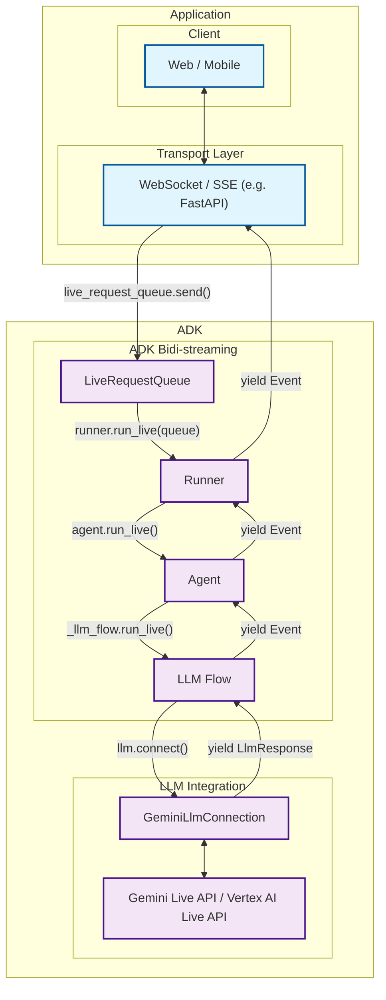
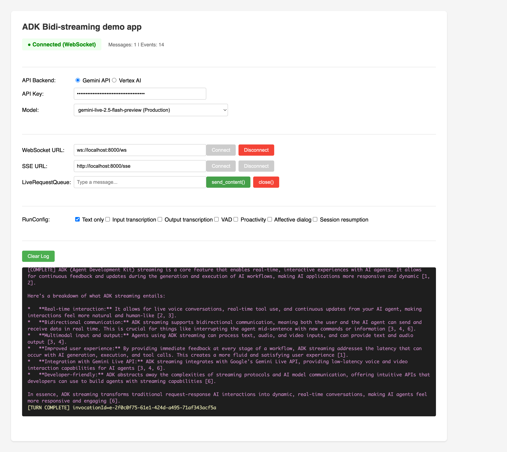

# Part 1: Introduction to ADK Bidi-streaming

Welcome to the world of bidirectional streaming with Google's [Agent Development Kit (ADK)](https://google.github.io/adk-docs/). This article will transform your understanding of AI agent communication from traditional request-response patterns to dynamic, real-time conversations that feel as natural as talking to another person.

Imagine building an AI assistant that doesn't just wait for you to finish speaking before responding, but actively listens and can be interrupted mid-sentence when you have a sudden thought. Picture creating customer support bots that handle audio, video, and text simultaneously while maintaining context throughout the conversation. This is the power of bidirectional streaming, and ADK makes it accessible to every developer.

## 1.1 What is Bidi-streaming?

Bidi-streaming (Bidirectional streaming) represents a fundamental shift from traditional AI interactions. Instead of the rigid "ask-and-wait" pattern, it enables **real-time, two-way communication** where both human and AI can speak, listen, and respond simultaneously. This creates natural, human-like conversations with immediate responses and the revolutionary ability to interrupt ongoing interactions.

Think of the difference between sending emails and having a phone conversation. Traditional AI interactions are like emails—you send a complete message, wait for a complete response, then send another complete message. Bidirectional streaming is like a phone conversation—fluid, natural, with the ability to interrupt, clarify, and respond in real-time.

### Key Characteristics

These characteristics distinguish bidirectional streaming from traditional AI interactions and make it uniquely powerful for creating engaging user experiences:

- **Two-way Communication**: Continuous data exchange without waiting for complete responses. Users can interrupt the AI mid-response with new input, creating a natural conversational flow. The AI responds after detecting the user has finished speaking (via automatic voice activity detection or explicit activity signals).

- **Responsive Interruption**: Perhaps the most important feature for the natural user experience—users can interrupt the agent mid-response with new input, just like in human conversation. If an AI is explaining quantum physics and you suddenly ask "wait, what's an electron?", the AI stops immediately and addresses your question.

- **Best for Multimodal**: Bidirectional streaming excels at multimodal interactions because it can process different input types simultaneously through a single connection. Users can speak while showing documents, type follow-up questions during voice calls, or seamlessly switch between communication modes without losing context. This unified approach eliminates the complexity of managing separate channels for each modality.


### Difference from Other Streaming Types

Understanding how bidirectional streaming differs from other approaches is crucial for appreciating its unique value. The streaming landscape includes several distinct patterns, each serving different use cases:

!!! info "Streaming Types Comparison"

    **Bidi-streaming** differs fundamentally from other streaming approaches:

    - **Server-Side Streaming**: One-way data flow from server to client. Like watching a live video stream—you receive continuous data but can't interact with it in real-time. Useful for dashboards or live feeds, but not for conversations.

    - **Token-Level Streaming**: Sequential text token delivery without interruption. The AI generates response word-by-word, but you must wait for completion before sending new input. Like watching someone type a message in real-time—you see it forming, but can't interrupt.

    - **Bidirectional Streaming**: Full two-way communication with interruption support. True conversational AI where both parties can speak, listen, and respond simultaneously. This is what enables natural dialogue where you can interrupt, clarify, or change topics mid-conversation.

### Real-World Applications

Bidirectional streaming revolutionizes agentic AI applications by enabling agents to operate with human-like responsiveness and intelligence. These applications showcase how streaming transforms static AI interactions into dynamic, agent-driven experiences that feel genuinely intelligent and proactive.

In a video of the [Shopper's Concierge demo](https://www.youtube.com/watch?v=LwHPYyw7u6U), the multimodal, bi-directional streaming feature significantly improve the user experience of e-commerce by enabling a faster and more intuitive shopping experience. The combination of conversational understanding and rapid, parallelized searching culminates in advanced capabilities like virtual try-on, boosting buyer confidence and reducing the friction of online shopping.

<div class="video-grid">
  <div class="video-item">
    <div class="video-container">
      <iframe src="https://www.youtube-nocookie.com/embed/LwHPYyw7u6U?si=xxIEhnKBapzQA6VV" title="Shopper's Concierge" frameborder="0" allow="accelerometer; autoplay; clipboard-write; encrypted-media; gyroscope; picture-in-picture; web-share" referrerpolicy="strict-origin-when-cross-origin" allowfullscreen></iframe>
    </div>
  </div>
</div>

Also, there are many possible real-world applications for bidirectional streaming:

- **Customer Service & Contact Centers**: This is the most direct application. The technology can create sophisticated virtual agents that go far beyond traditional chatbots.

  - Use case: A customer calls a retail company's support line about a defective product.
  - Multimodality (video): The customer can say, "My coffee machine is leaking from the bottom, let me show you." They can then use their phone's camera to stream live video of the issue. The AI agent can use its vision capabilities to identify the model and the specific point of failure.
  - Live Interaction & Interruption: If the agent says, "Okay, I'm processing a return for your Model X coffee maker," the customer can interrupt with, "No, wait, it's the Model Y Pro," and the agent can immediately correct its course without restarting the conversation.

- **E-commerce & Personalized Shopping**: The agent can act as a live, interactive personal shopper, enhancing the online retail experience.

  - Use Case: A user is browsing a fashion website and wants styling advice.
  - Multimodality (Voice & Image): The user can hold up a piece of clothing to their webcam and ask, "Can you find me a pair of shoes that would go well with these pants?" The agent analyzes the color and style of the pants.
  - Live Interaction: The conversation can be a fluid back-and-forth: "Show me something more casual." ... "Okay, how about these sneakers?" ... "Perfect, add the blue ones in size 10 to my cart."

- **Field Service & Technical Assistance**: Technicians working on-site can use a hands-free, voice-activated assistant to get real-time help.

  - Use Case: An HVAC technician is on-site trying to diagnose a complex commercial air conditioning unit.
  - Multimodality (Video & Voice): The technician, wearing smart glasses or using a phone, can stream their point-of-view to the AI agent. They can ask, "I'm hearing a strange noise from this compressor. Can you identify it and pull up the diagnostic flowchart for this model?"
  - Live Interaction: The agent can guide the technician step-by-step, and the technician can ask clarifying questions or interrupt at any point without taking their hands off their tools.

- **Healthcare & Telemedicine**: The agent can serve as a first point of contact for patient intake, triage, and basic consultations.

  - Use Case: A patient uses a provider's app for a preliminary consultation about a skin condition.
  - Multimodality (Video/Image): The patient can securely share a live video or high-resolution image of a rash. The AI can perform a preliminary analysis and ask clarifying questions.

- **Financial Services & Wealth Management**: An agent can provide clients with a secure, interactive, and data-rich way to manage their finances.

  - Use Case: A client wants to review their investment portfolio and discuss market trends.
  - Multimodality (Screen Sharing): The agent can share its screen to display charts, graphs, and portfolio performance data. The client could also share their screen to point to a specific news article and ask, "What is the potential impact of this event on my tech stocks?"
  - Live Interaction: Analyze the client's current portfolio allocation by accessing their account data.Simulate the impact of a potential trade on the portfolio's risk profile.

## 1.2 ADK Bidi-streaming Architecture Overview

ADK Bidi-streaming architecture enables bidirectional AI conversations feel as natural as human dialogue. The architecture seamlessly integrates with Google's streaming APIs—[Gemini Live API](https://ai.google.dev/gemini-api/docs/live) (via Google AI Studio) and [Vertex AI Live API](https://cloud.google.com/vertex-ai/generative-ai/docs/live-api) (via Google Cloud)—through a sophisticated pipeline that has been designed for low latency and high-throughput communication.

For complete ADK API reference, see the [official ADK documentation](https://google.github.io/adk-docs/).

The system handles the complex orchestration required for real-time streaming—managing multiple concurrent data flows, handling interruptions gracefully, processing multimodal inputs simultaneously, and maintaining conversation state across dynamic interactions. ADK Bidi-streaming abstracts this complexity into simple, intuitive APIs that developers can use without needing to understand the intricate details of streaming protocols or AI model communication patterns.

### High-Level Architecture



| Developer provides: | ADK provides: | Google's Live APIs provide: |
|:----------------------------|:------------------|:------------------------------|
| **Web / Mobile**: Frontend applications that users interact with, handling UI/UX, user input capture, and response display<br><br>**[WebSocket](https://developer.mozilla.org/en-US/docs/Web/API/WebSocket) / [SSE](https://developer.mozilla.org/en-US/docs/Web/API/Server-sent_events) Server**: Real-time communication server (such as [FastAPI](https://fastapi.tiangolo.com/)) that manages client connections, handles streaming protocols, and routes messages between clients and ADK<br><br>**Agent**: Custom AI agent definition with specific instructions, tools, and behavior tailored to your application's needs | **[LiveRequestQueue](https://github.com/google/adk-python/blob/main/src/google/adk/agents/live_request_queue.py)**: Message queue that buffers and sequences incoming user messages (text content, audio blobs, control signals) for orderly processing by the agent<br><br>**[Runner](https://github.com/google/adk-python/blob/main/src/google/adk/runners.py)**: Execution engine that orchestrates agent sessions, manages conversation state, and provides the `run_live()` streaming interface<br><br>**[LLM Flow](https://github.com/google/adk-python/blob/main/src/google/adk/flows/llm_flows/base_llm_flow.py)**: Processing pipeline that handles streaming conversation logic, manages context, and coordinates with language models<br><br>**[GeminiLlmConnection](https://github.com/google/adk-python/blob/main/src/google/adk/models/gemini_llm_connection.py)**: Abstraction layer that bridges ADK's streaming architecture with Google's Live APIs, handling protocol translation and connection management | **[Gemini Live API](https://ai.google.dev/gemini-api/docs/live)** (via Google AI Studio) and **[Vertex AI Live API](https://cloud.google.com/vertex-ai/generative-ai/docs/live-api)** (via Google Cloud): Google's real-time language model services that process streaming input, generate responses, handle interruptions, support multimodal content (text, audio, video), and provide advanced AI capabilities like function calling and contextual understanding |

### What You Don't Need To Care About

ADK Bidi-streaming APi hides a number of streaming internals so you can focus on product logic:

- Event loop setup for `LiveRequestQueue` creation and consumption
- Partial text aggregation and finalization boundaries
- Backpressure and queue polling timeouts used to keep UIs responsive
- When live audio responses are persisted vs. skipped in session history
- Low‑level fan‑out of live requests to active streaming tools

These are handled by the framework; you primarily work with `LiveRequestQueue`, `Runner.run_live()`, `RunConfig` and `Events`.

ADK's streaming architecture represents a complete solution to the challenges that would otherwise require months of custom development. Instead of building message queuing, async coordination, state management, and AI model integration separately, ADK provides an integrated event handling system that orchestrates all these components seamlessly.

### ADK vs. Raw Live API

Understanding the differences between using ADK and building directly with the raw Gemini Live API helps clarify ADK's value proposition:

**Building with Raw Gemini Live API (`google-genai` SDK):**

- ✅ Direct WebSocket connection to Gemini Live API
- ✅ Protocol translation handled by SDK
- ❌ Manual tool execution and response handling
- ❌ Manual session state management
- ❌ Custom event persistence logic
- ❌ Manual interruption handling

**Building with ADK:**

- ✅ Automatic tool execution
- ✅ Built-in session management
- ✅ Unified event model with metadata
- ✅ Session persistence and resumption
- ✅ Multi-agent orchestration
- ✅ Integration with memory, artifacts, and plugins

ADK's real value isn't just protocol handling—it's the complete agent lifecycle management and ecosystem integration that would otherwise require significant custom development. This simplification isn't achieved through abstraction that limits flexibility—it comes from thoughtful integration where each component is designed to work seamlessly with the others. You get the full power of bidirectional streaming without the complexity burden.

### Platform Flexibility: Gemini Live API and Vertex AI Live API

One of ADK's most powerful features is its transparent support for both [Gemini Live API](https://ai.google.dev/gemini-api/docs/live) and [Vertex AI Live API](https://cloud.google.com/vertex-ai/generative-ai/docs/live-api). This platform flexibility enables a seamless development-to-production workflow: develop locally with Gemini API using free API keys, then deploy to production with Vertex AI using enterprise Google Cloud infrastructure—all **without changing a single line of application code**.

#### Environment-Based Configuration

ADK uses a single environment variable to switch between the two APIs, enabling a seamless development-to-production workflow.

##### Development Phase: Gemini Live API (Google AI Studio)

```bash
# .env.development
GOOGLE_GENAI_USE_VERTEXAI=FALSE
GOOGLE_API_KEY=your_api_key_here
```

**Benefits:**

- Rapid prototyping with free API keys from Google AI Studio
- No Google Cloud setup required
- Instant experimentation with streaming features
- Zero infrastructure costs during development

##### Production Phase: Vertex AI Live API (Google Cloud)

```bash
# .env.production
GOOGLE_GENAI_USE_VERTEXAI=TRUE
GOOGLE_CLOUD_PROJECT=your_project_id
GOOGLE_CLOUD_LOCATION=us-central1
```

**Benefits:**

- Enterprise-grade infrastructure via Google Cloud
- Advanced monitoring, logging, and cost controls
- Integration with existing Google Cloud services
- Production SLAs and support
- **No code changes required** - just environment configuration

##### Unified Agent Code

The same agent code works with both configurations:

```python
from google.adk.agents import Agent
from google.adk.runners import Runner
from google.adk.agents.run_config import RunConfig, StreamingMode

# Your agent code - works with BOTH APIs
agent = Agent(
    model="gemini-2.0-flash-live-001",
    tools=[google_search],
    instruction="Answer questions using Google Search."
)

runner = Runner(agent=agent)

# IMPORTANT: run_live() defaults to response_modalities=["AUDIO"]
# Explicitly set to ["TEXT"] for text-only applications
run_config = RunConfig(
    streaming_mode=StreamingMode.BIDI,
    response_modalities=["TEXT"]  # or ["AUDIO"] for audio responses
)

# Streaming works identically regardless of backend
async for event in runner.run_live(
    user_id="user",
    session_id="session",
    live_request_queue=live_queue,
    run_config=run_config  # Don't forget to pass run_config
):
    process_event(event)
```

#### Platform Differences Handled Automatically

| Aspect | Gemini Live API | Vertex AI Live API |
|--------|----------------|-------------------|
| **Authentication** | API key from Google AI Studio | Google Cloud credentials (project + location) |
| **API Version** | `v1alpha` | `v1beta1` |
| **Labels Support** | ❌ Not supported (auto-removed by ADK) | ✅ Supported (for billing/organization) |
| **File Upload** | Simplified (display names removed) | Full metadata support |
| **Endpoint** | `generativelanguage.googleapis.com` | `{location}-aiplatform.googleapis.com` |
| **Billing** | Usage tracked via API key | Usage tracked via Google Cloud project |

*Labels are metadata tags used in Google Cloud for resource organization and billing tracking.

#### What ADK Handles Automatically

When you switch between platforms, ADK transparently manages:

- ✅ **API endpoint selection** - Routes to the correct endpoint based on configuration
- ✅ **Authentication translation** - Handles API key vs. Google Cloud credentials
- ✅ **API version negotiation** - Uses the appropriate version for each platform
- ✅ **Feature compatibility** - Removes unsupported features for Gemini API
- ✅ **Request preprocessing** - Adapts requests to platform-specific requirements
- ✅ **Identical streaming behavior** - Maintains consistent `LiveRequestQueue`, `run_live()`, and `Event` APIs

## 1.3 What We Will Learn

This guide is structured to build your understanding progressively, from fundamental concepts to advanced features. Each part builds on the previous ones while remaining practical and immediately applicable:

- **[Part 2: Unified Message Processing with LiveRequestQueue](part2_live_request_queue.md)** - Learn how ADK's `LiveRequestQueue` provides a unified interface for handling text, audio, and control messages. You'll understand how to send different types of content, manage user activity signals, and handle graceful session termination through a single, elegant API.

- **[Part 3: The run_live() Method](part3_run_live.md)** - Master the core streaming interface that transforms complex real-time AI communication into a simple async iterator pattern. Discover how `run_live()` orchestrates conversation flow, manages state, and handles interruptions while presenting a clean, predictable API.

- **[Part 4: Understanding RunConfig](part4_run_config.md)** - Configure sophisticated streaming behaviors including multimodal interactions, intelligent proactivity, session resumption, and cost controls. Learn which features are available on different models and how to declaratively control your streaming sessions.

- **[Part 5: How to Use Audio and Video](part5_audio_and_video.md)** - Implement voice and video features with ADK's multimodal capabilities. Understand audio specifications, streaming architectures, voice activity detection, and best practices for building natural voice-enabled AI experiences.

- **[Part 6: Understanding Events](part6_events.md)** - Explore ADK's event system that powers real-time streaming interactions. Learn about event types, emission pipelines, author semantics, and how to handle the continuous stream of events that make bidirectional conversations possible.

## 1.4 ADK Bidi-streaming demo app

Before diving into the technical details, try the runnable FastAPI demo in `src/demo/app`.
The guide's code snippets are drawn from `src/demo/app/bidi_streaming.py`, which encapsulates
the ADK streaming logic used throughout the app.

### Key Features to Explore

The demo application demonstrates:

1. **Environment-based API selection**: Switch between Gemini API and Vertex AI using UI controls (no code changes)
2. **WebSocket vs SSE comparison**: See both transport patterns using the same ADK streaming logic
3. **RunConfig toggles**: Interactive controls for transcription, VAD, proactivity, and other features
4. **Tool integration**: Google Search tool with automatic execution and result streaming
5. **Session management**: Proper handling of session creation, resumption, and cleanup

### Code Organization

> 📖 Source Reference: [src/demo/app/bidi_streaming.py](../src/demo/app/bidi_streaming.py)

- ADK streaming logic: `src/demo/app/bidi_streaming.py` — session wrapper around `LiveRequestQueue` and `Runner.run_live()`
- FastAPI transport: `src/demo/app/main.py` — WebSocket and SSE endpoints integrating the session wrapper
- Agent definition: `src/demo/app/agent/agent.py` — `create_streaming_agent()` used by the demo

For setup and run instructions, see the README: [src/demo/README.md](../src/demo/README.md).


