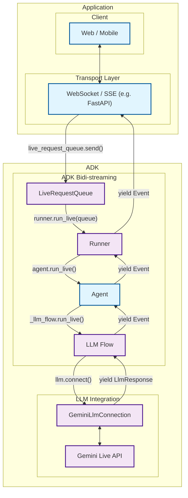
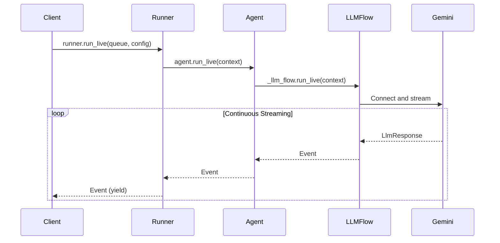

# Part 2: Core Streaming APIs

Having established the foundational concepts of bidirectional streaming in Part 1, we now dive deep into the technical heart of ADK—the complete event handling architecture that transforms complex streaming challenges into simple, intuitive APIs. This part reveals how ADK's integrated streaming system eliminates the complexity of building real-time AI communication from scratch.

You'll discover ADK's event-driven architecture that seamlessly coordinates message queuing, async processing, state management, and AI model integration. Rather than wrestling with WebSocket protocols, asyncio complexity, and AI model APIs separately, you'll see how ADK provides a unified streaming framework that handles the intricate orchestration automatically. By the end of this part, you'll understand why building streaming AI applications with ADK feels effortless compared to implementing these systems from scratch.

### Quick Demo (Recommended)

Before diving into the details, try the runnable FastAPI demo in `src/part2` (`streaming_app.py`). Running it and skimming the code will make the concepts in this section concrete.

For setup and run instructions, see the README: [src/part2/README.md](../src/part2/README.md).

As you read, keep `src/part2/streaming_app.py` open and map the concepts below to the working demo—this greatly accelerates understanding for the rest of Part 2.


## 2.1 ADK's Event Handling Architecture

### What You Don’t Need To Care About

ADK hides a number of streaming internals so you can focus on product logic:

- Event loop setup for `LiveRequestQueue` creation and consumption
- Partial text aggregation and finalization boundaries
- Backpressure and queue polling timeouts used to keep UIs responsive
- When live audio responses are persisted vs. skipped in session history
- Low‑level fan‑out of live requests to active streaming tools

These are handled by the framework; you primarily work with `LiveRequestQueue`, `Runner.run_live()`, `Event` objects, and `RunConfig`.

ADK's streaming architecture represents a complete solution to the challenges that would otherwise require months of custom development. Instead of building message queuing, async coordination, state management, and AI model integration separately, ADK provides an integrated event handling system that orchestrates all these components seamlessly.

### The Challenge of Building Streaming AI From Scratch

Implementing bidirectional streaming AI communication from scratch involves solving multiple complex problems simultaneously:

**Message Management Complexity:**
- Message queuing and ordering under concurrent access
- Thread-safe operations across async and sync contexts
- Graceful handling of connection failures and timeouts

**Event Processing Challenges:**
- Coordinating multiple async generators and consumers
- Managing backpressure when AI responses are slower than user input
- Handling interruptions and partial message states
- Maintaining conversation context across streaming sessions

**AI Model Integration Difficulties:**
- Protocol translation between application events and AI model APIs
- Managing streaming tokens vs. complete message semantics
- Handling model-specific response formats and error conditions
- Coordinating multimodal inputs (text, audio, video) with single model interface

### ADK's Integrated Solution

ADK eliminates this complexity through a cohesive architecture where each component works in harmony:



| Developer provides: | ADK provides: | Gemini Live API provides: |
|:----------------------------|:------------------|:------------------------------|
| **Web / Mobile**: Frontend applications that users interact with, handling UI/UX, user input capture, and response display<br><br>**[WebSocket](https://developer.mozilla.org/en-US/docs/Web/API/WebSocket) / [SSE](https://developer.mozilla.org/en-US/docs/Web/API/Server-sent_events) Server**: Real-time communication server (such as [FastAPI](https://fastapi.tiangolo.com/)) that manages client connections, handles streaming protocols, and routes messages between clients and ADK<br><br>**Agent**: Custom AI agent definition with specific instructions, tools, and behavior tailored to your application's needs | **[LiveRequestQueue](https://github.com/google/adk-python/blob/main/src/google/adk/agents/live_request_queue.py)**: Message queue that buffers and sequences incoming user messages (text content, audio blobs, control signals) for orderly processing by the agent<br><br>**[Runner](https://github.com/google/adk-python/blob/main/src/google/adk/runners.py)**: Execution engine that orchestrates agent sessions, manages conversation state, and provides the `run_live()` streaming interface<br><br>**[LLM Flow](https://github.com/google/adk-python/blob/main/src/google/adk/flows/llm_flows/base_llm_flow.py)**: Processing pipeline that handles streaming conversation logic, manages context, and coordinates with language models<br><br>**[GeminiLlmConnection](https://github.com/google/adk-python/blob/main/src/google/adk/models/gemini_llm_connection.py)**: Abstraction layer that bridges ADK's streaming architecture with Gemini Live API, handling protocol translation and connection management | **[Gemini Live API](https://ai.google.dev/gemini-api/docs/live)**: Google's real-time language model service that processes streaming input, generates responses, handles interruptions, supports multimodal content (text, audio, video), and provides advanced AI capabilities like function calling and contextual understanding |

### ADK's Value Proposition

The true measure of a framework isn't just what it enables—it's what it eliminates. ADK's value proposition becomes crystal clear when you compare the complexity of building bidirectional streaming from scratch versus using ADK's integrated solution. The difference isn't merely a matter of convenience; it's the difference between spending months building infrastructure versus focusing on your application's unique value from day one.

**Instead of building this yourself:**

```python
# Custom implementation (hundreds of lines)
class CustomStreamingSystem:
    def __init__(self):
        self.websocket_handler = CustomWebSocketHandler()
        self.message_queue = CustomAsyncQueue()
        self.ai_connector = CustomAIConnector()
        self.state_manager = CustomStateManager()
        # ... complex setup and coordination logic

    async def handle_streaming(self):
        # Complex async coordination
        # Error handling and recovery
        # Message ordering and backpressure
        # AI model protocol translation
        # ... hundreds of lines of coordination code
```

**You get this with ADK:**

```python
# ADK integrated system (5 lines)
live_request_queue = LiveRequestQueue()
live_request_queue.send_content(user_message)

async for event in runner.run_live(
    user_id="user", session_id="session",
    live_request_queue=live_request_queue
):
    # Handle streaming events - ADK manages all complexity
    process_event(event)
```

This simplification isn't achieved through abstraction that limits flexibility—it comes from thoughtful integration where each component is designed to work seamlessly with the others. You get the full power of bidirectional streaming without the complexity burden.

**Key Architectural Benefits:**

The integrated architecture delivers benefits that compound as your application grows:

- **Unified Event Model**: A single event stream seamlessly handles all message types—text, audio, control signals—eliminating the need for separate handling logic for each type. This unified approach reduces code complexity and ensures consistent behavior across different input modalities.

- **Automatic Coordination**: The framework provides built-in async coordination between message queuing, processing, and AI model communication. You don't need to manage asyncio tasks, handle backpressure, or coordinate between producers and consumers—ADK orchestrates this complexity automatically.

- **Production-Ready Reliability**: Battle-tested error handling, reconnection logic, and failure recovery come standard. These aren't features you need to build and debug yourself; they're baked into the framework's foundation, proven through real-world deployments.

- **Seamless AI Integration**: Direct integration with Gemini Live API eliminates the need for protocol translation layers. ADK speaks the language of both your application and the AI model, handling the translation seamlessly so you can focus on conversational logic rather than protocol details.

- **Memory Efficient**: Streaming event processing prevents the memory accumulation issues common in custom implementations. Events are processed as they arrive and immediately released, maintaining constant memory usage regardless of conversation length.

### Unified Message Processing

ADK's event handling architecture centers around a unified message model that eliminates the complexity of handling different data types separately. Instead of building custom protocols for text, audio, and control messages, ADK provides a single `LiveRequest` container:

> 📖 **Source Reference**: [`live_request_queue.py`](https://github.com/google/adk-python/blob/main/src/google/adk/agents/live_request_queue.py)

```python
class LiveRequest(BaseModel):
    content: Optional[Content] = None           # Text-based content and structured data
    blob: Optional[Blob] = None                 # Audio/video data and binary streams
    activity_start: Optional[ActivityStart] = None  # Signal start of user activity
    activity_end: Optional[ActivityEnd] = None      # Signal end of user activity
    close: bool = False                         # Graceful connection termination signal
```

This streamlined design handles every streaming scenario you'll encounter. The mutually exclusive `content` and `blob` fields handle different data types, the `activity_start` and `activity_end` fields enable activity signaling, and the `close` flag provides graceful termination semantics. This design eliminates the complexity of managing multiple message types while maintaining clear separation of concerns.

While you can create `LiveRequest` objects directly, `LiveRequestQueue` provides convenience methods that handle the creation internally:

**Text Content:**

Text content represents the primary mode of structured communication between users and AI agents. This includes not just simple text messages, but also rich content with metadata, function call responses, and contextual information. The `Content` object uses a `parts` array structure that allows for complex message composition while maintaining semantic clarity.

```python
# Convenience method (recommended)
text_content = Content(parts=[Part(text="Hello, streaming world!")])
live_request_queue.send_content(text_content)

# Equivalent to creating LiveRequest manually:
# live_request_queue.send(
#     LiveRequest(content=Content(parts=[Part(text="Hello, streaming world!")]))
# )
```

**Audio/Video Blobs:**

Binary data streams—primarily audio and video—flow through the `Blob` type, which handles the real-time transmission of multimedia content. Unlike text content that gets processed turn-by-turn, blobs are designed for continuous streaming scenarios where data arrives in chunks. The base64 encoding ensures safe transmission while the MIME type helps the model understand the content format.

```python
# Convenience method (recommended)
audio_blob = Blob(
    mime_type="audio/pcm",
    data=base64.b64encode(audio_data).decode()
)
live_request_queue.send_realtime(audio_blob)

# Equivalent to creating LiveRequest manually:
# live_request_queue.send(
#     LiveRequest(blob=Blob(mime_type="audio/pcm", data=encoded_audio))
# )
```

**Activity Signals:**

Activity signals provide a sophisticated mechanism for communicating user engagement state to the AI model. `ActivityStart` signals indicate when a user begins providing input (like starting to speak or type), while `ActivityEnd` marks the completion of that input. These signals enable the model to understand natural conversation boundaries and make intelligent decisions about when to respond or when to wait for more input.

```python
# Convenience methods (recommended)
live_request_queue.send_activity_start()
live_request_queue.send_activity_end()

# Equivalent to creating LiveRequest manually:
# live_request_queue.send(LiveRequest(activity_start=ActivityStart()))
# live_request_queue.send(LiveRequest(activity_end=ActivityEnd()))
```

**Control Signals:**

The `close` signal provides graceful termination semantics for streaming sessions. It signals the system to cleanly close the model connection and end the bidirectional stream. Note: audio/transcript caches are flushed on control events (for example, turn completion), not by `close()` itself.

```python
# Convenience method (recommended)
live_request_queue.close()

# Equivalent to creating LiveRequest manually:
# live_request_queue.send(LiveRequest(close=True))
```

**Sample Code (Producer – from src/part2/streaming_app.py):**

The WebSocket handler accepts either full `LiveRequest` JSON (activity, blob, close)
or plain text which it wraps into `Content` before enqueueing to `LiveRequestQueue`.

```python
# Inside consume_messages() in the WS handler
while True:
    data = await ws.receive_text()
    # Try a full LiveRequest (activity_start/end, blob, close)
    try:
        req = LiveRequest.model_validate_json(data)
        live_queue.send(req)
        if req.close:
            break
        continue
    except Exception:
        pass

    # Fallback: treat plain text as a discrete turn
    content = types.Content(parts=[types.Part(text=data)])
    live_queue.send_content(content)
```

### send_content() vs send_realtime() Methods

When using `LiveRequestQueue`, you'll use two different methods to send data to the model, each optimized for different types of communication. Understanding when to use each method is crucial for building efficient streaming applications.

#### send_content(): Structured Turn-Based Communication

The `send_content()` method handles structured, turn-complete messages that represent discrete conversation turns:

**What it sends:**

- **Regular conversation messages**: User text input that starts a new turn
- **Function call responses**: Results from tool executions that the model requested
- **Structured metadata**: Context information embedded in Content objects

**Example usage:**

```python
# Send user message
content = Content(parts=[Part(text="Hello, AI assistant!")])
live_request_queue.send_content(content)

# Send function response
function_response = FunctionResponse(
    name="get_weather",
    response={"temperature": 72, "condition": "sunny"}
)
content = Content(parts=[Part(function_response=function_response)])
live_request_queue.send_content(content)
```

**Key characteristic**: This signals a complete turn to the model, triggering immediate response generation.

**Important:** When sending function responses, ensure the `Content` contains only function responses in its parts (no mixed text), or the responses may be ignored by the model.

#### send_realtime(): Continuous Streaming Data

The `send_realtime()` method handles continuous, real-time data streams that don't follow turn-based semantics:

**What it sends:**

- **Audio chunks**: PCM-encoded audio data for voice input
- **Video frames**: Binary video data for multimodal processing
- **Activity signals**: ActivityStart/ActivityEnd markers for user engagement tracking

**Example usage:**

```python
# Send audio chunk (20ms of PCM audio)
audio_blob = Blob(
    mime_type="audio/pcm;rate=16000",
    data=base64.b64encode(audio_chunk).decode()
)
live_request_queue.send_realtime(audio_blob)

# Signal user activity
live_request_queue.send_activity_start()
# ... stream audio chunks ...
live_request_queue.send_activity_end()
```

**Key characteristic**: Real-time data flows continuously without turn boundaries. The model can start responding before receiving all input (e.g., interrupting during speech), enabling natural conversation flow.

**When to use which:**

| Scenario | Method | Reason |
|----------|--------|--------|
| Text chat message | `send_content()` | Discrete, turn-complete communication |
| Tool execution result | `send_content()` | Structured function response data |
| Voice input streaming | `send_realtime()` | Continuous audio data |
| User started speaking | `send_activity_start()` | Activity signal (convenience method) |
| Video frame | `send_realtime()` | Binary streaming data |

### Async Queue Management

One of the most powerful aspects of `LiveRequestQueue` is how it seamlessly bridges synchronous and asynchronous programming models. The queue's design recognizes a fundamental reality of streaming applications: message production often happens in synchronous contexts (like HTTP request handlers or UI event callbacks), while message consumption happens in async contexts (like the streaming event loop).

The producer side uses non-blocking operations that return immediately, allowing your application to queue messages without waiting for processing. This prevents UI freezes and keeps your application responsive even under heavy load. The consumer side, however, uses async/await patterns that integrate naturally with Python's asyncio ecosystem, enabling efficient concurrent processing without the complexity of threading.

```python
# Producer (non-blocking)
live_request_queue.send_content(content)

# Consumer (async)
request = await live_request_queue.get()
```

This asymmetric design—sync producers, async consumers—is what makes `LiveRequestQueue` so practical for real-world applications. You can send messages from anywhere in your codebase without worrying about async contexts, while ADK's internal machinery handles them efficiently through async processing.

### Concurrency Notes

`LiveRequestQueue` is designed for typical streaming scenarios:

- **Same event loop**: Call `send_content()`, `send_realtime()`, `send_activity_*()`, or `close()` freely without extra coordination
- **Cross-thread usage**: For advanced scenarios requiring cross-thread enqueueing, schedule enqueues via `loop.call_soon_threadsafe(queue.put_nowait, ...)` or send a validated `LiveRequest` via a loop-bound method
- **Message ordering**: ADK processes messages sequentially in FIFO order
- **Unbounded by default**: Messages are not dropped or coalesced; see Backpressure and Flow Control for bounded-buffer patterns if needed

**Sample Code (Producer/Consumer orchestration – from src/part2/streaming_app.py):**

The app creates a per-connection `LiveRequestQueue`, spawns a consumer task to
read client input and a producer task to forward events from `Runner.run_live(...)`.

```python
live_queue = LiveRequestQueue()
runner = build_runner()
rc = default_run_config(text_only=True)  # or enable AUDIO/transcription/VAD

async def forward_events():
    async for event in runner.run_live(
        user_id=uid,
        session_id=sid,
        live_request_queue=live_queue,
        run_config=rc,
    ):
        await ws.send_text(event.model_dump_json(exclude_none=True, by_alias=True))

async def consume_messages():
    # See Unified Message Processing sample above
    ...

forward_task = asyncio.create_task(forward_events())
consumer_task = asyncio.create_task(consume_messages())
await asyncio.wait({forward_task, consumer_task}, return_when=asyncio.FIRST_COMPLETED)
```

<!-- Example block removed: local Part 2 sample files have been removed. -->

## 2.2 The run_live() Method

The `run_live()` method serves as the primary entry point for streaming conversations in ADK. This method implements an async generator pattern that transforms the complex orchestration of real-time AI communication into a clean, iterator-like interface that feels natural to Python developers.

What makes `run_live()` remarkable is how it handles the inherent complexity of managing multiple concurrent data streams, coordinating with external AI services, maintaining conversation state, and processing interruptions—all while presenting a clean, predictable interface that yields events as the conversation unfolds. It's the difference between wrestling with streaming APIs and simply iterating over conversation events.

### Method Signature and Flow

> 📖 **Source Reference**: [`runners.py`](https://github.com/google/adk-python/blob/main/src/google/adk/runners.py)



### Basic Usage Pattern

```python
async for event in runner.run_live(
    user_id="user_123",
    session_id="session_456", 
    live_request_queue=live_request_queue,
    run_config=run_config
):
    # Process streaming events in real-time
    handle_event(event)
```

### Async Generator Pattern

The `run_live()` method leverages Python's async generator pattern in ways:

- **Yields events immediately**: No buffering or batching that would introduce artificial delays. Each event becomes available the moment it's generated, preserving the real-time nature of conversation.

- **Memory efficient**: Maintains constant memory usage regardless of conversation length. Whether you're handling a quick question or a hours-long tutoring session, memory usage remains predictable and bounded.

- **Real-time processing**: Events become available as soon as they're generated, enabling applications to respond immediately to conversation developments without polling or complex callback management.

```python
# The method signature reveals the thoughtful design
async def run_live(
    self,
    user_id: str,                         # User identification for session management
    session_id: str,                      # Session tracking across interactions
    live_request_queue: LiveRequestQueue, # The bidirectional communication channel
    run_config: Optional[RunConfig] = None, # Streaming behavior configuration
) -> AsyncGenerator[Event, None]:         # Generator yielding conversation events
```

As its signature tells, every streaming conversation needs identity (user_id), continuity (session_id), communication (live_request_queue), and configuration (run_config). The return type—an async generator of Events—promises real-time delivery without overwhelming system resources.

Notes:
- A deprecated `session` parameter is also accepted; prefer `user_id` and `session_id`.
- If `run_config.response_modalities` is not set, ADK defaults it to `['AUDIO']` for live mode to support native audio models.

Common errors and tips:
- Ensure `Content` you send has non-empty `parts`; empty messages raise `ValueError`.
- Use `send_content()` for discrete turns (text, function responses); use `send_realtime()` for continuous data (audio/video, activity signals).
- Avoid mixing function responses with regular text in a single `Content` object.

### Understanding RunConfig

> 📖 **Source Reference**: [`run_config.py`](https://github.com/google/adk-python/blob/main/src/google/adk/agents/run_config.py)

RunConfig is how you configure the behavior of `run_live()` sessions. It unlocks sophisticated capabilities like multimodal interactions, intelligent proactivity, session resumption, and cost controls—all configured declaratively without complex implementation.

#### Multimodal Input and Output

Configure which modalities the model should use for input processing and output generation:

```python
run_config = RunConfig(
    response_modalities=["TEXT", "AUDIO"],  # Model generates both text and audio
    streaming_mode=StreamingMode.BIDI      # Bidirectional streaming
)
```

**Sample Code (RunConfig builder – from src/part2/streaming_app.py):**

```python
def default_run_config(
    *,
    text_only: bool = True,
    enable_input_transcription: bool = False,
    enable_output_transcription: bool = False,
    enable_vad: bool = False,
) -> RunConfig:
    response_modalities = ["TEXT"] if text_only else ["TEXT", "AUDIO"]
    rc = RunConfig(
        response_modalities=response_modalities,
        streaming_mode=StreamingMode.BIDI,
    )
    if enable_input_transcription:
        rc.input_audio_transcription = types.AudioTranscriptionConfig(enabled=True)
    if enable_output_transcription:
        rc.output_audio_transcription = types.AudioTranscriptionConfig(enabled=True)
    if enable_vad:
        rc.realtime_input_config = types.RealtimeInputConfig(
            voice_activity_detection=types.VoiceActivityDetectionConfig(enabled=True)
        )
    return rc
```

**response_modalities:**
- `["TEXT"]`: Text-only responses (default for non-live agents)
- `["AUDIO"]`: Audio-only responses (default for live agents)
- `["TEXT", "AUDIO"]`: Both text and audio simultaneously

When both modalities are enabled, the model generates synchronized text and audio streams, enabling rich multimodal experiences like voice assistants with visual displays.

#### Audio Transcription

Enable automatic transcription of audio streams without external services:

```python
run_config = RunConfig(
    # Transcribe user's spoken input
    input_audio_transcription=AudioTranscriptionConfig(enabled=True),

    # Transcribe model's spoken output
    output_audio_transcription=AudioTranscriptionConfig(enabled=True)
)
```

**Use cases:**
- **Accessibility**: Provide captions for hearing-impaired users
- **Logging**: Store text transcripts of voice conversations
- **Analytics**: Analyze conversation content without audio processing
- **Debugging**: Verify what the model heard vs. what it generated

The transcriptions are delivered through the same streaming event pipeline as `input_transcription` and `output_transcription` fields in LlmResponse objects.

**Troubleshooting:** If audio is not being transcribed, ensure `input_audio_transcription` (and/or `output_audio_transcription`) is enabled in `RunConfig`, and confirm audio MIME type and chunking are correct (`audio/pcm`, short contiguous chunks).

#### Advanced: SSE vs. Bidi Streaming

Text streaming semantics are consistent across SSE and Bidi, but the underlying boundaries differ:

- **Bidi**: Partial text chunks are aggregated and a final merged text event is emitted at turn boundaries (e.g., `turn_complete`).
- **SSE**: Partial text chunks are aggregated and finalized when the stream signals completion (e.g., via `finish_reason`).

In both modes, partial events have `partial=True`; consumers should merge them or rely on the final non‑partial event for stable text.

#### Voice Activity Detection (VAD)

Configure real-time detection of when users are actively speaking:

```python
run_config = RunConfig(
    realtime_input_config=RealtimeInputConfig(
        voice_activity_detection=VoiceActivityDetectionConfig(enabled=True)
    )
)
```

**How it works:**

When VAD is enabled, Gemini Live API automatically analyzes incoming audio streams to detect:
- Speech start (user begins speaking)
- Speech end (user finishes speaking)
- Silence periods (pauses between words)

This enables the model to intelligently respond:
- Wait for natural pauses before responding
- Avoid interrupting mid-sentence
- Detect when the user has finished their thought

VAD is crucial for natural voice interactions, eliminating the need for "push-to-talk" buttons or manual turn-taking.

#### Live Audio Best Practices

- Prefer PCM audio (`mime_type="audio/pcm"`) with consistent sample rate across chunks.
- Send short, contiguous chunks (e.g., tens to hundreds of milliseconds) to reduce latency and preserve continuity.
- Use `send_activity_start()` when the user begins speaking and `send_activity_end()` when they finish to help the model time its responses.
- If `input_audio_transcription` is not enabled, ADK may use its own transcription path; enable it in `RunConfig` for end‑to‑end model transcription.
- For multimodal output, enable both `TEXT` and `AUDIO` in `response_modalities`.

#### Proactivity and Affective Dialog

Enable the model to be proactive and emotionally aware:

```python
run_config = RunConfig(
    # Model can initiate responses without explicit prompts
    proactivity=ProactivityConfig(enabled=True),

    # Model detects and adapts to user emotions
    enable_affective_dialog=True
)
```

**Proactivity:**

When enabled, the model can:
- Offer suggestions without being asked
- Provide follow-up information proactively
- Ignore irrelevant or off-topic input
- Anticipate user needs based on context

**Affective Dialog:**

The model analyzes emotional cues in voice tone and content to:
- Detect user emotions (frustrated, happy, confused, etc.)
- Adapt response style and tone accordingly
- Provide empathetic responses in customer service scenarios
- Adjust formality based on detected sentiment

#### Session Resumption

Enable transparent reconnection without losing conversation context:

```python
run_config = RunConfig(
    session_resumption=SessionResumptionConfig(
        mode="transparent"  # Only mode currently supported
    )
)
```

**How it works:**

When session resumption is enabled:

1. Gemini Live API provides a `live_session_resumption_handle` in session updates
2. ADK stores this handle in InvocationContext
3. If the WebSocket connection drops, ADK can reconnect using the handle
4. The model resumes from exactly where it left off—no context loss

This is critical for production deployments where network reliability varies and long conversations should survive temporary disconnections.

Advanced: Example reconnection flow (conceptual):

```python
attempt = 1
while True:
    try:
        # If available, attach InvocationContext.live_session_resumption_handle
        # to llm_request.live_connect_config.session_resumption.handle
        async with llm.connect(llm_request) as conn:
            # Start concurrent send/receive tasks
            await handle_stream(conn)
        break  # Clean close
    except ConnectionClosed:
        attempt += 1
        # Retry with updated handle provided by model updates
        continue
```

#### Cost and Safety Controls

Protect against runaway costs and ensure conversation boundaries:

```python
run_config = RunConfig(
    # Limit total LLM calls per invocation
    max_llm_calls=500,  # Default: 500, 0 or negative = unlimited

    # Save audio artifacts for debugging/compliance
    save_live_audio=True  # Default: False
)
```

**max_llm_calls:**

Enforced by InvocationContext's `_invocation_cost_manager`, which increments a counter on each LLM call and raises `LlmCallsLimitExceededError` when the limit is exceeded. This prevents:
- Infinite loops in agent workflows
- Runaway costs from buggy tools
- Excessive API usage in development

**save_live_audio:**

When enabled, ADK persists audio streams to:
- **Session service**: Conversation history includes audio references
- **Artifact service**: Audio files stored with unique IDs

Useful for:
- Debugging voice interaction issues
- Compliance and audit trails
- Training data collection
- Quality assurance

#### Compositional Function Calling (Experimental)

Enable advanced function calling patterns:

```python
run_config = RunConfig(
    support_cfc=True,  # Compositional Function Calling
    streaming_mode=StreamingMode.SSE
)
```

**⚠️ Warning:** This feature is experimental and only works with `StreamingMode.SSE`. Additional constraints enforced by ADK:
- Only supported on `gemini-2*` models.
- Requires the built-in code executor; ADK injects `BuiltInCodeExecutor` when CFC is enabled.

CFC enables complex tool use patterns like:
- Calling multiple tools in parallel
- Chaining tool outputs as inputs to other tools
- Conditional tool execution based on results

Only available through Gemini Live API, which ADK automatically uses when `support_cfc=True`.

<!-- Example block removed: local Part 2 sample files have been removed. -->


## 2.3 Understanding Events

ADK's event system is the foundation of real-time streaming interactions. Understanding how events flow through the system, what types of events you'll receive, and how to handle them enables you to build responsive, natural streaming applications.

### Event Emission Pipeline

Events flow through multiple layers before reaching your application:

1. **GeminiLlmConnection**: Generates `LlmResponse` objects
2. **LLM Flow**: Converts to `Event` objects with metadata
3. **Agent**: Passes through with optional state updates
4. **Runner**: Persists to session and yields to caller

Author semantics in live mode:
- Model responses are authored by the current agent (the `Event.author` is the agent name), not the literal string "model".
- Transcription events originating from user audio are authored as `"user"`.

#### Event Types and Flags

ADK surfaces model and system signals as `Event` objects with helpful flags:

- `partial`: True for incremental text chunks; a non‑partial merged text event follows turn boundaries.
- `turn_complete`: Signals end of the model’s current turn; often where merged text is emitted.
- `interrupted`: Model output was interrupted (e.g., by new user input); the flow flushes accumulated text if any.
- `input_transcription` / `output_transcription`: Streaming transcription events; emitted as stand‑alone events.
- Content parts with `inline_data` (audio) may be yielded for live audio output. By default, Runner does not persist these live audio response events.

Persistence in live mode:
- Runner skips appending model audio events to the session by default; audio persistence is controlled via `RunConfig.save_live_audio` and flushed on control events (e.g., turn completion).

**Troubleshooting:** If no events are arriving, ensure `runner.run_live(...)` is being iterated and the `LiveRequestQueue` is fed. Also verify that `Content` sent via `send_content()` has non-empty `parts`.

### Concurrent Processing Model

Behind the scenes, `run_live()` orchestrates bidirectional streaming through concurrent async tasks. This enables true bidirectional communication where input and output happen simultaneously:

```python
# Simplified internal pattern
async def streaming_session():
    # Input task: Client → Gemini
    input_task = asyncio.create_task(
        send_to_model(llm_connection, live_request_queue)
    )

    # Output task: Gemini → Client
    async for event in receive_from_model(llm_connection):
        yield event  # Real-time event streaming
```

**Sample Code (Consuming events – from src/part2/streaming_app.py):**

```python
async for event in runner.run_live(
    user_id=uid,
    session_id=sid,
    live_request_queue=live_queue,
    run_config=rc,
):
    # Stream back to client as JSON
    await ws.send_text(event.model_dump_json(exclude_none=True, by_alias=True))
```

### Backpressure and Flow Control

- Producers are not throttled by default: `LiveRequestQueue` is unbounded and accepts messages without blocking.
- Natural backpressure comes from awaits in the send/receive loops and from how quickly you consume `runner.run_live(...)`.
- Practical guidance:
  - Pace audio at the source (short, contiguous chunks) rather than large bursts.
  - Use `ActivityStart()`/`ActivityEnd()` to bound turns and reduce overlap; this is not byte‑rate throttling.
  - If you need hard limits, consider a bounded producer buffer (see Advanced example below).

### Connection Lifecycle

The streaming session follows a well-defined lifecycle using Python's async context manager pattern:

```python
async with llm.connect(llm_request) as llm_connection:
    # Bidirectional streaming session active
    await handle_streaming_conversation()
# Connection automatically closed
```

**Lifecycle Phases:**

1. **Setup**: Create LiveRequestQueue, configure RunConfig
2. **Connect**: Establish GeminiLlmConnection
3. **Stream**: Concurrent input/output processing
4. **Handle Events**: Process streaming events in real-time
5. **Cleanup**: Graceful connection termination

### Relationship with Regular agent.run()

| Feature | `agent.run()` | `agent.run_live()` |
|---------|---------------|-------------------|
| **Input** | Single message | LiveRequestQueue stream |
| **Output** | Final response | Event stream |
| **Timing** | Batch processing | Real-time streaming |
| **Interruption** | Not supported | Full interruption support |
| **Use Case** | Simple Q&A | Interactive conversations |

### Event Types and Handling

When you iterate over `runner.run_live()`, ADK streams `Event` objects that represent different aspects of the conversation. Understanding these events and their flags helps you build responsive, real-time applications.

**Event Types You'll Receive:**

**1. Text Response Events**

The most common event type, containing the model's text responses:

```python
async for event in runner.run_live(...):
    if event.content and event.content.parts:
        if event.content.parts[0].text:
            # Display streaming text to user
            text = event.content.parts[0].text

            # Check if this is partial (more text coming) or complete
            if event.partial:
                # Update UI with partial text (e.g., typing indicator)
                update_streaming_display(text)
            else:
                # Final merged text for this segment
                display_complete_message(text)
```

**Key Event Flags:**
- `event.partial`: `True` for incremental text chunks during streaming; `False` for complete merged text
- `event.turn_complete`: `True` when the model has finished its complete response
- `event.interrupted`: `True` when user interrupted the model's response

**2. Audio Events**

When `response_modalities` includes `"AUDIO"`, you'll receive audio data:

```python
async for event in runner.run_live(...):
    if event.content and event.content.parts:
        if event.content.parts[0].inline_data:
            # Stream audio to client for playback
            audio_data = event.content.parts[0].inline_data.data
            await play_audio(audio_data)
```

**3. Transcription Events**

When transcription is enabled in `RunConfig`, you receive transcriptions as separate events:

```python
async for event in runner.run_live(...):
    # User's spoken words (when input_audio_transcription enabled)
    if event.input_transcription:
        display_user_transcription(event.input_transcription)

    # Model's spoken words (when output_audio_transcription enabled)
    if event.output_transcription:
        display_model_transcription(event.output_transcription)
```

These enable accessibility features and conversation logging without separate transcription services.

**4. Tool Call Events**

When the model requests tool execution:

```python
async for event in runner.run_live(...):
    if event.content and event.content.parts:
        for part in event.content.parts:
            if part.function_call:
                # Model is requesting a tool execution
                tool_name = part.function_call.name
                tool_args = part.function_call.args
                # ADK handles execution automatically
```

ADK processes tool calls automatically—you typically don't need to handle these directly unless implementing custom tool execution logic.

### Handling Interruptions and Turn Completion

Two critical event flags enable natural, human-like conversation flow in your application: `interrupted` and `turn_complete`. Understanding how to handle these flags is essential for building responsive streaming UIs.

#### Interruption Handling

When users send new input while the model is still generating a response (common in voice conversations), you'll receive an event with `interrupted=True`:

```python
async for event in runner.run_live(...):
    if event.interrupted:
        # User interrupted the model's response
        # Stop displaying partial text, clear typing indicators
        stop_streaming_display()

        # Optionally: show interruption in UI
        show_user_interruption_indicator()
```

**Practical example:**

```
Model: "The weather in San Francisco is currently..."
User: [interrupts] "Actually, I meant San Diego"
→ event.interrupted=True received
→ Your app: stop rendering model response, clear UI
→ Model processes new input
Model: "The weather in San Diego is..."
```

**When to use interruption handling:**

- **Voice conversations**: Stop audio playback immediately when user starts speaking
- **Clear UI state**: Remove typing indicators and partial text displays
- **Conversation logging**: Mark which responses were interrupted (incomplete)
- **User feedback**: Show visual indication that interruption was recognized

#### Turn Completion Handling

When the model finishes its complete response, you'll receive an event with `turn_complete=True`:

```python
async for event in runner.run_live(...):
    if event.turn_complete:
        # Model has finished its turn
        # Update UI to show "ready for input" state
        enable_user_input()
        hide_typing_indicator()

        # Mark conversation boundary in logs
        log_turn_boundary()
```

**Event Flag Combinations:**

Understanding how `turn_complete` and `interrupted` combine helps you handle all conversation states:

| Scenario | turn_complete | interrupted | Your App Should |
|----------|---------------|-------------|-----------------|
| Normal completion | True | False | Enable input, show "ready" state |
| User interrupted mid-response | False | True | Stop display, clear partial content |
| Interrupted at end | True | True | Same as normal completion (turn is done) |
| Mid-response (partial text) | False | False | Continue displaying streaming text |

**Practical Application:**

```python
async for event in runner.run_live(...):
    # Handle streaming text
    if event.content and event.content.parts and event.content.parts[0].text:
        if event.partial:
            # Show typing indicator, update partial text
            update_streaming_text(event.content.parts[0].text)
        else:
            # Display complete text chunk
            display_text(event.content.parts[0].text)

    # Handle interruption
    if event.interrupted:
        stop_audio_playback()
        clear_streaming_indicators()

    # Handle turn completion
    if event.turn_complete:
        # Model is done - enable user input
        show_input_ready_state()
        enable_microphone()
        # The loop will wait for next user input before continuing
```

**Common Use Cases:**

- **UI state management**: Show/hide "ready for input" indicators, typing animations, microphone states
- **Audio playback control**: Know when to stop rendering audio chunks from the model
- **Conversation logging**: Mark clear boundaries between turns for history/analytics
- **Streaming optimization**: Stop buffering when turn is complete


## 2.4 InvocationContext: The Execution State Container

> 📖 **Source Reference**: [`invocation_context.py`](https://github.com/google/adk-python/blob/main/src/google/adk/agents/invocation_context.py)

While `run_live()` returns an AsyncGenerator for consuming events, internally it creates and manages an `InvocationContext`—the central data container that flows through every layer of ADK's execution stack.

**Who uses InvocationContext?**

InvocationContext serves different audiences at different levels:

- **ADK's internal components** (primary users): Runner, Agent, LLMFlow, and GeminiLlmConnection all receive, read from, and write to the InvocationContext as it flows through the stack. This shared context enables seamless coordination without tight coupling.

- **Application developers** (indirect beneficiaries): You don't typically create or manipulate InvocationContext directly in your application code. Instead, you benefit from the clean, simplified APIs that InvocationContext enables behind the scenes—like the elegant `async for event in runner.run_live()` pattern.

- **Tool and callback developers** (direct access): When you implement custom tools or callbacks, you receive InvocationContext as a parameter. This gives you direct access to conversation state, session services, and control flags (like `end_invocation`) to implement sophisticated behaviors.

Understanding InvocationContext is essential for grasping how ADK maintains state, coordinates execution, and enables advanced features like multi-agent workflows and resumability. Even if you never touch it directly, knowing what flows through your application helps you design better agents and debug issues more effectively.

### What is InvocationContext?

`InvocationContext` is ADK's unified state carrier that encapsulates everything needed for a complete conversation invocation. Think of it as a traveling notebook that accompanies a conversation from start to finish, collecting information, tracking progress, and providing context to every component along the way.

An **invocation** represents a complete interaction cycle:
- Starts with user input (text, audio, or control signal)
- May involve one or multiple agent calls
- Ends when a final response is generated or when explicitly terminated
- Is orchestrated by `runner.run_live()` or `runner.run_async()`

This is distinct from an **agent call** (execution of a single agent's logic) and a **step** (a single LLM call plus any resulting tool executions).

  ```
     ┌─────────────────────── invocation ──────────────────────────┐
     ┌──────────── llm_agent_call_1 ────────────┐ ┌─ agent_call_2 ─┐
     ┌──── step_1 ────────┐ ┌───── step_2 ──────┐
     [call_llm] [call_tool] [call_llm] [transfer]
  ```

The hierarchy looks like this:

### Lifecycle and Scope

InvocationContext follows a well-defined lifecycle within `run_live()`:

```python
# Inside runner.run_live()
async def run_live(...) -> AsyncGenerator[Event, None]:
    # 1. CREATE: Initialize InvocationContext with all services and configuration
    context = InvocationContext(
        invocation_id=new_invocation_context_id(),
        session=session,
        agent=self.agent,
        live_request_queue=live_request_queue,
        run_config=run_config,
        session_service=self.session_service,
        artifact_service=self.artifact_service,
        # ... other services and state
    )

    # 2. FLOW DOWN: Pass context to agent, which passes to LLM flow, etc.
    async for event in agent.run_live(context):
        # 3. FLOW UP: Events come back through the stack
        yield event

    # 4. CLEANUP: Context goes out of scope, resources released
```


The context flows **down the execution stack** (Runner → Agent → LLMFlow → GeminiLlmConnection), while events flow **up the stack** through the AsyncGenerator. Each layer reads from and writes to the context, creating a bidirectional information flow.

### What InvocationContext Contains

When you implement custom tools or callbacks, you receive InvocationContext as a parameter. Here's what's available to you:

**Essential Fields for Tool/Callback Developers:**

- **`context.session`**: Access to conversation history (`session.events`), user identity (`session.user_id`), and persistent state across invocations
- **`context.run_config`**: Current streaming configuration (response modalities, transcription settings, cost limits)
- **`context.end_invocation`**: Set this to `True` to immediately terminate the conversation (useful for error handling or policy enforcement)

**Common Use Cases:**

```python
# In a custom tool implementation
def my_tool(context: InvocationContext, **kwargs):
    # Access user identity
    user_id = context.session.user_id

    # Access conversation history
    previous_events = context.session.events

    # Terminate conversation if needed
    if should_end:
        context.end_invocation = True

    # Access services for persistence
    if context.artifact_service:
        # Store large files/audio
        artifact_id = context.artifact_service.save(data)

    return result
```


## Key Takeaways

You've completed a deep dive into ADK's streaming architecture. You now understand the five core components that enable real-time bidirectional AI conversations and how they work together to orchestrate complex streaming scenarios.

### **Core Components:**

**LiveRequestQueue** - Thread-safe async queue bridging synchronous producers with asynchronous consumers. Unified message model handles text, audio, activity signals, and control messages with FIFO ordering guarantees.

**run_live()** - Async generator pattern yielding real-time events. Creates InvocationContext, orchestrates concurrent input/output processing, and maintains constant memory usage through streaming.

**InvocationContext** - Unified state carrier flowing down the execution stack (Runner → Agent → LLMFlow → GeminiLlmConnection). Carries services, session data, streaming config, and agent states. Enables multi-agent workflows, resumability, and cost controls. Complements AsyncGenerator (context flows down, events flow up).

**GeminiLlmConnection** - Adapter layer translating between ADK's abstractions and Gemini Live API. Provides send_content() for turn-based messages, send_realtime() for continuous streams, and receive() for processing responses with intelligent text aggregation.

**RunConfig** - Declarative configuration for advanced features: multimodal output (TEXT, AUDIO, or both), automatic transcription, Voice Activity Detection, Proactivity, Affective Dialog, session resumption, cost controls (max_llm_calls), and audio persistence.

### **Key Architectural Patterns:**

- **Bidirectional flow**: Input descends through send methods, responses ascend through receive generators, both running concurrently
- **Interruption handling**: interrupted=True signals user interruptions with automatic text flushing; turn_complete=True signals turn end with loop exit
- **Event pipeline**: Messages transform through layers (Gemini API → GeminiLlmConnection → LLMFlow → Agent → Runner), each adding metadata
- **Service integration**: InvocationContext carries references to session, artifact, memory, and credential services for seamless persistence

### **Practical Application:**

- InvocationContext is managed by Runner—you access it in custom tools/callbacks
- Use send_content() for discrete turns (text, function responses), send_realtime() for continuous data (audio/video, activity signals)
- turn_complete enables UI state management; interrupted enables natural conversation flow
- invocation_id ties together all events for debugging; branch tracking supports multi-agent workflows

---

**Ready to apply this knowledge?** Continue to [Part 3: Basic Streaming Concepts](part3.md) where you'll explore audio/video handling, master different message types, and build your first complete streaming agent that showcases everything you've learned.
