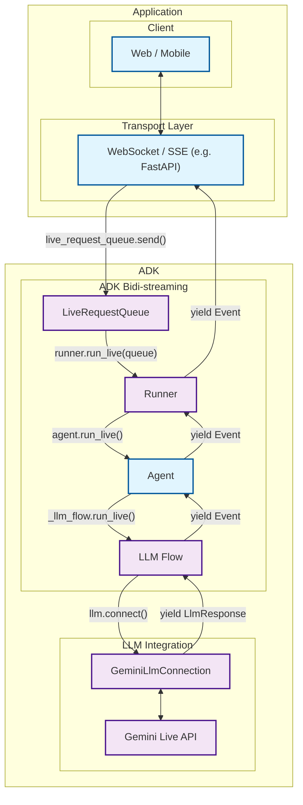
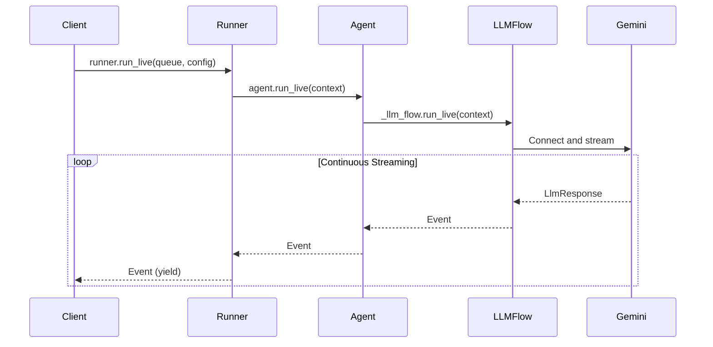
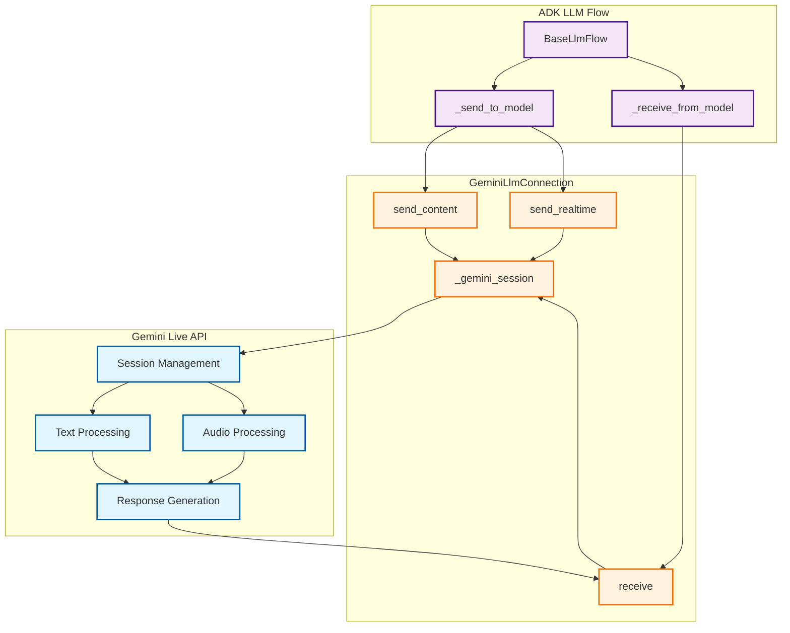

# Part 2: Core Streaming APIs

Having established the foundational concepts of bidirectional streaming in Part 1, we now dive deep into the technical heart of ADK—the complete event handling architecture that transforms complex streaming challenges into simple, intuitive APIs. This part reveals how ADK's integrated streaming system eliminates the complexity of building real-time AI communication from scratch.

You'll discover ADK's event-driven architecture that seamlessly coordinates message queuing, async processing, state management, and AI model integration. Rather than wrestling with WebSocket protocols, asyncio complexity, and AI model APIs separately, you'll see how ADK provides a unified streaming framework that handles the intricate orchestration automatically. By the end of this part, you'll understand why building streaming AI applications with ADK feels effortless compared to implementing these systems from scratch.

## 2.1 ADK's Event Handling Architecture

ADK's streaming architecture represents a complete solution to the challenges that would otherwise require months of custom development. Instead of building message queuing, async coordination, state management, and AI model integration separately, ADK provides an integrated event handling system that orchestrates all these components seamlessly.

### The Challenge of Building Streaming AI From Scratch

Implementing bidirectional streaming AI communication from scratch involves solving multiple complex problems simultaneously:

**Message Management Complexity:**
- WebSocket connection handling and reconnection logic
- Message queuing and ordering under concurrent access
- Thread-safe operations across async and sync contexts
- Graceful handling of connection failures and timeouts

**Event Processing Challenges:**
- Coordinating multiple async generators and consumers
- Managing backpressure when AI responses are slower than user input
- Handling interruptions and partial message states
- Maintaining conversation context across streaming sessions

**AI Model Integration Difficulties:**
- Protocol translation between application events and AI model APIs
- Managing streaming tokens vs. complete message semantics
- Handling model-specific response formats and error conditions
- Coordinating multimodal inputs (text, audio, video) with single model interface

### ADK's Integrated Solution

ADK eliminates this complexity through a cohesive architecture where each component works in harmony:

### Integrated Event Processing Pipeline



| Developer provides: | ADK provides: | Gemini Live API provides: |
|:----------------------------|:------------------|:------------------------------|
| **Web / Mobile**: Frontend applications that users interact with, handling UI/UX, user input capture, and response display<br><br>**[WebSocket](https://developer.mozilla.org/en-US/docs/Web/API/WebSocket) / [SSE](https://developer.mozilla.org/en-US/docs/Web/API/Server-sent_events) Server**: Real-time communication server (such as [FastAPI](https://fastapi.tiangolo.com/)) that manages client connections, handles streaming protocols, and routes messages between clients and ADK<br><br>**Agent**: Custom AI agent definition with specific instructions, tools, and behavior tailored to your application's needs | **[LiveRequestQueue](https://github.com/google/adk-python/blob/main/src/google/adk/agents/live_request_queue.py)**: Message queue that buffers and sequences incoming user messages (text content, audio blobs, control signals) for orderly processing by the agent<br><br>**[Runner](https://github.com/google/adk-python/blob/main/src/google/adk/runners.py)**: Execution engine that orchestrates agent sessions, manages conversation state, and provides the `run_live()` streaming interface<br><br>**[LLM Flow](https://github.com/google/adk-python/blob/main/src/google/adk/flows/llm_flows/base_llm_flow.py)**: Processing pipeline that handles streaming conversation logic, manages context, and coordinates with language models<br><br>**[GeminiLlmConnection](https://github.com/google/adk-python/blob/main/src/google/adk/models/gemini_llm_connection.py)**: Abstraction layer that bridges ADK's streaming architecture with Gemini Live API, handling protocol translation and connection management | **[Gemini Live API](https://ai.google.dev/gemini-api/docs/live)**: Google's real-time language model service that processes streaming input, generates responses, handles interruptions, supports multimodal content (text, audio, video), and provides advanced AI capabilities like function calling and contextual understanding |

### ADK's Value Proposition

The true measure of a framework isn't just what it enables—it's what it eliminates. ADK's value proposition becomes crystal clear when you compare the complexity of building bidirectional streaming from scratch versus using ADK's integrated solution. The difference isn't merely a matter of convenience; it's the difference between spending months building infrastructure versus focusing on your application's unique value from day one.

**Instead of building this yourself:**

```python
# Custom implementation (hundreds of lines)
class CustomStreamingSystem:
    def __init__(self):
        self.websocket_handler = CustomWebSocketHandler()
        self.message_queue = CustomAsyncQueue()
        self.ai_connector = CustomAIConnector()
        self.state_manager = CustomStateManager()
        # ... complex setup and coordination logic

    async def handle_streaming(self):
        # Complex async coordination
        # Error handling and recovery
        # Message ordering and backpressure
        # AI model protocol translation
        # ... hundreds of lines of coordination code
```

**You get this with ADK:**

```python
# ADK integrated system (5 lines)
live_request_queue = LiveRequestQueue()
live_request_queue.send_content(user_message)

async for event in runner.run_live(
    user_id="user", session_id="session",
    live_request_queue=live_request_queue
):
    # Handle streaming events - ADK manages all complexity
    process_event(event)
```

This dramatic simplification isn't achieved through abstraction that limits flexibility—it comes from thoughtful integration where each component is designed to work seamlessly with the others. You get the full power of bidirectional streaming without the complexity burden.

**Key Architectural Benefits:**

The integrated architecture delivers benefits that compound as your application grows:

- **Unified Event Model**: A single event stream seamlessly handles all message types—text, audio, control signals—eliminating the need for separate handling logic for each type. This unified approach reduces code complexity and ensures consistent behavior across different input modalities.

- **Automatic Coordination**: The framework provides built-in async coordination between message queuing, processing, and AI model communication. You don't need to manage asyncio tasks, handle backpressure, or coordinate between producers and consumers—ADK orchestrates this complexity automatically.

- **Production-Ready Reliability**: Battle-tested error handling, reconnection logic, and failure recovery come standard. These aren't features you need to build and debug yourself; they're baked into the framework's foundation, proven through real-world deployments.

- **Seamless AI Integration**: Direct integration with Gemini Live API eliminates the need for protocol translation layers. ADK speaks the language of both your application and the AI model, handling the translation seamlessly so you can focus on conversational logic rather than protocol details.

- **Memory Efficient**: Streaming event processing prevents the memory accumulation issues common in custom implementations. Events are processed as they arrive and immediately released, maintaining constant memory usage regardless of conversation length.

### Unified Message Processing

ADK's event handling architecture centers around a unified message model that eliminates the complexity of handling different data types separately. Instead of building custom protocols for text, audio, and control messages, ADK provides a single `LiveRequest` container:

> 📖 **Source Reference**: [`live_request_queue.py`](https://github.com/google/adk-python/blob/main/src/google/adk/agents/live_request_queue.py)

```python
class LiveRequest(BaseModel):
    content: Optional[Content] = None           # Text-based content and structured data
    blob: Optional[Blob] = None                 # Audio/video data and binary streams
    activity_start: Optional[ActivityStart] = None  # Signal start of user activity
    activity_end: Optional[ActivityEnd] = None      # Signal end of user activity
    close: bool = False                         # Graceful connection termination signal
```

This streamlined design handles every streaming scenario you'll encounter. The mutually exclusive `content` and `blob` fields handle different data types, the `activity_start` and `activity_end` fields enable activity signaling, and the `close` flag provides graceful termination semantics. This design eliminates the complexity of managing multiple message types while maintaining clear separation of concerns.

While you can create `LiveRequest` objects directly, `LiveRequestQueue` provides convenience methods that handle the creation internally:

#### Message Types

The `LiveRequest` container handles four distinct categories of messages, each serving a specific purpose in the streaming conversation flow. Understanding when and how to use each type is essential for building responsive streaming applications.

**Text Content:**

Text content represents the primary mode of structured communication between users and AI agents. This includes not just simple text messages, but also rich content with metadata, function call responses, and contextual information. The `Content` object uses a `parts` array structure that allows for complex message composition while maintaining semantic clarity.

```python
# Convenience method (recommended)
text_content = Content(parts=[Part(text="Hello, streaming world!")])
live_request_queue.send_content(text_content)

# Equivalent to creating LiveRequest manually:
# live_request_queue.send(
#     LiveRequest(content=Content(parts=[Part(text="Hello, streaming world!")]))
# )
```

**Audio/Video Blobs:**

Binary data streams—primarily audio and video—flow through the `Blob` type, which handles the real-time transmission of multimedia content. Unlike text content that gets processed turn-by-turn, blobs are designed for continuous streaming scenarios where data arrives in chunks. The base64 encoding ensures safe transmission while the MIME type helps the model understand the content format.

```python
# Convenience method (recommended)
audio_blob = Blob(
    mime_type="audio/pcm",
    data=base64.b64encode(audio_data).decode()
)
live_request_queue.send_realtime(audio_blob)

# Equivalent to creating LiveRequest manually:
# live_request_queue.send(
#     LiveRequest(blob=Blob(mime_type="audio/pcm", data=encoded_audio))
# )
```

**Activity Signals:**

Activity signals provide a sophisticated mechanism for communicating user engagement state to the AI model. `ActivityStart` signals indicate when a user begins providing input (like starting to speak or type), while `ActivityEnd` marks the completion of that input. These signals enable the model to understand natural conversation boundaries and make intelligent decisions about when to respond or when to wait for more input.

```python
# Convenience methods (recommended)
live_request_queue.send_activity_start()
live_request_queue.send_activity_end()

# Equivalent to creating LiveRequest manually:
# live_request_queue.send(LiveRequest(activity_start=ActivityStart()))
# live_request_queue.send(LiveRequest(activity_end=ActivityEnd()))
```

**Control Signals:**

The `close` signal provides graceful termination semantics for streaming sessions. Unlike abrupt connection closures that can leave resources hanging or messages unprocessed, calling `close()` allows the system to complete any pending operations, flush buffers, and cleanly shut down the bidirectional stream. This ensures consistent state management and proper resource cleanup.

```python
# Convenience method (recommended)
live_request_queue.close()

# Equivalent to creating LiveRequest manually:
# live_request_queue.send(LiveRequest(close=True))
```

### Async Queue Management

One of the most powerful aspects of `LiveRequestQueue` is how it seamlessly bridges synchronous and asynchronous programming models. The queue's design recognizes a fundamental reality of streaming applications: message production often happens in synchronous contexts (like HTTP request handlers or UI event callbacks), while message consumption happens in async contexts (like the streaming event loop).

The producer side uses non-blocking operations that return immediately, allowing your application to queue messages without waiting for processing. This prevents UI freezes and keeps your application responsive even under heavy load. The consumer side, however, uses async/await patterns that integrate naturally with Python's asyncio ecosystem, enabling efficient concurrent processing without the complexity of threading.

```python
# Producer (non-blocking)
live_request_queue.send_content(content)

# Consumer (async)
request = await live_request_queue.get()
```

This asymmetric design—sync producers, async consumers—is what makes `LiveRequestQueue` so practical for real-world applications. You can send messages from anywhere in your codebase without worrying about async contexts, while ADK's internal machinery handles them efficiently through async processing.

### Thread-Safe Operations

Threading introduces complexity that can sink even well-designed systems. Race conditions, deadlocks, and subtle state corruption bugs are the nightmares of concurrent programming. `LiveRequestQueue` addresses these challenges head-on with a carefully designed concurrency model that provides safety without sacrificing performance.

The queue supports multiple concurrent producers—different threads can call `send_content()`, `send_realtime()`, or `close()` simultaneously without coordination. This freedom is crucial for real-world applications where user input, system events, and background tasks all need to communicate with the AI agent. Behind the scenes, the queue uses asyncio's thread-safe primitives to ensure all operations remain atomic and consistent.

On the consumption side, ADK maintains a single sequential consumer that processes messages in the order they arrive. This guarantee—FIFO (first-in, first-out) ordering—simplifies application logic by ensuring predictable message sequencing. You don't need to worry about messages arriving out of order or implementing complex synchronization.

Perhaps most importantly, `LiveRequestQueue` handles the subtle complexities of event loop management automatically. When you create a queue, it intelligently detects whether an event loop exists in the current thread and creates one if needed. This removes a common source of asyncio errors and makes the queue work correctly whether you're in a FastAPI handler, a standalone script, or a Jupyter notebook.

**Key concurrency guarantees:**

- **Multiple producers**: Different threads can send messages simultaneously without locks or coordination
- **Single consumer**: ADK processes messages sequentially in FIFO order
- **Event loop integration**: Automatically handles asyncio event loop creation and management
- **Atomic operations**: All queue operations are atomic, preventing race conditions
- **No deadlocks**: The queue design eliminates common deadlock scenarios

!!! example "Complete Example"
    
    See [`2-1-1_live_request_queue.py`](../src/part2/2-1-1_live_request_queue.py) for comprehensive demonstrations of:
    
    - Basic queue operations and message types
    - Async consumption patterns
    - Concurrent producer/consumer scenarios
    - Queue internals and debugging

## 2.2 The run_live() Method

The `run_live()` method represents the culmination of modern Python async programming applied to AI streaming. It serves as the primary entry point for streaming conversations in ADK, but calling it merely an "entry point" undersells its sophistication. This method implements an async generator pattern that transforms the complex orchestration of real-time AI communication into a clean, iterator-like interface that feels natural to Python developers.

What makes `run_live()` remarkable is how it handles the inherent complexity of managing multiple concurrent data streams, coordinating with external AI services, maintaining conversation state, and processing interruptions—all while presenting a clean, predictable interface that yields events as the conversation unfolds. It's the difference between wrestling with streaming APIs and simply iterating over conversation events.

### Method Signature and Flow

> 📖 **Source Reference**: [`runners.py`](https://github.com/google/adk-python/blob/main/src/google/adk/runners.py)



### Basic Usage Pattern

```python
async for event in runner.run_live(
    user_id="user_123",
    session_id="session_456", 
    live_request_queue=live_request_queue,
    run_config=run_config
):
    # Process streaming events in real-time
    handle_event(event)
```

### Async Generator Pattern

The `run_live()` method leverages Python's async generator pattern in ways that showcase the language's elegance when applied to streaming scenarios. This isn't just a technical choice—it's a philosophical alignment between Python's iterator protocols and the natural flow of conversation:

- **Yields events immediately**: No buffering or batching that would introduce artificial delays. Each event becomes available the moment it's generated, preserving the real-time nature of conversation.

- **Memory efficient**: Maintains constant memory usage regardless of conversation length. Whether you're handling a quick question or a hours-long tutoring session, memory usage remains predictable and bounded.

- **Real-time processing**: Events become available as soon as they're generated, enabling applications to respond immediately to conversation developments without polling or complex callback management.

```python
# The method signature reveals the thoughtful design
async def run_live(
    self,
    user_id: str,                         # User identification for session management
    session_id: str,                      # Session tracking across interactions
    live_request_queue: LiveRequestQueue, # The bidirectional communication channel
    run_config: Optional[RunConfig] = None, # Streaming behavior configuration
) -> AsyncGenerator[Event, None]:         # Generator yielding conversation events
```

This signature tells a story: every streaming conversation needs identity (user_id), continuity (session_id), communication (live_request_queue), and configuration (run_config). The return type—an async generator of Events—promises real-time delivery without overwhelming system resources.

### InvocationContext Integration

`run_live()` creates and manages an `InvocationContext` that carries:

- **Live request queue**: For bidirectional communication
- **Session information**: User and session IDs
- **Configuration**: Streaming and model settings
- **Agent reference**: The agent handling the conversation

### Event Emission Pipeline

Events flow through multiple layers before reaching your application:

1. **GeminiLlmConnection**: Generates `LlmResponse` objects
2. **LLM Flow**: Converts to `Event` objects with metadata
3. **Agent**: Passes through with optional state updates
4. **Runner**: Persists to session and yields to caller

### Concurrent Processing Model

Behind the scenes, `run_live()` orchestrates bidirectional streaming through concurrent async tasks. This enables true bidirectional communication where input and output happen simultaneously:

```python
# Simplified internal pattern
async def streaming_session():
    # Input task: Client → Gemini
    input_task = asyncio.create_task(
        send_to_model(llm_connection, live_request_queue)
    )

    # Output task: Gemini → Client
    async for event in receive_from_model(llm_connection):
        yield event  # Real-time event streaming
```

### Connection Lifecycle

The streaming session follows a well-defined lifecycle using Python's async context manager pattern:

```python
async with llm.connect(llm_request) as llm_connection:
    # Bidirectional streaming session active
    await handle_streaming_conversation()
# Connection automatically closed
```

**Lifecycle Phases:**

1. **Setup**: Create LiveRequestQueue, configure RunConfig
2. **Connect**: Establish GeminiLlmConnection
3. **Stream**: Concurrent input/output processing
4. **Handle Events**: Process streaming events in real-time
5. **Cleanup**: Graceful connection termination

### Relationship with Regular agent.run()

| Feature | `agent.run()` | `agent.run_live()` |
|---------|---------------|-------------------|
| **Input** | Single message | LiveRequestQueue stream |
| **Output** | Final response | Event stream |
| **Timing** | Batch processing | Real-time streaming |
| **Interruption** | Not supported | Full interruption support |
| **Use Case** | Simple Q&A | Interactive conversations |

!!! example "Complete Example"

    See [`2-2-1_run_live_basic.py`](../src/part2/2-2-1_run_live_basic.py) for demonstrations of:

    - Basic `run_live()` usage with event processing
    - Async generator pattern behavior
    - Different event types and their properties
    - Integration with LiveRequestQueue
    - Concurrent streaming operations and lifecycle management

## 2.3 Gemini Live API Integration

The integration between ADK and Google's Gemini Live API represents one of the most sophisticated examples of API orchestration in modern AI development. This isn't just about connecting two systems—it's about creating a seamless bridge between ADK's developer-friendly abstractions and Gemini's cutting-edge AI capabilities, enabling advanced streaming features like multimodal input processing, intelligent interruption handling, and sophisticated real-time conversation management.

What makes this integration particularly remarkable is how it handles the impedance mismatch between different abstraction levels. ADK operates at the application level with concepts like agents, tools, and conversations, while Gemini Live API operates at the model level with tokens, embeddings, and neural network outputs. The integration layer translates between these worlds seamlessly, allowing developers to think in terms of conversations while leveraging the full power of Google's most advanced AI models.

### GeminiLlmConnection Interface

> 📖 **Source Reference**: [`gemini_llm_connection.py`](https://github.com/google/adk-python/blob/main/src/google/adk/models/gemini_llm_connection.py)

The `GeminiLlmConnection` class wraps the Gemini Live API session:

```python
# RealtimeInput is Union[Blob, ActivityStart, ActivityEnd]
class GeminiLlmConnection(BaseLlmConnection):
    async def send_content(self, content: Content) -> None
    async def send_realtime(self, input: RealtimeInput) -> None
    async def receive(self) -> AsyncGenerator[LlmResponse, None]
```

### Connection Architecture



### send_content() vs send_realtime() Methods

**Text Content (send_content):**
- Structured conversation messages
- Function call responses
- Metadata and context information

```python
content = Content(parts=[Part(text="Hello, AI assistant!")])
await llm_connection.send_content(content)
```

**Realtime Data (send_realtime):**
- Audio streams (PCM format)
- Video streams
- Raw binary data
- Activity signals (ActivityStart, ActivityEnd)

```python
# Send audio/video blob
audio_blob = Blob(mime_type="audio/pcm", data=encoded_audio)
await llm_connection.send_realtime(audio_blob)

# Send activity signals
await llm_connection.send_realtime(ActivityStart())
await llm_connection.send_realtime(ActivityEnd())
```

### Response Processing and Event Generation

The Gemini Live API sends various message types that get converted to ADK events:

```python
# Inside GeminiLlmConnection.receive()
async for message in self._gemini_session.receive():
    if message.server_content and message.server_content.model_turn:
        # Convert to LlmResponse
        yield LlmResponse(
            content=content,
            interrupted=message.server_content.interrupted,
            turn_complete=message.server_content.turn_complete
        )
```

### Interruption and Turn Completion Handling

**Interruption Detection:**
- User can interrupt agent mid-response
- Gemini Live API sets `interrupted=True`
- Current response stops, new input processed immediately

**Turn Completion:**
- Agent finishes complete thought/response
- `turn_complete=True` signals end of agent's turn
- Client can send new input

### Advanced Features

**Multimodal Support:**
```python
run_config = RunConfig(
    response_modalities=["TEXT", "AUDIO"],  # Multiple output types
    streaming_mode="SSE"
)
```

**Audio Transcription:**
```python
run_config = RunConfig(
    input_audio_transcription=AudioTranscriptionConfig(enabled=True),
    output_audio_transcription=AudioTranscriptionConfig(enabled=True)
)
```

**Real-time Configuration:**
```python
run_config = RunConfig(
    realtime_input_config=RealtimeInputConfig(
        voice_activity_detection=VoiceActivityDetectionConfig(enabled=True)
    )
)
```

!!! example "Complete Example"

    See [`2-3-1_gemini_integration.py`](../src/part2/2-3-1_gemini_integration.py) for demonstrations of:

    - Text streaming with chunk-by-chunk delivery
    - Multimodal input processing
    - Interruption detection and handling
    - Streaming metadata analysis

## Key Takeaways

Completing this part represents a significant milestone in your journey toward mastering bidirectional streaming with ADK. You've moved beyond abstract concepts to concrete understanding of the technical foundation that makes real-time AI conversations possible. This knowledge forms the bedrock upon which you'll build increasingly sophisticated streaming applications.

### **Core APIs You've Mastered:**

- **LiveRequestQueue**: You now understand how this sophisticated message queue handles incoming user messages, managing complex scenarios like concurrent message arrival, proper sequencing, and graceful termination while presenting a deceptively simple interface.

- **run_live()**: You've seen how Python's async generator pattern transforms complex streaming orchestration into intuitive iteration, enabling memory-efficient, real-time event processing that scales from simple demos to production applications.

- **GeminiLlmConnection**: You understand the sophisticated bridge between ADK's developer-friendly abstractions and Gemini's advanced AI capabilities, including how method calls translate to model interactions and how responses flow back through the system.

### **Architectural Understanding:**

- **Bidirectional Data Flow**: You grasp how input and output streams operate concurrently, how interruptions are handled gracefully, and how the system maintains conversation coherence across complex interaction patterns.

- **Event-Driven Processing**: You understand how the async generator pattern enables real-time event processing without the complexity of callback management or the overhead of polling mechanisms.

- **Integration Patterns**: You've seen how ADK bridges different abstraction levels, translating between application concepts like conversations and model concepts like tokens while maintaining clean separation of concerns.

### **Practical Skills Developed:**

- **Stream Management**: You can now design applications that handle multiple concurrent data streams while maintaining responsive user experiences.

- **Error Handling**: You understand how to build resilient streaming applications that gracefully handle network issues, interruptions, and unexpected scenarios.

- **Performance Optimization**: You know how to leverage async generators for memory efficiency and how to structure code for optimal streaming performance.

---

**Ready to apply this knowledge?** Continue to [Part 3: Basic Streaming Concepts](part3.md) where you'll explore audio/video handling, master different message types, and build your first complete streaming agent that showcases everything you've learned.