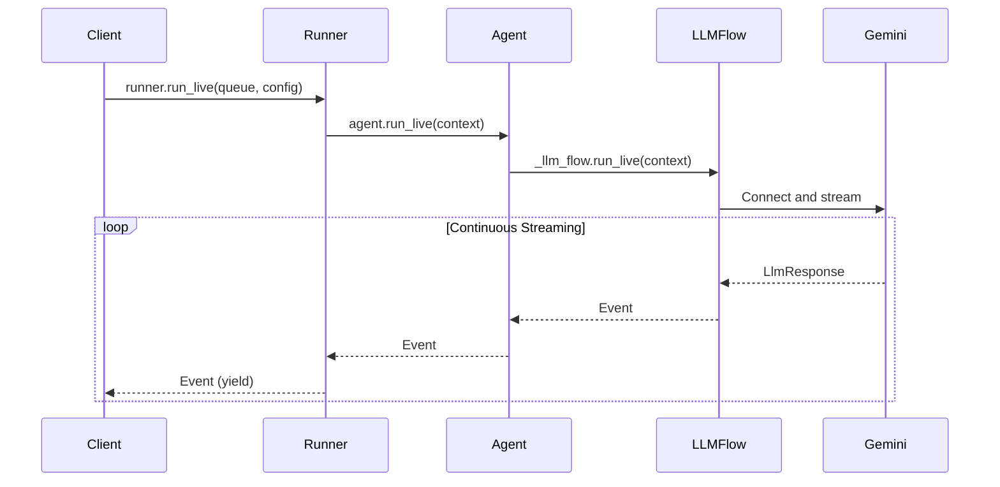
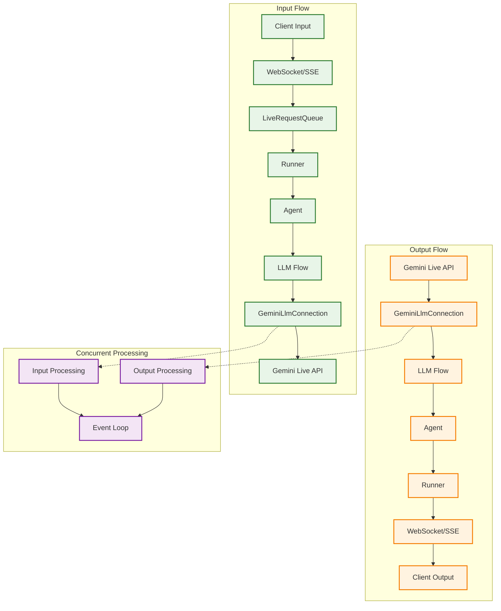
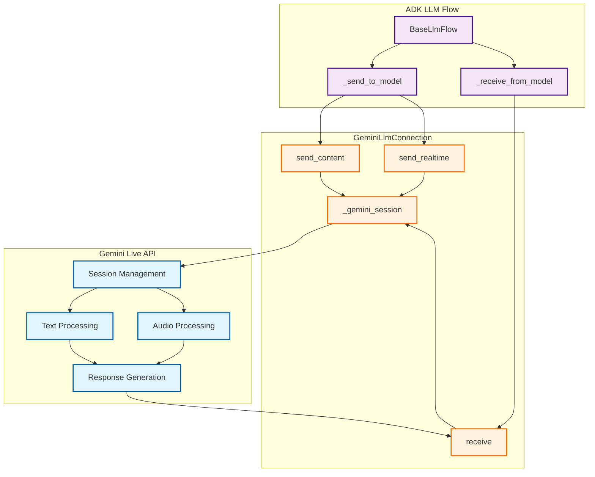

# Part 2: Core Streaming APIs

Having established the foundational concepts of bidirectional streaming in Part 1, we now dive deep into the technical heart of ADK—the complete event handling architecture that transforms complex streaming challenges into simple, elegant APIs. This part reveals how ADK's integrated streaming system eliminates the complexity of building real-time AI communication from scratch.

You'll discover ADK's event-driven architecture that seamlessly coordinates message queuing, async processing, state management, and AI model integration. Rather than wrestling with WebSocket protocols, asyncio complexity, and AI model APIs separately, you'll see how ADK provides a unified streaming framework that handles the intricate orchestration automatically. By the end of this part, you'll understand why building streaming AI applications with ADK feels effortless compared to implementing these systems from scratch.

## 2.1 ADK's Event Handling Architecture

ADK's streaming architecture represents a complete solution to the challenges that would otherwise require months of custom development. Instead of building message queuing, async coordination, state management, and AI model integration separately, ADK provides an integrated event handling system that orchestrates all these components seamlessly.

### The Challenge of Building Streaming AI From Scratch

Implementing bidirectional streaming AI communication from scratch involves solving multiple complex problems simultaneously:

**Message Management Complexity:**
- WebSocket connection handling and reconnection logic
- Message queuing and ordering under concurrent access
- Thread-safe operations across async and sync contexts
- Graceful handling of connection failures and timeouts

**Event Processing Challenges:**
- Coordinating multiple async generators and consumers
- Managing backpressure when AI responses are slower than user input
- Handling interruptions and partial message states
- Maintaining conversation context across streaming sessions

**AI Model Integration Difficulties:**
- Protocol translation between application events and AI model APIs
- Managing streaming tokens vs. complete message semantics
- Handling model-specific response formats and error conditions
- Coordinating multimodal inputs (text, audio, video) with single model interface

### ADK's Integrated Solution

ADK eliminates this complexity through a cohesive architecture where each component works in harmony:

### Integrated Event Processing Pipeline

```mermaid
graph TB
    subgraph "Without ADK: Custom Implementation"
        C1[Custom WebSocket Handler]
        C2[Custom Message Queue]
        C3[Custom Async Coordination]
        C4[Custom AI Model Integration]
        C5[Custom State Management]
        C6[Custom Error Handling]
        
        C1 --> C2
        C2 --> C3
        C3 --> C4
        C4 --> C5
        C5 --> C6
        
        style C1 fill:#ffcdd2,stroke:#d32f2f
        style C2 fill:#ffcdd2,stroke:#d32f2f
        style C3 fill:#ffcdd2,stroke:#d32f2f
        style C4 fill:#ffcdd2,stroke:#d32f2f
        style C5 fill:#ffcdd2,stroke:#d32f2f
        style C6 fill:#ffcdd2,stroke:#d32f2f
    end
    
    subgraph "With ADK: Integrated Architecture"
        A1[LiveRequestQueue]
        A2[Runner + run_live()]
        A3[Agent + LLM Flow]
        A4[GeminiLlmConnection]
        A5[Event Stream]
        
        A1 --> A2
        A2 --> A3
        A3 --> A4
        A4 --> A5
        
        style A1 fill:#c8e6c9,stroke:#388e3c
        style A2 fill:#c8e6c9,stroke:#388e3c
        style A3 fill:#c8e6c9,stroke:#388e3c
        style A4 fill:#c8e6c9,stroke:#388e3c
        style A5 fill:#c8e6c9,stroke:#388e3c
    end
```

### ADK's Value Proposition

**Instead of building this yourself:**
```python
# Custom implementation (hundreds of lines)
class CustomStreamingSystem:
    def __init__(self):
        self.websocket_handler = CustomWebSocketHandler()
        self.message_queue = CustomAsyncQueue()
        self.ai_connector = CustomAIConnector()
        self.state_manager = CustomStateManager()
        # ... complex setup and coordination logic
    
    async def handle_streaming(self):
        # Complex async coordination
        # Error handling and recovery
        # Message ordering and backpressure
        # AI model protocol translation
        # ... hundreds of lines of coordination code
```

**You get this with ADK:**
```python
# ADK integrated system (5 lines)
live_request_queue = LiveRequestQueue()
live_request_queue.send_content(user_message)

async for event in runner.run_live(
    user_id="user", session_id="session",
    live_request_queue=live_request_queue
):
    # Handle streaming events - ADK manages all complexity
    process_event(event)
```

**Key Architectural Benefits:**

- **Unified Event Model**: Single event stream handles all message types (text, audio, control signals) instead of separate handling logic
- **Automatic Coordination**: Built-in async coordination between message queuing, processing, and AI model communication
- **Production-Ready Reliability**: Battle-tested error handling, reconnection logic, and failure recovery without custom implementation
- **Seamless AI Integration**: Direct integration with Gemini Live API without protocol translation complexity
- **Memory Efficient**: Streaming event processing prevents memory accumulation issues common in custom implementations

### Unified Message Processing

ADK's event handling architecture centers around a unified message model that eliminates the complexity of handling different data types separately. Instead of building custom protocols for text, audio, and control messages, ADK provides a single `LiveRequest` container:

```python
@dataclass
class LiveRequest:
    content: Optional[Content] = None    # Text-based content and structured data
    blob: Optional[Blob] = None          # Audio/video data and binary streams
    close: bool = False                  # Graceful connection termination signal
```

This elegant three-field design handles every streaming scenario you'll encounter. The mutually exclusive `content` and `blob` fields ensure type safety while the `close` signal provides graceful termination semantics. This design eliminates the complexity of managing multiple message types while maintaining clear separation of concerns.

#### Message Types

**Text Content:**
```python
text_content = Content(parts=[Part(text="Hello, streaming world!")])
live_request_queue.send_content(text_content)
```

**Audio/Video Blobs:**
```python
audio_blob = Blob(
    mime_type="audio/pcm",
    data=base64.b64encode(audio_data).decode()
)
live_request_queue.send_realtime(audio_blob)
```

**Control Signals:**
```python
live_request_queue.close()  # Signals end of conversation
```

### Async Queue Management

The queue operates asynchronously for non-blocking communication:

```python
# Producer (non-blocking)
live_request_queue.send_content(content)

# Consumer (async)
request = await live_request_queue.get()
```

### Thread-Safe Operations

LiveRequestQueue ensures thread safety for concurrent access:

- **Multiple producers**: Different threads can send messages simultaneously
- **Single consumer**: ADK processes messages sequentially 
- **Event loop integration**: Automatically handles asyncio event loop creation

!!! example "Complete Example"
    
    See [`2-1-1_live_request_queue.py`](../src/part2/2-1-1_live_request_queue.py) for comprehensive demonstrations of:
    
    - Basic queue operations and message types
    - Async consumption patterns
    - Concurrent producer/consumer scenarios
    - Queue internals and debugging

## 2.2 The run_live() Method

The `run_live()` method represents the culmination of modern Python async programming applied to AI streaming. It serves as the primary entry point for streaming conversations in ADK, but calling it merely an "entry point" undersells its sophistication. This method implements an async generator pattern that transforms the complex orchestration of real-time AI communication into an elegant, iterator-like interface that feels natural to Python developers.

What makes `run_live()` remarkable is how it handles the inherent complexity of managing multiple concurrent data streams, coordinating with external AI services, maintaining conversation state, and processing interruptions—all while presenting a clean, predictable interface that yields events as the conversation unfolds. It's the difference between wrestling with streaming APIs and simply iterating over conversation events.

### Method Signature and Flow



### Basic Usage Pattern

```python
async for event in runner.run_live(
    user_id="user_123",
    session_id="session_456", 
    live_request_queue=live_request_queue,
    run_config=run_config
):
    # Process streaming events in real-time
    handle_event(event)
```

### Async Generator Pattern

The `run_live()` method leverages Python's async generator pattern in ways that showcase the language's elegance when applied to streaming scenarios. This isn't just a technical choice—it's a philosophical alignment between Python's iterator protocols and the natural flow of conversation:

- **Yields events immediately**: No buffering or batching that would introduce artificial delays. Each event becomes available the moment it's generated, preserving the real-time nature of conversation.

- **Memory efficient**: Maintains constant memory usage regardless of conversation length. Whether you're handling a quick question or a hours-long tutoring session, memory usage remains predictable and bounded.

- **Real-time processing**: Events become available as soon as they're generated, enabling applications to respond immediately to conversation developments without polling or complex callback management.

```python
# The method signature reveals the thoughtful design
async def run_live(
    self,
    user_id: str,                         # User identification for session management
    session_id: str,                      # Session tracking across interactions
    live_request_queue: LiveRequestQueue, # The bidirectional communication channel
    run_config: Optional[RunConfig] = None, # Streaming behavior configuration
) -> AsyncGenerator[Event, None]:         # Generator yielding conversation events
```

This signature tells a story: every streaming conversation needs identity (user_id), continuity (session_id), communication (live_request_queue), and configuration (run_config). The return type—an async generator of Events—promises real-time delivery without overwhelming system resources.

### InvocationContext Integration

`run_live()` creates and manages an `InvocationContext` that carries:

- **Live request queue**: For bidirectional communication
- **Session information**: User and session IDs
- **Configuration**: Streaming and model settings
- **Agent reference**: The agent handling the conversation

### Event Emission Pipeline

Events flow through multiple layers before reaching your application:

1. **GeminiLlmConnection**: Generates `LlmResponse` objects
2. **LLM Flow**: Converts to `Event` objects with metadata
3. **Agent**: Passes through with optional state updates
4. **Runner**: Persists to session and yields to caller

### Relationship with Regular agent.run()

| Feature | `agent.run()` | `agent.run_live()` |
|---------|---------------|-------------------|
| **Input** | Single message | LiveRequestQueue stream |
| **Output** | Final response | Event stream |
| **Timing** | Batch processing | Real-time streaming |
| **Interruption** | Not supported | Full interruption support |
| **Use Case** | Simple Q&A | Interactive conversations |

!!! example "Complete Example"
    
    See [`2-2-1_run_live_basic.py`](../src/part2/2-2-1_run_live_basic.py) for demonstrations of:
    
    - Basic `run_live()` usage with event processing
    - Async generator pattern behavior
    - Different event types and their properties
    - Integration with LiveRequestQueue

## 2.3 Bidirectional Data Flow Architecture

ADK's bidirectional data flow architecture represents a paradigm shift from traditional request-response patterns to dynamic, concurrent communication streams. This isn't simply about sending data in both directions—it's about creating a sophisticated orchestration system where multiple data streams flow simultaneously while maintaining conversation coherence, handling interruptions gracefully, and preserving the illusion of natural dialogue.

The architecture enables true bidirectional communication where human input and AI responses happen concurrently, just like in natural conversation. When you interrupt someone mid-sentence to ask a clarifying question, both the interruption and the original thought exist in the same conversational space. ADK's architecture mirrors this complexity while hiding it behind elegant APIs.

### Complete Data Flow Diagram



### Message Queuing and Processing

**Input Pipeline:**
1. **Client** sends messages via WebSocket/SSE
2. **Transport Layer** queues messages in LiveRequestQueue
3. **ADK Engine** processes messages through agent hierarchy
4. **Gemini Live API** receives streaming input for processing

**Output Pipeline:**
1. **Gemini Live API** generates responses and events
2. **ADK Engine** processes and enriches events with metadata
3. **Transport Layer** serializes events for client consumption
4. **Client** receives real-time streaming responses

### Concurrent Processing Model

ADK handles bidirectional streaming through concurrent tasks:

```python
# Simplified internal pattern
async def streaming_session():
    # Input task: Client → Gemini
    input_task = asyncio.create_task(
        send_to_model(llm_connection, live_request_queue)
    )
    
    # Output task: Gemini → Client  
    async for event in receive_from_model(llm_connection):
        yield event  # Real-time event streaming
```

### Connection Lifecycle Management

**Connection Establishment:**
```python
async with llm.connect(llm_request) as llm_connection:
    # Bidirectional streaming session active
    await handle_streaming_conversation()
# Connection automatically closed
```

**Lifecycle Phases:**

1. **Setup**: Create LiveRequestQueue, configure RunConfig
2. **Connect**: Establish GeminiLlmConnection 
3. **Stream**: Concurrent input/output processing
4. **Handle Events**: Process streaming events in real-time
5. **Cleanup**: Graceful connection termination

!!! example "Complete Example"
    
    See [`2-3-1_bidirectional_flow.py`](../src/part2/2-3-1_bidirectional_flow.py) for demonstrations of:
    
    - Interactive bidirectional conversations
    - Message queueing and processing order
    - Concurrent streaming operations
    - Real-time event handling

## 2.4 Gemini Live API Integration

The integration between ADK and Google's Gemini Live API represents one of the most sophisticated examples of API orchestration in modern AI development. This isn't just about connecting two systems—it's about creating a seamless bridge between ADK's developer-friendly abstractions and Gemini's cutting-edge AI capabilities, enabling advanced streaming features like multimodal input processing, intelligent interruption handling, and sophisticated real-time conversation management.

What makes this integration particularly remarkable is how it handles the impedance mismatch between different abstraction levels. ADK operates at the application level with concepts like agents, tools, and conversations, while Gemini Live API operates at the model level with tokens, embeddings, and neural network outputs. The integration layer translates between these worlds seamlessly, allowing developers to think in terms of conversations while leveraging the full power of Google's most advanced AI models.

### GeminiLlmConnection Interface

The `GeminiLlmConnection` class wraps the Gemini Live API session:

```python
class GeminiLlmConnection(BaseLlmConnection):
    async def send_content(self, content: Content) -> None
    async def send_realtime(self, blob: Blob) -> None  
    async def receive(self) -> AsyncGenerator[LlmResponse, None]
```

### Connection Architecture



### send_content() vs send_realtime() Methods

**Text Content (send_content):**
- Structured conversation messages
- Function call responses
- Metadata and context information

```python
content = Content(parts=[Part(text="Hello, AI assistant!")])
await llm_connection.send_content(content)
```

**Realtime Data (send_realtime):**
- Audio streams (PCM format)
- Video streams  
- Raw binary data

```python
audio_blob = Blob(mime_type="audio/pcm", data=encoded_audio)
await llm_connection.send_realtime(audio_blob)
```

### Response Processing and Event Generation

The Gemini Live API sends various message types that get converted to ADK events:

```python
# Inside GeminiLlmConnection.receive()
async for message in self._gemini_session.receive():
    if message.server_content and message.server_content.model_turn:
        # Convert to LlmResponse
        yield LlmResponse(
            content=content,
            interrupted=message.server_content.interrupted,
            turn_complete=message.server_content.turn_complete
        )
```

### Interruption and Turn Completion Handling

**Interruption Detection:**
- User can interrupt agent mid-response
- Gemini Live API sets `interrupted=True`
- Current response stops, new input processed immediately

**Turn Completion:**
- Agent finishes complete thought/response
- `turn_complete=True` signals end of agent's turn
- Client can send new input

### Advanced Features

**Multimodal Support:**
```python
run_config = RunConfig(
    response_modalities=["TEXT", "AUDIO"],  # Multiple output types
    streaming_mode="SSE"
)
```

**Audio Transcription:**
```python
run_config = RunConfig(
    input_audio_transcription=AudioTranscriptionConfig(enabled=True),
    output_audio_transcription=AudioTranscriptionConfig(enabled=True)
)
```

**Real-time Configuration:**
```python
run_config = RunConfig(
    realtime_input_config=RealtimeInputConfig(
        voice_activity_detection=VoiceActivityDetectionConfig(enabled=True)
    )
)
```

!!! example "Complete Example"
    
    See [`2-4-1_gemini_integration.py`](../src/part2/2-4-1_gemini_integration.py) for demonstrations of:
    
    - Text streaming with chunk-by-chunk delivery
    - Multimodal input processing
    - Interruption detection and handling  
    - Streaming metadata analysis

## Key Takeaways

Completing this part represents a significant milestone in your journey toward mastering bidirectional streaming with ADK. You've moved beyond abstract concepts to concrete understanding of the technical foundation that makes real-time AI conversations possible. This knowledge forms the bedrock upon which you'll build increasingly sophisticated streaming applications.

### **Core APIs You've Mastered:**

- **LiveRequestQueue**: You now understand how this elegant message queue handles incoming user messages, managing complex scenarios like concurrent message arrival, proper sequencing, and graceful termination while presenting a deceptively simple interface.

- **run_live()**: You've seen how Python's async generator pattern transforms complex streaming orchestration into intuitive iteration, enabling memory-efficient, real-time event processing that scales from simple demos to production applications.

- **GeminiLlmConnection**: You understand the sophisticated bridge between ADK's developer-friendly abstractions and Gemini's advanced AI capabilities, including how method calls translate to model interactions and how responses flow back through the system.

### **Architectural Understanding:**

- **Bidirectional Data Flow**: You grasp how input and output streams operate concurrently, how interruptions are handled gracefully, and how the system maintains conversation coherence across complex interaction patterns.

- **Event-Driven Processing**: You understand how the async generator pattern enables real-time event processing without the complexity of callback management or the overhead of polling mechanisms.

- **Integration Patterns**: You've seen how ADK bridges different abstraction levels, translating between application concepts like conversations and model concepts like tokens while maintaining clean separation of concerns.

### **Practical Skills Developed:**

- **Stream Management**: You can now design applications that handle multiple concurrent data streams while maintaining responsive user experiences.

- **Error Handling**: You understand how to build resilient streaming applications that gracefully handle network issues, interruptions, and unexpected scenarios.

- **Performance Optimization**: You know how to leverage async generators for memory efficiency and how to structure code for optimal streaming performance.

---

**Ready to apply this knowledge?** Continue to [Part 3: Basic Streaming Concepts](part3.md) where you'll explore audio/video handling, master different message types, and build your first complete streaming agent that showcases everything you've learned.