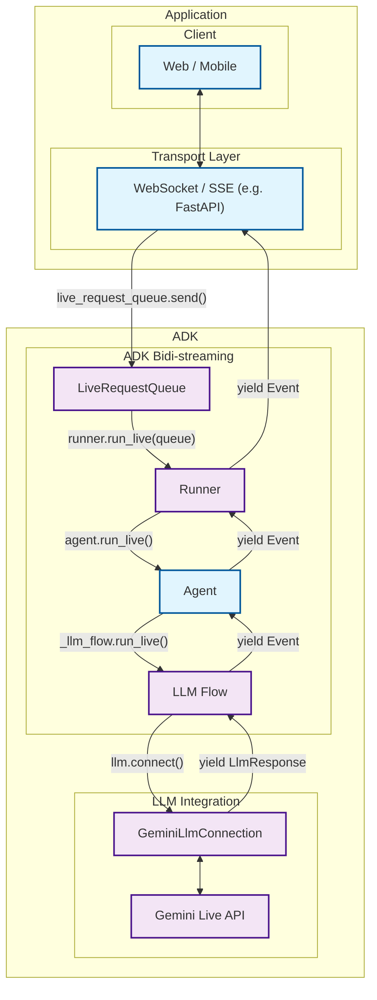
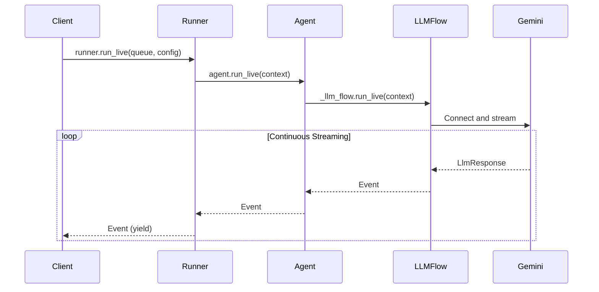
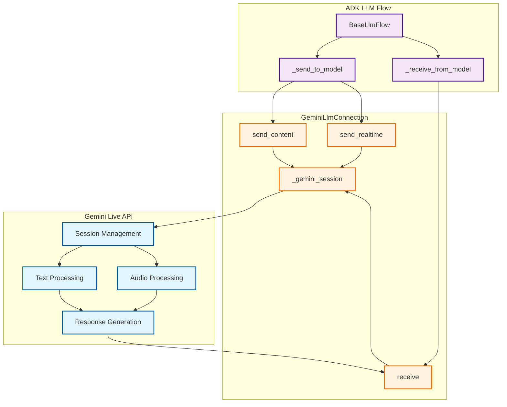

# Part 2: Core Streaming APIs

Having established the foundational concepts of bidirectional streaming in Part 1, we now dive deep into the technical heart of ADK—the complete event handling architecture that transforms complex streaming challenges into simple, intuitive APIs. This part reveals how ADK's integrated streaming system eliminates the complexity of building real-time AI communication from scratch.

You'll discover ADK's event-driven architecture that seamlessly coordinates message queuing, async processing, state management, and AI model integration. Rather than wrestling with WebSocket protocols, asyncio complexity, and AI model APIs separately, you'll see how ADK provides a unified streaming framework that handles the intricate orchestration automatically. By the end of this part, you'll understand why building streaming AI applications with ADK feels effortless compared to implementing these systems from scratch.

## 2.1 ADK's Event Handling Architecture

ADK's streaming architecture represents a complete solution to the challenges that would otherwise require months of custom development. Instead of building message queuing, async coordination, state management, and AI model integration separately, ADK provides an integrated event handling system that orchestrates all these components seamlessly.

### The Challenge of Building Streaming AI From Scratch

Implementing bidirectional streaming AI communication from scratch involves solving multiple complex problems simultaneously:

**Message Management Complexity:**
- WebSocket connection handling and reconnection logic
- Message queuing and ordering under concurrent access
- Thread-safe operations across async and sync contexts
- Graceful handling of connection failures and timeouts

**Event Processing Challenges:**
- Coordinating multiple async generators and consumers
- Managing backpressure when AI responses are slower than user input
- Handling interruptions and partial message states
- Maintaining conversation context across streaming sessions

**AI Model Integration Difficulties:**
- Protocol translation between application events and AI model APIs
- Managing streaming tokens vs. complete message semantics
- Handling model-specific response formats and error conditions
- Coordinating multimodal inputs (text, audio, video) with single model interface

### ADK's Integrated Solution

ADK eliminates this complexity through a cohesive architecture where each component works in harmony:

### Integrated Event Processing Pipeline



| Developer provides: | ADK provides: | Gemini Live API provides: |
|:----------------------------|:------------------|:------------------------------|
| **Web / Mobile**: Frontend applications that users interact with, handling UI/UX, user input capture, and response display<br><br>**[WebSocket](https://developer.mozilla.org/en-US/docs/Web/API/WebSocket) / [SSE](https://developer.mozilla.org/en-US/docs/Web/API/Server-sent_events) Server**: Real-time communication server (such as [FastAPI](https://fastapi.tiangolo.com/)) that manages client connections, handles streaming protocols, and routes messages between clients and ADK<br><br>**Agent**: Custom AI agent definition with specific instructions, tools, and behavior tailored to your application's needs | **[LiveRequestQueue](https://github.com/google/adk-python/blob/main/src/google/adk/agents/live_request_queue.py)**: Message queue that buffers and sequences incoming user messages (text content, audio blobs, control signals) for orderly processing by the agent<br><br>**[Runner](https://github.com/google/adk-python/blob/main/src/google/adk/runners.py)**: Execution engine that orchestrates agent sessions, manages conversation state, and provides the `run_live()` streaming interface<br><br>**[LLM Flow](https://github.com/google/adk-python/blob/main/src/google/adk/flows/llm_flows/base_llm_flow.py)**: Processing pipeline that handles streaming conversation logic, manages context, and coordinates with language models<br><br>**[GeminiLlmConnection](https://github.com/google/adk-python/blob/main/src/google/adk/models/gemini_llm_connection.py)**: Abstraction layer that bridges ADK's streaming architecture with Gemini Live API, handling protocol translation and connection management | **[Gemini Live API](https://ai.google.dev/gemini-api/docs/live)**: Google's real-time language model service that processes streaming input, generates responses, handles interruptions, supports multimodal content (text, audio, video), and provides advanced AI capabilities like function calling and contextual understanding |

### ADK's Value Proposition

The true measure of a framework isn't just what it enables—it's what it eliminates. ADK's value proposition becomes crystal clear when you compare the complexity of building bidirectional streaming from scratch versus using ADK's integrated solution. The difference isn't merely a matter of convenience; it's the difference between spending months building infrastructure versus focusing on your application's unique value from day one.

**Instead of building this yourself:**

```python
# Custom implementation (hundreds of lines)
class CustomStreamingSystem:
    def __init__(self):
        self.websocket_handler = CustomWebSocketHandler()
        self.message_queue = CustomAsyncQueue()
        self.ai_connector = CustomAIConnector()
        self.state_manager = CustomStateManager()
        # ... complex setup and coordination logic

    async def handle_streaming(self):
        # Complex async coordination
        # Error handling and recovery
        # Message ordering and backpressure
        # AI model protocol translation
        # ... hundreds of lines of coordination code
```

**You get this with ADK:**

```python
# ADK integrated system (5 lines)
live_request_queue = LiveRequestQueue()
live_request_queue.send_content(user_message)

async for event in runner.run_live(
    user_id="user", session_id="session",
    live_request_queue=live_request_queue
):
    # Handle streaming events - ADK manages all complexity
    process_event(event)
```

This dramatic simplification isn't achieved through abstraction that limits flexibility—it comes from thoughtful integration where each component is designed to work seamlessly with the others. You get the full power of bidirectional streaming without the complexity burden.

**Key Architectural Benefits:**

The integrated architecture delivers benefits that compound as your application grows:

- **Unified Event Model**: A single event stream seamlessly handles all message types—text, audio, control signals—eliminating the need for separate handling logic for each type. This unified approach reduces code complexity and ensures consistent behavior across different input modalities.

- **Automatic Coordination**: The framework provides built-in async coordination between message queuing, processing, and AI model communication. You don't need to manage asyncio tasks, handle backpressure, or coordinate between producers and consumers—ADK orchestrates this complexity automatically.

- **Production-Ready Reliability**: Battle-tested error handling, reconnection logic, and failure recovery come standard. These aren't features you need to build and debug yourself; they're baked into the framework's foundation, proven through real-world deployments.

- **Seamless AI Integration**: Direct integration with Gemini Live API eliminates the need for protocol translation layers. ADK speaks the language of both your application and the AI model, handling the translation seamlessly so you can focus on conversational logic rather than protocol details.

- **Memory Efficient**: Streaming event processing prevents the memory accumulation issues common in custom implementations. Events are processed as they arrive and immediately released, maintaining constant memory usage regardless of conversation length.

### Unified Message Processing

ADK's event handling architecture centers around a unified message model that eliminates the complexity of handling different data types separately. Instead of building custom protocols for text, audio, and control messages, ADK provides a single `LiveRequest` container:

> 📖 **Source Reference**: [`live_request_queue.py`](https://github.com/google/adk-python/blob/main/src/google/adk/agents/live_request_queue.py)

```python
class LiveRequest(BaseModel):
    content: Optional[Content] = None           # Text-based content and structured data
    blob: Optional[Blob] = None                 # Audio/video data and binary streams
    activity_start: Optional[ActivityStart] = None  # Signal start of user activity
    activity_end: Optional[ActivityEnd] = None      # Signal end of user activity
    close: bool = False                         # Graceful connection termination signal
```

This streamlined design handles every streaming scenario you'll encounter. The mutually exclusive `content` and `blob` fields handle different data types, the `activity_start` and `activity_end` fields enable activity signaling, and the `close` flag provides graceful termination semantics. This design eliminates the complexity of managing multiple message types while maintaining clear separation of concerns.

While you can create `LiveRequest` objects directly, `LiveRequestQueue` provides convenience methods that handle the creation internally:

#### Message Types

The `LiveRequest` container handles four distinct categories of messages, each serving a specific purpose in the streaming conversation flow. Understanding when and how to use each type is essential for building responsive streaming applications.

**Text Content:**

Text content represents the primary mode of structured communication between users and AI agents. This includes not just simple text messages, but also rich content with metadata, function call responses, and contextual information. The `Content` object uses a `parts` array structure that allows for complex message composition while maintaining semantic clarity.

```python
# Convenience method (recommended)
text_content = Content(parts=[Part(text="Hello, streaming world!")])
live_request_queue.send_content(text_content)

# Equivalent to creating LiveRequest manually:
# live_request_queue.send(
#     LiveRequest(content=Content(parts=[Part(text="Hello, streaming world!")]))
# )
```

**Audio/Video Blobs:**

Binary data streams—primarily audio and video—flow through the `Blob` type, which handles the real-time transmission of multimedia content. Unlike text content that gets processed turn-by-turn, blobs are designed for continuous streaming scenarios where data arrives in chunks. The base64 encoding ensures safe transmission while the MIME type helps the model understand the content format.

```python
# Convenience method (recommended)
audio_blob = Blob(
    mime_type="audio/pcm",
    data=base64.b64encode(audio_data).decode()
)
live_request_queue.send_realtime(audio_blob)

# Equivalent to creating LiveRequest manually:
# live_request_queue.send(
#     LiveRequest(blob=Blob(mime_type="audio/pcm", data=encoded_audio))
# )
```

**Activity Signals:**

Activity signals provide a sophisticated mechanism for communicating user engagement state to the AI model. `ActivityStart` signals indicate when a user begins providing input (like starting to speak or type), while `ActivityEnd` marks the completion of that input. These signals enable the model to understand natural conversation boundaries and make intelligent decisions about when to respond or when to wait for more input.

```python
# Convenience methods (recommended)
live_request_queue.send_activity_start()
live_request_queue.send_activity_end()

# Equivalent to creating LiveRequest manually:
# live_request_queue.send(LiveRequest(activity_start=ActivityStart()))
# live_request_queue.send(LiveRequest(activity_end=ActivityEnd()))
```

**Control Signals:**

The `close` signal provides graceful termination semantics for streaming sessions. Unlike abrupt connection closures that can leave resources hanging or messages unprocessed, calling `close()` allows the system to complete any pending operations, flush buffers, and cleanly shut down the bidirectional stream. This ensures consistent state management and proper resource cleanup.

```python
# Convenience method (recommended)
live_request_queue.close()

# Equivalent to creating LiveRequest manually:
# live_request_queue.send(LiveRequest(close=True))
```

### Async Queue Management

One of the most powerful aspects of `LiveRequestQueue` is how it seamlessly bridges synchronous and asynchronous programming models. The queue's design recognizes a fundamental reality of streaming applications: message production often happens in synchronous contexts (like HTTP request handlers or UI event callbacks), while message consumption happens in async contexts (like the streaming event loop).

The producer side uses non-blocking operations that return immediately, allowing your application to queue messages without waiting for processing. This prevents UI freezes and keeps your application responsive even under heavy load. The consumer side, however, uses async/await patterns that integrate naturally with Python's asyncio ecosystem, enabling efficient concurrent processing without the complexity of threading.

```python
# Producer (non-blocking)
live_request_queue.send_content(content)

# Consumer (async)
request = await live_request_queue.get()
```

This asymmetric design—sync producers, async consumers—is what makes `LiveRequestQueue` so practical for real-world applications. You can send messages from anywhere in your codebase without worrying about async contexts, while ADK's internal machinery handles them efficiently through async processing.

### Thread-Safe Operations

Threading introduces complexity that can sink even well-designed systems. Race conditions, deadlocks, and subtle state corruption bugs are the nightmares of concurrent programming. `LiveRequestQueue` addresses these challenges head-on with a carefully designed concurrency model that provides safety without sacrificing performance.

The queue supports multiple concurrent producers—different threads can call `send_content()`, `send_realtime()`, or `close()` simultaneously without coordination. This freedom is crucial for real-world applications where user input, system events, and background tasks all need to communicate with the AI agent. Behind the scenes, the queue uses asyncio's thread-safe primitives to ensure all operations remain atomic and consistent.

On the consumption side, ADK maintains a single sequential consumer that processes messages in the order they arrive. This guarantee—FIFO (first-in, first-out) ordering—simplifies application logic by ensuring predictable message sequencing. You don't need to worry about messages arriving out of order or implementing complex synchronization.

Perhaps most importantly, `LiveRequestQueue` handles the subtle complexities of event loop management automatically. When you create a queue, it intelligently detects whether an event loop exists in the current thread and creates one if needed. This removes a common source of asyncio errors and makes the queue work correctly whether you're in a FastAPI handler, a standalone script, or a Jupyter notebook.

**Key concurrency guarantees:**

- **Multiple producers**: Different threads can send messages simultaneously without locks or coordination
- **Single consumer**: ADK processes messages sequentially in FIFO order
- **Event loop integration**: Automatically handles asyncio event loop creation and management
- **Atomic operations**: All queue operations are atomic, preventing race conditions
- **No deadlocks**: The queue design eliminates common deadlock scenarios

!!! example "Complete Example"
    
    See [`2-1-1_live_request_queue.py`](../src/part2/2-1-1_live_request_queue.py) for comprehensive demonstrations of:
    
    - Basic queue operations and message types
    - Async consumption patterns
    - Concurrent producer/consumer scenarios
    - Queue internals and debugging

## 2.2 The run_live() Method

The `run_live()` method serves as the primary entry point for streaming conversations in ADK. This method implements an async generator pattern that transforms the complex orchestration of real-time AI communication into a clean, iterator-like interface that feels natural to Python developers.

What makes `run_live()` remarkable is how it handles the inherent complexity of managing multiple concurrent data streams, coordinating with external AI services, maintaining conversation state, and processing interruptions—all while presenting a clean, predictable interface that yields events as the conversation unfolds. It's the difference between wrestling with streaming APIs and simply iterating over conversation events.

### Method Signature and Flow

> 📖 **Source Reference**: [`runners.py`](https://github.com/google/adk-python/blob/main/src/google/adk/runners.py)



### Basic Usage Pattern

```python
async for event in runner.run_live(
    user_id="user_123",
    session_id="session_456", 
    live_request_queue=live_request_queue,
    run_config=run_config
):
    # Process streaming events in real-time
    handle_event(event)
```

### Async Generator Pattern

The `run_live()` method leverages Python's async generator pattern in ways that showcase the language's elegance when applied to streaming scenarios. This isn't just a technical choice—it's a philosophical alignment between Python's iterator protocols and the natural flow of conversation:

- **Yields events immediately**: No buffering or batching that would introduce artificial delays. Each event becomes available the moment it's generated, preserving the real-time nature of conversation.

- **Memory efficient**: Maintains constant memory usage regardless of conversation length. Whether you're handling a quick question or a hours-long tutoring session, memory usage remains predictable and bounded.

- **Real-time processing**: Events become available as soon as they're generated, enabling applications to respond immediately to conversation developments without polling or complex callback management.

```python
# The method signature reveals the thoughtful design
async def run_live(
    self,
    user_id: str,                         # User identification for session management
    session_id: str,                      # Session tracking across interactions
    live_request_queue: LiveRequestQueue, # The bidirectional communication channel
    run_config: Optional[RunConfig] = None, # Streaming behavior configuration
) -> AsyncGenerator[Event, None]:         # Generator yielding conversation events
```

This signature tells a story: every streaming conversation needs identity (user_id), continuity (session_id), communication (live_request_queue), and configuration (run_config). The return type—an async generator of Events—promises real-time delivery without overwhelming system resources.

### Event Emission Pipeline

Events flow through multiple layers before reaching your application:

1. **GeminiLlmConnection**: Generates `LlmResponse` objects
2. **LLM Flow**: Converts to `Event` objects with metadata
3. **Agent**: Passes through with optional state updates
4. **Runner**: Persists to session and yields to caller

### Concurrent Processing Model

Behind the scenes, `run_live()` orchestrates bidirectional streaming through concurrent async tasks. This enables true bidirectional communication where input and output happen simultaneously:

```python
# Simplified internal pattern
async def streaming_session():
    # Input task: Client → Gemini
    input_task = asyncio.create_task(
        send_to_model(llm_connection, live_request_queue)
    )

    # Output task: Gemini → Client
    async for event in receive_from_model(llm_connection):
        yield event  # Real-time event streaming
```

### Connection Lifecycle

The streaming session follows a well-defined lifecycle using Python's async context manager pattern:

```python
async with llm.connect(llm_request) as llm_connection:
    # Bidirectional streaming session active
    await handle_streaming_conversation()
# Connection automatically closed
```

**Lifecycle Phases:**

1. **Setup**: Create LiveRequestQueue, configure RunConfig
2. **Connect**: Establish GeminiLlmConnection
3. **Stream**: Concurrent input/output processing
4. **Handle Events**: Process streaming events in real-time
5. **Cleanup**: Graceful connection termination

### Relationship with Regular agent.run()

| Feature | `agent.run()` | `agent.run_live()` |
|---------|---------------|-------------------|
| **Input** | Single message | LiveRequestQueue stream |
| **Output** | Final response | Event stream |
| **Timing** | Batch processing | Real-time streaming |
| **Interruption** | Not supported | Full interruption support |
| **Use Case** | Simple Q&A | Interactive conversations |

!!! example "Complete Example"

    See [`2-2-1_run_live_basic.py`](../src/part2/2-2-1_run_live_basic.py) for demonstrations of:

    - Basic `run_live()` usage with event processing
    - Async generator pattern behavior
    - Different event types and their properties
    - Integration with LiveRequestQueue
    - Concurrent streaming operations and lifecycle management

## 2.3 InvocationContext: The Execution State Container

> 📖 **Source Reference**: [`invocation_context.py`](https://github.com/google/adk-python/blob/main/src/google/adk/agents/invocation_context.py)

While `run_live()` returns an AsyncGenerator for consuming events, internally it creates and manages an `InvocationContext`—the central data container that flows through every layer of ADK's execution stack.

**Who uses InvocationContext?**

InvocationContext serves different audiences at different levels:

- **ADK's internal components** (primary users): Runner, Agent, LLMFlow, and GeminiLlmConnection all receive, read from, and write to the InvocationContext as it flows through the stack. This shared context enables seamless coordination without tight coupling.

- **Application developers** (indirect beneficiaries): You don't typically create or manipulate InvocationContext directly in your application code. Instead, you benefit from the clean, simplified APIs that InvocationContext enables behind the scenes—like the elegant `async for event in runner.run_live()` pattern.

- **Tool and callback developers** (direct access): When you implement custom tools or callbacks, you receive InvocationContext as a parameter. This gives you direct access to conversation state, session services, and control flags (like `end_invocation`) to implement sophisticated behaviors.

Understanding InvocationContext is essential for grasping how ADK maintains state, coordinates execution, and enables advanced features like multi-agent workflows and resumability. Even if you never touch it directly, knowing what flows through your application helps you design better agents and debug issues more effectively.

### What is InvocationContext?

`InvocationContext` is ADK's unified state carrier that encapsulates everything needed for a complete conversation invocation. Think of it as a traveling notebook that accompanies a conversation from start to finish, collecting information, tracking progress, and providing context to every component along the way.

An **invocation** represents a complete interaction cycle:
- Starts with user input (text, audio, or control signal)
- May involve one or multiple agent calls
- Ends when a final response is generated or when explicitly terminated
- Is orchestrated by `runner.run_live()` or `runner.run_async()`

This is distinct from an **agent call** (execution of a single agent's logic) and a **step** (a single LLM call plus any resulting tool executions).

  ```
     ┌─────────────────────── invocation ──────────────────────────┐
     ┌──────────── llm_agent_call_1 ────────────┐ ┌─ agent_call_2 ─┐
     ┌──── step_1 ────────┐ ┌───── step_2 ──────┐
     [call_llm] [call_tool] [call_llm] [transfer]
  ```

The hierarchy looks like this:

### Lifecycle and Scope

InvocationContext follows a well-defined lifecycle within `run_live()`:

```python
# Inside runner.run_live()
async def run_live(...) -> AsyncGenerator[Event, None]:
    # 1. CREATE: Initialize InvocationContext with all services and configuration
    context = InvocationContext(
        invocation_id=new_invocation_context_id(),
        session=session,
        agent=self.agent,
        live_request_queue=live_request_queue,
        run_config=run_config,
        session_service=self.session_service,
        artifact_service=self.artifact_service,
        # ... other services and state
    )

    # 2. FLOW DOWN: Pass context to agent, which passes to LLM flow, etc.
    async for event in agent.run_live(context):
        # 3. FLOW UP: Events come back through the stack
        yield event

    # 4. CLEANUP: Context goes out of scope, resources released
```


The context flows **down the execution stack** (Runner → Agent → LLMFlow → GeminiLlmConnection), while events flow **up the stack** through the AsyncGenerator. Each layer reads from and writes to the context, creating a bidirectional information flow.

### Key Fields and Their Purposes

Understanding the fields within InvocationContext reveals how ADK orchestrates complex streaming conversations. These fields are organized by their primary responsibilities, from identity management to advanced features.

#### Identity and Session Management

These fields establish the fundamental identity and continuity of the conversation:

```python
invocation_id: str              # Unique ID for this invocation (e.g., "e-uuid")
session: Session                # Contains conversation history and metadata
user_id: str                    # From session, identifies the user
branch: Optional[str]           # Multi-agent workflow branch path
```

- **invocation_id**: A unique identifier (prefixed with "e-") generated for each invocation via `new_invocation_context_id()`. This ID ties together all events, agent calls, and state changes within a single user interaction, enabling precise tracking and debugging.

- **session**: A Session object that represents the persistent conversation thread. It contains:
  - `events`: The complete conversation history (user inputs, agent responses, function calls)
  - `state`: Application-level state that persists across invocations
  - `app_name`, `user_id`, `id`: Core identifiers for routing and storage

- **user_id**: Extracted from the session for convenient access. This identifies the user across multiple sessions and enables user-specific context retrieval and personalization.

- **branch**: A dot-separated path (e.g., "agent_1.agent_2.agent_3") that tracks the agent hierarchy in multi-agent workflows. When agents transfer control to sub-agents, the branch ensures each agent sees only relevant conversation history, preventing cross-contamination between parallel agent branches.

#### Streaming Infrastructure

These fields power the real-time bidirectional communication:

```python
live_request_queue: Optional[LiveRequestQueue]  # Bidirectional message queue
run_config: Optional[RunConfig]                 # Streaming and model configuration
active_streaming_tools: Optional[dict]          # Running streaming tool instances
```

- **live_request_queue**: The communication channel that buffers incoming user messages (text, audio, control signals) for processing. This queue bridges synchronous message production (from web handlers) with asynchronous consumption (by the agent), enabling non-blocking real-time interaction.

- **run_config**: A RunConfig object containing all streaming behavior settings:
  - `response_modalities`: Output types (TEXT, AUDIO)
  - `streaming_mode`: SSE (server-sent events) or BIDI (bidirectional)
  - `input_audio_transcription` / `output_audio_transcription`: Transcription settings
  - `realtime_input_config`: Voice activity detection and real-time processing
  - `max_llm_calls`: Cost control limits
  - `save_live_audio`: Whether to persist audio artifacts

- **active_streaming_tools**: A dictionary mapping tool IDs to ActiveStreamingTool instances that are currently executing. This enables ADK to manage concurrent streaming tool calls, handle their outputs, and coordinate their lifecycle with the conversation flow.

#### Service Integration

These fields connect InvocationContext to ADK's persistence and infrastructure services:

```python
session_service: BaseSessionService         # Persists conversation history
artifact_service: Optional[BaseArtifactService]  # Stores audio/video artifacts
memory_service: Optional[BaseMemoryService]      # Long-term memory integration
credential_service: Optional[BaseCredentialService]  # Secure credential access
```

- **session_service**: Handles persistence of Session objects, ensuring conversation history survives across application restarts. Every event generated during the invocation gets saved through this service.

- **artifact_service**: Stores large binary data like audio recordings, video frames, and file uploads. Instead of embedding binary data in session events, ADK stores them as artifacts and references them by ID, keeping session data manageable.

- **memory_service**: Provides long-term memory capabilities beyond the immediate conversation. This enables agents to recall information from previous sessions, implement user preferences, and maintain context across extended time periods.

- **credential_service**: Securely manages API keys, OAuth tokens, and other sensitive credentials that tools may need. This prevents credentials from being exposed in logs or session data while enabling tools to access external services.

#### State Management

These fields track the execution state across multi-agent workflows:

```python
agent_states: dict[str, dict[str, Any]]  # State per agent in workflow
end_of_agents: dict[str, bool]           # Completion status per agent
end_invocation: bool                     # Signal to terminate invocation
```

- **agent_states**: A nested dictionary keyed by agent name, storing each agent's internal state. When an agent transfers control to another agent and later resumes, its state is restored from this dictionary, enabling stateful multi-step workflows.

- **end_of_agents**: Tracks which agents have completed their execution. When an agent finishes and won't be called again in this invocation, its entry is set to True. This prevents infinite loops and enables proper workflow termination.

- **end_invocation**: A boolean flag that any callback or tool can set to immediately terminate the entire invocation. This provides an escape hatch for error conditions, user cancellations, or policy violations.

#### Caching and Transcription

These fields buffer real-time data before persistence:

```python
input_realtime_cache: Optional[list[RealtimeCacheEntry]]   # Buffers input audio before flush
output_realtime_cache: Optional[list[RealtimeCacheEntry]]  # Buffers output audio before flush
transcription_cache: Optional[list[TranscriptionEntry]]    # Data needed for transcription
```

- **input_realtime_cache** / **output_realtime_cache**: Buffer audio chunks (as RealtimeCacheEntry objects containing role, data blob, and timestamp) before flushing to session and artifact services. This batching improves performance by reducing write operations and enables efficient audio streaming without overwhelming storage systems.

- **transcription_cache**: Stores TranscriptionEntry objects that contain the data needed for generating audio transcriptions. This cache coordinates between incoming audio data and the transcription generation process, ensuring audio and transcripts remain synchronized.

#### Advanced Features

These fields enable sophisticated capabilities like resumability and performance optimization:

```python
resumability_config: Optional[ResumabilityConfig]  # Enables pause/resume
context_cache_config: Optional[ContextCacheConfig]  # LLM context caching
plugin_manager: PluginManager                       # Plugin lifecycle management
live_session_resumption_handle: Optional[str]       # Handle for live session resumption
```

- **resumability_config**: When present, enables the invocation to pause mid-execution (e.g., during a long-running API call) and resume later with full state restoration. The config specifies which state should be persisted and how resumption should be handled.

- **context_cache_config**: Configuration for Gemini's context caching feature, which can dramatically reduce costs and latency by caching repeated prompt content (like system instructions or large documents) across multiple requests.

- **plugin_manager**: Manages the lifecycle of plugins attached to this invocation. Plugins can hook into various events (before/after LLM calls, tool executions, etc.) to add cross-cutting functionality like logging, monitoring, or custom processing.

- **live_session_resumption_handle**: A unique handle provided by Gemini Live API for transparent session resumption. If the connection drops, ADK can use this handle to reconnect and continue the conversation without losing context.

## 2.4 Gemini Live API Integration

The integration between ADK and Google's Gemini Live API represents one of the most sophisticated examples of API orchestration in modern AI development. This isn't just about connecting two systems—it's about creating a seamless bridge between ADK's developer-friendly abstractions and Gemini's cutting-edge AI capabilities, enabling advanced streaming features like multimodal input processing, intelligent interruption handling, and sophisticated real-time conversation management.

What makes this integration particularly remarkable is how it handles the impedance mismatch between different abstraction levels. ADK operates at the application level with concepts like agents, tools, and conversations, while Gemini Live API operates at the model level with tokens, embeddings, and neural network outputs. The integration layer translates between these worlds seamlessly, allowing developers to think in terms of conversations while leveraging the full power of Google's most advanced AI models.

### GeminiLlmConnection Interface

> 📖 **Source Reference**: [`gemini_llm_connection.py`](https://github.com/google/adk-python/blob/main/src/google/adk/models/gemini_llm_connection.py)

The `GeminiLlmConnection` class serves as ADK's adapter layer that wraps the Gemini Live API session, providing a clean, typed interface for bidirectional streaming communication. This abstraction shields ADK's internal components from the complexities of the underlying Gemini Live API protocol.

**Core Interface:**

```python
# RealtimeInput is Union[Blob, ActivityStart, ActivityEnd]
class GeminiLlmConnection(BaseLlmConnection):
    async def send_content(self, content: Content) -> None
    async def send_realtime(self, input: RealtimeInput) -> None
    async def receive(self) -> AsyncGenerator[LlmResponse, None]
```

**Key Responsibilities:**

1. **Protocol Translation**: Converts ADK's high-level Content objects into Gemini Live API's wire format (LiveClientContent, LiveClientToolResponse, etc.) and vice versa.

2. **Response Aggregation**: Accumulates partial text chunks from streaming responses, yielding both partial updates (for real-time display) and complete merged responses (for clean conversation history).

3. **Message Type Routing**: Distinguishes between different input types (text content, function responses, audio blobs, activity signals) and routes them to appropriate Gemini Live API methods.

4. **Transcription Handling**: Processes both input and output transcription messages from Gemini, yielding them as separate LlmResponse objects for display or storage.

5. **Interruption Detection**: Monitors the `interrupted` flag in server responses and propagates interruption state through LlmResponse objects, enabling graceful handling of user interruptions.

6. **Session Management**: Wraps the underlying `AsyncSession` from google.genai.live, managing the connection lifecycle through async context managers.

**Internal State:**

The connection maintains minimal state—primarily the `_gemini_session` handle and a `text` accumulator for merging partial streaming responses. This stateless design ensures each invocation gets a fresh connection without residual state from previous conversations.

### Connection Architecture

> 📖 **Source Reference**: [`base_llm_flow.py`](https://github.com/google/adk-python/blob/main/src/google/adk/flows/llm_flows/base_llm_flow.py)



The architecture diagram above reveals the three-layer structure that enables seamless streaming:

**ADK LLM Flow Layer (Purple):**

The `BaseLlmFlow` orchestrates the bidirectional streaming session by creating two concurrent async tasks:

- **_send_to_model**: Consumes messages from InvocationContext's LiveRequestQueue, routing them to either `send_content()` (for structured text/function responses) or `send_realtime()` (for audio blobs and activity signals). This task runs continuously, feeding user input to the model as it arrives.

- **_receive_from_model**: Consumes the async generator returned by `receive()`, converting LlmResponse objects into ADK Events with proper metadata (event IDs, timestamps, invocation context). This task yields events upstream to the Agent and Runner layers.

**GeminiLlmConnection Layer (Orange):**

This adapter layer provides three focused methods that abstract the Gemini Live API's complexity:

- **send_content()**: Inspects the Content object to determine whether it contains function responses (wrapped in LiveClientToolResponse) or regular content (wrapped in LiveClientContent with turn_complete=True). This automatic routing eliminates manual protocol handling.

- **send_realtime()**: Type-checks the input (Blob, ActivityStart, or ActivityEnd) and calls the appropriate Gemini session method. Blobs get sent as raw dictionaries, while activity signals use the dedicated send_realtime_input() API.

- **receive()**: The most sophisticated method, maintaining internal state to aggregate partial text chunks while yielding real-time updates. It handles multiple message types (server_content, tool_call, session_resumption_update) and intelligently merges text before interruptions or turn completions.

- **_gemini_session**: The underlying AsyncSession handle from google.genai.live that manages the WebSocket connection to Gemini's servers.

**Gemini Live API Layer (Blue):**

Google's streaming API handles the heavy lifting:

- **Session Management**: Establishes and maintains the bidirectional WebSocket connection, handling reconnection and session resumption.

- **Text Processing** / **Audio Processing**: Separate processing pipelines for different modalities, enabling simultaneous text and audio streaming.

- **Response Generation**: The neural network layer that generates streaming responses, function calls, and transcriptions based on accumulated context.

**Data Flow:**

Input flows **downward** (ADK → GeminiLlmConnection → Gemini Live API) through send methods, while responses flow **upward** (Gemini Live API → GeminiLlmConnection → ADK) through the receive async generator. This bidirectional flow happens concurrently, with _send_to_model and _receive_from_model running as parallel async tasks coordinated by BaseLlmFlow.

### send_content() vs send_realtime() Methods

GeminiLlmConnection provides two distinct input methods, each optimized for different types of data and use cases. Understanding when to use each method is crucial for building efficient streaming applications.

#### send_content(): Structured Turn-Based Communication

The `send_content()` method handles structured, turn-complete messages that represent discrete conversation turns:

```python
async def send_content(self, content: Content) -> None:
    """Sends a user content to the gemini model.

    The model will respond immediately upon receiving the content.
    """
```

**What it sends:**

- **Regular conversation messages**: User text input that starts a new turn
- **Function call responses**: Results from tool executions that the model requested
- **Structured metadata**: Context information embedded in Content objects

**How it works:**

The method inspects the first part of the Content to determine the message type:

- If `content.parts[0].function_response` exists, all parts are treated as function responses and wrapped in `LiveClientToolResponse`
- Otherwise, the content is wrapped in `LiveClientContent` with `turn_complete=True`, signaling the model to generate a response immediately

**Example usage:**

```python
# Send user message
content = Content(parts=[Part(text="Hello, AI assistant!")])
await llm_connection.send_content(content)

# Send function response
function_response = FunctionResponse(
    name="get_weather",
    response={"temperature": 72, "condition": "sunny"}
)
content = Content(parts=[Part(function_response=function_response)])
await llm_connection.send_content(content)
```

**Key characteristic**: Setting `turn_complete=True` tells Gemini "I'm done speaking, it's your turn now," triggering immediate model response generation.

#### send_realtime(): Continuous Streaming Data

The `send_realtime()` method handles continuous, real-time data streams that don't follow turn-based semantics:

```python
async def send_realtime(self, input: RealtimeInput) -> None:
    """Sends a chunk of audio or a frame of video to the model in realtime."""
```

**What it sends:**

- **Audio chunks**: PCM-encoded audio data for voice input
- **Video frames**: Binary video data for multimodal processing
- **Activity signals**: ActivityStart/ActivityEnd markers for user engagement tracking

**How it works:**

The method performs type-based routing:

```python
if isinstance(input, types.Blob):
    # Send binary data (audio/video)
    await self._gemini_session.send(input=input.model_dump())
elif isinstance(input, types.ActivityStart):
    # Signal user started speaking/typing
    await self._gemini_session.send_realtime_input(activity_start=input)
elif isinstance(input, types.ActivityEnd):
    # Signal user finished speaking/typing
    await self._gemini_session.send_realtime_input(activity_end=input)
```

**Example usage:**

```python
# Send audio chunk (20ms of PCM audio)
audio_blob = Blob(
    mime_type="audio/pcm;rate=16000",
    data=base64.b64encode(audio_chunk).decode()
)
await llm_connection.send_realtime(audio_blob)

# Signal user activity
await llm_connection.send_realtime(ActivityStart())
# ... stream audio chunks ...
await llm_connection.send_realtime(ActivityEnd())
```

**Key characteristic**: Real-time data flows continuously without turn boundaries. The model can start responding before receiving all input (e.g., interrupting during speech), enabling natural conversation flow.

**When to use which:**

| Scenario | Method | Reason |
|----------|--------|--------|
| Text chat message | `send_content()` | Discrete, turn-complete communication |
| Tool execution result | `send_content()` | Structured function response data |
| Voice input streaming | `send_realtime()` | Continuous audio data |
| User started speaking | `send_realtime()` | Activity signal |
| Video frame | `send_realtime()` | Binary streaming data |

### Response Processing and Event Generation

The `receive()` method is the most sophisticated component of GeminiLlmConnection, responsible for consuming the raw message stream from Gemini Live API and transforming it into ADK's LlmResponse objects. This transformation involves intelligent aggregation, transcription handling, and state management.

**Core Processing Loop:**

```python
async def receive(self) -> AsyncGenerator[LlmResponse, None]:
    text = ''  # Accumulator for partial text chunks
    async with Aclosing(self._gemini_session.receive()) as agen:
        async for message in agen:
            # Process different message types
            if message.server_content:
                # Handle model content, transcriptions, turn completion
            if message.tool_call:
                # Handle function calls
            if message.session_resumption_update:
                # Handle session resumption
```

**Message Type Processing:**

The receive() method handles four primary message types from Gemini:

**1. Server Content (message.server_content):**

The most common message type, containing the model's response content:

```python
if message.server_content:
    content = message.server_content.model_turn
    if content and content.parts:
        # Text streaming: accumulate partial chunks
        if content.parts[0].text:
            text += content.parts[0].text
            yield LlmResponse(content=content, partial=True, interrupted=...)

        # Audio data: yield without merging text
        elif content.parts[0].inline_data:
            yield LlmResponse(content=content, interrupted=...)
```

The method maintains a `text` accumulator to merge streaming text chunks. This dual-output strategy provides:
- **Partial updates** (marked with `partial=True`) for real-time UI display
- **Complete merged text** when the turn completes or interruption occurs

**2. Transcription Messages:**

Separate handling for input (user speech) and output (model speech) transcriptions:

```python
# Input transcription (user's spoken words)
if message.server_content.input_transcription:
    yield LlmResponse(
        input_transcription=message.server_content.input_transcription
    )

# Output transcription (model's spoken words)
if message.server_content.output_transcription:
    yield LlmResponse(
        output_transcription=message.server_content.output_transcription
    )
```

These transcriptions enable accessibility features and conversation logging without requiring separate transcription services.

**3. Tool Calls (message.tool_call):**

When the model requests tool execution:

```python
if message.tool_call:
    # Flush any accumulated text first
    if text:
        yield self.__build_full_text_response(text)
        text = ''

    # Convert function calls to Content parts
    parts = [
        types.Part(function_call=fc)
        for fc in message.tool_call.function_calls
    ]
    yield LlmResponse(content=types.Content(role='model', parts=parts))
```

Before yielding tool calls, the method flushes any accumulated text to maintain proper event ordering in the conversation history.

**4. Session Resumption Updates:**

Handles transparent session resumption when connections drop:

```python
if message.session_resumption_update:
    yield LlmResponse(
        live_session_resumption_update=message.session_resumption_update
    )
```

**Turn Completion and Text Merging:**

When the model finishes its turn:

```python
if message.server_content.turn_complete:
    # Flush final accumulated text
    if text:
        yield self.__build_full_text_response(text)
        text = ''

    # Signal turn completion
    yield LlmResponse(turn_complete=True, interrupted=...)
    break  # Exit receive loop
```

The `break` statement is crucial—it terminates the receive loop after turn completion, allowing the next user turn to begin with a fresh context.

### Interruption and Turn Completion Handling

Gemini Live API's support for interruptions and turn completion enables natural, human-like conversation flow. GeminiLlmConnection translates these signals into ADK's event model, allowing applications to build responsive, interruptible AI experiences.

#### Interruption Detection

Interruptions occur when the user starts speaking or sending input while the model is still generating its response. This mirrors natural human conversation where people can interrupt each other.

**How it works:**

When the user sends new input (via `send_content()` or `send_realtime()`), Gemini Live API immediately:

1. Sets `interrupted=True` in the next server message
2. Stops the current response generation
3. Begins processing the new user input

**GeminiLlmConnection's handling:**

```python
# When interruption is detected
if message.server_content.interrupted:
    # Flush accumulated text before interruption
    if text:
        yield self.__build_full_text_response(text)
        text = ''

    # Yield interruption signal
    yield LlmResponse(interrupted=True)
```

The method ensures any accumulated partial text gets flushed as a complete response before signaling the interruption. This prevents losing partial content and maintains clean conversation history.

**Example flow:**

```
Model: "The weather in San Francisco is currently..."
User: [interrupts] "Actually, I meant San Diego"
→ interrupted=True signal
→ Model stops mid-sentence
→ Model processes "Actually, I meant San Diego"
Model: "The weather in San Diego is..."
```

**Use cases:**

- Voice conversations where users interrupt for clarification
- Correcting the agent's direction mid-response
- Stopping long responses when the user has their answer
- Natural conversation flow in customer service scenarios

#### Turn Completion

Turn completion signals that the model has finished its complete response and is ready for the next user input. This creates clear boundaries between conversation turns.

**How it works:**

Gemini Live API sets `turn_complete=True` when:

- The model finishes generating its complete response
- All tool calls (if any) have been made
- The model has nothing more to add to the current turn

**GeminiLlmConnection's handling:**

```python
if message.server_content.turn_complete:
    # Flush any remaining accumulated text
    if text:
        yield self.__build_full_text_response(text)
        text = ''

    # Signal turn completion
    yield LlmResponse(
        turn_complete=True,
        interrupted=message.server_content.interrupted
    )

    # Exit the receive loop
    break
```

The `break` statement is critical—it terminates the async generator, signaling to ADK that this model turn is complete. The next user input will trigger a fresh `receive()` call.

**Turn completion vs. Interruption:**

| Scenario | turn_complete | interrupted | Meaning |
|----------|---------------|-------------|---------|
| Normal completion | True | False | Model finished naturally |
| User interrupted | False | True | User started speaking mid-response |
| Interrupted at end | True | True | User interrupted just as model finished |
| Mid-response | False | False | Model still generating |

**Example flow:**

```
User: "Tell me about ADK"
Model: "ADK is a powerful framework for..."
→ turn_complete=True
→ receive() exits
→ Agent awaits next user input

User: "What are its key features?"
→ New receive() loop begins
Model: "The key features include..."
```

**Practical implications:**

- **UI state management**: Use `turn_complete` to show "ready for input" indicators
- **Audio playback**: Know when to stop rendering audio chunks
- **Conversation logging**: Mark clear boundaries between turns
- **Response streaming**: Understand when to stop waiting for more chunks

### Advanced Features

> 📖 **Source Reference**: [`run_config.py`](https://github.com/google/adk-python/blob/main/src/google/adk/agents/run_config.py)

ADK's integration with Gemini Live API unlocks sophisticated capabilities through RunConfig. These features enable multimodal interactions, intelligent proactivity, session resumption, and cost controls—all configured declaratively without complex implementation.

#### Multimodal Input and Output

Configure which modalities the model should use for input processing and output generation:

```python
run_config = RunConfig(
    response_modalities=["TEXT", "AUDIO"],  # Model generates both text and audio
    streaming_mode=StreamingMode.BIDI      # Bidirectional streaming
)
```

**response_modalities:**
- `["TEXT"]`: Text-only responses (default for non-live agents)
- `["AUDIO"]`: Audio-only responses (default for live agents)
- `["TEXT", "AUDIO"]`: Both text and audio simultaneously

When both modalities are enabled, the model generates synchronized text and audio streams, enabling rich multimodal experiences like voice assistants with visual displays.

#### Audio Transcription

Enable automatic transcription of audio streams without external services:

```python
run_config = RunConfig(
    # Transcribe user's spoken input
    input_audio_transcription=AudioTranscriptionConfig(enabled=True),

    # Transcribe model's spoken output
    output_audio_transcription=AudioTranscriptionConfig(enabled=True)
)
```

**Use cases:**
- **Accessibility**: Provide captions for hearing-impaired users
- **Logging**: Store text transcripts of voice conversations
- **Analytics**: Analyze conversation content without audio processing
- **Debugging**: Verify what the model heard vs. what it generated

The transcriptions are delivered through the same streaming event pipeline as `input_transcription` and `output_transcription` fields in LlmResponse objects.

#### Voice Activity Detection (VAD)

Configure real-time detection of when users are actively speaking:

```python
run_config = RunConfig(
    realtime_input_config=RealtimeInputConfig(
        voice_activity_detection=VoiceActivityDetectionConfig(enabled=True)
    )
)
```

**How it works:**

When VAD is enabled, Gemini Live API automatically analyzes incoming audio streams to detect:
- Speech start (user begins speaking)
- Speech end (user finishes speaking)
- Silence periods (pauses between words)

This enables the model to intelligently respond:
- Wait for natural pauses before responding
- Avoid interrupting mid-sentence
- Detect when the user has finished their thought

VAD is crucial for natural voice interactions, eliminating the need for "push-to-talk" buttons or manual turn-taking.

#### Proactivity and Affective Dialog

Enable the model to be proactive and emotionally aware:

```python
run_config = RunConfig(
    # Model can initiate responses without explicit prompts
    proactivity=ProactivityConfig(enabled=True),

    # Model detects and adapts to user emotions
    enable_affective_dialog=True
)
```

**Proactivity:**

When enabled, the model can:
- Offer suggestions without being asked
- Provide follow-up information proactively
- Ignore irrelevant or off-topic input
- Anticipate user needs based on context

**Affective Dialog:**

The model analyzes emotional cues in voice tone and content to:
- Detect user emotions (frustrated, happy, confused, etc.)
- Adapt response style and tone accordingly
- Provide empathetic responses in customer service scenarios
- Adjust formality based on detected sentiment

#### Session Resumption

Enable transparent reconnection without losing conversation context:

```python
run_config = RunConfig(
    session_resumption=SessionResumptionConfig(
        mode="transparent"  # Only mode currently supported
    )
)
```

**How it works:**

When session resumption is enabled:

1. Gemini Live API provides a `live_session_resumption_handle` in session updates
2. ADK stores this handle in InvocationContext
3. If the WebSocket connection drops, ADK can reconnect using the handle
4. The model resumes from exactly where it left off—no context loss

This is critical for production deployments where network reliability varies and long conversations should survive temporary disconnections.

#### Cost and Safety Controls

Protect against runaway costs and ensure conversation boundaries:

```python
run_config = RunConfig(
    # Limit total LLM calls per invocation
    max_llm_calls=500,  # Default: 500, 0 or negative = unlimited

    # Save audio artifacts for debugging/compliance
    save_live_audio=True  # Default: False
)
```

**max_llm_calls:**

Enforced by InvocationContext's `_invocation_cost_manager`, which increments a counter on each LLM call and raises `LlmCallsLimitExceededError` when the limit is exceeded. This prevents:
- Infinite loops in agent workflows
- Runaway costs from buggy tools
- Excessive API usage in development

**save_live_audio:**

When enabled, ADK persists audio streams to:
- **Session service**: Conversation history includes audio references
- **Artifact service**: Audio files stored with unique IDs

Useful for:
- Debugging voice interaction issues
- Compliance and audit trails
- Training data collection
- Quality assurance

#### Compositional Function Calling (Experimental)

Enable advanced function calling patterns:

```python
run_config = RunConfig(
    support_cfc=True,  # Compositional Function Calling
    streaming_mode=StreamingMode.SSE
)
```

**⚠️ Warning:** This feature is experimental and only works with `StreamingMode.SSE`. CFC enables complex tool use patterns like:
- Calling multiple tools in parallel
- Chaining tool outputs as inputs to other tools
- Conditional tool execution based on results

Only available through Gemini Live API, which ADK automatically uses when `support_cfc=True`.

!!! example "Complete Example"

    See [`2-3-1_gemini_integration.py`](../src/part2/2-3-1_gemini_integration.py) for demonstrations of:

    - Text streaming with chunk-by-chunk delivery
    - Multimodal input processing
    - Interruption detection and handling
    - Streaming metadata analysis

## Key Takeaways

You've completed a deep dive into ADK's streaming architecture. You now understand the five core components that enable real-time bidirectional AI conversations and how they work together to orchestrate complex streaming scenarios.

### **Core Components:**

**LiveRequestQueue** - Thread-safe async queue bridging synchronous producers with asynchronous consumers. Unified message model handles text, audio, activity signals, and control messages with FIFO ordering guarantees.

**run_live()** - Async generator pattern yielding real-time events. Creates InvocationContext, orchestrates concurrent input/output processing, and maintains constant memory usage through streaming.

**InvocationContext** - Unified state carrier flowing down the execution stack (Runner → Agent → LLMFlow → GeminiLlmConnection). Carries services, session data, streaming config, and agent states. Enables multi-agent workflows, resumability, and cost controls. Complements AsyncGenerator (context flows down, events flow up).

**GeminiLlmConnection** - Adapter layer translating between ADK's abstractions and Gemini Live API. Provides send_content() for turn-based messages, send_realtime() for continuous streams, and receive() for processing responses with intelligent text aggregation.

**RunConfig** - Declarative configuration for advanced features: multimodal output (TEXT, AUDIO, or both), automatic transcription, Voice Activity Detection, Proactivity, Affective Dialog, session resumption, cost controls (max_llm_calls), and audio persistence.

### **Key Architectural Patterns:**

- **Bidirectional flow**: Input descends through send methods, responses ascend through receive generators, both running concurrently
- **Interruption handling**: interrupted=True signals user interruptions with automatic text flushing; turn_complete=True signals turn end with loop exit
- **Event pipeline**: Messages transform through layers (Gemini API → GeminiLlmConnection → LLMFlow → Agent → Runner), each adding metadata
- **Service integration**: InvocationContext carries references to session, artifact, memory, and credential services for seamless persistence

### **Practical Application:**

- InvocationContext is managed by Runner—you access it in custom tools/callbacks
- Use send_content() for discrete turns (text, function responses), send_realtime() for continuous data (audio/video, activity signals)
- turn_complete enables UI state management; interrupted enables natural conversation flow
- invocation_id ties together all events for debugging; branch tracking supports multi-agent workflows

---

**Ready to apply this knowledge?** Continue to [Part 3: Basic Streaming Concepts](part3.md) where you'll explore audio/video handling, master different message types, and build your first complete streaming agent that showcases everything you've learned.
