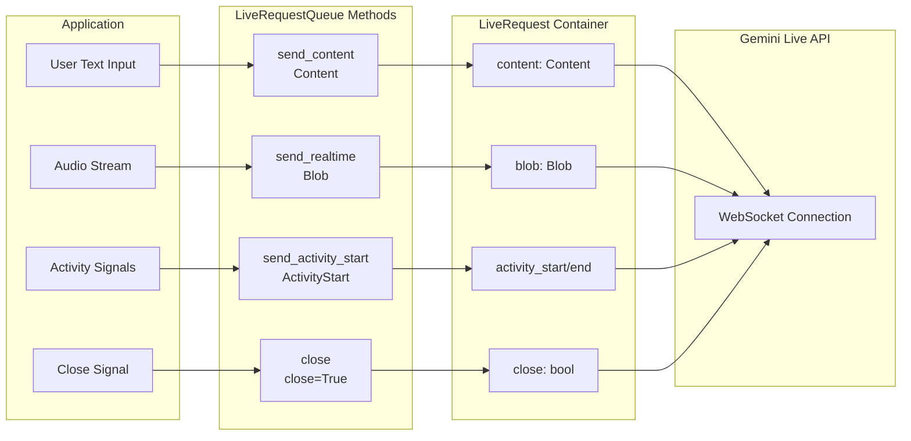

# Part 2: Sending messages with LiveRequestQueue

The `LiveRequestQueue` is your primary interface for sending messages to the AI model in streaming conversations. Rather than managing separate channels for text, audio, and control signals, ADK provides a unified `LiveRequest` container that handles all message types through a single, elegant API:

> 📖 **Source Reference**: [`live_request_queue.py`](https://github.com/google/adk-python/blob/main/src/google/adk/agents/live_request_queue.py)

```python
class LiveRequest(BaseModel):
    content: Optional[Content] = None           # Text-based content and structured data
    blob: Optional[Blob] = None                 # Audio/video data and binary streams
    activity_start: Optional[ActivityStart] = None  # Signal start of user activity
    activity_end: Optional[ActivityEnd] = None      # Signal end of user activity
    close: bool = False                         # Graceful connection termination signal
```

This streamlined design handles every streaming scenario you'll encounter. The `content` and `blob` fields handle different data types, the `activity_start` and `activity_end` fields enable activity signaling, and the `close` flag provides graceful termination semantics. This design eliminates the complexity of managing multiple message types while maintaining clear separation of concerns.

**Important:** The `content` and `blob` fields are mutually exclusive—only one can be set per LiveRequest. Setting both will result in validation errors from the Live API. ADK's convenience methods (`send_content()`, `send_realtime()`) automatically ensure this constraint is met, so using these methods (rather than manually creating `LiveRequest` objects) is the recommended approach.

## LiveRequest Message Flow

The following diagram illustrates how different message types flow from your application through LiveRequestQueue to the Gemini Live API:



> 📖 **Demo Implementation:** This guide's concepts are demonstrated in the working FastAPI application at [`src/demo/app/bidi_streaming.py`](../src/demo/app/bidi_streaming.py). The `StreamingSession` class shows all `LiveRequestQueue` patterns in a production-like implementation. See [Demo README](../src/demo/README.md) for setup instructions.

> 📖 **Important Note:** When configuring `response_modalities` in RunConfig, you must choose **exactly one** modality per session—either `["TEXT"]` or `["AUDIO"]`, never both. See [Part 4: Response Modalities](part4_run_config.md#response-modalities) for details.

While you can create `LiveRequest` objects directly, `LiveRequestQueue` provides convenience methods that handle the creation internally:

**Text Content:**

Text content represents the primary mode of structured communication between users and AI agents. This includes not just simple text messages, but also rich content with metadata, function call responses, and contextual information. The `Content` object uses a `parts` array structure that allows for complex message composition while maintaining semantic clarity.

```python
# Convenience method (recommended)
text_content = Content(parts=[Part(text="Hello, streaming world!")])
live_request_queue.send_content(text_content)

# Equivalent to creating LiveRequest manually:
# live_request_queue.send(
#     LiveRequest(content=Content(parts=[Part(text="Hello, streaming world!")]))
# )
```

**Audio/Video Blobs:**

Binary data streams—primarily audio and video—flow through the `Blob` type, which handles the real-time transmission of multimedia content. Unlike text content that gets processed turn-by-turn, blobs are designed for continuous streaming scenarios where data arrives in chunks. You provide raw bytes, and the SDK automatically handles base64 encoding for safe JSON transmission. The MIME type helps the model understand the content format.

```python
# Convenience method (recommended)
# Provide raw PCM bytes - SDK handles base64 encoding automatically
audio_blob = Blob(
    mime_type="audio/pcm;rate=16000",  # Include sample rate for audio
    data=audio_bytes  # Raw PCM bytes, NOT base64-encoded
)
live_request_queue.send_realtime(audio_blob)

# Equivalent to creating LiveRequest manually:
# live_request_queue.send(
#     LiveRequest(blob=Blob(mime_type="audio/pcm;rate=16000", data=audio_bytes))
# )
```

**Activity Signals:**

Activity signals (`ActivityStart`/`ActivityEnd`) provide explicit control over conversation turn boundaries in voice/audio interactions.

**Critical Constraint:** Activity signals are **ONLY** for voice/audio interactions when automatic Voice Activity Detection (VAD) is disabled. Using them incorrectly will cause API errors.

| Use Case | Should Use Activity Signals? | Why |
|----------|------------------------------|-----|
| Text-only chat | ❌ No | Text messages have automatic turn detection |
| Voice with automatic VAD enabled | ❌ No | API detects speech automatically |
| Voice with VAD disabled (push-to-talk) | ✅ Yes | Manual turn boundaries required |
| Custom audio streaming with manual control | ✅ Yes | Application controls turn boundaries |

**Error Behavior:** Sending activity signals in text-only mode or with automatic VAD enabled will result in API errors from the Live API.

> 📖 **API Documentation**:
> - [Gemini Live API: Disable automatic VAD](https://ai.google.dev/gemini-api/docs/live-guide#disable-automatic-vad)
> - [Vertex AI Live API: Change voice activity detection settings](https://cloud.google.com/vertex-ai/generative-ai/docs/live-api/streamed-conversations#voice-activity-detection)
> - [Voice Activity Detection configuration](part4_run_config.md#voice-activity-detection-vad)

```python
# Voice use case: Push-to-talk button
async def on_talk_button_press():
    """User pressed the talk button - start listening to their voice."""
    live_request_queue.send_activity_start()
    # Begin streaming audio chunks via send_realtime()

async def on_talk_button_release():
    """User released the talk button - they've finished speaking."""
    live_request_queue.send_activity_end()
    # Model can now process the complete audio input

# Convenience methods
live_request_queue.send_activity_start()
live_request_queue.send_activity_end()

# Equivalent to creating LiveRequest manually:
# live_request_queue.send(LiveRequest(activity_start=ActivityStart()))
# live_request_queue.send(LiveRequest(activity_end=ActivityEnd()))
```

**Control Signals:**

The `close` signal provides graceful termination semantics for streaming sessions. It signals the system to cleanly close the model connection and end the bidirectional stream. Note: audio/transcript caches are flushed on control events (for example, turn completion as indicated by `turn_complete=True` in events), not by `close()` itself. See [Part 3: Handling interruptions and turn completion](part3_run_live.md#handling-interruptions-and-turn-completion) for details on event handling and turn completion signals.

```python
# Convenience method (recommended)
live_request_queue.close()

# Equivalent to creating LiveRequest manually:
# live_request_queue.send(LiveRequest(close=True))
```

**What happens if you don't call close()?**

While ADK has automatic cleanup mechanisms, failing to call `close()` prevents graceful termination and can lead to inefficient resource usage:

| Impact | Details | Severity | What ADK Does Automatically |
|--------|---------|----------|----------------------------|
| **Send task keeps running** | The internal `_send_to_model()` task runs in a continuous loop, timing out repeatedly until the connection closes | ⚠️ Medium | Task eventually times out and is cancelled on disconnect |
| **Resource overhead** | The asyncio queue and related objects remain in memory longer than necessary | ⚠️ Low | Python GC eventually cleans up unreferenced objects |
| **No graceful signal** | The model receives an abrupt disconnection instead of a clean termination signal | ⚠️ High | **No automatic mitigation - always call close()** |

**Automatic cleanup mechanisms:**

ADK provides safety nets that eventually clean up resources:

- **SSE mode**: When `turn_complete` is True, ADK automatically calls `close()` on the queue ([`base_llm_flow.py:754`](https://github.com/google/adk-python/blob/main/src/google/adk/flows/llm_flows/base_llm_flow.py#L754))
- **Task cancellation**: When the WebSocket disconnects or an exception occurs, pending tasks are cancelled in finally blocks ([`base_llm_flow.py:190-197`](https://github.com/google/adk-python/blob/main/src/google/adk/flows/llm_flows/base_llm_flow.py#L190-L197))
- **Connection closure**: Network disconnection triggers cleanup of associated resources

**Best Practice:**

Even though ADK has safety nets for the first two issues, **always explicitly call `close()`** in cleanup handlers (try/finally blocks) to ensure predictable, graceful termination with proper signaling to the model:

```python
try:
    # Handle streaming session
    async for event in session.stream_events():
        await process_event(event)
finally:
    # Always close the queue for graceful termination
    session.close()  # This calls live_request_queue.close() internally
```

## send_content() vs send_realtime() Methods

When using `LiveRequestQueue`, you'll use two different methods to send data to the model, each optimized for different types of communication. Understanding when to use each method is crucial for building efficient streaming applications.

### send_content(): Structured Turn-Based Communication

The `send_content()` method handles structured, turn-complete messages that represent discrete conversation turns:

**What it sends:**

- **Regular conversation messages**: User text input that starts a new turn
- **Structured metadata**: Context information embedded in Content objects

**Example usage:**

```python
# Send user message
content = Content(parts=[Part(text="Hello, AI assistant!")])
live_request_queue.send_content(content)
```

**Key characteristic**: This signals a complete turn to the model, triggering immediate response generation.

### send_realtime(): Continuous Streaming Data

The `send_realtime()` method handles continuous, real-time data streams that don't follow turn-based semantics:

**What it sends:**

- **Audio chunks**: PCM-encoded audio data for voice input
- **Video frames**: Binary video data for multimodal processing
- **Activity signals**: ActivityStart/ActivityEnd markers for manual voice activity control (when automatic detection is disabled)

**Example usage (voice streaming with push-to-talk):**

```python
# User presses talk button - signal start of voice input
live_request_queue.send_activity_start()

# Stream audio chunks while user is speaking
while user_is_speaking:
    audio_blob = Blob(
        mime_type="audio/pcm;rate=16000",
        data=audio_chunk  # Raw PCM bytes - SDK handles base64 encoding
    )
    live_request_queue.send_realtime(audio_blob)

# User releases talk button - signal end of voice input
live_request_queue.send_activity_end()
```

**Example usage (automatic VAD - no activity signals needed):**

```python
# With automatic voice activity detection enabled (default),
# stream audio continuously - the API detects speech automatically
while recording:  # Application controls recording (e.g., button press/release)
    audio_blob = Blob(
        mime_type="audio/pcm;rate=16000",
        data=audio_chunk  # Raw PCM bytes - SDK handles base64 encoding
    )
    live_request_queue.send_realtime(audio_blob)
    # No activity_start/activity_end needed - API detects speech boundaries

# Note: With automatic VAD enabled:
# - Your application controls WHEN to capture audio (via recording flag/button)
# - The Live API automatically detects WHEN the user is speaking within that audio
# - Turn completion is signaled via events (turn_complete=True)
# See Part 6: Events for details on handling turn completion signals
```

**Key characteristic**: Real-time data flows continuously without turn boundaries. The model can start responding before receiving all input (e.g., interrupting during speech), enabling natural conversation flow.

**When to use which:**

| Scenario | Method | Reason |
|----------|--------|--------|
| Text chat message | `send_content()` | Discrete, turn-complete communication |
| Voice input (push-to-talk) | `send_realtime()` + activity signals | Manual control over voice turn boundaries |
| Voice input (automatic VAD) | `send_realtime()` only | Continuous audio data with automatic activity detection |
| Video frame | `send_realtime()` | Binary streaming data |
| User pressed talk button | `send_activity_start()` | Signal start of manual voice input (only with VAD disabled) |
| User released talk button | `send_activity_end()` | Signal end of manual voice input (only with VAD disabled) |

## Async Queue Management

One of the most powerful aspects of `LiveRequestQueue` is how it seamlessly bridges synchronous and asynchronous programming models. The queue's design recognizes a fundamental reality of streaming applications: message production often happens in synchronous contexts (like HTTP request handlers or UI event callbacks), while message consumption happens in async contexts (like the streaming event loop).

The producer side uses non-blocking operations that return immediately, allowing your application to queue messages without waiting for processing. This prevents UI freezes and keeps your application responsive even under heavy load. The consumer side, however, uses async/await patterns that integrate naturally with Python's asyncio ecosystem, enabling efficient concurrent processing without the complexity of threading.

```python
from fastapi import FastAPI, WebSocket
from google.adk.agents import LiveRequestQueue
from google.genai.types import Content, Part

app = FastAPI()

# 1. WebSocket handler - async context
@app.websocket("/chat")
async def websocket_handler(websocket: WebSocket):
    await websocket.accept()
    queue = LiveRequestQueue()

    # Send message in async context
    message = await websocket.receive_text()
    queue.send_content(Content(parts=[Part(text=message)]))

# 2. HTTP handler - sync context
@app.post("/send")
def http_handler(message: str):
    queue = LiveRequestQueue()

    # Send message in sync context - still works!
    queue.send_content(Content(parts=[Part(text=message)]))
    return {"status": "queued"}
```

This asymmetric design—sync producers, async consumers—is what makes `LiveRequestQueue` so practical for real-world applications. You can send messages from anywhere in your codebase without worrying about async contexts, while ADK's internal machinery handles them efficiently through async processing.

## LiveRequestQueue Lifecycle

**Creation:**
```python
# Create a new queue for each streaming session
live_request_queue = LiveRequestQueue()
```

**Important Lifecycle Rules:**
1. **One queue per session:** Create a new `LiveRequestQueue` for each `run_live()` session
2. **Not reusable:** After `close()` is called and the session ends, create a new queue for subsequent sessions
3. **Message persistence:** Messages already in the queue when `close()` is called will be processed before the connection terminates
4. **Automatic cleanup:** The queue is garbage collected when the session ends and references are released

**Example Pattern:**
```python
# ✅ Correct - New queue per session
for session_id in sessions:
    queue = LiveRequestQueue()  # Fresh queue for each session
    async for event in runner.run_live(..., live_request_queue=queue):
        process_event(event)
    queue.close()

# ❌ Incorrect - Reusing queue across sessions
queue = LiveRequestQueue()
async for event in runner.run_live(..., live_request_queue=queue): ...
# Session ends
async for event in runner.run_live(..., live_request_queue=queue): ...  # ERROR
```

## Concurrency and Thread Safety

`LiveRequestQueue` is designed for typical streaming scenarios with the following characteristics:

### Same Event Loop Usage (Common Case)

When all queue operations happen in the same event loop (e.g., FastAPI WebSocket handler):

```python
# Safe - all operations in same async context
async def websocket_handler(websocket: WebSocket):
    live_queue = LiveRequestQueue()

    # Send from async handler
    user_message = await websocket.receive_text()
    live_queue.send_content(Content(parts=[Part(text=user_message)]))  # Safe

    # Stream events
    async for event in runner.run_live(..., live_request_queue=live_queue):
        await websocket.send_text(event.model_dump_json())
```

### Cross-Thread Usage (Advanced)

For scenarios requiring thread-safe enqueueing (e.g., background workers):

```python
import asyncio
from threading import Thread

# Thread-safe enqueueing pattern
def background_audio_capture(loop, queue):
    """Runs in separate thread, enqueues audio safely."""
    while capturing:
        audio_data = capture_audio_chunk()
        blob = Blob(mime_type="audio/pcm", data=audio_data)  # Raw bytes - SDK handles encoding

        # Schedule on the main event loop thread-safely
        loop.call_soon_threadsafe(queue.send_realtime, blob)

# Main async context
async def main():
    loop = asyncio.get_event_loop()
    live_queue = LiveRequestQueue()

    # Start background thread
    thread = Thread(target=background_audio_capture, args=(loop, live_queue))
    thread.start()

    # Process events on main thread
    async for event in runner.run_live(..., live_request_queue=live_queue):
        process_event(event)
```

### Message Ordering Guarantees

- **FIFO ordering:** Messages are processed in the order they were sent
- **No coalescing:** Each message is delivered independently (no automatic batching)
- **Unbounded by default:** Queue accepts unlimited messages without blocking

## Common Pitfalls and Solutions

### Pitfall 1: Mixing Activity Signals with Text Messages

**Problem:**
```python
# DON'T - Activity signals with text causes API errors
live_queue.send_activity_start()
live_queue.send_content(text_content)
live_queue.send_activity_end()
```

**Solution:**
```python
# DO - Use activity signals ONLY for voice/audio with VAD disabled
# For text-only interactions, just send content (automatic turn detection)
live_queue.send_content(text_content)  # Just this, no signals needed
```

### Pitfall 2: Forgetting to Call close()

**Problem:** Not calling `close()` leaves resources hanging and prevents graceful termination.

**Solution:** Always use try/finally or async context managers:
```python
try:
    async for event in session.stream_events():
        await process_event(event)
finally:
    session.close()  # Always cleanup, even on errors
```

### Pitfall 3: Reusing LiveRequestQueue Across Sessions

**Problem:**
```python
# DON'T - Reuse queue across sessions
queue = LiveRequestQueue()
async for event in runner.run_live(..., live_request_queue=queue): ...
# Session ends
async for event in runner.run_live(..., live_request_queue=queue): ...  # ERROR
```

**Solution:**
```python
# DO - Create new queue for each session
for session_id in sessions:
    queue = LiveRequestQueue()  # New queue per session
    async for event in runner.run_live(..., live_request_queue=queue): ...
    queue.close()
```

### Pitfall 4: Empty Content Parts

**Problem:**
```python
# DON'T - Empty parts raise ValueError
content = Content(parts=[])  # ERROR
live_queue.send_content(content)
```

**Solution:**
```python
# DO - Always include at least one part
content = Content(parts=[Part(text="Hello")])
live_queue.send_content(content)
```

## Troubleshooting LiveRequestQueue

### Messages Not Being Processed

**Symptom:** Messages sent via `send_content()` or `send_realtime()` don't trigger model responses.

**Common Causes:**
1. **Not iterating run_live():** The `run_live()` generator must be actively iterated to process events
2. **Empty Content.parts:** Sending `Content(parts=[])` raises `ValueError`
3. **Queue closed prematurely:** Calling `close()` before messages are processed
4. **No event loop:** Queue requires an event loop to exist when created

**Debug Steps:**
```python
import logging
logging.basicConfig(level=logging.DEBUG)  # Enable ADK debug logs

# Verify queue operations
live_queue = LiveRequestQueue()
live_queue.send_content(content)
# Check debug logs for queue operations and errors
```

### LiveRequestQueue created outside async context

**Symptom:** Queue created outside async context. ADK will auto-create a loop, but this may not be expected.

**Cause:** `LiveRequestQueue` requires an event loop to exist when instantiated. However, ADK includes a safety mechanism: if no running loop is found, it automatically creates one using `asyncio.new_event_loop()` and sets it as the current event loop.

**When you might still see this error:**
- In multi-threaded scenarios where loops are not properly propagated
- When using advanced asyncio configurations with custom loop policies
