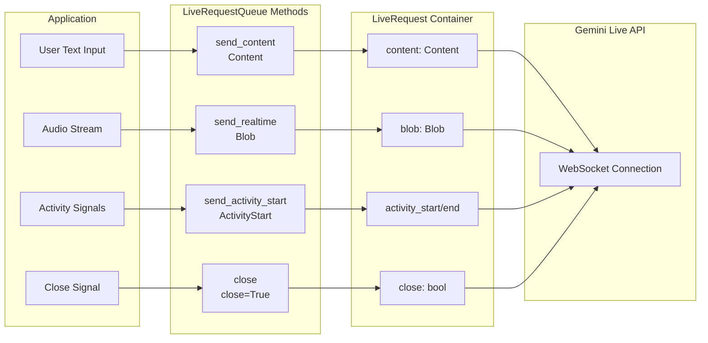

# Part 2: Sending messages with LiveRequestQueue

The `LiveRequestQueue` is your primary interface for sending messages to the AI model in streaming conversations. Rather than managing separate channels for text, audio, and control signals, ADK provides a unified `LiveRequest` container that handles all message types through a single, elegant API:

> 📖 **Source Reference**: [`live_request_queue.py`](https://github.com/google/adk-python/blob/main/src/google/adk/agents/live_request_queue.py)

```python
class LiveRequest(BaseModel):
    content: Optional[Content] = None           # Text-based content and structured data
    blob: Optional[Blob] = None                 # Audio/video data and binary streams
    activity_start: Optional[ActivityStart] = None  # Signal start of user activity
    activity_end: Optional[ActivityEnd] = None      # Signal end of user activity
    close: bool = False                         # Graceful connection termination signal
```

This streamlined design handles every streaming scenario you'll encounter. The `content` and `blob` fields handle different data types, the `activity_start` and `activity_end` fields enable activity signaling, and the `close` flag provides graceful termination semantics. This design eliminates the complexity of managing multiple message types while maintaining clear separation of concerns.

**Important:** The `content` and `blob` fields are mutually exclusive—only one can be set per LiveRequest. While ADK does not enforce this client-side and will attempt to send both if set, the Live API backend will reject this with a validation error. ADK's convenience methods (`send_content()`, `send_realtime()`) automatically ensure this constraint is met by setting only one field, so **using these methods (rather than manually creating `LiveRequest` objects) is the strongly recommended approach**.

## LiveRequest Message Flow

The following diagram illustrates how different message types flow from your application through LiveRequestQueue to the Gemini Live API:



> 📖 **Demo Implementation:** This guide's concepts are demonstrated in the working FastAPI application at [`src/demo/app/bidi_streaming.py`](../src/demo/app/bidi_streaming.py). The `StreamingSession` class shows all `LiveRequestQueue` patterns in a production-like implementation. See [Demo README](../src/demo/README.md) for setup instructions.

> 📖 **Important Note:** When configuring `response_modalities` in RunConfig, you must choose **exactly one** modality per session—either `["TEXT"]` or `["AUDIO"]`, never both. See [Part 4: Response Modalities](part4_run_config.md#response-modalities) for details.

## Sending Different Message Types

While you can create `LiveRequest` objects directly, `LiveRequestQueue` provides convenience methods that handle the creation internally:

### Text Content

The `send_content()` method sends text messages to the model in turn-by-turn mode. This is how you send user text input to start a conversation turn.

```python
from google.genai import types

# Simple text message (most common pattern)
text_content = types.Content(parts=[types.Part(text="Hello, streaming world!")])
live_request_queue.send_content(text_content)

# Equivalent to creating LiveRequest manually:
# live_request_queue.send(
#     LiveRequest(content=types.Content(parts=[types.Part(text="Hello, streaming world!")]))
# )
```

**Using Content and Part with ADK Bidi-streaming:**

- **`Content`** (`google.genai.types.Content`): A container that represents a single message or turn in the conversation. It holds an array of `Part` objects that together compose the complete message.

- **`Part`** (`google.genai.types.Part`): An individual piece of content within a message. For ADK Bidi-streaming with Live API, you'll use:
  - `text`: Text content (including code) that you send to the model

In practice, most messages use a single text Part. The multi-part structure is designed for mixing different content types (text + images, text + function responses), but in Live API, other modalities use different mechanisms.

> 📝 **Note on Content and Part usage in ADK Bidi-streaming**:
>
> While the Gemini API `Part` type supports many fields (`inline_data`, `file_data`, `function_call`, `function_response`, etc.), most are either handled automatically by ADK or use different mechanisms in Live API:
>
> - **Function calls**: ADK automatically handles the function calling loop - receiving function calls from the model, executing your registered functions, and sending responses back. You don't manually construct these.
> - **Images/Video**: Do NOT use `send_content()` with `inline_data`. Instead, use `send_realtime(Blob(mime_type="image/jpeg", data=...))` for continuous streaming. See [Part 5: How to Use Video](part5_audio_and_video.md#how-to-use-video).

### Audio/Video Blobs

Binary data streams—primarily audio and video—flow through the `Blob` type, which handles transmission in realtime mode. Unlike text content that gets processed in turn-by-turn mode, blobs are designed for continuous streaming scenarios where data arrives in chunks. You provide raw bytes, and Pydantic automatically handles base64 encoding during JSON serialization for safe network transmission. The MIME type helps the model understand the content format.

```python
from google.genai import types

# Convenience method (recommended)
# Provide raw PCM bytes - Pydantic automatically handles base64 encoding
# during JSON serialization for network transmission
audio_blob = types.Blob(
    mime_type="audio/pcm;rate=16000",  # REQUIRED: sample rate for PCM audio
    data=audio_bytes  # Raw bytes - Pydantic base64-encodes during JSON serialization for WebSocket transport
)
live_request_queue.send_realtime(audio_blob)

# Equivalent to creating LiveRequest manually:
# live_request_queue.send(
#     LiveRequest(blob=types.Blob(mime_type="audio/pcm;rate=16000", data=audio_bytes))
# )
```

> 💡 **Learn More**: For complete details on audio and video specifications, formats, and best practices, see [Part 5: How to Use Audio and Video](part5_audio_and_video.md).

### Activity Signals

Activity signals (`ActivityStart`/`ActivityEnd`) can **ONLY** be sent when automatic (server-side) Voice Activity Detection is **explicitly disabled** in your `RunConfig`. Use them when your application requires manual voice activity control, such as:

- **Push-to-talk interfaces**: User explicitly controls when they're speaking (e.g., holding a button)
- **Noisy environments**: Background noise makes automatic VAD unreliable, so you use client-side VAD or manual control
- **Client-side VAD**: You implement your own VAD algorithm on the client to reduce network overhead by only sending audio when speech is detected
- **Custom interaction patterns**: Non-speech scenarios like gesture-triggered interactions or timed audio segments

**What activity signals tell the model:**

- `ActivityStart`: "The user is now speaking - start accumulating audio for processing"
- `ActivityEnd`: "The user has finished speaking - process the accumulated audio and generate a response"

Without these signals (when VAD is disabled), the model doesn't know when to start/stop listening for speech, so you must explicitly mark turn boundaries.

**How it works:**

```python
from google.genai import types

# Manual activity signal pattern (e.g., push-to-talk)
live_request_queue.send_activity_start()  # Signal: user started speaking

# Stream audio chunks while user holds the talk button
while user_is_holding_button:
    audio_blob = types.Blob(mime_type="audio/pcm;rate=16000", data=audio_chunk)
    live_request_queue.send_realtime(audio_blob)

live_request_queue.send_activity_end()  # Signal: user stopped speaking
```

**Default behavior (automatic VAD):** If you don't send activity signals, Live API's built-in VAD automatically detects speech boundaries in the audio stream you send via `send_realtime()`. This is the recommended approach for most applications.

> 💡 **Learn More**: For detailed comparison of automatic VAD vs manual activity signals, including performance implications and best practices, see [Part 5: VAD vs Manual Activity Signals](part5_audio_and_video.md#vad-vs-manual-activity-signals).

### Control Signals

The `close` signal provides graceful termination semantics for streaming sessions. It signals the system to cleanly close the model connection and end the bidirectional stream. In ADK Bidi-streaming, your application is responsible for sending the `close` signal explicitly:

**Manual closure in BIDI mode:** When using `StreamingMode.BIDI` (Bidi-streaming), your application should manually call `close()` when the session terminates or when errors occur. This practice minimizes session resource usage.

**Automatic closure in SSE mode:** When using the legacy `StreamingMode.SSE` (not Bidi-streaming), ADK automatically calls `close()` on the queue when it receives a `turn_complete=True` event from the model (see `base_llm_flow.py:754`).

> **⚠️ Important**: The need to call `close()` manually depends on your `StreamingMode`:
> - **BIDI mode** (bidirectional streaming): You must call `close()` manually
> - **SSE mode** (server-sent events): ADK automatically calls `close()` when receiving `turn_complete=True`
>
> See [Part 4: StreamingMode](part4_run_config.md#streamingmode-bidi-or-sse) for detailed comparison and when to use each mode.

**Practical Example:**

```python
# Always call close() in a finally block to ensure cleanup
try:
    await asyncio.gather(
        upstream_task(),    # Send messages to model
        downstream_task(),  # Receive responses from model
        return_exceptions=True  # Prevent one task's exception from canceling the other
    )
finally:
    live_request_queue.close()  # Send graceful termination signal to Live API
```

**What happens if you don't call close()?**

Although ADK cleans up local resources automatically, failing to call `close()` in BIDI mode prevents sending a graceful termination signal to the Live API, which will then receive an abrupt disconnection instead. This may also increase resource overhead on both ADK and Live API sides.

## send_content() vs send_realtime() Methods

When using `LiveRequestQueue`, you'll use two different methods to send data to the model, each optimized for different types of communication. Understanding when to use each method is crucial for building efficient streaming applications.

### send_content(): Turn-by-Turn Mode

The `send_content()` method sends structured messages in turn-by-turn mode, where each message represents a discrete conversation turn:

**What it sends:**

- **Regular conversation messages**: User text input that starts a new turn
- **Structured metadata**: Context information embedded in Content objects

**Example usage:**

```python
from google.genai import types

# Send user message in turn-by-turn mode
content = types.Content(parts=[types.Part(text="Hello, AI assistant!")])
live_request_queue.send_content(content)  # Triggers immediate model response
```

**Key characteristic**: This signals a complete turn to the model, triggering immediate response generation.

### send_realtime(): Realtime Mode

The `send_realtime()` method sends continuous data in realtime mode, which doesn't follow turn-by-turn semantics:

**What it sends:**

- **Audio chunks**: PCM-encoded audio data for voice input
- **Video frames**: Binary video data for multimodal processing

**Note**: Activity signals (`ActivityStart`/`ActivityEnd`) are also sent through the realtime mode pipeline internally, but you should use the dedicated convenience methods `send_activity_start()` and `send_activity_end()` instead of `send_realtime()` for these.

**Example usage:**

```python
from google.genai import types

# Stream audio chunks in realtime mode while user is speaking
while user_is_speaking:
    audio_blob = types.Blob(
        mime_type="audio/pcm;rate=16000",  # Specify PCM format with 16kHz sample rate
        data=audio_chunk  # Raw bytes - base64-encoded during serialization
    )
    live_request_queue.send_realtime(audio_blob)  # Continuous streaming, no turn boundary
```

**Key characteristic**: In realtime mode, data flows continuously without turn boundaries. The model can start responding before receiving all input (e.g., interrupting during speech), enabling natural conversation flow.

**When to use which:**

| Scenario | Method | Reason |
|----------|--------|--------|
| Text chat message | `send_content()` | Turn-by-turn mode for discrete messages |
| Voice input (automatic VAD) | `send_realtime()` only | Realtime mode with continuous audio data |
| Voice input (push-to-talk) | `send_realtime()` + activity signals | Realtime mode with manual turn control |
| Video frame | `send_realtime()` | Realtime mode for binary streaming data |

## Concurrency and Thread Safety

Understanding how `LiveRequestQueue` handles concurrency is essential for building reliable streaming applications. The queue is built on `asyncio.Queue`, which means it's safe for concurrent access **within the same event loop thread** (the common case), but requires special handling when called from **different threads** (the advanced case). This section explains the design choices behind `LiveRequestQueue`'s API, when you can safely use it without extra precautions, and when you need thread-safety mechanisms like `loop.call_soon_threadsafe()`.

### Async Queue Management

`LiveRequestQueue` uses synchronous methods (`send_content()`, `send_realtime()`) instead of async methods, even though the underlying queue is consumed asynchronously. This design choice uses `asyncio.Queue.put_nowait()` - a non-blocking operation that doesn't require `await`.

**Why synchronous send methods?** Convenience and simplicity. You can call them from anywhere in your async code without `await`:

```python
async def upstream_task():
    """Receives messages from WebSocket and sends to LiveRequestQueue."""
    while True:
        data = await websocket.receive_text()       # Async I/O operation
        content = types.Content(...)                 # Sync data construction
        live_request_queue.send_content(content)    # Sync, non-blocking queue operation
```

This pattern mixes async I/O operations with sync CPU operations naturally. The send methods return immediately without blocking, allowing your application to stay responsive.

**Important:** This works **only within the same event loop thread**. If you're calling from different threads (e.g., sync FastAPI handlers, background workers), you must use `loop.call_soon_threadsafe()`. See [Cross-Thread Usage](#cross-thread-usage-advanced) below.

!!! tip "Best Practice: Create Queue in Async Context"

    Always create `LiveRequestQueue` within an async context (async function or coroutine) to ensure it uses the correct event loop:

    ```python
    # ✅ Recommended - Create in async context
    async def main():
        queue = LiveRequestQueue()  # Uses existing event loop from async context
        # This is the preferred pattern - ensures queue uses the correct event loop
        # that will run your streaming operations

    # ❌ Not recommended - Creates event loop automatically
    queue = LiveRequestQueue()  # Works but ADK auto-creates new loop
    # This works due to ADK's safety mechanism, but may cause issues with
    # loop coordination in complex applications or multi-threaded scenarios
    ```

    **Why this matters:** `LiveRequestQueue` requires an event loop to exist when instantiated. ADK includes a safety mechanism that auto-creates a loop if none exists, but relying on this can cause unexpected behavior in multi-threaded scenarios or with custom event loop configurations.

### Cross-Thread Usage (Advanced)

!!! warning "Not Officially Supported by ADK"

    This section describes cross-thread usage patterns that are **not officially documented or supported** by the ADK Python library. ADK's `LiveRequestQueue` is designed for single-threaded async usage within the event loop. The patterns shown here are for educational purposes and advanced use cases where cross-thread communication is unavoidable.

    For production applications, prefer keeping all `LiveRequestQueue` operations within async functions on the same event loop thread.

This section covers calling `LiveRequestQueue` methods from **different threads**, which is uncommon in typical streaming applications. The underlying `asyncio.Queue` is not thread-safe, so when enqueueing from different threads (e.g., background workers or sync FastAPI handlers), you must use `loop.call_soon_threadsafe()` to safely schedule operations on the correct event loop thread.

```python
import asyncio
import threading
from google.genai import types
from google.adk.agents import LiveRequestQueue

# Thread-safe enqueueing pattern with proper cleanup
def background_audio_capture(loop, queue, stop_event):
    """Runs in separate thread, enqueues audio safely."""
    try:
        while not stop_event.is_set():  # Check shutdown signal
            # Simulate audio capture (replace with actual capture logic)
            audio_data = capture_audio_chunk()
            if not audio_data:
                break

            # Prepare audio blob for realtime mode transmission
            blob = types.Blob(
                mime_type="audio/pcm;rate=16000",  # Specify audio format and sample rate
                data=audio_data  # Raw PCM bytes from audio capture
            )

            # CRITICAL: Use call_soon_threadsafe() to safely enqueue from different thread
            # Direct queue.send_realtime() would fail - asyncio.Queue is not thread-safe
            loop.call_soon_threadsafe(queue.send_realtime, blob)
    except Exception as e:
        print(f"Error in background thread: {e}")
    finally:
        print("Background audio capture thread shutting down")

# Main async context
async def main():
    loop = asyncio.get_event_loop()  # Get current event loop for cross-thread coordination
    live_queue = LiveRequestQueue()  # Create queue in async context
    stop_event = threading.Event()  # Shutdown signal for background thread
    thread = None

    try:
        # Start background thread for audio capture
        thread = threading.Thread(
            target=background_audio_capture,
            args=(loop, live_queue, stop_event),  # Pass loop reference and queue
            daemon=True  # Thread terminates when main program exits
        )
        thread.start()

        # Process events on main event loop thread
        async for event in runner.run_live(..., live_request_queue=live_queue):
            process_event(event)
    finally:
        # Cleanup: Signal thread to stop and wait for graceful shutdown
        if thread and thread.is_alive():
            stop_event.set()  # Signal background thread to exit
            thread.join(timeout=2.0)  # Wait up to 2 seconds for clean shutdown
            if thread.is_alive():
                print("Warning: Background thread did not stop in time")
```

**Important FastAPI caveat:** Sync FastAPI handlers (functions without `async def`) run in a thread pool, not the event loop thread, so sharing a `LiveRequestQueue` between async WebSocket handlers and sync HTTP handlers requires `call_soon_threadsafe()`. To avoid this complexity, use `async def` for all handlers that interact with `LiveRequestQueue`.

### Message Ordering Guarantees

`LiveRequestQueue` provides predictable message delivery behavior that's important for maintaining conversation context and ensuring reliable streaming interactions:

- **FIFO ordering:** Messages are processed in the order they were sent (guaranteed by the underlying `asyncio.Queue` implementation)
- **No coalescing:** Each message is delivered independently (no automatic batching)
- **Unbounded by default:** Queue accepts unlimited messages without blocking
  - **Benefit**: Simplifies client code (no blocking on send)
  - **Risk**: Memory can grow if client sends faster than model processes
  - **Mitigation**: Monitor queue depth in production; implement client-side rate limiting if needed

> **Production Tip**: For high-throughput audio/video streaming, monitor `live_request_queue._queue.qsize()` to detect backpressure. If the queue depth grows continuously, slow down your send rate or implement batching.

## Troubleshooting LiveRequestQueue

When things don't work as expected, these troubleshooting guides help you diagnose and resolve common issues with `LiveRequestQueue`.

### Messages Not Being Processed

If messages you send to the queue aren't triggering model responses, the issue is usually related to how the streaming loop is set up or the content being sent.

**Symptom:** Messages sent via `send_content()` or `send_realtime()` don't trigger model responses.

**Common Causes:**
1. **Not iterating run_live():** The `run_live()` generator must be actively iterated to process events
2. **Empty Content.parts:** Sending `Content(parts=[])` will be rejected by the Live API backend
3. **Queue closed prematurely:** Calling `close()` before messages are processed
4. **No event loop:** Queue requires an event loop to exist when created

### LiveRequestQueue created outside async context

**Symptom:** Queue created outside async context. ADK will auto-create a loop, but this may not be expected.

**Cause:** `LiveRequestQueue` requires an event loop to exist when instantiated. ADK includes a safety mechanism that auto-creates a loop if none exists, but this can cause issues in multi-threaded scenarios or with custom event loop configurations.

**Solution:** Always create `LiveRequestQueue` within an async context. See the [Best Practice guidance in Async Queue Management](#async-queue-management) for detailed explanation and code examples.

**When you might still encounter issues:**
- In multi-threaded scenarios where loops are not properly propagated
- When using advanced asyncio configurations with custom loop policies
- In environments with strict event loop management (e.g., some web frameworks)
