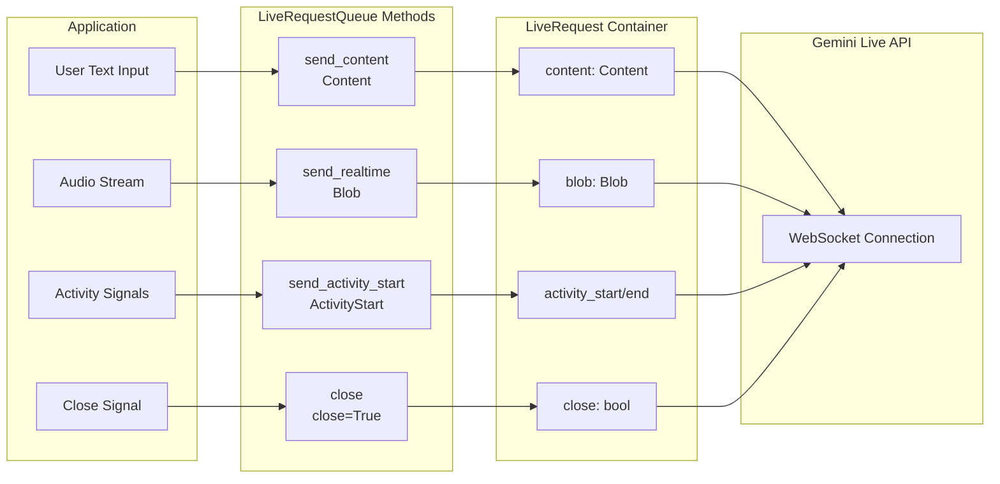

# Part 2: Sending messages with LiveRequestQueue

The `LiveRequestQueue` is your primary interface for sending messages to the AI model in streaming conversations. Rather than managing separate channels for text, audio, and control signals, ADK provides a unified `LiveRequest` container that handles all message types through a single, elegant API:

> 📖 **Source Reference**: [`live_request_queue.py`](https://github.com/google/adk-python/blob/main/src/google/adk/agents/live_request_queue.py)

```python
class LiveRequest(BaseModel):
    content: Optional[Content] = None           # Text-based content and structured data
    blob: Optional[Blob] = None                 # Audio/video data and binary streams
    activity_start: Optional[ActivityStart] = None  # Signal start of user activity
    activity_end: Optional[ActivityEnd] = None      # Signal end of user activity
    close: bool = False                         # Graceful connection termination signal
```

This streamlined design handles every streaming scenario you'll encounter. The `content` and `blob` fields handle different data types, the `activity_start` and `activity_end` fields enable activity signaling, and the `close` flag provides graceful termination semantics. This design eliminates the complexity of managing multiple message types while maintaining clear separation of concerns.

**Important:** The `content` and `blob` fields are mutually exclusive—only one can be set per LiveRequest. ADK does not enforce this client-side; attempting to send both will result in validation errors from the Live API backend. ADK's convenience methods (`send_content()`, `send_realtime()`) automatically ensure this constraint is met, so using these methods (rather than manually creating `LiveRequest` objects) is the recommended approach.

## LiveRequest Message Flow

The following diagram illustrates how different message types flow from your application through LiveRequestQueue to the Gemini Live API:



> 📖 **Demo Implementation:** This guide's concepts are demonstrated in the working FastAPI application at [`src/demo/app/bidi_streaming.py`](../src/demo/app/bidi_streaming.py). The `StreamingSession` class shows all `LiveRequestQueue` patterns in a production-like implementation. See [Demo README](../src/demo/README.md) for setup instructions.

> 📖 **Important Note:** When configuring `response_modalities` in RunConfig, you must choose **exactly one** modality per session—either `["TEXT"]` or `["AUDIO"]`, never both. See [Part 4: Response Modalities](part4_run_config.md#response-modalities) for details.

While you can create `LiveRequest` objects directly, `LiveRequestQueue` provides convenience methods that handle the creation internally:

### Text Content

Text content represents the primary mode of structured communication between users and AI agents. This includes not just simple text messages, but also rich content with metadata, function call responses, and contextual information. The `Content` object uses a `parts` array structure that allows for complex message composition while maintaining semantic clarity.

```python
# Convenience method (recommended)
text_content = Content(parts=[Part(text="Hello, streaming world!")])
live_request_queue.send_content(text_content)

# Equivalent to creating LiveRequest manually:
# live_request_queue.send(
#     LiveRequest(content=Content(parts=[Part(text="Hello, streaming world!")]))
# )
```

### Audio/Video Blobs

Binary data streams—primarily audio and video—flow through the `Blob` type, which handles the real-time transmission of multimedia content. Unlike text content that gets processed turn-by-turn, blobs are designed for continuous streaming scenarios where data arrives in chunks. You provide raw bytes, and Pydantic automatically handles base64 encoding during JSON serialization for safe network transmission. The MIME type helps the model understand the content format.

```python
# Convenience method (recommended)
# Provide raw PCM bytes - Pydantic automatically handles base64 encoding
# during JSON serialization for network transmission
audio_blob = Blob(
    mime_type="audio/pcm;rate=16000",  # Include sample rate for audio
    data=audio_bytes  # Raw bytes - will be base64-encoded during serialization
)
live_request_queue.send_realtime(audio_blob)

# Equivalent to creating LiveRequest manually:
# live_request_queue.send(
#     LiveRequest(blob=Blob(mime_type="audio/pcm;rate=16000", data=audio_bytes))
# )
```

### Activity Signals

Activity signals (`ActivityStart`/`ActivityEnd`) are used **ONLY** when your application requires manual voice activity control over the default Voice Activity Detection (VAD) in Live API. See [VAD vs Manual Activity Signals comparison](part5_audio_and_video.md#vad-vs-manual-activity-signals) for details.

### Control Signals

The `close` signal provides graceful termination semantics for streaming sessions. It signals the system to cleanly close the model connection and end the bidirectional stream. In ADK Bidi-streaming, your application is responsible for sending the `close` signal explicitly:

**Manual closure in BIDI mode:** When using `StreamingMode.BIDI` (Bidi-streaming), your application should manually call `close()` when the session terminates or when errors occur. This practice minimizes session resource usage.

**Automatic closure in SSE mode:** When using the legacy `StreamingMode.SSE` (not Bidi-streaming), ADK automatically calls `close()` on the queue when it receives a `turn_complete=True` event from the model (see `base_llm_flow.py:754`).

> 📖 For detailed comparison of BIDI vs SSE streaming modes, see [StreamingMode: BIDI or SSE](part4_run_config.md#streamingmode-bidi-or-sse).

**Practical Example:**

```python
# Always call close() in a finally block to ensure cleanup
try:
    await asyncio.gather(
        upstream_task(),
        downstream_task(),
        return_exceptions=True
    )
finally:
    live_request_queue.close()  # Always cleanup
```

**What happens if you don't call close()?**

Although ADK cleans up local resources automatically, failing to call `close()` in BIDI mode prevents sending a graceful termination signal to the Live API, which will then receive an abrupt disconnection instead. This may also increase resource overhead on both ADK and Live API sides.

## send_content() vs send_realtime() Methods

When using `LiveRequestQueue`, you'll use two different methods to send data to the model, each optimized for different types of communication. Understanding when to use each method is crucial for building efficient streaming applications.

### send_content(): Structured Turn-Based Communication

The `send_content()` method handles structured, turn-complete messages that represent discrete conversation turns:

**What it sends:**

- **Regular conversation messages**: User text input that starts a new turn
- **Structured metadata**: Context information embedded in Content objects

**Example usage:**

```python
# Send user message
content = Content(parts=[Part(text="Hello, AI assistant!")])
live_request_queue.send_content(content)
```

**Key characteristic**: This signals a complete turn to the model, triggering immediate response generation.

### send_realtime(): Continuous Streaming Data

The `send_realtime()` method handles continuous, real-time data streams that don't follow turn-based semantics:

**What it sends:**

- **Audio chunks**: PCM-encoded audio data for voice input
- **Video frames**: Binary video data for multimodal processing
- **Activity signals**: ActivityStart/ActivityEnd markers for manual voice activity control (when automatic Voice Activity Detection is disabled)

**Example usage:**

```python
# Stream audio chunks while user is speaking
while user_is_speaking:
    audio_blob = Blob(
        mime_type="audio/pcm;rate=16000",
        data=audio_chunk  # Raw bytes - base64-encoded during serialization
    )
    live_request_queue.send_realtime(audio_blob)
```

**Key characteristic**: Real-time data flows continuously without turn boundaries. The model can start responding before receiving all input (e.g., interrupting during speech), enabling natural conversation flow.

**When to use which:**

| Scenario | Method | Reason |
|----------|--------|--------|
| Text chat message | `send_content()` | Discrete, turn-complete communication |
| Voice input (automatic VAD) | `send_realtime()` only | Continuous audio data with automatic activity detection |
| Voice input (push-to-talk) | `send_realtime()` + activity signals | Manual control over voice turn boundaries |
| Video frame | `send_realtime()` | Binary streaming data |

## Concurrency and Thread Safety

Understanding how `LiveRequestQueue` handles concurrency is essential for building reliable streaming applications. The queue is built on `asyncio.Queue`, which means it's safe for concurrent access **within the same event loop thread** (the common case), but requires special handling when called from **different threads** (the advanced case). This section explains the design choices behind `LiveRequestQueue`'s API, when you can safely use it without extra precautions, and when you need thread-safety mechanisms like `loop.call_soon_threadsafe()`.

### Async Queue Management

`LiveRequestQueue` uses synchronous methods (`send_content()`, `send_realtime()`) instead of async methods, even though the underlying queue is consumed asynchronously. This design choice uses `asyncio.Queue.put_nowait()` - a non-blocking operation that doesn't require `await`.

**Why synchronous send methods?** Convenience and simplicity. You can call them from anywhere in your async code without `await`:

```python
async def upstream_task():
    """Receives messages from WebSocket and sends to LiveRequestQueue."""
    while True:
        data = await websocket.receive_text()       # Async I/O operation
        content = types.Content(...)                 # Sync data construction
        live_request_queue.send_content(content)    # Sync, non-blocking queue operation
```

This pattern mixes async I/O operations with sync CPU operations naturally. The send methods return immediately without blocking, allowing your application to stay responsive.

**Important:** This works **only within the same event loop thread**. If you're calling from different threads (e.g., sync FastAPI handlers, background workers), you must use `loop.call_soon_threadsafe()`. See [Cross-Thread Usage](#cross-thread-usage-advanced) below.

### Cross-Thread Usage (Advanced)

This section covers calling `LiveRequestQueue` methods from **different threads**, which is uncommon in typical streaming applications. The underlying `asyncio.Queue` is not thread-safe, so when enqueueing from different threads (e.g., background workers or sync FastAPI handlers), you must use `loop.call_soon_threadsafe()` to safely schedule operations on the correct event loop thread.

```python
import asyncio
from threading import Thread

# Thread-safe enqueueing pattern
def background_audio_capture(loop, queue):
    """Runs in separate thread, enqueues audio safely."""
    while capturing:
        audio_data = capture_audio_chunk()
        blob = Blob(mime_type="audio/pcm", data=audio_data)  # Raw bytes - base64-encoded during serialization

        # Schedule on the main event loop thread-safely
        loop.call_soon_threadsafe(queue.send_realtime, blob)

# Main async context
async def main():
    loop = asyncio.get_event_loop()
    live_queue = LiveRequestQueue()

    # Start background thread
    thread = Thread(target=background_audio_capture, args=(loop, live_queue))
    thread.start()

    # Process events on main thread
    async for event in runner.run_live(..., live_request_queue=live_queue):
        process_event(event)
```

**Important FastAPI caveat:** Sync FastAPI handlers (functions without `async def`) run in a thread pool, not the event loop thread, so sharing a `LiveRequestQueue` between async WebSocket handlers and sync HTTP handlers requires `call_soon_threadsafe()`. To avoid this complexity, use `async def` for all handlers that interact with `LiveRequestQueue`.

### Message Ordering Guarantees

`LiveRequestQueue` provides predictable message delivery behavior that's important for maintaining conversation context and ensuring reliable streaming interactions:

- **FIFO ordering:** Messages are processed in the order they were sent (guaranteed by the underlying `asyncio.Queue` implementation)
- **No coalescing:** Each message is delivered independently (no automatic batching)
- **Unbounded by default:** Queue accepts unlimited messages without blocking

## Troubleshooting LiveRequestQueue

When things don't work as expected, these troubleshooting guides help you diagnose and resolve common issues with `LiveRequestQueue`.

### Messages Not Being Processed

If messages you send to the queue aren't triggering model responses, the issue is usually related to how the streaming loop is set up or the content being sent.

**Symptom:** Messages sent via `send_content()` or `send_realtime()` don't trigger model responses.

**Common Causes:**
1. **Not iterating run_live():** The `run_live()` generator must be actively iterated to process events
2. **Empty Content.parts:** Sending `Content(parts=[])` will be rejected by the Live API backend
3. **Queue closed prematurely:** Calling `close()` before messages are processed
4. **No event loop:** Queue requires an event loop to exist when created

### LiveRequestQueue created outside async context

While ADK handles event loop creation automatically, understanding when and why this happens helps avoid unexpected behavior in certain environments.

**Symptom:** Queue created outside async context. ADK will auto-create a loop, but this may not be expected.

**Cause:** `LiveRequestQueue` requires an event loop to exist when instantiated. However, ADK includes a safety mechanism: if no running loop is found, it automatically creates one using `asyncio.new_event_loop()` and sets it as the current event loop.

**Best Practice:** Always create `LiveRequestQueue` within an async context (async function or coroutine) to avoid relying on auto-created event loops:

```python
# ✅ Recommended - Create in async context
async def main():
    queue = LiveRequestQueue()  # Uses existing event loop

# ❌ Not recommended - Creates event loop automatically
queue = LiveRequestQueue()  # Works but creates new loop
```

**When you might still encounter issues:**
- In multi-threaded scenarios where loops are not properly propagated
- When using advanced asyncio configurations with custom loop policies
- In environments with strict event loop management (e.g., some web frameworks)
