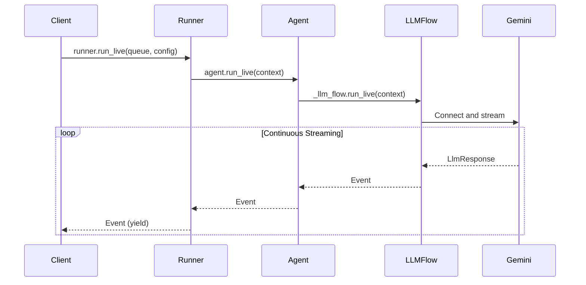

# Part 3: The run_live() Method

The `run_live()` method serves as the primary entry point for streaming conversations in ADK. This method implements an async generator pattern that transforms the complex orchestration of real-time AI communication into a clean, iterator-like interface that feels natural to Python developers.

What makes `run_live()` remarkable is how it handles the inherent complexity of managing multiple concurrent data streams, coordinating with external AI services, maintaining conversation state, and processing interruptions—all while presenting a clean, predictable interface that yields events as the conversation unfolds. It's the difference between wrestling with streaming APIs and simply iterating over conversation events.

## Method Signature and Flow

> 📖 **Source Reference**: [`runners.py`](https://github.com/google/adk-python/blob/main/src/google/adk/runners.py)



## Basic Usage Pattern

```python
async for event in runner.run_live(
    user_id="user_123",
    session_id="session_456",
    live_request_queue=live_request_queue,
    run_config=run_config
):
    # Process streaming events in real-time
    handle_event(event)
```

> 📖 Source Reference (demo files):
> - [src/demo/app/bidi_streaming.py](../src/demo/app/bidi_streaming.py) — session wrapper using `run_live()`
> - [src/demo/app/main.py](../src/demo/app/main.py) — WebSocket/SSE handlers that stream events
> - [src/demo/app/agent/agent.py](../src/demo/app/agent/agent.py) — demo agent factory

## Async Generator Pattern

The `run_live()` method leverages Python's async generator pattern in the following ways:

- **Yields events immediately**: No buffering or batching that would introduce artificial delays. Each event becomes available the moment it's generated, preserving the real-time nature of conversation.

- **Memory efficient**: Maintains constant memory usage regardless of conversation length. Whether you're handling a quick question or a hours-long tutoring session, memory usage remains predictable and bounded.

- **Real-time processing**: Events become available as soon as they're generated, enabling applications to respond immediately to conversation developments without polling or complex callback management.

```python
# The method signature reveals the thoughtful design
async def run_live(
    self,
    *,                                      # Keyword-only arguments
    user_id: Optional[str] = None,          # User identification (required unless session provided)
    session_id: Optional[str] = None,       # Session tracking (required unless session provided)
    live_request_queue: LiveRequestQueue,   # The bidirectional communication channel
    run_config: Optional[RunConfig] = None, # Streaming behavior configuration
) -> AsyncGenerator[Event, None]:           # Generator yielding conversation events
```

As its signature tells, every streaming conversation needs identity (user_id), continuity (session_id), communication (live_request_queue), and configuration (run_config). The return type—an async generator of Events—promises real-time delivery without overwhelming system resources.

Notes:
- A deprecated `session` parameter is also accepted; prefer `user_id` and `session_id`.
- Either `session` or both `user_id` and `session_id` must be provided (at least one pair).
- If `run_config.response_modalities` is not set, ADK defaults it to `['AUDIO']` for live mode to support native audio models.

Common errors and tips:
- Ensure `Content` you send has non-empty `parts`; empty messages raise `ValueError`.
- Use `send_content()` for discrete turns (text, function responses); use `send_realtime()` for continuous data (audio/video, activity signals).
- Avoid mixing function responses with regular text in a single `Content` object.

## Automatic Tool Execution in run_live()

> 📖 **Source Reference**: [`functions.py`](https://github.com/google/adk-python/blob/main/src/google/adk/flows/llm_flows/functions.py)

One of the most powerful features of ADK's `run_live()` is **automatic tool execution**. Unlike the raw Gemini Live API, which requires you to manually handle tool calls and responses, ADK abstracts this complexity entirely.

### The Challenge with Raw Live API

When using the Gemini Live API directly (without ADK), tool use requires manual orchestration:

1. **Receive** function calls from the model
2. **Execute** the tools yourself
3. **Format** function responses correctly
4. **Send** responses back to the model

This creates significant implementation overhead, especially in streaming contexts where you need to handle multiple concurrent tool calls, manage errors, and coordinate with ongoing audio/text streams.

### How ADK Simplifies Tool Use

With ADK, tool execution becomes declarative. Simply define tools on your Agent:

```python
from google.adk.agents import Agent
from google.adk.tools import google_search

agent = Agent(
    name="search_agent",
    model="gemini-2.0-flash-exp",
    tools=[google_search],  # Just declare the tool
)
```

When you call `runner.run_live()`, ADK automatically:

- **Detects** when the model returns function calls in streaming responses
- **Executes** tools in parallel for maximum performance
- **Handles** before/after tool callbacks for custom logic
- **Formats** function responses according to Live API requirements
- **Sends** responses back to the model seamlessly
- **Yields** both function call and response events to your application

### Under the Hood: Automatic Execution Flow

> 📖 **Source Reference**: [`base_llm_flow.py:609-615`](https://github.com/google/adk-python/blob/main/src/google/adk/flows/llm_flows/base_llm_flow.py)

When `run_live()` receives a model response containing function calls, it automatically triggers the tool execution pipeline:

```python
# Inside ADK's streaming pipeline (simplified)
if model_response_event.get_function_calls():
    # Automatically execute all tools in parallel
    function_response_event = await handle_function_calls_live(
        invocation_context,
        model_response_event,
        tools_dict
    )

    # Yield the function response event
    yield function_response_event
```

The `handle_function_calls_live()` function:

1. **Parallel Execution**: Creates async tasks for each tool call, executing them concurrently for minimal latency
2. **Callback Support**: Runs before/after tool callbacks for custom validation or logging
3. **Error Handling**: Captures and formats tool errors as function responses
4. **Streaming Tools**: Handles special streaming tools that use `LiveRequestQueue`
5. **Response Merging**: Combines parallel tool results into a single event

**Error Handling Example:**

When a tool raises an exception, ADK automatically captures it and formats it as a function response with error details:

```python
async for event in runner.run_live(...):
    if event.get_function_responses():
        for resp in event.get_function_responses():
            # Check if the tool execution failed
            if hasattr(resp.response, 'error'):
                print(f"Tool {resp.name} failed: {resp.response.error}")
            else:
                print(f"Tool {resp.name} succeeded: {resp.response}")
```

This automatic error handling means you never need to wrap tool implementations in try/except blocks—ADK handles failures gracefully and communicates them back to the model.

### Tool Execution Events

When tools execute, you'll receive events through the `run_live()` async generator:

```python
async for event in runner.run_live(...):
    # Function call event - model requesting tool execution
    if event.get_function_calls():
        print(f"Model calling: {event.get_function_calls()[0].name}")

    # Function response event - tool execution result
    if event.get_function_responses():
        print(f"Tool result: {event.get_function_responses()[0].response}")
```

You don't need to handle the execution yourself—ADK does it automatically. You just observe the events as they flow through the conversation.

> 💡 **Learn More**: For comprehensive coverage of event types, handling patterns, and the event emission pipeline, see [Part 6: Understanding Events](part6_events.md).

### Long-Running and Streaming Tools

ADK supports advanced tool patterns that integrate seamlessly with `run_live()`:

**Long-Running Tools**: Tools that require human approval or take extended time to complete. Mark them with `is_long_running=True`, and ADK will pause the conversation until the tool completes.

**Streaming Tools**: Tools that accept a `LiveRequestQueue` parameter can send real-time updates back to the model during execution, enabling progressive responses.

> 💡 **How it works**: When you call `runner.run_live()`, ADK inspects your agent's tools to identify streaming tools (those with a `LiveRequestQueue` parameter). For each streaming tool, ADK creates a dedicated queue that the tool can use to send messages back to the model while it's running. This enables tools to provide incremental updates, progress notifications, or partial results during long-running operations.
>
> See the [Tools Guide](https://google.github.io/adk-docs/tools/) for implementation examples.

### Key Takeaway

The difference between raw Live API tool use and ADK is stark:

| Aspect | Raw Live API | ADK `run_live()` |
|--------|--------------|------------------|
| **Tool Declaration** | Manual schema definition | Automatic from Python functions |
| **Tool Execution** | Manual handling in app code | Automatic parallel execution |
| **Response Formatting** | Manual JSON construction | Automatic |
| **Error Handling** | Manual try/catch and formatting | Automatic capture and reporting |
| **Streaming Integration** | Manual coordination | Automatic event yielding |
| **Developer Experience** | Complex, error-prone | Declarative, simple |

This automatic handling is one of the core value propositions of ADK—it transforms the complexity of Live API tool use into a simple, declarative developer experience.

## InvocationContext: The Execution State Container

> 📖 **Source Reference**: [`invocation_context.py`](https://github.com/google/adk-python/blob/main/src/google/adk/agents/invocation_context.py)

While `run_live()` returns an AsyncGenerator for consuming events, internally it creates and manages an `InvocationContext`—the central data container that flows through every layer of ADK's execution stack.

`InvocationContext` is ADK's runtime implementation of the Context concept, providing the execution-time state and services needed during a live conversation. For a broader overview of context in ADK, see [Context in ADK](https://google.github.io/adk-docs/context/).

### What is InvocationContext?

`InvocationContext` is ADK's unified state carrier that encapsulates everything needed for a complete conversation invocation. Think of it as a traveling notebook that accompanies a conversation from start to finish, collecting information, tracking progress, and providing context to every component along the way.

An **invocation** represents a complete interaction cycle:
- Starts with user input (text, audio, or control signal)
- May involve one or multiple agent calls
- Ends when a final response is generated or when explicitly terminated
- Is orchestrated by `runner.run_live()` or `runner.run_async()`

This is distinct from an **agent call** (execution of a single agent's logic) and a **step** (a single LLM call plus any resulting tool executions).

The hierarchy looks like this:

  ```
     ┌─────────────────────── invocation ──────────────────────────┐
     ┌──────────── llm_agent_call_1 ────────────┐ ┌─ agent_call_2 ─┐
     ┌──── step_1 ────────┐ ┌───── step_2 ──────┐
     [call_llm] [call_tool] [call_llm] [transfer]
  ```

> ⚠️ **Important for `run_live()`**: In bidirectional streaming mode, an invocation typically doesn't have a clear "end" unless explicitly terminated. The `run_live()` generator continues yielding events until:
>
> - The client sends a close signal via `LiveRequestQueue.close()`
> - `context.end_invocation` is set to `True` by a tool or callback
> - An unrecoverable error occurs
> - The underlying connection is closed
>
> This differs from `run_async()` where an invocation has a clear start (user message) and end (final response).

#### Lifecycle and Scope

InvocationContext follows a well-defined lifecycle within `run_live()`:

```python
# Inside runner.run_live()
async def run_live(...) -> AsyncGenerator[Event, None]:
    # 1. CREATE: Initialize InvocationContext with all services and configuration
    context = InvocationContext(
        invocation_id=new_invocation_context_id(),
        session=session,
        agent=self.agent,
        live_request_queue=live_request_queue,
        run_config=run_config,
        session_service=self.session_service,
        artifact_service=self.artifact_service,
        # ... other services and state
    )

    # 2. FLOW DOWN: Pass context to agent, which passes to LLM flow, etc.
    async for event in agent.run_live(context):
        # 3. FLOW UP: Events come back through the stack
        yield event

    # 4. CLEANUP: Context goes out of scope, resources released
    #    Session data persists in session_service for future invocations
```

The context flows **down the execution stack** (Runner → Agent → LLMFlow → GeminiLlmConnection), while events flow **up the stack** through the AsyncGenerator. Each layer reads from and writes to the context, creating a bidirectional information flow.

#### What InvocationContext Contains

When you implement custom tools or callbacks, you receive InvocationContext as a parameter. Here's what's available to you:

**Essential Fields for Tool/Callback Developers:**

- **`context.session`**: Access to conversation history (`session.events`), user identity (`session.user_id`), and persistent state across invocations
- **`context.run_config`**: Current streaming configuration (response modalities, transcription settings, cost limits)
- **`context.end_invocation`**: Set this to `True` to immediately terminate the conversation (useful for error handling or policy enforcement)

**Example - Accessing session history:**

```python
def my_tool(context: InvocationContext, query: str):
    # Check if this is the user's first message
    event_count = len(context.session.events)

    if event_count == 0:
        return "Welcome! This is your first message."

    # Access previous events
    recent_events = context.session.events[-5:]  # Last 5 events

    return process_query(query, context=recent_events)
```

### Who Uses InvocationContext?

InvocationContext serves different audiences at different levels:

- **ADK's internal components** (primary users): Runner, Agent, LLMFlow, and GeminiLlmConnection all receive, read from, and write to the InvocationContext as it flows through the stack. This shared context enables seamless coordination without tight coupling.

- **Application developers** (indirect beneficiaries): You don't typically create or manipulate InvocationContext directly in your application code. Instead, you benefit from the clean, simplified APIs that InvocationContext enables behind the scenes—like the elegant `async for event in runner.run_live()` pattern.

- **Tool and callback developers** (direct access): When you implement custom tools or callbacks, you receive InvocationContext as a parameter. This gives you direct access to conversation state, session services, and control flags (like `end_invocation`) to implement sophisticated behaviors.

#### Common Use Cases in Tool Development

```python
# In a custom tool implementation
def my_tool(context: InvocationContext, **kwargs):
    # Access user identity
    user_id = context.session.user_id

    # Access conversation history
    previous_events = context.session.events

    # Terminate conversation if needed
    if should_end:
        context.end_invocation = True

    # Access services for persistence
    if context.artifact_service:
        # Store large files/audio
        artifact_id = context.artifact_service.save(data)

    return result
```

Understanding InvocationContext is essential for grasping how ADK maintains state, coordinates execution, and enables advanced features like multi-agent workflows and resumability. Even if you never touch it directly, knowing what flows through your application helps you design better agents and debug issues more effectively.
