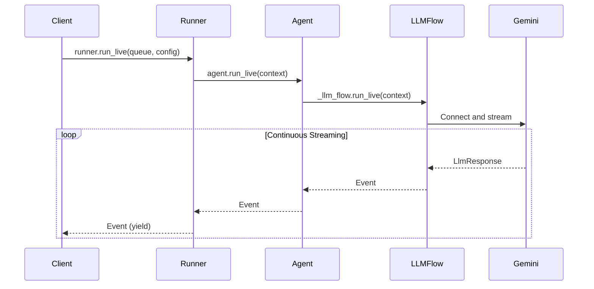

# Part 3: Event handling with run_live()

The `run_live()` method is ADK's primary entry point for streaming conversations, implementing an async generator that yields events as the conversation unfolds. This part focuses on understanding and handling these events—the core communication mechanism that enables real-time interaction between your application, users, and AI models.

You'll learn how to process different event types (text, audio, transcriptions, tool calls), manage conversation flow with interruption and turn completion signals, serialize events for network transport, and leverage ADK's automatic tool execution. Understanding event handling is essential for building responsive streaming applications that feel natural and real-time to users.

!!! note "Async Context Required"

    All code examples in this guide assume you're running in an async context (e.g., within an async function or coroutine). For consistency with ADK's official documentation patterns, examples show the core logic without boilerplate wrapper functions.

    **Running in production**: See [Part 1: FastAPI Application Example](part1_intro.md#fastapi-application-example) for complete examples with proper async context setup.

## How run_live() works

The `run_live()` method leverages Python's async generator pattern in the following ways:

- **Yields events immediately**: No buffering or batching that would introduce artificial delays. Each event becomes available the moment it's generated, preserving the real-time nature of conversation.

- **Memory efficient**: Maintains constant memory usage regardless of conversation length. Whether you're handling a quick question or a hours-long tutoring session, memory usage remains predictable and bounded.

- **Real-time processing**: Events become available as soon as they're generated, enabling applications to respond immediately to conversation developments without polling or complex callback management.

### Method Signature and Flow

> 📖 **Source Reference**: [`runners.py`](https://github.com/google/adk-python/blob/main/src/google/adk/runners.py)

```python
# The method signature reveals the thoughtful design
async def run_live(
    self,
    *,                                      # Keyword-only arguments
    user_id: Optional[str] = None,          # User identification (required unless session provided)
    session_id: Optional[str] = None,       # Session tracking (required unless session provided)
    live_request_queue: LiveRequestQueue,   # The bidirectional communication channel
    run_config: Optional[RunConfig] = None, # Streaming behavior configuration
    session: Optional[Session] = None,      # Deprecated: use user_id and session_id instead
) -> AsyncGenerator[Event, None]:           # Generator yielding conversation events
```

!!! note "Deprecated session parameter"

    The `session` parameter is deprecated. Use `user_id` and `session_id` instead. See [ADK source](https://github.com/google/adk-python/blob/main/src/google/adk/runners.py#L767-L773) for details.

As its signature tells, every streaming conversation needs identity (user_id), continuity (session_id), communication (live_request_queue), and configuration (run_config). The return type—an async generator of Events—promises real-time delivery without overwhelming system resources.



### Basic Usage Pattern

The simplest way to consume events from `run_live()` is to iterate over the async generator with a for-loop:

```python
async for event in runner.run_live(
    user_id="user_123",           # Must match the user_id you set when creating the session
    session_id="session_456",     # Must match the session_id you set when creating the session
    live_request_queue=live_request_queue,
    run_config=run_config
):
    # Process streaming events in real-time
    handle_event(event)
```

> 💡 **Session Identifiers**: Both `user_id` and `session_id` must match the identifiers you used when creating the session via `SessionService.create_session()`. These can be any string values based on your application's needs (e.g., UUIDs, email addresses, custom tokens). See [Part 1: Get or Create Session](part1_intro.md#get-or-create-session) for detailed guidance on session identifiers.

## Understanding Events

Events are the core communication mechanism in ADK's Bidi-streaming system. This section explores the complete lifecycle of events—from how they're generated through multiple pipeline layers, to concurrent processing patterns that enable true real-time interaction, to practical handling of interruptions and turn completion. You'll learn about event types (text, audio, transcriptions, tool calls), serialization strategies for network transport, and the connection lifecycle that manages streaming sessions across both Gemini Live API and Vertex AI Live API platforms.

### The Event Class

ADK's `Event` class is a Pydantic model that represents all communication in a streaming conversation. It extends `LlmResponse` and serves as the unified container for model responses, user input, transcriptions, and control signals.

> 📖 **Source Reference**: [`event.py:30-129`](https://github.com/google/adk-python/blob/main/src/google/adk/events/event.py#L30-L129), [`llm_response.py:28-185`](https://github.com/google/adk-python/blob/main/src/google/adk/models/llm_response.py#L28-L185)

#### Key Fields

**Essential for all applications:**
- `content`: Contains text, audio, or function calls as `Content.parts`
- `author`: Identifies who created the event (`"user"` or agent name)
- `partial`: Distinguishes incremental chunks from complete text
- `turn_complete`: Signals when to enable user input again
- `interrupted`: Indicates when to stop rendering current output

**For voice/audio applications:**
- `input_transcription`: User's spoken words (when enabled in `RunConfig`)
- `output_transcription`: Model's spoken words (when enabled in `RunConfig`)
- `content.parts[].inline_data`: Audio data for playback

**For tool execution:**
- `content.parts[].function_call`: Model's tool invocation requests
- `content.parts[].function_response`: Tool execution results
- `long_running_tool_ids`: Track async tool execution

**For debugging and diagnostics:**
- `usage_metadata`: Token counts and billing information
- `cache_metadata`: Context cache hit/miss statistics
- `error_code` / `error_message`: Failure diagnostics
- `finish_reason`: Why the model stopped generating (e.g., STOP, MAX_TOKENS, SAFETY)

#### Understanding Event Identity

Events have two important ID fields:

- **`event.id`**: Unique identifier for this specific event (format: UUID). Each event gets a new ID, even partial text chunks.
- **`event.invocation_id`**: Shared identifier for all events in the current invocation (format: `"e-" + UUID`). In `run_live()`, all events from a single streaming session share the same invocation_id. (See [InvocationContext](#invocationcontext-the-execution-state-container) for more about invocations)

**Usage:**
```python
# All events in this streaming session will have the same invocation_id
async for event in runner.run_live(...):
    print(f"Event ID: {event.id}")              # Unique per event
    print(f"Invocation ID: {event.invocation_id}")  # Same for all events in session
```

**Use cases:**
- **event.id**: Track individual events in logs, deduplicate events
- **event.invocation_id**: Group events by conversation session, filter session-specific events

### Event Authorship

In live streaming mode, the `Event.author` field follows special semantics to maintain conversation clarity:

**Model responses**: Authored by the **agent name** (e.g., `"my_agent"`), not the literal string `"model"`

- This enables multi-agent scenarios where you need to track which agent generated the response
- Example: `Event(author="customer_service_agent", content=...)`

**User transcriptions**: Authored as `"user"` when the event contains transcribed user audio

**How it works**:
1. Gemini Live API returns user audio transcriptions with `content.role == 'user'`
2. ADK's `get_author_for_event()` function checks for this role marker
3. If `content.role == 'user'`, ADK sets `Event.author` to `"user"`
4. Otherwise, ADK sets `Event.author` to the agent name (e.g., `"my_agent"`)

This transformation ensures that transcribed user input is correctly attributed to the user in your application's conversation history, even though it flows through the model's response stream.

- Example: Input audio transcription → `Event(author="user", input_transcription=..., content.role="user")`

**Why this matters**:

- In multi-agent applications, you can filter events by agent: `events = [e for e in stream if e.author == "my_agent"]`
- When displaying conversation history, use `event.author` to show who said what
- Transcription events are correctly attributed to the user even though they flow through the model

> 📖 **Source Reference**: [`base_llm_flow.py:281-294`](https://github.com/google/adk-python/blob/main/src/google/adk/flows/llm_flows/base_llm_flow.py#L281-L294)

### Connection Lifecycle in run_live()

The `run_live()` method manages the underlying Live API connection lifecycle automatically:

**Connection States:**
1. **Initialization**: Connection established when `run_live()` is called
2. **Active Streaming**: Bidirectional communication via `LiveRequestQueue`
3. **Graceful Closure**: Connection closes when `LiveRequestQueue.close()` is called
4. **Error Recovery**: Session resumption (if enabled) handles transient failures

#### When run_live() Exits

The `run_live()` event loop can exit under various conditions. Understanding these exit scenarios is crucial for proper resource cleanup and error handling:

| Exit Condition | Trigger | Graceful? | Description |
|---|---|---|---|
| **Manual close** | `live_request_queue.close()` | ✅ Yes | User explicitly closes the queue, sending `LiveRequest(close=True)` signal |
| **Agent transfer** | `transfer_to_agent` function response | ✅ Yes | Multi-agent orchestration transfers control to another agent |
| **Task completion** | `task_completed` function response | ✅ Yes | Sequential agent workflow signals completion |
| **Session timeout** | Live API duration limit reached | ⚠️ Connection closed | Session exceeds maximum duration (see limits below) |
| **Early exit** | `end_invocation` flag set | ✅ Yes | Set during preprocessing or by tools/callbacks to terminate early |
| **Empty event** | Queue closure signal | ✅ Yes | Internal signal indicating event stream has ended |
| **Errors** | Connection errors, exceptions | ❌ No | Unhandled exceptions or connection failures |

**Live API session duration limits:**

- **Gemini Live API**:
  - Audio-only: 15 minutes
  - Audio+video: 2 minutes
- **Vertex AI Live API**:
  - Both modes: 10 minutes
- **With Context Window Compression**: Unlimited (automatic reconnection)

> 📖 **Source Reference**: [`base_llm_flow.py:86-207`](https://github.com/google/adk-python/blob/main/src/google/adk/flows/llm_flows/base_llm_flow.py#L86-L207)

**Connection Management Example:**

```python
try:
    async for event in runner.run_live(
        user_id="user_123",           # Must match the user_id you set when creating the session
        session_id="session_456",     # Must match the session_id you set when creating the session
        live_request_queue=queue,
        run_config=RunConfig(
            session_resumption=types.SessionResumptionConfig()  # Enable auto-recovery
        )
    ):
        await handle_event(event)
except Exception as e:
    logger.error(f"Connection error: {e}")
finally:
    queue.close()  # Ensure connection cleanup
```

> 💡 **Learn More**: For session resumption and connection recovery details, see [Part 4: Session Resumption](part4_run_config.md#session-resumption).

### Event types and handling

ADK streams distinct event types through `runner.run_live()` to support different interaction modalities: text responses for traditional chat, audio chunks for voice output, transcriptions for accessibility and logging, and tool call notifications for function execution. Each event includes metadata flags (`partial`, `turn_complete`, `interrupted`) that control UI state transitions and enable natural, human-like conversation flows. Understanding how to recognize and handle these event types is essential for building responsive streaming applications.

### Text Response Events

The most common event type, containing the model's text responses:

```python
async for event in runner.run_live(...):
    if event.content and event.content.parts:
        if event.content.parts[0].text:
            # Display streaming text to user
            text = event.content.parts[0].text

            # Check if this is partial (more text coming) or complete
            if event.partial:
                # Update UI with partial text (e.g., typing indicator)
                update_streaming_display(text)
            else:
                # Final merged text for this segment
                display_complete_message(text)
```

**Understanding `partial` Flag Semantics:**

- `partial=True`: The text in this event is **incremental**—it contains ONLY the new text since the last event
- `partial=False`: The text in this event is **complete**—it contains the full merged text for this response segment

**Example Stream:**

```python
# Scenario 1: Separate events for completion
Event 1: partial=True,  text="Hello",        turn_complete=False
Event 2: partial=True,  text=" world",       turn_complete=False
Event 3: partial=False, text="Hello world",  turn_complete=False
Event 4: partial=False, text="",             turn_complete=True  # Turn done

# Scenario 2: Combined completion (more common for text-only)
Event 1: partial=True,  text="Hello",        turn_complete=False
Event 2: partial=True,  text=" world",       turn_complete=False
Event 3: partial=False, text="Hello world",  turn_complete=True  # Last text + turn done
```

**Important timing relationships**:
- `partial=False` can occur **multiple times** in a turn (e.g., after each sentence)
- `turn_complete=True` occurs **once** at the very end of the model's complete response
- You may receive: `partial=False` (sentence 1) → `partial=False` (sentence 2) → `turn_complete=True`
- For text-only responses, `partial=False` and `turn_complete=True` often arrive in the **same event**

**Important:** When `partial=False`, you receive the complete merged text, which is useful for:
- Final confirmation before storing in database
- Accurate token counting
- Complete text for analytics

**Key Event Flags:**
- `event.partial`: `True` for incremental text chunks during streaming; `False` for complete merged text
- `event.turn_complete`: `True` when the model has finished its complete response
- `event.interrupted`: `True` when user interrupted the model's response

> 💡 **Learn More**: For detailed guidance on using `turn_complete` and `interrupted` flags to manage conversation flow and UI state, see [Handling interruptions and turn completion](#handling-interruptions-and-turn-completion).

!!! warning "Default Response Modality"

    When you call `run_live()` without specifying `response_modalities` in `RunConfig`, ADK defaults to `["AUDIO"]` mode. This means you'll receive audio events instead of text events unless you explicitly configure `response_modalities=["TEXT"]`.

    This default exists because some native audio models require the modality to be set. For text-only applications, explicitly set `response_modalities=["TEXT"]` in your RunConfig.

### Audio Events

When `response_modalities` is configured to `["AUDIO"]` in your `RunConfig`, the model generates audio output instead of text, and you'll receive audio data in the event stream:

```python
# Configure RunConfig for audio responses
run_config = RunConfig(
    response_modalities=["AUDIO"],
    streaming_mode=StreamingMode.BIDI
)

# Audio arrives as inline_data in event.content.parts
async for event in runner.run_live(..., run_config=run_config):
    if event.content and event.content.parts:
        part = event.content.parts[0]
        if part.inline_data:
            # Audio event structure:
            # part.inline_data.data: bytes (raw PCM audio)
            # part.inline_data.mime_type: str (e.g., "audio/pcm")
            audio_data = part.inline_data.data
            mime_type = part.inline_data.mime_type

            print(f"Received {len(audio_data)} bytes of {mime_type}")
            await play_audio(audio_data)
```

> 💡 **Learn More**:
> - **`response_modalities` controls how the model generates output**—you must choose either `["TEXT"]` for text responses or `["AUDIO"]` for audio responses per session. You cannot use both modalities simultaneously. See [Part 4: Response Modalities](part4_run_config.md#response-modalities) for configuration details.
> - For comprehensive coverage of audio formats, sending/receiving audio, and audio processing flow, see [Part 5: How to Use Audio, Image and Video](part5_audio_and_video.md).

### Transcription Events

When transcription is enabled in `RunConfig`, you receive transcriptions as separate events:

```python
async for event in runner.run_live(...):
    # User's spoken words (when input_audio_transcription enabled)
    if event.input_transcription:
        display_user_transcription(event.input_transcription)

    # Model's spoken words (when output_audio_transcription enabled)
    if event.output_transcription:
        display_model_transcription(event.output_transcription)
```

These enable accessibility features and conversation logging without separate transcription services.

> 💡 **Learn More**: For details on enabling transcription in `RunConfig` and understanding transcription delivery, see [Part 5: Audio Transcription](part5_audio_and_video.md#audio-transcription).

### Tool Call Events

When the model requests tool execution:

```python
async for event in runner.run_live(...):
    if event.content and event.content.parts:
        for part in event.content.parts:
            if part.function_call:
                # Model is requesting a tool execution
                tool_name = part.function_call.name
                tool_args = part.function_call.args
                # ADK handles execution automatically
```

ADK processes tool calls automatically—you typically don't need to handle these directly unless implementing custom tool execution logic.

> 💡 **Learn More**: For details on how ADK automatically executes tools, handles function responses, and supports long-running and streaming tools, see [Automatic Tool Execution in run_live()](#automatic-tool-execution-in-run_live).

### Error Events

Production applications need robust error handling to gracefully handle model errors and connection issues. ADK surfaces errors through the `error_code` and `error_message` fields:

```python
import logging

logger = logging.getLogger(__name__)

try:
    async for event in runner.run_live(...):
        # Handle errors from the model or connection
        if event.error_code:
            logger.error(f"Model error: {event.error_code} - {event.error_message}")

            # Send error notification to client
            await websocket.send_json({
                "type": "error",
                "code": event.error_code,
                "message": event.error_message
            })

            # Decide whether to continue or break based on error severity
            if event.error_code in ["SAFETY", "PROHIBITED_CONTENT", "BLOCKLIST"]:
                # Content policy violations - usually cannot retry
                break  # Terminal error - exit loop
            elif event.error_code == "MAX_TOKENS":
                # Token limit reached - may need to adjust configuration
                break
            # For other errors, you might continue or implement retry logic
            continue  # Transient error - keep processing

        # Normal event processing only if no error
        if event.content and event.content.parts:
            # ... handle content
            pass
finally:
    queue.close()  # Always cleanup connection
```

**Error handling implications**:
- **Breaking from the loop** (`break`) exits your event processing but doesn't automatically close the connection. Always use a `finally` block to call `queue.close()` for proper cleanup.
- **Continuing** (`continue`) keeps the stream open and continues processing subsequent events. The model may recover and continue generating responses.
- **Critical errors** (SAFETY, PROHIBITED_CONTENT) typically terminate the model's response, making continuation pointless.
- **Transient errors** (network issues, rate limits) may resolve if you continue listening to the stream.

**Error Code Reference:**

ADK error codes come from the underlying Gemini API. For complete error code listings and descriptions, refer to the official documentation:

> 📖 **Official Documentation**:
>
> - **FinishReason** (when model stops generating tokens): [Google AI for Developers](https://ai.google.dev/api/rest/v1beta/FinishReason) | [Vertex AI](https://cloud.google.com/vertex-ai/generative-ai/docs/model-reference/gemini)
> - **BlockedReason** (when prompts are blocked by content filters): [Google AI for Developers](https://ai.google.dev/api/rest/v1beta/BlockReason) | [Vertex AI Safety Filters](https://cloud.google.com/vertex-ai/generative-ai/docs/model-reference/safety-filters)
> - **ADK Implementation**: [`llm_response.py:160-184`](https://github.com/google/adk-python/blob/main/src/google/adk/models/llm_response.py#L160-L184)

**Best practices for error handling:**

- **Always check for errors first**: Process `error_code` before handling content to avoid processing invalid events
- **Log errors with context**: Include session_id and user_id in error logs for debugging
- **Categorize errors**: Distinguish between retryable errors (transient failures) and terminal errors (content policy violations)
- **Notify users gracefully**: Show user-friendly error messages instead of raw error codes
- **Implement retry logic**: For transient errors, consider automatic retry with exponential backoff
- **Monitor error rates**: Track error types and frequencies to identify systemic issues
- **Handle content policy errors**: For `SAFETY`, `PROHIBITED_CONTENT`, and `BLOCKLIST` errors, inform users that their content violates policies

### Handling interruptions and turn completion

Two critical event flags enable natural, human-like conversation flow in your application: `interrupted` and `turn_complete`. Understanding how to handle these flags is essential for building responsive streaming UIs.

#### Interruption Handling

When users send new input while the model is still generating a response (common in voice conversations), you'll receive an event with `interrupted=True`:

```python
async for event in runner.run_live(...):
    if event.interrupted:
        # User interrupted the model's response
        # Stop displaying partial text, clear typing indicators
        stop_streaming_display()

        # Optionally: show interruption in UI
        show_user_interruption_indicator()
```

**Example - Interruption Scenario:**

```text
Model: "The weather in San Francisco is currently..."
User: [interrupts] "Actually, I meant San Diego"
→ event.interrupted=True received
→ Your app: stop rendering model response, clear UI
→ Model processes new input
Model: "The weather in San Diego is..."
```

**When to use interruption handling:**

- **Voice conversations**: Stop audio playback immediately when user starts speaking
- **Clear UI state**: Remove typing indicators and partial text displays
- **Conversation logging**: Mark which responses were interrupted (incomplete)
- **User feedback**: Show visual indication that interruption was recognized

#### Turn Completion Handling

When the model finishes its complete response, you'll receive an event with `turn_complete=True`:

```python
async for event in runner.run_live(...):
    if event.turn_complete:
        # Model has finished its turn
        # Update UI to show "ready for input" state
        enable_user_input()
        hide_typing_indicator()

        # Mark conversation boundary in logs
        log_turn_boundary()
```

**Event Flag Combinations:**

Understanding how `turn_complete` and `interrupted` combine helps you handle all conversation states:

| Scenario | turn_complete | interrupted | Your App Should |
|----------|---------------|-------------|-----------------|
| Normal completion | True | False | Enable input, show "ready" state |
| User interrupted mid-response | False | True | Stop display, clear partial content |
| Interrupted at end | True | True | Same as normal completion (turn is done) |
| Mid-response (partial text) | False | False | Continue displaying streaming text |

**Implementation:**

```python
async for event in runner.run_live(...):
    # Handle streaming text
    if event.content and event.content.parts and event.content.parts[0].text:
        if event.partial:
            # Show typing indicator, update partial text
            update_streaming_text(event.content.parts[0].text)
        else:
            # Display complete text chunk
            display_text(event.content.parts[0].text)

    # Handle interruption
    if event.interrupted:
        stop_audio_playback()
        clear_streaming_indicators()

    # Handle turn completion
    if event.turn_complete:
        # Model is done - enable user input
        show_input_ready_state()
        enable_microphone()
        # The loop will wait for next user input before continuing
```

**Common Use Cases:**

- **UI state management**: Show/hide "ready for input" indicators, typing animations, microphone states
- **Audio playback control**: Know when to stop rendering audio chunks from the model
- **Conversation logging**: Mark clear boundaries between turns for history/analytics
- **Streaming optimization**: Stop buffering when turn is complete

**Turn completion and caching:** Audio/transcript caches are flushed automatically at specific points during streaming:
- **On turn completion** (`turn_complete=True`): Both user and model audio caches are flushed
- **On interruption** (`interrupted=True`): Model audio cache is flushed
- **On generation completion**: Model audio cache is flushed

## Serializing events to JSON

ADK `Event` objects are Pydantic models, which means they come with powerful serialization capabilities. The `model_dump_json()` method is particularly useful for streaming events over network protocols like WebSockets or Server-Sent Events (SSE).

### Using event.model_dump_json()

The `model_dump_json()` method serializes an `Event` object to a JSON string:

```python
async for event in runner.run_live(...):
    # Serialize event to JSON string
    event_json = event.model_dump_json()

    # Send to WebSocket client
    await websocket.send_text(event_json)

    # Or send via SSE
    yield f"data: {event_json}\n\n"
```

**What gets serialized:**

- All event metadata (author, event_type, timestamp)
- Content (text, audio data, function calls)
- Event flags (partial, turn_complete, interrupted)
- Transcription data (input_transcription, output_transcription)
- Tool execution information

> ⚠️ **Performance Warning**: Binary audio data in `event.content.parts[].inline_data` will be base64-encoded when serialized to JSON, significantly increasing payload size (~133% overhead). For production applications with audio, send binary data separately using WebSocket binary frames or multipart HTTP. See [Performance considerations](#performance-considerations) for details.

### Serialization options

Pydantic's `model_dump_json()` supports several useful parameters:

```python
# Exclude None values for smaller payloads
event_json = event.model_dump_json(exclude_none=True)

# Custom exclusions (e.g., skip large binary audio)
event_json = event.model_dump_json(
    exclude={'content': {'parts': {'__all__': {'inline_data'}}}}
)

# Include only specific fields
event_json = event.model_dump_json(
    include={'content', 'author', 'turn_complete', 'interrupted'}
)

# Pretty-printed JSON (for debugging)
event_json = event.model_dump_json(indent=2)
```

### Selective serialization

When streaming to clients, you often want to customize what gets sent. Here's a common pattern:

```python
async def stream_events_to_client(runner, websocket):
    async for event in runner.run_live(...):
        # Handle audio separately (too large for JSON)
        if event.content and event.content.parts:
            for part in event.content.parts:
                if part.inline_data and part.inline_data.mime_type.startswith("audio/"):
                    # Send binary audio via separate message
                    await websocket.send_bytes(part.inline_data.data)

                    # Send event metadata without audio
                    event_json = event.model_dump_json(
                        exclude={'content': {'parts': {'__all__': {'inline_data'}}}}
                    )
                    await websocket.send_text(event_json)
                    continue

        # For non-audio events, send everything
        event_json = event.model_dump_json(exclude_none=True)
        await websocket.send_text(event_json)
```

### Deserializing on the Client

On the client side (JavaScript/TypeScript), parse the JSON back to objects:

```javascript
websocket.onmessage = (message) => {
    const event = JSON.parse(message.data);

    // Access event properties
    if (event.turn_complete) {
        console.log("Model finished turn");
    }

    if (event.content?.parts?.[0]?.text) {
        displayText(event.content.parts[0].text);
    }

    if (event.interrupted) {
        stopStreamingDisplay();
    }
};
```

### Performance considerations

#### Serialization options impact

The `by_alias=True` parameter used in the demo app affects field naming:

```python
# Without by_alias (default)
event.model_dump_json(exclude_none=True)
# → {"turn_complete": true, "output_transcription": {...}}

# With by_alias=True (used in demo)
event.model_dump_json(exclude_none=True, by_alias=True)
# → {"turnComplete": true, "outputTranscription": {...}}
```

**Why this matters**:
- `by_alias=True` converts Python snake_case to camelCase (defined by `alias_generator=to_camel` in Event's model_config)
- JavaScript clients typically prefer camelCase
- Adds minimal overhead (~1-2% serialization time)
- Must be consistent across your application

**Trade-off**: Readability for JavaScript clients vs. consistency with Python conventions.

#### When to use model_dump_json()

**When to use `model_dump_json()`:**

- ✅ Streaming events over network (WebSocket, SSE)
- ✅ Logging/persistence to JSON files
- ✅ Debugging and inspection
- ✅ Integration with JSON-based APIs

**When NOT to use it:**

- ❌ In-memory processing (use event objects directly)
- ❌ High-frequency events where serialization overhead matters
- ❌ When you only need a few fields (extract them directly instead)

**Optimization tip for binary data:**

Base64-encoded binary audio in JSON significantly increases payload size. For production applications, use a single WebSocket connection with both binary frames (for audio) and text frames (for metadata):

```python
async for event in runner.run_live(...):
    # Check for binary audio
    has_audio = (
        event.content and
        event.content.parts and
        any(p.inline_data for p in event.content.parts)
    )

    if has_audio:
        # Send audio via binary WebSocket frame
        for part in event.content.parts:
            if part.inline_data:
                await websocket.send_bytes(part.inline_data.data)

        # Send metadata only (much smaller)
        metadata_json = event.model_dump_json(
            exclude={'content': {'parts': {'__all__': {'inline_data'}}}}
        )
        await websocket.send_text(metadata_json)
    else:
        # Text-only events can be sent as JSON
        await websocket.send_text(event.model_dump_json(exclude_none=True))
```

This approach reduces bandwidth by ~75% for audio-heavy streams while maintaining full event metadata.

## Automatic Tool Execution in run_live()

> 📖 **Source Reference**: [`functions.py`](https://github.com/google/adk-python/blob/main/src/google/adk/flows/llm_flows/functions.py)

One of the most powerful features of ADK's `run_live()` is **automatic tool execution**. Unlike the raw Gemini Live API, which requires you to manually handle tool calls and responses, ADK abstracts this complexity entirely.

### The Challenge with Raw Live API

When using the Gemini Live API directly (without ADK), tool use requires manual orchestration:

1. **Receive** function calls from the model
2. **Execute** the tools yourself
3. **Format** function responses correctly
4. **Send** responses back to the model

This creates significant implementation overhead, especially in streaming contexts where you need to handle multiple concurrent tool calls, manage errors, and coordinate with ongoing audio/text streams.

### How ADK Simplifies Tool Use

With ADK, tool execution becomes declarative. Simply define tools on your Agent:

```python
from google.adk.agents import Agent
from google.adk.tools import google_search

agent = Agent(
    name="search_agent",
    model="gemini-2.0-flash-exp",
    tools=[google_search],  # Just declare the tool
)
```

When you call `runner.run_live()`, ADK automatically:

- **Detects** when the model returns function calls in streaming responses
- **Executes** tools in parallel for maximum performance
- **Handles** before/after tool callbacks for custom logic
- **Formats** function responses according to Live API requirements
- **Sends** responses back to the model seamlessly
- **Yields** both function call and response events to your application

### Tool Execution Events

When tools execute, you'll receive events through the `run_live()` async generator:

```python
async for event in runner.run_live(...):
    # Function call event - model requesting tool execution
    if event.get_function_calls():
        print(f"Model calling: {event.get_function_calls()[0].name}")

    # Function response event - tool execution result
    if event.get_function_responses():
        print(f"Tool result: {event.get_function_responses()[0].response}")
```

You don't need to handle the execution yourself—ADK does it automatically. You just observe the events as they flow through the conversation.

### Long-Running and Streaming Tools

ADK supports advanced tool patterns that integrate seamlessly with `run_live()`:

**Long-Running Tools**: Tools that require human approval or take extended time to complete. Mark them with `is_long_running=True`, and ADK will pause the conversation until the tool completes.

**Streaming Tools**: Tools that accept a `LiveRequestQueue` parameter can send real-time updates back to the model during execution, enabling progressive responses.

> 💡 **How it works**: When you call `runner.run_live()`, ADK inspects your agent's tools at initialization (lines 789-826 in `runners.py`) to identify streaming tools (those with a `LiveRequestQueue` parameter).
>
> **Queue creation and management**:
> 1. ADK creates an `ActiveStreamingTool` with a dedicated `LiveRequestQueue` for each streaming tool
> 2. These queues are stored in `invocation_context.active_streaming_tools[tool_name]`
> 3. When the tool is called, ADK injects this queue as the `LiveRequestQueue` parameter
> 4. The tool can use this queue to send real-time updates back to the model during execution
> 5. The queues persist for the entire streaming session (stored in InvocationContext)
>
> **Queue distinction**:
> - **Main queue** (`live_request_queue` parameter): Created by your application, used for client-to-model communication
> - **Tool queues** (`active_streaming_tools[tool_name].stream`): Created automatically by ADK, used for tool-to-model communication during execution
>
> Both types of queues are `LiveRequestQueue` instances, but they serve different purposes in the streaming architecture.
>
> This enables tools to provide incremental updates, progress notifications, or partial results during long-running operations.
>
> **Code reference**: See `runners.py:789-826` and `functions.py:633-639` for implementation details.
>
> See the [Tools Guide](https://google.github.io/adk-docs/tools/) for implementation examples.

### Key Takeaway

The difference between raw Live API tool use and ADK is stark:

| Aspect | Raw Live API | ADK `run_live()` |
|--------|--------------|------------------|
| **Tool Declaration** | Manual schema definition | Automatic from Python functions |
| **Tool Execution** | Manual handling in app code | Automatic parallel execution |
| **Response Formatting** | Manual JSON construction | Automatic |
| **Error Handling** | Manual try/catch and formatting | Automatic capture and reporting |
| **Streaming Integration** | Manual coordination | Automatic event yielding |
| **Developer Experience** | Complex, error-prone | Declarative, simple |

This automatic handling is one of the core value propositions of ADK—it transforms the complexity of Live API tool use into a simple, declarative developer experience.

## InvocationContext: The Execution State Container

> 📖 **Source Reference**: [`invocation_context.py`](https://github.com/google/adk-python/blob/main/src/google/adk/agents/invocation_context.py)

While `run_live()` returns an AsyncGenerator for consuming events, internally it creates and manages an `InvocationContext`—ADK's unified state carrier that encapsulates everything needed for a complete conversation invocation. **One InvocationContext corresponds to one `run_live()` loop**—it's created when you call `run_live()` and persists for the entire streaming session.

Think of it as a traveling notebook that accompanies a conversation from start to finish, collecting information, tracking progress, and providing context to every component along the way. It's ADK's runtime implementation of the Context concept, providing the execution-time state and services needed during a live conversation. For a broader overview of context in ADK, see [Context in ADK](https://google.github.io/adk-docs/context/).

### What is an Invocation?

An **invocation** represents a complete interaction cycle:
- Starts with user input (text, audio, or control signal)
- May involve one or multiple agent calls
- Ends when a final response is generated or when explicitly terminated
- Is orchestrated by `runner.run_live()` or `runner.run_async()`

This is distinct from an **agent call** (execution of a single agent's logic) and a **step** (a single LLM call plus any resulting tool executions).

The hierarchy looks like this:

```text
   ┌─────────────────────── invocation ──────────────────────────┐
   ┌──────────── llm_agent_call_1 ────────────┐ ┌─ agent_call_2 ─┐
   ┌──── step_1 ────────┐ ┌───── step_2 ──────┐
   [call_llm] [call_tool] [call_llm] [transfer]
```

> ⚠️ **Important for `run_live()`**: In Bidi-streaming mode, an invocation typically doesn't have a clear "end" unless explicitly terminated.
>
> **Invocation lifecycle**:
> - Each call to `run_live()` creates a new InvocationContext with a unique invocation_id (format: `"e-" + UUID`)
> - This invocation_id is shared by **all events** in the streaming session
> - The InvocationContext persists until the session ends (not per user message)
>
> The `run_live()` generator continues yielding events until:
> - The client sends a close signal via `LiveRequestQueue.close()`
> - `context.end_invocation` is set to `True` by a tool or callback
> - An unrecoverable error occurs
> - The underlying connection is closed

### Who Uses InvocationContext?

InvocationContext serves different audiences at different levels:

- **ADK's internal components** (primary users): Runner, Agent, LLMFlow, and GeminiLlmConnection all receive, read from, and write to the InvocationContext as it flows through the stack. This shared context enables seamless coordination without tight coupling.

- **Application developers** (indirect beneficiaries): You don't typically create or manipulate InvocationContext directly in your application code. Instead, you benefit from the clean, simplified APIs that InvocationContext enables behind the scenes—like the elegant `async for event in runner.run_live()` pattern.

- **Tool and callback developers** (direct access): When you implement custom tools or callbacks, you receive InvocationContext as a parameter. This gives you direct access to conversation state, session services, and control flags (like `end_invocation`) to implement sophisticated behaviors.

#### What InvocationContext Contains

When you implement custom tools or callbacks, you receive InvocationContext as a parameter. Here's what's available to you:

**Essential Fields for Tool/Callback Developers:**

- **`context.invocation_id`**: Current invocation identifier (unique per `run_live()` call)
- **`context.session`**:
  - **`context.session.events`**: All events in the session history (across all invocations)
  - **`context.session.state`**: Persistent key-value store for session data
  - **`context.session.user_id`**: User identity
- **`context.run_config`**: Current streaming configuration (response modalities, transcription settings, cost limits)
- **`context.end_invocation`**: Set this to `True` to immediately terminate the conversation (useful for error handling or policy enforcement)

**Example Use Cases in Tool Development:**

```python
# Example: Comprehensive tool implementation showing common InvocationContext patterns
def my_tool(context: InvocationContext, query: str):
    # Access user identity
    user_id = context.session.user_id

    # Check if this is the user's first message
    event_count = len(context.session.events)
    if event_count == 0:
        return "Welcome! This is your first message."

    # Access conversation history
    recent_events = context.session.events[-5:]  # Last 5 events

    # Access persistent session state
    # Session state persists across invocations (not just this streaming session)
    user_preferences = context.session.state.get('user_preferences', {})

    # Update session state (will be persisted)
    context.session.state['last_query_time'] = datetime.now().isoformat()

    # Access services for persistence
    if context.artifact_service:
        # Store large files/audio
        artifact_id = context.artifact_service.save(data)

    # Process the query with context
    result = process_query(query, context=recent_events, preferences=user_preferences)

    # Terminate conversation if needed (e.g., policy violation, error)
    if should_end:
        context.end_invocation = True

    return result
```

Understanding InvocationContext is essential for grasping how ADK maintains state, coordinates execution, and enables advanced features like multi-agent workflows and resumability. Even if you never touch it directly, knowing what flows through your application helps you design better agents and debug issues more effectively.

## Summary

In this part, you mastered event handling in ADK's Bidi-streaming architecture. We explored the different event types that agents generate—text responses, audio chunks, transcriptions, tool calls, and control signals—and learned how to process each event type effectively. You now understand how to handle interruptions and turn completion signals for natural conversation flow, serialize events for network transport using Pydantic's model serialization, leverage ADK's automatic tool execution to simplify agent workflows, and access InvocationContext for advanced state management scenarios. With these event handling patterns in place, you're equipped to build responsive streaming applications that provide real-time feedback to users. Next, you'll learn how to configure sophisticated streaming behaviors through RunConfig, including multimodal interactions, session resumption, and cost controls.
