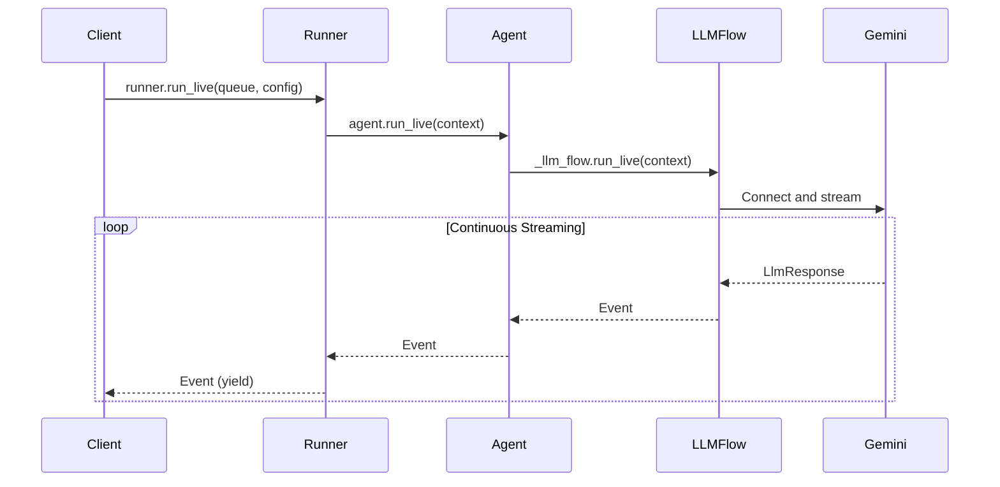

# Part 3: The run_live() Method

The `run_live()` method serves as the primary entry point for streaming conversations in ADK. This method implements an async generator pattern that transforms the complex orchestration of real-time AI communication into a clean, iterator-like interface that feels natural to Python developers.

What makes `run_live()` remarkable is how it handles the inherent complexity of managing multiple concurrent data streams, coordinating with external AI services, maintaining conversation state, and processing interruptions—all while presenting a clean, predictable interface that yields events as the conversation unfolds. It's the difference between wrestling with streaming APIs and simply iterating over conversation events.

## Method Signature and Flow

> 📖 **Source Reference**: [`runners.py`](https://github.com/google/adk-python/blob/main/src/google/adk/runners.py)



## Basic Usage Pattern

```python
async for event in runner.run_live(
    user_id="user_123",
    session_id="session_456",
    live_request_queue=live_request_queue,
    run_config=run_config
):
    # Process streaming events in real-time
    handle_event(event)
```

> 📖 Source Reference (demo files):
> - [src/demo/app/bidi_streaming.py](../src/demo/app/bidi_streaming.py) — session wrapper using `run_live()`
> - [src/demo/app/main.py](../src/demo/app/main.py) — WebSocket/SSE handlers that stream events
> - [src/demo/app/agent/agent.py](../src/demo/app/agent/agent.py) — demo agent factory

## Async Generator Pattern

The `run_live()` method leverages Python's async generator pattern in ways:

- **Yields events immediately**: No buffering or batching that would introduce artificial delays. Each event becomes available the moment it's generated, preserving the real-time nature of conversation.

- **Memory efficient**: Maintains constant memory usage regardless of conversation length. Whether you're handling a quick question or a hours-long tutoring session, memory usage remains predictable and bounded.

- **Real-time processing**: Events become available as soon as they're generated, enabling applications to respond immediately to conversation developments without polling or complex callback management.

```python
# The method signature reveals the thoughtful design
async def run_live(
    self,
    user_id: str,                         # User identification for session management
    session_id: str,                      # Session tracking across interactions
    live_request_queue: LiveRequestQueue, # The bidirectional communication channel
    run_config: Optional[RunConfig] = None, # Streaming behavior configuration
) -> AsyncGenerator[Event, None]:         # Generator yielding conversation events
```

As its signature tells, every streaming conversation needs identity (user_id), continuity (session_id), communication (live_request_queue), and configuration (run_config). The return type—an async generator of Events—promises real-time delivery without overwhelming system resources.

Notes:
- A deprecated `session` parameter is also accepted; prefer `user_id` and `session_id`.
- If `run_config.response_modalities` is not set, ADK defaults it to `['AUDIO']` for live mode to support native audio models.

Common errors and tips:
- Ensure `Content` you send has non-empty `parts`; empty messages raise `ValueError`.
- Use `send_content()` for discrete turns (text, function responses); use `send_realtime()` for continuous data (audio/video, activity signals).
- Avoid mixing function responses with regular text in a single `Content` object.

## InvocationContext: The Execution State Container

> 📖 **Source Reference**: [`invocation_context.py`](https://github.com/google/adk-python/blob/main/src/google/adk/agents/invocation_context.py)

While `run_live()` returns an AsyncGenerator for consuming events, internally it creates and manages an `InvocationContext`—the central data container that flows through every layer of ADK's execution stack.

`InvocationContext` is ADK's runtime implementation of the Context concept, providing the execution-time state and services needed during a live conversation. For a broader overview of context in ADK, see [Context in ADK](https://google.github.io/adk-docs/context/).

### What is InvocationContext?

`InvocationContext` is ADK's unified state carrier that encapsulates everything needed for a complete conversation invocation. Think of it as a traveling notebook that accompanies a conversation from start to finish, collecting information, tracking progress, and providing context to every component along the way.

An **invocation** represents a complete interaction cycle:
- Starts with user input (text, audio, or control signal)
- May involve one or multiple agent calls
- Ends when a final response is generated or when explicitly terminated
- Is orchestrated by `runner.run_live()` or `runner.run_async()`

This is distinct from an **agent call** (execution of a single agent's logic) and a **step** (a single LLM call plus any resulting tool executions).

The hierarchy looks like this:

  ```
     ┌─────────────────────── invocation ──────────────────────────┐
     ┌──────────── llm_agent_call_1 ────────────┐ ┌─ agent_call_2 ─┐
     ┌──── step_1 ────────┐ ┌───── step_2 ──────┐
     [call_llm] [call_tool] [call_llm] [transfer]
  ```

#### Lifecycle and Scope

InvocationContext follows a well-defined lifecycle within `run_live()`:

```python
# Inside runner.run_live()
async def run_live(...) -> AsyncGenerator[Event, None]:
    # 1. CREATE: Initialize InvocationContext with all services and configuration
    context = InvocationContext(
        invocation_id=new_invocation_context_id(),
        session=session,
        agent=self.agent,
        live_request_queue=live_request_queue,
        run_config=run_config,
        session_service=self.session_service,
        artifact_service=self.artifact_service,
        # ... other services and state
    )

    # 2. FLOW DOWN: Pass context to agent, which passes to LLM flow, etc.
    async for event in agent.run_live(context):
        # 3. FLOW UP: Events come back through the stack
        yield event

    # 4. CLEANUP: Context goes out of scope, resources released
```

The context flows **down the execution stack** (Runner → Agent → LLMFlow → GeminiLlmConnection), while events flow **up the stack** through the AsyncGenerator. Each layer reads from and writes to the context, creating a bidirectional information flow.

#### What InvocationContext Contains

When you implement custom tools or callbacks, you receive InvocationContext as a parameter. Here's what's available to you:

**Essential Fields for Tool/Callback Developers:**

- **`context.session`**: Access to conversation history (`session.events`), user identity (`session.user_id`), and persistent state across invocations
- **`context.run_config`**: Current streaming configuration (response modalities, transcription settings, cost limits)
- **`context.end_invocation`**: Set this to `True` to immediately terminate the conversation (useful for error handling or policy enforcement)

### Who Uses InvocationContext?

InvocationContext serves different audiences at different levels:

- **ADK's internal components** (primary users): Runner, Agent, LLMFlow, and GeminiLlmConnection all receive, read from, and write to the InvocationContext as it flows through the stack. This shared context enables seamless coordination without tight coupling.

- **Application developers** (indirect beneficiaries): You don't typically create or manipulate InvocationContext directly in your application code. Instead, you benefit from the clean, simplified APIs that InvocationContext enables behind the scenes—like the elegant `async for event in runner.run_live()` pattern.

- **Tool and callback developers** (direct access): When you implement custom tools or callbacks, you receive InvocationContext as a parameter. This gives you direct access to conversation state, session services, and control flags (like `end_invocation`) to implement sophisticated behaviors.

#### Common Use Cases in Tool

```python
# In a custom tool implementation
def my_tool(context: InvocationContext, **kwargs):
    # Access user identity
    user_id = context.session.user_id

    # Access conversation history
    previous_events = context.session.events

    # Terminate conversation if needed
    if should_end:
        context.end_invocation = True

    # Access services for persistence
    if context.artifact_service:
        # Store large files/audio
        artifact_id = context.artifact_service.save(data)

    return result
```

Understanding InvocationContext is essential for grasping how ADK maintains state, coordinates execution, and enables advanced features like multi-agent workflows and resumability. Even if you never touch it directly, knowing what flows through your application helps you design better agents and debug issues more effectively.
