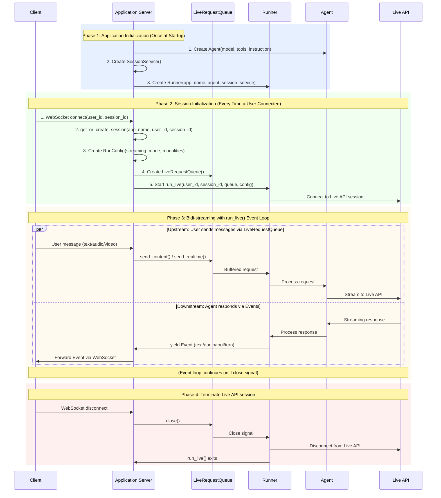

# Part 4: Understanding RunConfig

> 📖 **Source Reference**: [`run_config.py`](https://github.com/google/adk-python/blob/main/src/google/adk/agents/run_config.py)

RunConfig is how you configure the behavior of `run_live()` sessions. It unlocks sophisticated capabilities like multimodal interactions, intelligent proactivity, session resumption, and cost controls—all configured declaratively without complex implementation.

> 💡 **Learn More**: For detailed information about audio/video related `RunConfig` configurations, see [Part 5: Audio and Video in Live API](part5_audio_and_video.md).

## Response Modalities

Response modalities control how the model generates output—as text or audio. Both Gemini Live API and Vertex AI Live API have the same restriction: only one response modality per session.

### Configuration

```python
# Default behavior (implicitly AUDIO)
run_config = RunConfig(
    streaming_mode=StreamingMode.BIDI
)
# Equivalent to:
# run_config = RunConfig(
#     response_modalities=["AUDIO"],  # ← Automatically set by ADK
#     streaming_mode=StreamingMode.BIDI
# )

# ✅ Valid: Text-only responses
run_config = RunConfig(
    response_modalities=["TEXT"],
    streaming_mode=StreamingMode.BIDI
)

# ✅ Valid: Audio-only responses (explicit)
run_config = RunConfig(
    response_modalities=["AUDIO"],
    streaming_mode=StreamingMode.BIDI
)

# ❌ Invalid: Both modalities - results in API error
run_config = RunConfig(
    response_modalities=["TEXT", "AUDIO"],  # ERROR
    streaming_mode=StreamingMode.BIDI
)
# This will cause an error from the Live API:
# "Only one response modality is supported per session"
```

**Key constraints:**

- You must choose either `TEXT` or `AUDIO` at session start. **Cannot switch between modalities mid-session**
- You must choose `AUDIO` for [Native Audio models](part5_audio_and_video.md#understanding-audio-architectures). If you want to receive both audio and text responses from native audio models, use the Audio Transcript feature which provides text transcripts of the audio output. See [Audio Transcription](part5_audio_and_video.md#audio-transcription) for details
- Response modality only affects model output—**you can always send text, voice, or video input** regardless of the chosen response modality

## StreamingMode: BIDI or SSE

ADK supports two distinct streaming modes that control whether ADK uses Bidi-streaming with Live API, or the legacy Gemini API:

- `StreamingMode.BIDI`: ADK uses WebSocket to connect to Gemini Live API
- `StreamingMode.SSE`: ADK uses HTTP streaming to connect to Gemini API

**Important:** These modes refer to the **ADK-to-Gemini API communication protocol**, not your application's client-facing architecture. You can build WebSocket servers, REST APIs, SSE endpoints, or any other architecture for your clients with either mode.

This guide focuses on `StreamingMode.BIDI`, which is required for real-time audio/video interactions and Live API features. However, it's worth understanding the differences between BIDI and SSE modes to choose the right approach for your use case.

```python
from google.adk.agents.run_config import RunConfig, StreamingMode

# BIDI streaming for real-time audio/video
run_config = RunConfig(
    streaming_mode=StreamingMode.BIDI,
    response_modalities=["AUDIO"]  # Supports audio/video modalities
)

# SSE streaming for text-based interactions
run_config = RunConfig(
    streaming_mode=StreamingMode.SSE,
    response_modalities=["TEXT"]  # Text-only modality
)
```

### Protocol and Implementation Differences

The two streaming modes differ fundamentally in their communication patterns and capabilities. BIDI mode enables true bidirectional communication where you can send new input while receiving model responses, while SSE mode follows a traditional request-then-response pattern where you send a complete request and stream back the response.

**StreamingMode.BIDI - Bidirectional WebSocket Communication:**

BIDI mode establishes a persistent WebSocket connection that allows simultaneous sending and receiving. This enables real-time features like interruptions, live audio streaming, and immediate turn-taking:


**StreamingMode.SSE - Unidirectional HTTP Streaming:**

SSE (Server-Sent Events) mode uses HTTP streaming where you send a complete request upfront, then receive the response as a stream of chunks. This is a simpler, more traditional pattern suitable for text-based chat applications:

```mermaid
sequenceDiagram
    participant App as Your Application
    participant ADK as ADK
    participant Gemini as Gemini API

    Note over ADK,Gemini: Protocol: HTTP

    App->>ADK: runner.run(run_config)
    ADK->>Gemini: generate_content_stream() - HTTP
    activate Gemini

    Note over ADK,Gemini: Request sent completely, then stream response

    Gemini-->>ADK: ← Partial chunk (partial=True)
    ADK-->>App: ← Event: partial text
    Gemini-->>ADK: ← Partial chunk (partial=True)
    ADK-->>App: ← Event: partial text
    Gemini-->>ADK: ← Partial chunk (partial=True)
    ADK-->>App: ← Event: partial text

    Gemini-->>ADK: ← Final chunk (finish_reason=STOP)
    ADK-->>App: ← Event: complete response

    deactivate Gemini

    Note over ADK,Gemini: Turn Detection: finish_reason
```



### When to Use Each Mode

Your choice between BIDI and SSE depends on your application requirements and the interaction patterns you need to support. Here's a practical guide to help you choose:

**Use BIDI when:**

- Building voice/video applications with real-time interaction
- Need bidirectional communication (send while receiving)
- Require Live API features (audio transcription, VAD, proactivity, affective dialog)
- Supporting interruptions and natural turn-taking (see [Part 3: Handling Interruptions](part3_run_live.md#handling-interruptions-and-turn-completion))
- Implementing live streaming tools or real-time data feeds

**Use SSE when:**

- Building text-based chat applications
- Standard request/response interaction pattern
- Using models without Live API support (e.g., Gemini 1.5 Pro, Gemini 1.5 Flash)
- Simpler deployment without WebSocket requirements
- Need larger context windows (Gemini 1.5 supports up to 2M tokens)

> **Note**: SSE mode uses the standard Gemini API (`generate_content_async`) via HTTP streaming, while BIDI mode uses the Live API (`live.connect()`) via WebSocket. Gemini 1.5 models (Pro, Flash) don't support the Live API protocol and therefore must be used with SSE mode. Gemini 2.0/2.5 Live models support both protocols but are typically used with BIDI mode to access real-time audio/video features.

### Standard Gemini Models (1.5 series) accessed via SSE

While this guide focuses on Bidi-streaming with Gemini 2.0 Live models, ADK also supports the Gemini 1.5 model family through SSE streaming. These models offer different trade-offs—larger context windows and proven stability, but without real-time audio/video features. Here's what the 1.5 series supports when accessed via SSE:

**Models:**

- `gemini-1.5-pro`
- `gemini-1.5-flash`

**Supported:**

- ✅ Text input/output (`response_modalities=["TEXT"]`)
- ✅ SSE streaming (`StreamingMode.SSE`)
- ✅ Function calling with automatic execution
- ✅ Large context windows (up to 2M tokens for 1.5-pro)

**Not Supported:**

- ❌ Live audio features (audio I/O, transcription, VAD)
- ❌ Bidi-streaming via `run_live()`
- ❌ Proactivity and affective dialog
- ❌ Video input

## Understanding Live API Connections and Sessions

When building ADK Bidi-streaming applications, it's essential to understand how ADK manages the communication layer between itself and the  Live API backend. This section explores the fundamental distinction between **connections** (the WebSocket transport links that ADK establishes to Live API) and **sessions** (the logical conversation contexts maintained by Live API). Unlike traditional request-response APIs, the Bidi-streaming architecture introduces unique constraints: connection timeouts, session duration limits that vary by modality (audio-only vs audio+video), finite context windows, and concurrent session quotas that differ between Gemini Live API and Vertex AI Live API.

### ADK `Session` vs Live API session

Understanding the distinction between **ADK `Session`** and **Live API session** is crucial for building reliable streaming applications with ADK Bidi-streaming.

**ADK `Session`** (managed by SessionService):
- Persistent conversation storage created via `SessionService.create_session()`
- Stores conversation history, events, and state across multiple `run_live()` calls
- Storage backend: in-memory, database (PostgreSQL/MySQL/SQLite), or Vertex AI
- Required before calling `run_live()`—missing sessions raise `ValueError: Session not found`
- Survives application restarts (with persistent SessionService implementations)
- Lifespan: indefinite (until explicitly deleted)

**Live API session** (managed by Live API backend):
- Transient conversation context created during `run_live()` and destroyed when streaming ends
- Maintained by the Live API during active streaming
- Subject to platform duration limits (15 min audio-only, 2 min audio+video on Gemini Live API; 10 min on Vertex AI)
- Can be resumed across multiple connections using session resumption handles (see [ADK's Automatic Reconnection with Session Resumption](#adks-automatic-reconnection-with-session-resumption) below)
- Lifespan: single `run_live()` call (unless resumed)

**How they work together:**

1. **When you call `run_live(user_id, session_id, ...)`**, ADK:
   - Retrieves the ADK `Session` from SessionService
   - **Initializes the Live API session** with conversation history from `session.events`
   - Streams events bidirectionally with the Live API backend
   - **Updates the ADK `Session`** with new events as they occur
2. **When `run_live()` ends**, the Live API session terminates, **but the ADK `Session` persists**
3. **Calling `run_live()` again** with the same identifiers **resumes the conversation**—ADK loads the history from the ADK `Session` and creates a new Live API session with that context

**Key insight:** ADK `Session` objects provide persistent, long-term conversation storage, while Live API sessions are ephemeral streaming contexts. This separation enables production applications to maintain conversation continuity across network interruptions, application restarts, and multiple streaming sessions.



Now that we understand the difference between ADK `Session` objects and Live API sessions, let's focus on Live API connections and sessions—the backend infrastructure that powers real-time bidirectional streaming.

### Live API Connections and Sessions

Understanding the distinction between **connections** and **sessions** at the Live API level is crucial for building reliable ADK Bidi-streaming applications.

**Connection**: The physical WebSocket link between ADK and the Live API server. This is the network transport layer that carries bidirectional streaming data.

**Session**: The logical conversation context maintained by the Live API, including conversation history, tool call state, and model context. A session can span multiple connections.

| Aspect | Connection | Session |
|--------|-----------|---------|
| **What is it?** | WebSocket network connection | Logical conversation context |
| **Scope** | Transport layer | Application layer |
| **Can span?** | Single network link | Multiple connections via resumption |
| **Failure impact** | Network error or timeout | Lost conversation history |

#### Why This Matters for ADK Developers

With ADK's automatic session resumption (see below), you typically don't need to manage connections directly. However, understanding this distinction helps you:

- **Interpret session duration limits**: These apply to the logical session, not individual connections
- **Understand reconnection behavior**: ADK may cycle through multiple connections (each ~10 minutes) while maintaining a single session
- **Debug timeout issues**: Connection timeouts (~10 min) are handled automatically by session resumption; **session duration limits** (15 min for audio-only, 2 min for audio+video on Gemini Live API without context window compression; 10 min for all sessions on Vertex AI Live API without compression) require application-level planning (see [Best Practices for Session Management](#best-practices-for-session-management) below)

#### Live API Connection and Session Limits by Platform

Understanding the constraints of each platform is critical for production planning. Gemini Live API and Vertex AI Live API have different limits that affect how long conversations can run and how many users can connect simultaneously. The most important distinction is between **connection duration** (how long a single WebSocket connection stays open) and **session duration** (how long a logical conversation can continue).

| Constraint Type | Gemini Live API<br>(Google AI Studio) | Vertex AI Live API<br>(Google Cloud) | Notes |
|----------------|---------------------------------------|--------------------------------------|-------|
| **Connection duration** | ~10 minutes | Not documented separately | Each Gemini WebSocket connection auto-terminates; ADK reconnects transparently with session resumption |
| **Session Duration (Audio-only)** | 15 minutes | 10 minutes | Maximum session duration without context window compression. Both platforms: unlimited with context window compression enabled |
| **Session Duration (Audio + video)** | 2 minutes | 10 minutes | Gemini has shorter limit for video; Vertex treats all sessions equally. Both platforms: unlimited with context window compression enabled |
| **Concurrent sessions** | 50 (Tier 1)<br>1,000 (Tier 2+) | Up to 1,000 | Gemini limits vary by API tier; Vertex limit is per Google Cloud project |

> 📖 **Sources**: [Gemini Live API Capabilities Guide](https://ai.google.dev/gemini-api/docs/live-guide) | [Gemini API Quotas](https://ai.google.dev/gemini-api/docs/quota) | [Vertex AI Streamed Conversations](https://cloud.google.com/vertex-ai/generative-ai/docs/live-api/streamed-conversations)

## Live API session resumption

By default, the Live API limits connection duration to approximately 10 minutes—each WebSocket connection automatically closes after this duration. To overcome this limit and enable longer conversations, the **Live API provides [Session Resumption](https://ai.google.dev/gemini-api/docs/live#session-resumption)**, a feature that transparently migrates a session across multiple connections. When enabled, the Live API generates resumption handles that allow reconnecting to the same session context, preserving the full conversation history and state.

**ADK automates this entirely**: When you enable session resumption in RunConfig, ADK automatically handles all reconnection logic—detecting connection closures, caching resumption handles, and reconnecting seamlessly in the background. You don't need to write any reconnection code. Sessions continue seamlessly beyond the 10-minute connection limit, handling connection timeouts, network disruptions, and planned reconnections automatically.

**Configuration:**

```python
from google.genai import types

run_config = RunConfig(
    session_resumption=types.SessionResumptionConfig(transparent=True)
)
```

#### How ADK Manages Session Resumption

While session resumption is a Gemini Live API feature, using it directly requires managing resumption handles, detecting connection closures, and implementing reconnection logic. ADK takes full responsibility for this complexity, automatically utilizing session resumption behind the scenes so developers don't need to write any reconnection code. You simply enable it in RunConfig, and ADK handles everything transparently.

**ADK's automatic management:**

1. **Initial Connection**: ADK establishes a WebSocket connection to Live API
2. **Handle Updates**: Live API periodically sends updated session resumption handles, which ADK caches in InvocationContext
3. **Graceful Connection Close**: When the ~10 minute connection limit is reached, the WebSocket closes gracefully (no exception)
4. **Automatic Reconnection**: ADK's internal loop detects the close and automatically reconnects using the cached handle
5. **Session Continuation**: The same session continues seamlessly with full context preserved

> **Implementation Detail**: ADK stores the session resumption handle in `InvocationContext.live_session_resumption_handle`. When the Live API sends a `session_resumption_update` message with a new handle, ADK automatically caches it. During reconnection, ADK retrieves this handle from the InvocationContext and includes it in the new `LiveConnectConfig` for the `live.connect()` call. This is handled entirely by ADK's internal reconnection loop—developers never need to access or manage these handles directly.

#### Sequence Diagram: Automatic Reconnection

```mermaid
sequenceDiagram
    participant App as Your Application
    participant ADK as ADK (run_live)
    participant WS as WebSocket Connection
    participant API as Gemini Live API
    participant Session as Live Session Context

    Note over App,Session: Initial Connection (with session resumption enabled)

    App->>ADK: runner.run_live(run_config=RunConfig(session_resumption=...))
    ADK->>API: WebSocket connect()
    activate WS
    API->>Session: Create new session
    activate Session

    Note over ADK,API: Bidirectional Streaming (0-10 minutes)

    App->>ADK: send_content(text) / send_realtime(audio)
    ADK->>API: → Content via WebSocket
    API->>Session: Update conversation history
    API-->>ADK: ← Streaming response
    ADK-->>App: ← yield event

    Note over API,Session: Live API sends resumption handle updates
    API-->>ADK: session_resumption_update { new_handle: "abc123" }
    ADK->>ADK: Cache handle in InvocationContext

    Note over WS,API: ~10 minutes elapsed - Connection timeout

    API->>WS: Close WebSocket (graceful close)
    deactivate WS
    Note over Session: Session context preserved

    Note over ADK: Graceful close detected - No exception raised
    ADK->>ADK: while True loop continues

    Note over ADK,API: Automatic Reconnection

    ADK->>API: WebSocket connect(session_resumption.handle="abc123")
    activate WS
    API->>Session: Attach to existing session
    API-->>ADK: Session resumed with full context

    Note over ADK,API: Bidirectional Streaming Continues

    App->>ADK: send_content(text) / send_realtime(audio)
    ADK->>API: → Content via WebSocket
    API->>Session: Update conversation history
    API-->>ADK: ← Streaming response
    ADK-->>App: ← yield event

    Note over App,Session: Session continues until duration limit or explicit close

    deactivate WS
    deactivate Session
```



## Live API Context Window Compression

**Problem:** Live API sessions face two critical constraints that limit conversation duration. First, **session duration limits** impose hard time caps: without compression, Gemini Live API limits audio-only sessions to 15 minutes and audio+video sessions to just 2 minutes, while Vertex AI limits all sessions to 10 minutes. Second, **context window limits** restrict conversation length: models have finite token capacities (128k tokens for `gemini-2.5-flash-native-audio-preview-09-2025`, 32k-128k for Vertex AI models). Long conversations—especially extended customer support sessions, tutoring interactions, or multi-hour voice dialogues—will hit either the time limit or the token limit, causing the session to terminate or lose critical conversation history.

**Solution:** [Context window compression](https://ai.google.dev/gemini-api/docs/live-session#context-window-compression) solves both constraints simultaneously. It uses a sliding-window approach to automatically compress or summarize earlier conversation history when the token count reaches a configured threshold. The Live API preserves recent context in full detail while compressing older portions. **Critically, enabling context window compression extends session duration to unlimited time**, removing the session duration limits (15 minutes for audio-only / 2 minutes for audio+video on Gemini Live API; 10 minutes for all sessions on Vertex AI) while also preventing token limit exhaustion. However, there is a trade-off: as the feature summarizes earlier conversation history rather than retaining it all, the detail of past context will be gradually lost over time. The model will have access to compressed summaries of older exchanges, not the full verbatim history.

ADK provides an easy way to configure context window compression through RunConfig. However, developers are responsible for appropriately configuring the compression parameters (`trigger_tokens` and `target_tokens`) based on their specific requirements—model context window size, expected conversation patterns, and quality needs:

```python
from google.genai import types
from google.adk.agents.run_config import RunConfig

# For gemini-2.5-flash-native-audio-preview-09-2025 (128k context window)
run_config = RunConfig(
    context_window_compression=types.ContextWindowCompressionConfig(
        trigger_tokens=100000,  # Start compression at ~78% of 128k context
        sliding_window=types.SlidingWindow(
            target_tokens=80000  # Compress to ~62% of context, preserving recent turns
        )
    )
)

# For gemini-live-2.5-flash (32k context window on Vertex AI)
run_config = RunConfig(
    context_window_compression=types.ContextWindowCompressionConfig(
        trigger_tokens=25000,  # Start compression at ~78% of 32k context
        sliding_window=types.SlidingWindow(
            target_tokens=20000  # Compress to ~62% of context
        )
    )
)
```

**Choosing appropriate thresholds:**

- Set `trigger_tokens` to 70-80% of your model's context window to allow headroom
- Set `target_tokens` to 60-70% to provide sufficient compression
- Test with your actual conversation patterns to optimize these values

**How it works:**

When context window compression is enabled:

1. The Live API monitors the total token count of the conversation context
2. When the context reaches the `trigger_tokens` threshold, compression activates
3. Earlier conversation history is compressed or summarized using a sliding window approach
4. Recent context (last `target_tokens` worth) is preserved in full detail
5. **Two critical effects occur simultaneously:**
   - Session duration limits are removed (no more 15-minute/2-minute caps on Gemini Live API or 10-minute caps on Vertex AI)
   - Token limits are managed (sessions can continue indefinitely regardless of conversation length)

#### When NOT to Use Context Window Compression

While compression enables unlimited session duration, consider these trade-offs:

- **Short sessions**: For sessions expected to stay under duration limits (15 min audio-only, 2 min audio+video), compression adds unnecessary overhead
- **Quality-critical applications**: Compression summarizes older context, which may reduce response quality for applications requiring precise recall of earlier conversation details
- **Development/testing**: Disable compression during development to see full conversation history without summarization

**Best practice**: Enable compression only when you need sessions longer than platform duration limits OR when conversations may exceed context window token limits.

## Best Practices for Live API Connection and Session Management

### Essential: Enable Session Resumption

- ✅ **Always enable session resumption** in RunConfig for production applications
- ✅ This enables ADK to automatically handle Gemini's ~10 minute connection timeouts transparently
- ✅ Sessions continue seamlessly across multiple WebSocket connections without user interruption
- ✅ Session resumption handle caching and management

```python
from google.genai import types

run_config = RunConfig(
    response_modalities=["AUDIO"],
    session_resumption=types.SessionResumptionConfig(transparent=True)
)
```

### Recommended: Enable Context Window Compression for Unlimited Sessions

- ✅ **Enable context window compression** if you need sessions longer than 15 minutes (audio-only) or 2 minutes (audio+video)
- ✅ Once enabled, session duration becomes unlimited—no need to monitor time-based limits
- ✅ Configure `trigger_tokens` and `target_tokens` based on your model's context window
- ✅ Test compression settings with realistic conversation patterns
- ⚠️ **Use judiciously**: Compression adds latency during summarization and may lose conversational nuance—only enable when extended sessions are truly necessary for your use case

```python
from google.genai import types
from google.adk.agents.run_config import RunConfig

run_config = RunConfig(
    response_modalities=["AUDIO"],
    session_resumption=types.SessionResumptionConfig(transparent=True),
    context_window_compression=types.ContextWindowCompressionConfig(
        trigger_tokens=100000,
        sliding_window=types.SlidingWindow(target_tokens=80000)
    )
)
```

### Optional: Monitor Session Duration

**Only applies if NOT using context window compression:**

- ✅ Focus on **session duration limits**, not connection timeouts (ADK handles those automatically)
- ✅ **Gemini Live API**: Monitor for 15-minute limit (audio-only) or 2-minute limit (audio+video)
- ✅ **Vertex AI Live API**: Monitor for 10-minute session limit
- ✅ Warn users 1-2 minutes before session duration limits
- ✅ Implement graceful session transitions for conversations exceeding session limits

### Recommended: Error Handling for Communication Issues

With session resumption enabled, ADK handles connection issues automatically through **transparent reconnection**. You need to handle only two error categories:

1. **`LlmCallsLimitExceededError`** (Required): Cost control limit reached
2. **Generic exceptions** (Recommended): For logging unexpected errors in production

**Import and Usage:**

```python
from google.adk.agents.invocation_context import LlmCallsLimitExceededError

try:
    async for event in runner.run_live(
        user_id=user_id,
        session_id=session_id,
        live_request_queue=live_request_queue,
        run_config=run_config
    ):
        # Process events
        yield event
except LlmCallsLimitExceededError as e:
    logger.error(f"Max LLM calls exceeded for session {session_id}: {e}")
    # Investigate for infinite loops in agent logic
    raise
except Exception as e:
    logger.error(f"Unexpected error in run_live session {session_id}: {e}")
    # Log for production monitoring
    raise
```

**Error handling strategy:**

| Error Type | When to Handle | Recommended Action |
|------------|----------------|-------------------|
| `LlmCallsLimitExceededError` | Always catch explicitly | Log and investigate for infinite agent loops |
| `Exception` (catch-all) | For logging/debugging | Log unexpected errors; useful for production monitoring |

**Key insights:**

1. **Session resumption provides transparent reconnection** - ADK internally manages reconnection when connections are interrupted. No application-level retry logic is needed.

2. **Minimal error handling needed** - The official ADK samples use a simple pattern: handle `LlmCallsLimitExceededError` explicitly, and optionally add a catch-all `Exception` for logging unexpected errors.

3. **`LlmCallsLimitExceededError` is your cost safety net** - This is the primary error to handle explicitly. It prevents runaway costs from infinite agent loops.

## Concurrent Live API sessions and quota management

**Problem:** Production voice applications typically serve multiple users simultaneously, each requiring their own Live API session. However, both Gemini Live API and Vertex AI Live API impose strict concurrent session limits that vary by platform and pricing tier. Without proper quota planning and session management, applications can hit these limits quickly, causing connection failures for new users or degraded service quality during peak usage.

**Solution:** Understand platform-specific quotas, design your architecture to stay within concurrent session limits, implement session pooling or queueing strategies when needed, and monitor quota usage proactively. ADK handles individual session lifecycle automatically, but developers must architect their applications to manage multiple concurrent users within quota constraints.

### Understanding concurrent Live API session quotas

Both platforms limit how many Live API sessions can run simultaneously, but the limits and mechanisms differ significantly:

**Gemini Live API (Google AI Studio) - Tier-based quotas:**

| Tier | Concurrent Sessions | TPM (Tokens Per Minute) | Access |
|------|---------------------|-------------------------|--------|
| **Free Tier** | Limited* | 1,000,000 | Free API key |
| **Tier 1** | 50 | 4,000,000 | Pay-as-you-go |
| **Tier 2** | 1,000 | 10,000,000 | Higher usage tier |
| **Tier 3** | 1,000 | 10,000,000 | Higher usage tier |

*Free tier concurrent session limits are not explicitly documented but are significantly lower than paid tiers.

> 📖 **Source**: [Gemini API Quotas](https://ai.google.dev/gemini-api/docs/quota)

**Vertex AI Live API (Google Cloud) - Project-based quotas:**

| Resource Type | Limit | Scope |
|---------------|-------|-------|
| **Concurrent live bidirectional connections** | 10 per minute | Per project, per region |
| **Maximum concurrent sessions** | Up to 1,000 | Per project |
| **Session creation/deletion/update** | 100 per minute | Per project, per region |

> 📖 **Source**: [Vertex AI Live API Streamed Conversations](https://cloud.google.com/vertex-ai/generative-ai/docs/live-api/streamed-conversations) | [Vertex AI Quotas](https://cloud.google.com/vertex-ai/generative-ai/docs/quotas)

**Requesting a quota increase:**

To request an increase for Live API concurrent sessions, navigate to the [Quotas page](https://console.cloud.google.com/iam-admin/quotas) in the Google Cloud Console. Filter for the quota named **"Bidi generate content concurrent requests"** to find quota values for each project, region and base model, and submit a quota increase request. You'll need the Quota Administrator role (`roles/servicemanagement.quotaAdmin`) to make the request. See [View and manage quotas](https://cloud.google.com/docs/quotas/view-manage) for detailed instructions.


**Key differences:**

1. **Gemini Live API**: Concurrent session limits scale dramatically with API tier (50 → 1,000 sessions). Best for applications with unpredictable or rapidly scaling user bases willing to pay for higher tiers.

2. **Vertex AI Live API**: Rate-limited by connection establishment rate (10/min) but supports up to 1,000 total concurrent sessions. Best for enterprise applications with gradual scaling patterns and existing Google Cloud infrastructure. Additionally, you can request quota increases to prepare for production deployments with higher concurrency requirements.

### Architectural Patterns for Managing Quotas

Once you understand your concurrent session quotas, the next challenge is architecting your application to operate effectively within those limits. The right approach depends on your expected user concurrency, scaling requirements, and tolerance for queueing. This section presents two architectural patterns—from simple direct mapping for low-concurrency applications to session pooling with queueing for applications that may exceed quota limits during peak usage. Choose the pattern that matches your current scale and design it to evolve as your user base grows.

#### Pattern 1: Direct mapping (simple applications)

For small-scale applications where concurrent users will never exceed quota limits:

**The idea:** Create a dedicated Live API session for each connected user with a simple 1:1 mapping. When a user connects, immediately start a `run_live()` session for them. When they disconnect, the session ends. This pattern has no quota management logic—it assumes your total concurrent users will always stay below your quota limits. It's the simplest possible architecture and works well for prototypes, development environments, and small-scale applications with predictable user loads.

```python
from google.adk.runners import Runner
from google.adk.agents.run_config import RunConfig
from google.genai import types

# Simple 1:1 mapping - one session per user
async def handle_user_connection(user_id: str, agent: Agent):
    runner = Runner(agent=agent)

    run_config = RunConfig(
        response_modalities=["AUDIO"],
        session_resumption=types.SessionResumptionConfig(transparent=True)
    )

    async for event in runner.run_live(
        user_id=user_id,
        session_id=f"session-{user_id}",
        run_config=run_config
    ):
        # Stream events to user
        yield event
```

**✅ Use when:**

- Total concurrent users < 50 (Gemini Tier 1) or < 1,000 (Vertex AI)
- Simple architecture requirements
- Development and testing environments

**❌ Avoid when:**

- User base can exceed quota limits
- Need predictable scaling behavior
- Production applications with unknown peak loads

#### Pattern 2: Session pooling with queueing

For applications that may exceed concurrent session limits during peak usage:

**The idea:** Track the number of active Live API sessions and enforce your quota limit at the application level. When a new user tries to connect, check if you have available session slots. If slots are available, start a session immediately. If you've reached your quota limit, place the user in a waiting queue and notify them they're waiting for an available slot. As sessions end, automatically process the queue to start sessions for waiting users. This provides graceful degradation—users wait briefly during peak times rather than experiencing hard connection failures.

> ⚠️ **Important**: The following is a **simplified conceptual example** showing the session pooling pattern. Production implementations require timeout handling, priority queuing, health checks, graceful shutdown, and metrics. Use this as a design reference, not production-ready code.

```python
import asyncio
from google.adk.runners import Runner
from google.adk.agents.run_config import RunConfig
from google.genai import types

# Track active sessions and quota limit
MAX_SESSIONS = 50  # Based on your quota tier
active_sessions = {}
waiting_queue = asyncio.Queue()

async def handle_user_with_pooling(user_id: str, agent: Agent):
    """Handle user connection with session pooling (SIMPLIFIED EXAMPLE)"""

    # Check if we have capacity
    if len(active_sessions) >= MAX_SESSIONS:
        # At capacity - queue the user
        await waiting_queue.put(user_id)
        yield {"status": "queued", "message": "Waiting for available slot..."}

        # Wait for slot (with timeout)
        try:
            await asyncio.wait_for(
                wait_for_available_slot(user_id),
                timeout=60.0
            )
            yield {"status": "ready", "message": "Starting session..."}
        except asyncio.TimeoutError:
            yield {"status": "timeout", "message": "Please try again later"}
            return

    # Start session
    try:
        active_sessions[user_id] = asyncio.current_task()

        runner = Runner(agent=agent)
        run_config = RunConfig(
            response_modalities=["AUDIO"],
            session_resumption=types.SessionResumptionConfig(transparent=True)
        )

        async for event in runner.run_live(
            user_id=user_id,
            session_id=f"session-{user_id}",
            run_config=run_config
        ):
            yield event

    finally:
        # Release session slot
        del active_sessions[user_id]
        # Notify next waiting user (if any)
        if not waiting_queue.empty():
            asyncio.create_task(process_next_in_queue())

async def wait_for_available_slot(user_id: str):
    """Wait for notification that a slot is available"""
    # Production: Use asyncio.Event per user for proper signaling
    while len(active_sessions) >= MAX_SESSIONS:
        await asyncio.sleep(0.1)

async def process_next_in_queue():
    """Notify next user in queue that slot is available"""
    # Production: Signal the specific user's Event
    pass
```

**Production Implementation Considerations:**

- **Timeout Handling**: Remove queued users after wait time expires (30-60 seconds)
- **Priority Queuing**: Allow VIP users or retries to skip ahead
- **Health Checks**: Detect and clean up stale sessions that didn't properly release
- **Graceful Shutdown**: Stop accepting new connections and drain queue on shutdown
- **Metrics/Logging**: Track queue depth, wait times, session duration for optimization
- **Race Conditions**: Use proper locking/signaling (asyncio.Event per user) instead of polling

**✅ Use when:**

- Peak concurrent users may exceed quota limits
- Can tolerate queueing some users during peak times
- Want graceful degradation rather than hard failures

## Miscellaneous controls

ADK provides additional RunConfig options to control session behavior, manage costs, and persist audio data for debugging and compliance purposes.

```python
run_config = RunConfig(
    # Limit total LLM calls per invocation
    max_llm_calls=500,  # Default: 500 (prevents runaway loops)
                        # 0 or negative = unlimited (use with caution)

    # Save audio artifacts for debugging/compliance
    save_live_audio=True  # Default: False
)
```

### max_llm_calls

This parameter caps the total number of LLM invocations allowed per `run_live()` invocation (which corresponds to one session), providing protection against runaway costs and infinite agent loops.

Enforced by InvocationContext's `_invocation_cost_manager`, which increments a counter on each LLM call and raises `LlmCallsLimitExceededError` when the limit is exceeded. This prevents:

- Infinite loops in agent workflows
- Runaway costs from buggy tools
- Excessive API usage in development

**Why 500 is the default**: In typical conversational agents with tool use, 500 LLM calls represents 100-250 conversation turns (depending on tool complexity).

**How this works**:
- **Simple turn (no tools)**: 1 LLM call per turn
- **Turn with tool use**: 2-5 LLM calls (initial call → tool execution → response generation → potential follow-up calls)
- **Complex multi-tool turn**: 5+ LLM calls (multiple tool invocations, iterations)

For a 15-minute audio session with ~30-40 conversation turns, the 500 limit provides ample headroom (12-16 calls per turn) while protecting against infinite loops.

This is sufficient for most legitimate use cases while protecting against infinite loops caused by:

- Tool execution errors that retry indefinitely
- Poorly designed agent logic that enters recursive loops
- Malicious inputs designed to exhaust API quotas

> 💡 **Learn More**: For patterns on handling `LlmCallsLimitExceededError` in your application, see [Error Handling for Communication Issues](#error-handling-for-communication-issues) above.

### save_live_audio

This parameter controls whether audio streams are persisted to ADK's session and artifact services for debugging, compliance, and quality assurance purposes.

When enabled, ADK persists audio streams to:

- **[Session service](https://google.github.io/adk-docs/sessions/)**: Conversation history includes audio references
- **[Artifact service](https://google.github.io/adk-docs/artifacts/)**: Audio files stored with unique IDs

**Use cases:**

- **Debugging**: Voice interaction issues, assistant behavior analysis
- **Compliance**: Audit trails for regulated industries (healthcare, financial services)
- **Quality Assurance**: Monitoring conversation quality, identifying issues
- **Training Data**: Collecting data for model improvement
- **Development/Testing**: Testing environments and cost-sensitive deployments

**Storage considerations:**

Enabling `save_live_audio=True` has significant storage implications:

- **Audio file sizes**: At 16kHz PCM, audio input generates ~1.92 MB per minute
- **Session storage**: Audio is stored in both session service and artifact service
- **Retention policy**: Check your artifact service configuration for retention periods
- **Cost impact**: Storage costs can accumulate quickly for high-volume voice applications

**Best practices:**

- Enable only when needed (debugging, compliance, training)
- Implement retention policies to auto-delete old audio artifacts
- Consider sampling (e.g., save 10% of sessions for quality monitoring)
- Use compression if supported by your artifact service
