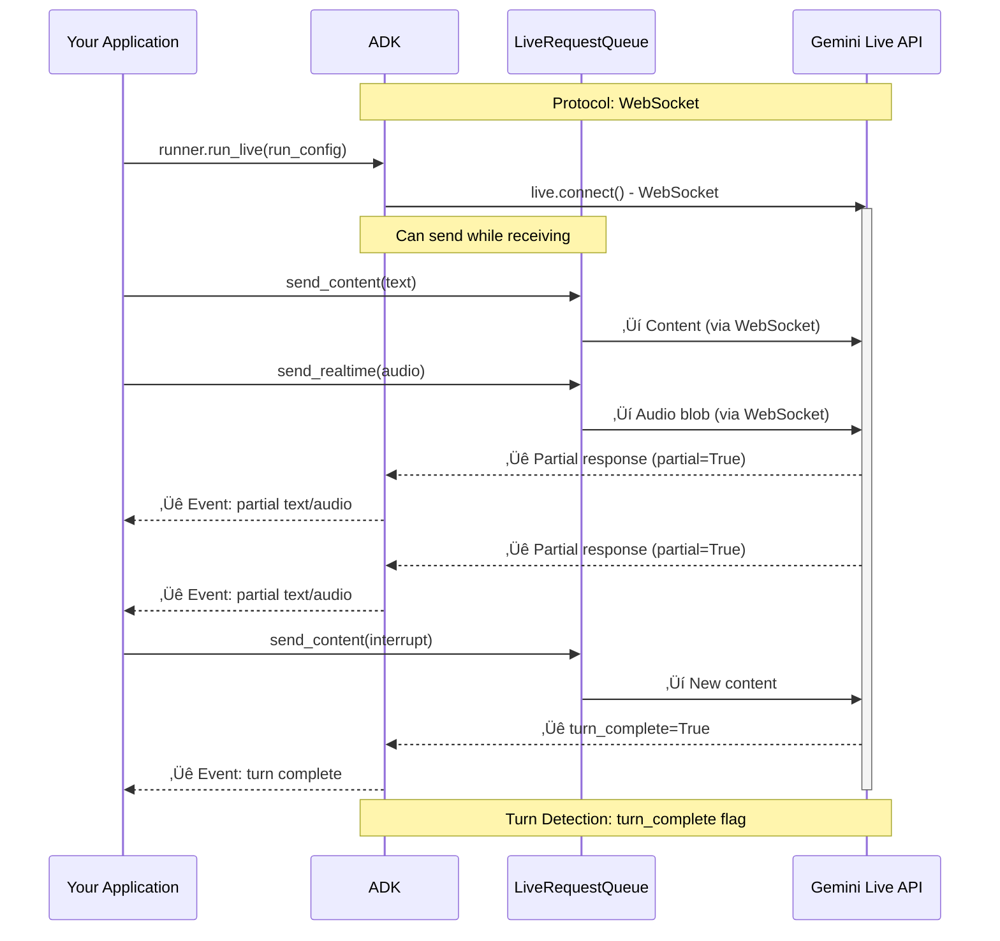
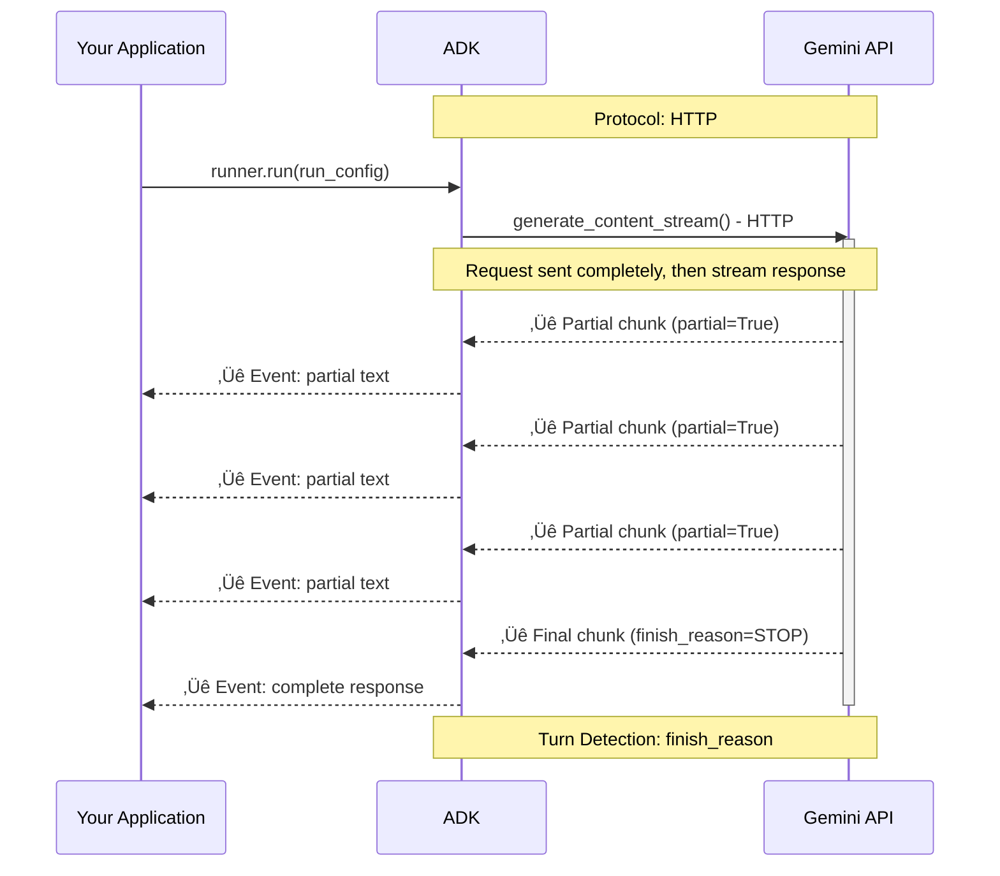

# Part 4: Understanding RunConfig

> 📖 **Source Reference**: [`run_config.py`](https://github.com/google/adk-python/blob/main/src/google/adk/agents/run_config.py)

RunConfig is how you configure the behavior of `run_live()` sessions. It unlocks sophisticated capabilities like multimodal interactions, intelligent proactivity, session resumption, and cost controls—all configured declaratively without complex implementation.

> 📘 **For detailed information about audio/video models, architectures, and features**, see [Part 5: Audio and Video in Live API](part5_audio_and_video.md).

## Model Compatibility

Understanding which features are available on which models is crucial for configuring `RunConfig` correctly. ADK's approach to model capabilities is straightforward: when you use `runner.run_live()`, it automatically connects to either the **Gemini Live API** (via Google AI Studio) or **Vertex AI Live API** (via Google Cloud), depending on your environment configuration.

ADK doesn't perform extensive model validation—it relies on the Live API backend to handle feature support. The Live API will return errors if you attempt to use unsupported features on a given model.

**⚠️ Disclaimer:** Model availability, capabilities, and discontinuation dates are subject to change. Always verify model capabilities and preview/discontinuation timelines before deploying to production:

- **Gemini Live API**: Check the [official Gemini Live API documentation](https://ai.google.dev/gemini-api/docs/live)
- **Vertex AI Live API**: Check the [official Vertex AI Live API documentation](https://cloud.google.com/vertex-ai/generative-ai/docs/live-api)

### Feature Support Matrix

Different Live API models support different feature sets when used with ADK. Understanding these differences helps you choose the right model for your use case:

**Model Naming Convention:**

- **Gemini API** (via Google AI Studio): Uses model IDs like `gemini-2.5-flash-native-audio-preview-09-2025`
- **Vertex AI** (via Google Cloud): Uses model IDs like `gemini-live-2.5-flash`

| Feature | Gemini: `gemini-2.5-flash-native-audio-preview-09-2025` | Gemini: `gemini-live-2.5-flash-preview`<br>Vertex: `gemini-live-2.5-flash` | Gemini: `gemini-2.0-flash-live-001` | RunConfig parameters |
|---------|:---:|:---:|:---:|:---:|
| **Audio input/output** | ✅ | ✅ | ✅ | `response_modalities=["AUDIO"]` |
| **Audio transcription** | ✅ | ✅ | ✅ | `input_audio_transcription`, `output_audio_transcription` |
| **Voice Activity Detection (VAD)** | ✅ | ✅ | ✅ | `realtime_input_config.voice_activity_detection` |
| **Bidirectional streaming** | ✅ | ✅ | ✅ | `runner.run_live()` |
| **Emotion-aware dialogue** | ✅ | ❌ | ❌ | `enable_affective_dialog=True` |
| **Proactive audio response** | ✅ | ❌ | ❌ | `proactivity=ProactivityConfig(enabled=True)` |
| **Session resumption** | ✅ | ✅ | ✅ | `session_resumption=SessionResumptionConfig(mode="transparent")` |
| **Function calling** | ✅ | ✅ | ✅ | Define tools on `Agent` |
| **Built-in tools** (Search, Code Execution) | ✅ | ✅ | ✅ | ADK tool definitions |
| **Context window** | 128k tokens | 32k-128k tokens (Vertex configurable) | 32k tokens | Model property |
| **Provisioned Throughput** | Vertex AI only | Vertex AI only | ❌ | Google Cloud feature |

### Session Limits and Constraints

Live API models have session duration limits that vary by platform and modality:

| Constraint Type | Gemini Live API<br>(via Google AI Studio) | Vertex AI Live API<br>(via Google Cloud) | Notes |
|----------------|-------------------------------------------|------------------------------------------|-------|
| **Audio-only sessions** | 15 minutes | 15 minutes | Includes text + audio interactions |
| **Audio + video sessions** | 2 minutes | 2 minutes | Significantly shorter due to video processing overhead |
| **Connection lifetime** | ~10 minutes | N/A | WebSocket connection auto-terminates (Gemini only) |
| **Concurrent sessions** | N/A | Up to 1,000 | Per Google Cloud project (Vertex only) |
| **Session resumption window** | 2 hours | 24 hours | Resumption tokens validity period after session termination |

### Standard Gemini Models (1.5 series)

For comparison, standard Gemini 1.5 models accessed via SSE streaming have different capabilities:

**Models:**

- `gemini-1.5-pro`
- `gemini-1.5-flash`

**Supported:**

- ✅ Text input/output (`response_modalities=["TEXT"]`)
- ✅ SSE streaming (`StreamingMode.SSE`)
- ✅ Function calling with automatic execution
- ✅ Large context windows (up to 2M tokens for 1.5-pro)

**Not Supported:**

- ❌ Live audio features (audio I/O, transcription, VAD)
- ❌ Bidirectional streaming via `run_live()`
- ❌ Proactivity and affective dialog
- ❌ Video input

## Response Modalities

Response modalities control how the model generates output—as text, audio, or both. **Support varies significantly between platforms**, so understanding these differences is crucial for correct configuration.

### Platform-Specific Support

#### Gemini Live API (Google AI Studio)

**Limitation:** Only **one response modality** per session.

```python
# ✅ Valid: Text-only responses
run_config = RunConfig(
    response_modalities=["TEXT"],
    streaming_mode=StreamingMode.BIDI
)

# ✅ Valid: Audio-only responses
run_config = RunConfig(
    response_modalities=["AUDIO"],
    streaming_mode=StreamingMode.BIDI
)

# ❌ Invalid: Both modalities - results in config error
run_config = RunConfig(
    response_modalities=["TEXT", "AUDIO"],  # ERROR on Gemini Live API
    streaming_mode=StreamingMode.BIDI
)
```

**Key constraints:**

- You must choose either `TEXT` or `AUDIO` at session start
- Cannot switch between modalities mid-session
- Setting both `["TEXT", "AUDIO"]` results in a config error
- **Official source:** [Gemini Live API capabilities guide](https://ai.google.dev/gemini-api/docs/live-guide) states: *"You can only set one response modality (TEXT or AUDIO) per session"* and *"Setting both results in a config error message"*

#### Vertex AI Live API (Google Cloud)

**Capability:** Supports **multiple response modalities simultaneously**.

```python
# ✅ Valid: Both text and audio simultaneously
run_config = RunConfig(
    response_modalities=["TEXT", "AUDIO"],  # ✅ Works on Vertex AI
    streaming_mode=StreamingMode.BIDI
)

# ✅ Valid: Text-only responses
run_config = RunConfig(
    response_modalities=["TEXT"],
    streaming_mode=StreamingMode.BIDI
)

# ✅ Valid: Audio-only responses
run_config = RunConfig(
    response_modalities=["AUDIO"],
    streaming_mode=StreamingMode.BIDI
)
```

**Key capabilities:**

- Can receive both text and audio in the same session
- Model generates synchronized text and audio streams
- Enables rich multimodal experiences (e.g., voice assistants with visual displays)
- Cannot switch modalities mid-session, but can configure both at start
- **Official source:** [Vertex AI Live API documentation](https://cloud.google.com/vertex-ai/generative-ai/docs/live-api/streamed-conversations) shows configuration examples with `"response_modalities": ["TEXT", "AUDIO"]`

## StreamingMode: BIDI or SSE

**This guide focuses on `StreamingMode.BIDI`**, which is required for real-time audio/video interactions and Live API features. However, it's worth understanding the difference between BIDI mode and the legacy SSE mode to choose the right approach for your use case.

ADK supports two distinct streaming modes that control **how ADK communicates with the Gemini API**. These modes are independent of your application's client-facing architecture (you can build WebSocket servers, REST APIs, or any other architecture with either mode).

### Understanding the Terminology

**Important:** `StreamingMode.BIDI` and `StreamingMode.SSE` refer to the **ADK-to-Gemini API communication protocol**, not your server's client-facing protocol:

- `StreamingMode.BIDI`: ADK uses WebSocket to connect to Gemini Live API
- `StreamingMode.SSE`: ADK uses HTTP streaming to connect to Gemini API

Your application can use either mode regardless of whether you're building a WebSocket server, SSE server, REST API, or any other architecture for your clients.

```python
from google.adk.agents.run_config import RunConfig, StreamingMode

# BIDI streaming for real-time audio/video
run_config = RunConfig(
    streaming_mode=StreamingMode.BIDI,
    response_modalities=["AUDIO"]  # Supports audio/video modalities
)

# SSE streaming for text-based interactions
run_config = RunConfig(
    streaming_mode=StreamingMode.SSE,
    response_modalities=["TEXT"]  # Text-only modality
)
```

### Protocol and Implementation Differences

**StreamingMode.BIDI - Bidirectional WebSocket Communication:**



**StreamingMode.SSE - Unidirectional HTTP Streaming:**



### When to Use Each Mode

**Use BIDI when:**

- Building voice/video applications with real-time interaction
- Need bidirectional communication (send while receiving)
- Require Live API features (audio transcription, VAD, proactivity, affective dialog)
- Supporting interruptions and natural turn-taking
- Implementing live streaming tools or real-time data feeds

**Use SSE when:**

- Building text-based chat applications
- Standard request/response interaction pattern
- Using Gemini 1.5 models (Pro, Flash)
- Simpler deployment without WebSocket requirements
- Need larger context windows (up to 2M tokens)

## Context Window Compression

Enable sliding-window compression to extend session duration beyond connection limits:

```python
from google.genai import types

run_config = RunConfig(
    context_window_compression=types.ContextWindowCompressionConfig(
        trigger_tokens=1000,  # Start compression after this many tokens
        sliding_window=types.SlidingWindow(
            target_tokens=500  # Target size after compression
        )
    )
)
```

**How it works:**

When context window compression is enabled:

1. The Live API monitors the total token count of the conversation context
2. When the context reaches the `trigger_tokens` threshold, compression activates
3. Earlier conversation history is compressed or summarized using a sliding window approach
4. Recent context (last `target_tokens` worth) is preserved in full detail
5. This allows sessions to continue beyond normal context window limits

This is critical for long-running conversations that would otherwise exceed the model's context window limits (128k tokens for `gemini-2.5-flash-native-audio-preview-09-2025`, 32k-128k for Vertex AI models).

**Configuration parameters:**

- `trigger_tokens`: The number of tokens at which compression begins
- `sliding_window.target_tokens`: The target context size to maintain after compression

**Use cases:**

- Extended customer service conversations
- Long tutoring or educational sessions
- Multi-hour voice interactions
- Any scenario where conversation history exceeds model context limits

**Note:** Context window compression is a Live API feature that works automatically once configured. ADK passes this configuration to the underlying Live API, which handles the compression transparently.

## Session Resumption

Enable transparent reconnection without losing conversation context:

```python
run_config = RunConfig(
    session_resumption=SessionResumptionConfig(
        mode="transparent"  # Only mode currently supported
    )
)
```

**How it works:**

When session resumption is enabled:

1. Gemini Live API provides a `live_session_resumption_handle` in session updates
2. ADK stores this handle in InvocationContext
3. If the WebSocket connection drops, ADK can reconnect using the handle
4. The model resumes from exactly where it left off—no context loss

This is critical for production deployments where network reliability varies and long conversations should survive temporary disconnections.

Advanced: Example reconnection flow (conceptual):

```python
attempt = 1
while True:
    try:
        # If available, attach InvocationContext.live_session_resumption_handle
        # to llm_request.live_connect_config.session_resumption.handle
        async with llm.connect(llm_request) as conn:
            # Start concurrent send/receive tasks
            await handle_stream(conn)
        break  # Clean close
    except ConnectionClosed:
        attempt += 1
        # Retry with updated handle provided by model updates
        continue
```

## Cost and Safety Controls

Protect against runaway costs and ensure conversation boundaries:

```python
run_config = RunConfig(
    # Limit total LLM calls per invocation
    max_llm_calls=500,  # Default: 500, 0 or negative = unlimited

    # Save audio artifacts for debugging/compliance
    save_live_audio=True  # Default: False
)
```

**max_llm_calls:**

Enforced by InvocationContext's `_invocation_cost_manager`, which increments a counter on each LLM call and raises `LlmCallsLimitExceededError` when the limit is exceeded. This prevents:

- Infinite loops in agent workflows
- Runaway costs from buggy tools
- Excessive API usage in development

**save_live_audio:**

When enabled, ADK persists audio streams to:

- **Session service**: Conversation history includes audio references
- **Artifact service**: Audio files stored with unique IDs

Useful for:

- Debugging voice interaction issues
- Compliance and audit trails
- Training data collection
- Quality assurance

## Compositional Function Calling (Experimental)

Enable advanced function calling patterns:

```python
run_config = RunConfig(
    support_cfc=True,  # Compositional Function Calling
    streaming_mode=StreamingMode.SSE
)
```

**⚠️ Warning:** This feature is experimental and only works with `StreamingMode.SSE`.

**ADK Validation:**

CFC is the **only explicitly validated feature** in ADK. ADK checks that your model name starts with `gemini-2` when `support_cfc=True`. This is enforced in `runners.py:1060-1066`.

**Additional constraints enforced by ADK:**

- Only supported on `gemini-2*` models.
- Requires the built-in code executor; ADK injects `BuiltInCodeExecutor` when CFC is enabled.

CFC enables complex tool use patterns like:

- Calling multiple tools in parallel
- Chaining tool outputs as inputs to other tools
- Conditional tool execution based on results

Only available through Gemini Live API, which ADK automatically uses when `support_cfc=True`.

<!-- Example block removed: local Part 2 sample files have been removed. -->
