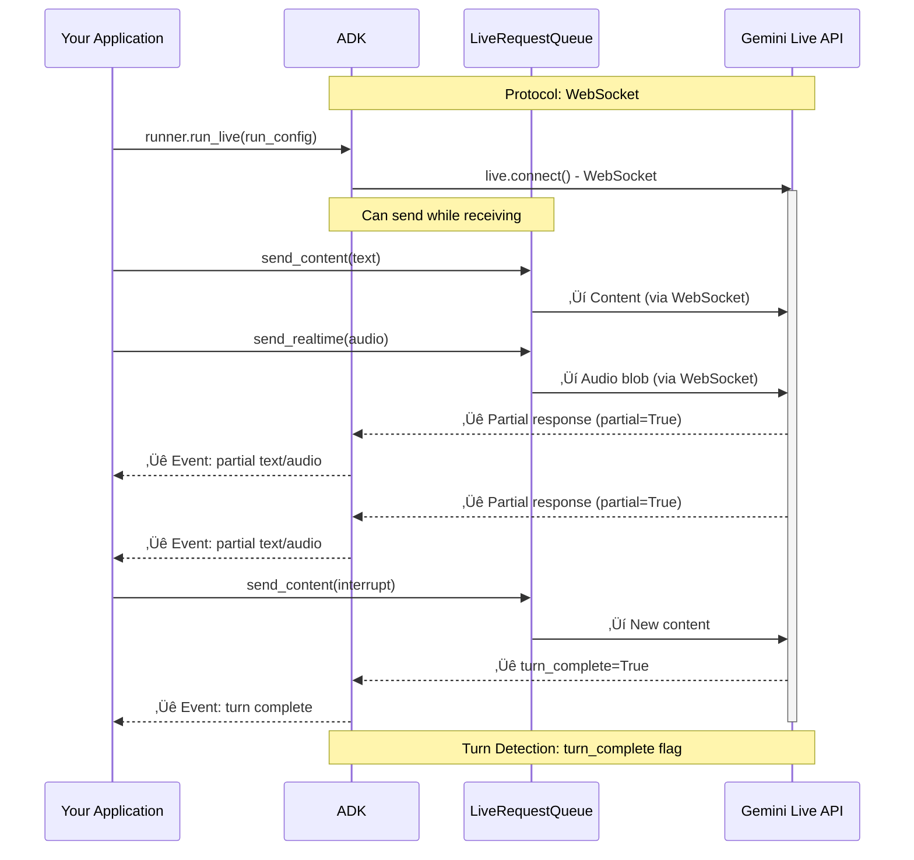
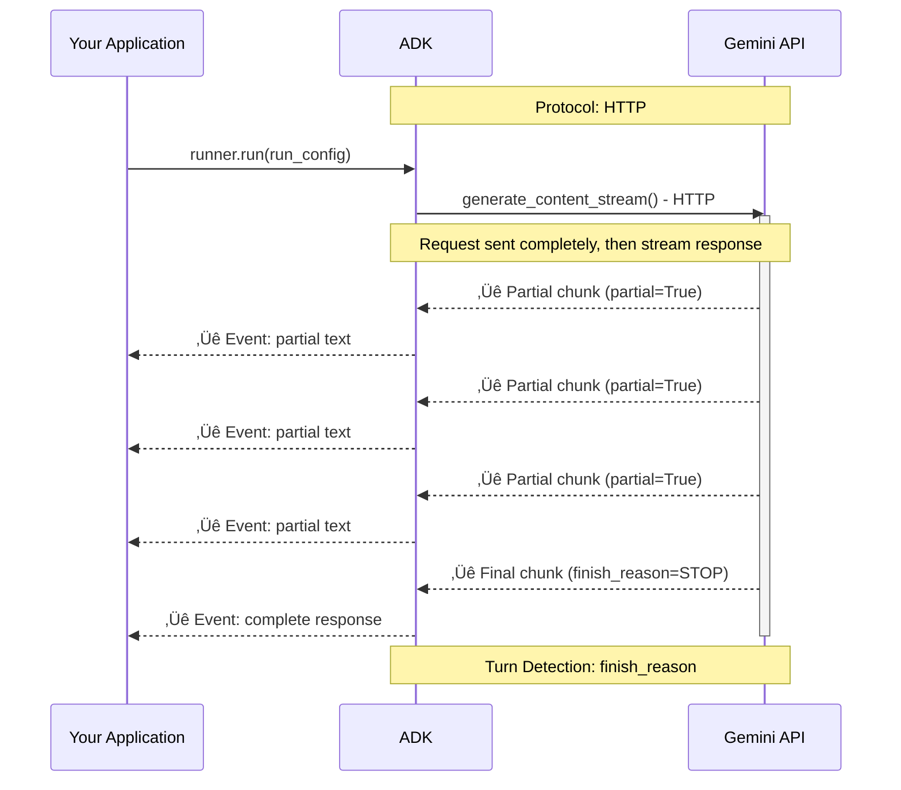
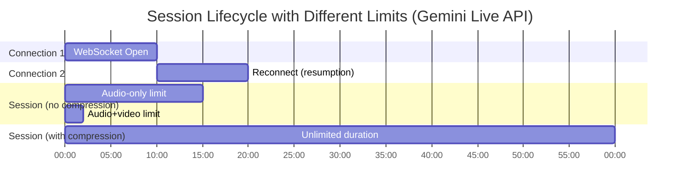

# Part 4: Understanding RunConfig

> 📖 **Source Reference**: [`run_config.py`](https://github.com/google/adk-python/blob/main/src/google/adk/agents/run_config.py)

RunConfig is how you configure the behavior of `run_live()` sessions. It unlocks sophisticated capabilities like multimodal interactions, intelligent proactivity, session resumption, and cost controls—all configured declaratively without complex implementation.

> 📘 **For detailed information about audio/video models, architectures, and features**, see [Part 5: Audio and Video in Live API](part5_audio_and_video.md).

## Model Compatibility

Understanding which features are available on which models is crucial for configuring `RunConfig` correctly. ADK's approach to model capabilities is straightforward: when you use `runner.run_live()`, it automatically connects to either the **Gemini Live API** (via Google AI Studio) or **Vertex AI Live API** (via Google Cloud), depending on your environment configuration.

ADK doesn't perform extensive model validation—it relies on the Live API backend to handle feature support. The Live API will return errors if you attempt to use unsupported features on a given model.

**⚠️ Disclaimer:** Model availability, capabilities, and discontinuation dates are subject to change. **Preview models may be discontinued with limited notice.** Always verify model capabilities and preview/discontinuation timelines before deploying to production:

- **Gemini Live API**: Check the [official Gemini Live API documentation](https://ai.google.dev/gemini-api/docs/live) and [model deprecation schedule](https://ai.google.dev/gemini-api/docs/models/gemini#model-versions)
- **Vertex AI Live API**: Check the [official Vertex AI Live API documentation](https://cloud.google.com/vertex-ai/generative-ai/docs/live-api) and [Vertex AI model versions](https://cloud.google.com/vertex-ai/generative-ai/docs/learn/model-versioning)

For production deployments, prefer stable model versions over preview models whenever possible.

### Feature Support Matrix

Different Live API models support different feature sets when used with ADK. Understanding these differences helps you choose the right model for your use case:

**Model Naming Convention:**

- **Gemini API** (via Google AI Studio): Uses model IDs like `gemini-2.5-flash-native-audio-preview-09-2025`
- **Vertex AI** (via Google Cloud): Uses model IDs like `gemini-live-2.5-flash`

| Feature | Gemini: `gemini-2.5-flash-native-audio-preview-09-2025` | Gemini: `gemini-live-2.5-flash-preview`<br>Vertex: `gemini-live-2.5-flash` | Gemini: `gemini-2.0-flash-live-001` | RunConfig parameters | Notes |
|---------|:---:|:---:|:---:|:---:|:---:|
| **Audio input/output** | ✅ | ✅ | ✅ | `response_modalities=["AUDIO"]` | Core Live API feature across all models |
| **Audio transcription** | ✅ | ✅ | ✅ | `input_audio_transcription`, `output_audio_transcription` | Core Live API feature across all models |
| **Voice Activity Detection (VAD)** | ✅ | ✅ | ✅ | `realtime_input_config.automatic_activity_detection` | Core Live API feature across all models |
| **Bidirectional streaming** | ✅ | ✅ | ✅ | `runner.run_live()` | Core Live API feature across all models |
| **Emotion-aware dialogue** | ✅ | ❌ | ❌ | `enable_affective_dialog=True` | Only on native-audio models with affective dialog support |
| **Proactive audio response** | ✅ | ❌ | ❌ | `proactivity=types.ProactivityConfig()` | Requires model-level proactivity features |
| **Session resumption** | ✅ | ✅ | ✅ | `session_resumption=types.SessionResumptionConfig(transparent=True)` | Core Live API feature across all models |
| **Function calling** | ✅ | ✅ | ✅ | Define tools on `Agent` | Core Live API feature across all models |
| **Built-in tools** (Search, Code Execution) | ✅ | ✅ | ✅ | ADK tool definitions | Core Live API feature across all models |
| **Context window** | 128k tokens | 32k-128k tokens (Vertex configurable) | 32k tokens | Model property | Varies by model architecture |
| **Provisioned Throughput** | ❌ | ✅ | ❌ | Google Cloud feature | Vertex AI infrastructure feature |

**Note on VAD**: Voice Activity Detection (VAD) is **enabled by default** on all Live API models—when you don't specify `realtime_input_config` at all, the Live API automatically detects when users start and stop speaking, enabling natural hands-free conversation. You only need to configure `realtime_input_config.automatic_activity_detection` if you want to **disable** automatic detection for push-to-talk implementations or custom turn control. See [Part 5: Voice Activity Detection](part5_audio_and_video.md#voice-activity-detection-vad) for detailed configuration examples and best practices.

> 💡 **Related Concept**: Voice Activity Detection (VAD) is different from manual activity signals (`ActivityStart`/`ActivityEnd`). VAD automatically detects when users are speaking, while activity signals are manually sent by your application for push-to-talk implementations. See [Part 2: Activity Signals](part2_live_request_queue.md#activity-signals) for details on manual turn control.

**Provisioned Throughput**: A Vertex AI Live API feature that allows you to reserve dedicated capacity for predictable performance and pricing. Only available on Vertex AI (`gemini-live-2.5-flash`), not on Gemini Live API. See [Vertex AI Provisioned Throughput documentation](https://cloud.google.com/vertex-ai/generative-ai/docs/provisioned-throughput) for details.

## Response Modalities

Response modalities control how the model generates output—as text or audio. Both Gemini Live API and Vertex AI Live API have the same restriction: only one response modality per session.

### Configuration

```python
# ✅ Valid: Text-only responses
run_config = RunConfig(
    response_modalities=["TEXT"],
    streaming_mode=StreamingMode.BIDI
)

# ✅ Valid: Audio-only responses
run_config = RunConfig(
    response_modalities=["AUDIO"],
    streaming_mode=StreamingMode.BIDI
)

# ❌ Invalid: Both modalities - results in API error
run_config = RunConfig(
    response_modalities=["TEXT", "AUDIO"],  # ERROR
    streaming_mode=StreamingMode.BIDI
)
# This will cause an error from the Live API:
# "Only one response modality is supported per session"
```

**Key constraints:**

- You must choose either `TEXT` or `AUDIO` at session start. Cannot switch between modalities mid-session
- If you want to receive both audio and text responses from the model, use the Audio Transcript feature which provides text transcripts of the audio output. See [Audio Transcription](part5_audio_and_video.md#audio-transcription) for details
- Response modality only affects model output—you can always send text, voice, or video input regardless of the chosen response modality

**Why this restriction exists**: The Live API models are optimized for either text generation or audio generation, not both simultaneously. This is a fundamental constraint of the underlying model architecture, not an ADK limitation.

## StreamingMode: BIDI or SSE

**This guide focuses on `StreamingMode.BIDI`**, which is required for real-time audio/video interactions and Live API features. However, it's worth understanding the difference between BIDI mode and the legacy SSE mode to choose the right approach for your use case.

ADK supports two distinct streaming modes that control **how ADK communicates with the Gemini API**. These modes are independent of your application's client-facing architecture (you can build WebSocket servers, REST APIs, or any other architecture with either mode).

### Understanding the Terminology

**Important:** `StreamingMode.BIDI` and `StreamingMode.SSE` refer to the **ADK-to-Gemini API communication protocol**, not your server's client-facing protocol:

- `StreamingMode.BIDI`: ADK uses WebSocket to connect to Gemini Live API
- `StreamingMode.SSE`: ADK uses HTTP streaming to connect to Gemini API

Your application can use either mode regardless of whether you're building a WebSocket server, SSE server, REST API, or any other architecture for your clients.

```python
from google.adk.agents.run_config import RunConfig, StreamingMode

# BIDI streaming for real-time audio/video
run_config = RunConfig(
    streaming_mode=StreamingMode.BIDI,
    response_modalities=["AUDIO"]  # Supports audio/video modalities
)

# SSE streaming for text-based interactions
run_config = RunConfig(
    streaming_mode=StreamingMode.SSE,
    response_modalities=["TEXT"]  # Text-only modality
)
```

### Protocol and Implementation Differences

**StreamingMode.BIDI - Bidirectional WebSocket Communication:**



**StreamingMode.SSE - Unidirectional HTTP Streaming:**



### When to Use Each Mode

**Use BIDI when:**

- Building voice/video applications with real-time interaction
- Need bidirectional communication (send while receiving)
- Require Live API features (audio transcription, VAD, proactivity, affective dialog)
- Supporting interruptions and natural turn-taking (see [Part 3: Handling Interruptions](part3_run_live.md#handling-interruptions-and-turn-completion))
- Implementing live streaming tools or real-time data feeds

**Use SSE when:**

- Building text-based chat applications
- Standard request/response interaction pattern
- Using Gemini 1.5 models (Pro, Flash)
- Simpler deployment without WebSocket requirements
- Need larger context windows (up to 2M tokens)

### Standard Gemini Models (1.5 series) accessed via SSE

For comparison, standard Gemini 1.5 models accessed via SSE streaming have different capabilities:

**Models:**

- `gemini-1.5-pro`
- `gemini-1.5-flash`

**Supported:**

- ✅ Text input/output (`response_modalities=["TEXT"]`)
- ✅ SSE streaming (`StreamingMode.SSE`)
- ✅ Function calling with automatic execution
- ✅ Large context windows (up to 2M tokens for 1.5-pro)

**Not Supported:**

- ❌ Live audio features (audio I/O, transcription, VAD)
- ❌ Bidirectional streaming via `run_live()`
- ❌ Proactivity and affective dialog
- ❌ Video input

## Session Management

Building reliable Live API applications requires understanding the fundamental distinction between **connections** (WebSocket transport links) and **sessions** (logical conversation contexts). Unlike traditional request-response APIs, Live API sessions face unique platform-specific constraints: connection timeouts, session duration limits that vary by modality (audio-only vs audio+video), finite context windows, and concurrent session quotas that differ between Gemini Live API and Vertex AI Live API.

Two complementary Live API features address these constraints, with different levels of ADK automation:

**Session Resumption (ADK-managed)**: Overcomes the ~10 minute connection duration limit. When enabled in RunConfig, ADK automatically handles all connection lifecycle management by transparently reconnecting when connections close (whether from normal timeouts or unexpected network failures). ADK reconnects seamlessly in the background—developers don't need to write any reconnection logic. The session continues uninterrupted even as ADK cycles through multiple WebSocket connections, preserving full conversation state.

**Context Window Compression (Developer-configured)**: Overcomes both session duration limits (15 minutes for audio-only, 2 minutes for audio+video) and context window limits (token caps). Developers must explicitly configure this feature if they need unlimited session duration. Once configured in RunConfig, the Live API automatically compresses older conversation history when approaching the context window threshold, enabling unlimited session duration regardless of time or conversation length. ADK simply passes this configuration to the Live API without managing the compression itself.

Together, these features enable production-ready voice applications that can sustain extended, reliable interactions across varying network conditions and conversation lengths.

#### How Session Resumption and Context Window Compression Work Together

These features address different constraints and are often used together:

| Feature | Overcomes | Required for | Automatic? |
|---------|-----------|--------------|------------|
| **Session Resumption** | ~10 minute connection timeout | Any session > 10 minutes | ✅ Yes (ADK manages) |
| **Context Window Compression** | Session duration limits (15/2 min) & token limits | Sessions > 15 min (audio) or > 2 min (video) | ❌ No (developer configures) |

**Typical patterns**:
- **Short sessions (< 10 min)**: Neither feature needed
- **Medium sessions (10-15 min audio)**: Session resumption only
- **Long sessions (> 15 min)**: Both features required
- **Very long sessions (hours)**: Both features + monitoring for quality

### Live API Connections and Sessions

Understanding the distinction between **connections** and **sessions** in Live API is crucial for building reliable ADK Bidi-streaming applications.

**Connection**: The physical WebSocket link between ADK and the Live API server. This is the network transport layer that carries bidirectional streaming data.

**Session**: The logical conversation context maintained by the Live API, including conversation history, tool call state, and model context. A session can span multiple connections.

| Aspect | Connection | Session |
|--------|-----------|---------|
| **What is it?** | WebSocket network connection | Logical conversation context |
| **Scope** | Transport layer | Application layer |
| **Can span?** | Single network link | Multiple connections via resumption |
| **Failure impact** | Network error or timeout | Lost conversation history |

#### Why This Matters for ADK Developers

With ADK's automatic session resumption (see below), you typically don't need to manage connections directly. However, understanding this distinction helps you:

- **Interpret session duration limits**: These apply to the logical session, not individual connections
- **Understand reconnection behavior**: ADK may cycle through multiple connections (each ~10 minutes) while maintaining a single session
- **Debug timeout issues**: Connection timeouts (~10 min) are handled automatically; session timeouts (15 min for audio-only, 2 min for audio+video without compression) require application-level handling

#### Connection and Session Limits by Platform

Understanding the constraints of each platform is critical for production planning. Gemini Live API and Vertex AI Live API have different limits that affect how long conversations can run and how many users can connect simultaneously. The most important distinction is between **connection duration** (how long a single WebSocket connection stays open) and **session duration** (how long a logical conversation can continue).

| Constraint Type | Gemini Live API<br>(Google AI Studio) | Vertex AI Live API<br>(Google Cloud) | Notes |
|----------------|---------------------------------------|--------------------------------------|-------|
| **Connection duration** | ~10 minutes | Not documented separately | Each Gemini WebSocket connection auto-terminates; ADK reconnects transparently with session resumption |
| **Session Duration (Audio-only)** | 15 minutes | 10 minutes | Maximum session duration without context window compression. Both platforms: unlimited with context window compression enabled |
| **Session Duration (Audio + video)** | 2 minutes | 10 minutes | Gemini has shorter limit for video; Vertex treats all sessions equally. Both platforms: unlimited with context window compression enabled |
| **Concurrent sessions** | 50 (Tier 1)<br>1,000 (Tier 2+) | Up to 1,000 | Gemini limits vary by API tier; Vertex limit is per Google Cloud project |

> 📖 **Sources**: [Gemini Live API Capabilities Guide](https://ai.google.dev/gemini-api/docs/live-guide) | [Gemini API Quotas](https://ai.google.dev/gemini-api/docs/quota) | [Vertex AI Streamed Conversations](https://cloud.google.com/vertex-ai/generative-ai/docs/live-api/streamed-conversations)

**Visual timeline of session lifecycle limits:**



This diagram illustrates how:
- **Individual connections** are limited to ~10 minutes each
- **Session resumption** allows cycling through multiple connections (Connection 1 → Connection 2 → ...)
- **Without compression**: Sessions are limited to 15 minutes (audio-only) or 2 minutes (audio+video)
- **With compression**: Sessions can run indefinitely (shown here as 60 minutes, but no actual limit)

### ADK's Automatic Reconnection with Session Resumption

By default, the Live API limits connection duration to approximately 10 minutes—each WebSocket connection automatically closes after this duration. To overcome this limit and enable longer conversations, the **Gemini Live API provides [Session Resumption](https://ai.google.dev/gemini-api/docs/live#session-resumption)**, a feature that transparently migrates a session across multiple connections. When enabled, the Live API generates resumption handles that allow reconnecting to the same session context, preserving the full conversation history and state.

**ADK automates this entirely**: When you enable session resumption in RunConfig, ADK automatically handles all reconnection logic—detecting connection closures, caching resumption handles, and reconnecting seamlessly in the background. You don't need to write any reconnection code. Sessions continue seamlessly beyond the 10-minute connection limit, handling connection timeouts, network disruptions, and planned reconnections automatically.

**Configuration:**

```python
from google.genai import types

run_config = RunConfig(
    session_resumption=types.SessionResumptionConfig(transparent=True)
)
```

#### How ADK Manages Session Resumption

While session resumption is a Gemini Live API feature, using it directly requires managing resumption handles, detecting connection closures, and implementing reconnection logic. ADK takes full responsibility for this complexity, automatically utilizing session resumption behind the scenes so developers don't need to write any reconnection code. You simply enable it in RunConfig, and ADK handles everything transparently.

**ADK's automatic management:**

1. **Initial Connection**: ADK establishes a WebSocket connection to Live API
2. **Handle Updates**: Live API periodically sends updated session resumption handles, which ADK caches in InvocationContext
3. **Graceful Connection Close**: When the ~10 minute connection limit is reached, the WebSocket closes gracefully (no exception)
4. **Automatic Reconnection**: ADK's internal loop detects the close and automatically reconnects using the cached handle
5. **Session Continuation**: The same session continues seamlessly with full context preserved

#### Sequence Diagram: Automatic Reconnection


### Context Window Compression

**Problem:** Live API sessions face two critical constraints that limit conversation duration. First, **session duration limits** impose hard time caps: without compression, Gemini Live API limits audio-only sessions to 15 minutes and audio+video sessions to just 2 minutes, while Vertex AI limits all sessions to 10 minutes. Second, **context window limits** restrict conversation length: models have finite token capacities (128k tokens for `gemini-2.5-flash-native-audio-preview-09-2025`, 32k-128k for Vertex AI models). Long conversations—especially extended customer support sessions, tutoring interactions, or multi-hour voice dialogues—will hit either the time limit or the token limit, causing the session to terminate or lose critical conversation history.

**Solution:** [Context window compression](https://ai.google.dev/gemini-api/docs/live-session#context-window-compression) solves both constraints simultaneously. It uses a sliding-window approach to automatically compress or summarize earlier conversation history when the token count reaches a configured threshold. The Live API preserves recent context in full detail while compressing older portions. **Critically, enabling context window compression extends session duration to unlimited time**, removing the session duration limits (15 minutes for audio-only / 2 minutes for audio+video on Gemini Live API; 10 minutes for all sessions on Vertex AI) while also preventing token limit exhaustion. However, there is a trade-off: as the feature summarizes earlier conversation history rather than retaining it all, the detail of past context will be gradually lost over time. The model will have access to compressed summaries of older exchanges, not the full verbatim history.

ADK provides an easy way to configure context window compression through RunConfig. However, developers are responsible for appropriately configuring the compression parameters (`trigger_tokens` and `target_tokens`) based on their specific requirements—model context window size, expected conversation patterns, and quality needs:

```python
from google.genai import types
from google.adk.agents.run_config import RunConfig

# For gemini-2.5-flash-native-audio-preview-09-2025 (128k context window)
run_config = RunConfig(
    context_window_compression=types.ContextWindowCompressionConfig(
        trigger_tokens=100000,  # Start compression at ~78% of 128k context
        sliding_window=types.SlidingWindow(
            target_tokens=80000  # Compress to ~62% of context, preserving recent turns
        )
    )
)

# For gemini-live-2.5-flash (32k context window on Vertex AI)
run_config = RunConfig(
    context_window_compression=types.ContextWindowCompressionConfig(
        trigger_tokens=25000,  # Start compression at ~78% of 32k context
        sliding_window=types.SlidingWindow(
            target_tokens=20000  # Compress to ~62% of context
        )
    )
)
```

**Choosing appropriate thresholds:**

- Set `trigger_tokens` to 70-80% of your model's context window to allow headroom
- Set `target_tokens` to 60-70% to provide sufficient compression
- Test with your actual conversation patterns to optimize these values

**How it works:**

When context window compression is enabled:

1. The Live API monitors the total token count of the conversation context
2. When the context reaches the `trigger_tokens` threshold, compression activates
3. Earlier conversation history is compressed or summarized using a sliding window approach
4. Recent context (last `target_tokens` worth) is preserved in full detail
5. **Two critical effects occur simultaneously:**
   - Session duration limits are removed (no more 15-minute/2-minute caps on Gemini Live API or 10-minute caps on Vertex AI)
   - Token limits are managed (sessions can continue indefinitely regardless of conversation length)

#### When NOT to Use Context Window Compression

While compression enables unlimited session duration, consider these trade-offs:

- **Short sessions**: For sessions expected to stay under duration limits (15 min audio-only, 2 min audio+video), compression adds unnecessary overhead
- **Compliance requirements**: If you need verbatim conversation history for legal/compliance purposes, compression may lose important details from early turns
- **Quality-critical applications**: Compression summarizes older context, which may reduce response quality for applications requiring precise recall of earlier conversation details
- **Development/testing**: Disable compression during development to see full conversation history without summarization

**Best practice**: Enable compression only when you need sessions longer than platform duration limits OR when conversations may exceed context window token limits.

### Best Practices for Session Management

#### Essential: Enable Session Resumption

- ✅ **Always enable session resumption** in RunConfig for production applications
- ✅ This enables ADK to automatically handle Gemini's ~10 minute connection timeouts transparently
- ✅ Sessions continue seamlessly across multiple WebSocket connections without user interruption

```python
from google.genai import types

run_config = RunConfig(
    response_modalities=["AUDIO"],
    session_resumption=types.SessionResumptionConfig(transparent=True)
)
```

#### Enable Context Window Compression for Unlimited Sessions

- ✅ **Enable context window compression** if you need sessions longer than 15 minutes (audio-only) or 2 minutes (audio+video)
- ✅ Once enabled, session duration becomes unlimited—no need to monitor time-based limits
- ✅ Configure `trigger_tokens` and `target_tokens` based on your model's context window
- ✅ Test compression settings with realistic conversation patterns

```python
from google.genai import types
from google.adk.agents.run_config import RunConfig

run_config = RunConfig(
    response_modalities=["AUDIO"],
    session_resumption=types.SessionResumptionConfig(transparent=True),
    context_window_compression=types.ContextWindowCompressionConfig(
        trigger_tokens=100000,
        sliding_window=types.SlidingWindow(target_tokens=80000)
    )
)
```

#### Monitor Session Duration (Without Context Window Compression)

**Only applies if NOT using context window compression:**

- ✅ Focus on **session duration limits**, not connection timeouts (ADK handles those automatically)
- ✅ **Gemini Live API**: Monitor for 15-minute limit (audio-only) or 2-minute limit (audio+video)
- ✅ **Vertex AI Live API**: Monitor for 10-minute session limit
- ✅ Warn users 1-2 minutes before session duration limits
- ✅ Implement graceful session transitions for conversations exceeding session limits

#### Error Handling

With session resumption enabled, ADK handles connection issues automatically through **transparent reconnection**. You need to handle only two error categories:

1. **`LlmCallsLimitExceededError`** (Required): Cost control limit reached
2. **Generic exceptions** (Recommended): For logging unexpected errors in production

Session resumption handles all connection-related errors automatically, so you don't need specific handlers for network timeouts, disconnections, or reconnection failures.

**Recommended error handling pattern:**

```python
import logging
from google.adk.runners import Runner
from google.adk.agents.run_config import RunConfig
from google.adk.agents.invocation_context import LlmCallsLimitExceededError

logger = logging.getLogger(__name__)

async def run_live_session(
    runner: Runner,
    user_id: str,
    session_id: str,
    run_config: RunConfig
):
    """
    Run live session with session resumption.

    Session resumption automatically handles:
    - Normal ~10 minute connection timeouts
    - Temporary network interruptions
    - Transparent reconnection with context preservation

    You only need to handle:
    - LlmCallsLimitExceededError (cost control limit)
    """
    try:
        async for event in runner.run_live(
            user_id=user_id,
            session_id=session_id,
            run_config=run_config
        ):
            # Process events
            if event.server_content:
                logger.debug(f"Received: {event.server_content}")

        logger.info("Session completed successfully")

    except LlmCallsLimitExceededError as e:
        # Cost control limit reached - this is intentional
        logger.error(
            f"LLM calls limit exceeded: {e}. "
            "Check for infinite loops or increase max_llm_calls."
        )
        raise

    except Exception as e:
        # Catch-all for unexpected errors during streaming
        logger.error(f"Unexpected error in live session: {e}", exc_info=True)
        raise

# Usage
async def main():
    from google.adk.agents.llm_agent import LlmAgent
    from google.genai import types

    agent = LlmAgent(
        name="my_agent",
        model="gemini-2.5-flash-native-audio-preview-09-2025"
    )
    runner = Runner(agent=agent)

    # Enable session resumption for automatic reconnection
    run_config = RunConfig(
        response_modalities=["AUDIO"],
        session_resumption=types.SessionResumptionConfig(transparent=True),
        max_llm_calls=500  # Cost protection
    )

    try:
        await run_live_session(runner, "user123", "session456", run_config)
    except LlmCallsLimitExceededError:
        logger.error("Session terminated: cost limit reached")
        # Investigate agent logic for infinite loops
    except Exception as e:
        logger.error(f"Session failed: {e}")
        # Handle or report the error appropriately

if __name__ == "__main__":
    import asyncio
    asyncio.run(main())
```

**What session resumption handles automatically (no application code needed):**

- ✅ Normal ~10 minute connection timeout
- ✅ Temporary network interruptions
- ✅ WebSocket connection drops
- ✅ Transparent reconnection with conversation context preserved
- ✅ Session resumption handle caching and management

**Error handling strategy:**

| Error Type | When to Handle | Recommended Action |
|------------|----------------|-------------------|
| `LlmCallsLimitExceededError` | Always catch explicitly | Log and investigate for infinite agent loops |
| `Exception` (catch-all) | For logging/debugging | Log unexpected errors; useful for production monitoring |

**Key insights:**

1. **Session resumption provides transparent reconnection** - ADK internally manages reconnection when connections are interrupted. No application-level retry logic is needed.

2. **Minimal error handling needed** - The official ADK samples use a simple pattern: handle `LlmCallsLimitExceededError` explicitly, and optionally add a catch-all `Exception` for logging unexpected errors.

3. **`LlmCallsLimitExceededError` is your cost safety net** - This is the primary error to handle explicitly. It prevents runaway costs from infinite agent loops.

4. **Unexpected exceptions are rare** - With session resumption enabled, connection-related exceptions should be handled automatically. If you see frequent unexpected exceptions, investigate your infrastructure or model configuration.

#### Don't

- ❌ Assume you need to manually handle Gemini's ~10 minute connection timeout (ADK does this automatically)
- ❌ Let sessions hit duration limits without warning users (if NOT using context window compression)
- ❌ Disable session resumption in production applications
- ❌ Forget to enable context window compression if you need sessions longer than 15 minutes (audio-only) or 2 minutes (audio+video)
- ❌ **Without context window compression on Gemini Live API**: Use video when not needed (limits session to 2 minutes instead of 15)
- ❌ Ignore platform-specific session duration limits in production planning (unless using context window compression)
- ❌ Confuse connection duration with session duration

## Concurrent sessions and quota management

**Problem:** Production voice applications typically serve multiple users simultaneously, each requiring their own Live API session. However, both Gemini Live API and Vertex AI Live API impose strict concurrent session limits that vary by platform and pricing tier. Without proper quota planning and session management, applications can hit these limits quickly, causing connection failures for new users or degraded service quality during peak usage.

**Solution:** Understand platform-specific quotas, design your architecture to stay within concurrent session limits, implement session pooling or queueing strategies when needed, and monitor quota usage proactively. ADK handles individual session lifecycle automatically, but developers must architect their applications to manage multiple concurrent users within quota constraints.

### Understanding Concurrent Session Quotas

Both platforms limit how many Live API sessions can run simultaneously, but the limits and mechanisms differ significantly:

**Gemini Live API (Google AI Studio) - Tier-based quotas:**

| Tier | Concurrent Sessions | TPM (Tokens Per Minute) | Access |
|------|---------------------|-------------------------|--------|
| **Free Tier** | Limited* | 1,000,000 | Free API key |
| **Tier 1** | 50 | 4,000,000 | Pay-as-you-go |
| **Tier 2** | 1,000 | 10,000,000 | Higher usage tier |
| **Tier 3** | 1,000 | 10,000,000 | Higher usage tier |

*Free tier concurrent session limits are not explicitly documented but are significantly lower than paid tiers.

> 📖 **Source**: [Gemini API Quotas](https://ai.google.dev/gemini-api/docs/quota)

**Vertex AI Live API (Google Cloud) - Project-based quotas:**

| Resource Type | Limit | Scope |
|---------------|-------|-------|
| **Concurrent live bidirectional connections** | 10 per minute | Per project, per region |
| **Maximum concurrent sessions** | Up to 1,000 | Per project |
| **Session creation/deletion/update** | 100 per minute | Per project, per region |

> 📖 **Source**: [Vertex AI Live API Streamed Conversations](https://cloud.google.com/vertex-ai/generative-ai/docs/live-api/streamed-conversations) | [Vertex AI Quotas](https://cloud.google.com/vertex-ai/generative-ai/docs/quotas)

**Requesting a quota increase:**

To request an increase for Live API concurrent sessions, navigate to the [Quotas page](https://console.cloud.google.com/iam-admin/quotas) in the Google Cloud Console. Filter for the quota named **"Bidi generate content concurrent requests"** to find quota values for each project, region and base model, and submit a quota increase request. You'll need the Quota Administrator role (`roles/servicemanagement.quotaAdmin`) to make the request. See [View and manage quotas](https://cloud.google.com/docs/quotas/view-manage) for detailed instructions.


**Key differences:**

1. **Gemini Live API**: Concurrent session limits scale dramatically with API tier (50 → 1,000 sessions). Best for applications with unpredictable or rapidly scaling user bases willing to pay for higher tiers.

2. **Vertex AI Live API**: Rate-limited by connection establishment rate (10/min) but supports up to 1,000 total concurrent sessions. Best for enterprise applications with gradual scaling patterns and existing Google Cloud infrastructure. Additionally, you can request quota increases to prepare for production deployments with higher concurrency requirements.

### Architectural Patterns for Managing Quotas

Once you understand your concurrent session quotas, the next challenge is architecting your application to operate effectively within those limits. The right approach depends on your expected user concurrency, scaling requirements, and tolerance for queueing. This section presents two architectural patterns—from simple direct mapping for low-concurrency applications to session pooling with queueing for applications that may exceed quota limits during peak usage. Choose the pattern that matches your current scale and design it to evolve as your user base grows.

#### Pattern 1: Direct mapping (simple applications)

For small-scale applications where concurrent users will never exceed quota limits:

**The idea:** Create a dedicated Live API session for each connected user with a simple 1:1 mapping. When a user connects, immediately start a `run_live()` session for them. When they disconnect, the session ends. This pattern has no quota management logic—it assumes your total concurrent users will always stay below your quota limits. It's the simplest possible architecture and works well for prototypes, development environments, and small-scale applications with predictable user loads.

```python
from google.adk.runners import Runner
from google.adk.agents.run_config import RunConfig
from google.genai import types

# Simple 1:1 mapping - one session per user
async def handle_user_connection(user_id: str, agent: Agent):
    runner = Runner(agent=agent)

    run_config = RunConfig(
        response_modalities=["AUDIO"],
        session_resumption=types.SessionResumptionConfig(transparent=True)
    )

    async for event in runner.run_live(
        user_id=user_id,
        session_id=f"session-{user_id}",
        run_config=run_config
    ):
        # Stream events to user
        yield event
```

**✅ Use when:**

- Total concurrent users < 50 (Gemini Tier 1) or < 1,000 (Vertex AI)
- Simple architecture requirements
- Development and testing environments

**❌ Avoid when:**

- User base can exceed quota limits
- Need predictable scaling behavior
- Production applications with unknown peak loads

#### Pattern 2: Session pooling with queueing

For applications that may exceed concurrent session limits during peak usage:

**The idea:** Track the number of active Live API sessions and enforce your quota limit at the application level. When a new user tries to connect, check if you have available session slots. If slots are available, start a session immediately. If you've reached your quota limit, place the user in a waiting queue and notify them they're waiting for an available slot. As sessions end, automatically process the queue to start sessions for waiting users. This provides graceful degradation—users wait briefly during peak times rather than experiencing hard connection failures.

> ⚠️ **Note**: The following is a **conceptual pseudocode example** showing the session pooling pattern. Production implementations require additional features like timeout handling, priority queuing, health checks for active sessions, and graceful shutdown logic. Use this as a design reference, not production-ready code.

```python
import asyncio
from typing import Dict
from dataclasses import dataclass, field
from google.adk.runners import Runner
from google.adk.agents.run_config import RunConfig
from google.genai import types

@dataclass
class SessionPool:
    """Manages concurrent Live API session quota (CONCEPTUAL EXAMPLE)

    Production implementations should add:
    - Timeout handling for queued users (remove from queue after N seconds)
    - Priority queuing (VIP users, retry logic, etc.)
    - Health checks for active sessions (detect and clean up stale sessions)
    - Graceful shutdown logic (drain queue, close active sessions)
    - Metrics/logging (track queue depth, wait times, session duration)
    """
    max_sessions: int  # Set based on your quota tier
    active_sessions: Dict[str, asyncio.Task] = field(default_factory=dict)
    waiting_queue: asyncio.Queue = field(default_factory=asyncio.Queue)
    user_ready_events: Dict[str, asyncio.Event] = field(default_factory=dict)

    async def acquire_session(self, user_id: str) -> bool:
        """Attempt to acquire a session slot

        Returns:
            True if slot available immediately, False if queued
        """
        if len(self.active_sessions) < self.max_sessions:
            # Slot available - user can start immediately
            return True
        else:
            # At capacity - queue the request
            # Create an event for this user to wait on
            ready_event = asyncio.Event()
            self.user_ready_events[user_id] = ready_event
            await self.waiting_queue.put(user_id)
            return False

    async def wait_for_slot(self, user_id: str, timeout: float = 60.0) -> bool:
        """Wait for a session slot to become available

        Args:
            user_id: User waiting for a slot
            timeout: Maximum wait time in seconds

        Returns:
            True if slot became available, False if timeout
        """
        if user_id not in self.user_ready_events:
            return False

        try:
            # Wait for the ready event with timeout
            await asyncio.wait_for(
                self.user_ready_events[user_id].wait(),
                timeout=timeout
            )
            return True
        except asyncio.TimeoutError:
            # Timeout - remove from queue and notify user
            # PSEUDOCODE: Remove user from waiting_queue
            # (Actual implementation needs queue removal logic)
            del self.user_ready_events[user_id]
            return False

    def release_session(self, user_id: str):
        """Release a session slot and notify next waiting user"""
        if user_id in self.active_sessions:
            del self.active_sessions[user_id]

            # Check if anyone is waiting
            if not self.waiting_queue.empty():
                asyncio.create_task(self._process_queue())

    async def _process_queue(self):
        """Process waiting queue when slots become available"""
        if self.waiting_queue.empty():
            return

        # PSEUDOCODE: Get next waiting user
        # Production implementation needs:
        # - Priority handling (VIP users)
        # - Queue timeout cleanup (remove users waiting > 60s)
        # - Race condition handling (multiple releases simultaneously)
        waiting_user = await self.waiting_queue.get()

        # Signal that slot is ready for this user
        if waiting_user in self.user_ready_events:
            self.user_ready_events[waiting_user].set()
            # PSEUDOCODE: Cleanup event after signal
            # Production: Add timeout for cleanup, handle case where user disconnected

# Global session pool (PSEUDOCODE - use dependency injection in production)
session_pool = SessionPool(max_sessions=50)  # Gemini Tier 1 limit

async def handle_user_with_pooling(user_id: str, agent: Agent):
    """Handle user connection with session pooling (CONCEPTUAL EXAMPLE)"""

    # Try to acquire a session slot
    immediate_start = await session_pool.acquire_session(user_id)

    if not immediate_start:
        # User is queued - notify them they're waiting
        yield {
            "type": "queue_status",
            "status": "queued",
            "message": "Waiting for available session slot...",
            "queue_position": session_pool.waiting_queue.qsize()
        }

        # Wait for slot to become available (with timeout)
        slot_available = await session_pool.wait_for_slot(
            user_id,
            timeout=60.0  # Wait up to 60 seconds
        )

        if not slot_available:
            # Timeout - reject connection gracefully
            yield {
                "type": "queue_status",
                "status": "timeout",
                "message": "Session slot not available. Please try again later."
            }
            return

        # Slot is now available - proceed to start session
        yield {
            "type": "queue_status",
            "status": "ready",
            "message": "Session slot available. Starting session..."
        }

    try:
        runner = Runner(agent=agent)
        run_config = RunConfig(
            response_modalities=["AUDIO"],
            session_resumption=types.SessionResumptionConfig(transparent=True)
        )

        # Track active session
        session_pool.active_sessions[user_id] = asyncio.current_task()

        # Start Live API session
        async for event in runner.run_live(
            user_id=user_id,
            session_id=f"session-{user_id}",
            run_config=run_config
        ):
            yield event

    finally:
        # Always release session when done (even on error)
        session_pool.release_session(user_id)
```

**Key Design Considerations:**

- **Queue Timeout**: Users shouldn't wait indefinitely. Implement timeout logic to remove users from queue after a reasonable wait time (30-60 seconds)
- **Queue Position Updates**: Consider periodically sending queue position updates to waiting users so they know their status
- **Priority Handling**: You may want VIP users or retries to skip ahead in the queue
- **Health Monitoring**: Detect and clean up stale sessions (connections that dropped without cleanup)
- **Graceful Shutdown**: When shutting down your service, stop accepting new users and drain the queue gracefully
- **Metrics**: Track queue depth, average wait time, and session duration to optimize your `max_sessions` setting

**✅ Use when:**

- Peak concurrent users may exceed quota limits
- Can tolerate queueing some users during peak times
- Want graceful degradation rather than hard failures

## Miscellaneous controls

ADK provides additional RunConfig options to control session behavior, manage costs, and persist audio data for debugging and compliance purposes.

```python
run_config = RunConfig(
    # Limit total LLM calls per invocation
    max_llm_calls=500,  # Default: 500 (prevents runaway loops)
                        # 0 or negative = unlimited (use with caution)

    # Save audio artifacts for debugging/compliance
    save_live_audio=True  # Default: False
)
```

### max_llm_calls

This parameter caps the total number of LLM invocations allowed per `run_live()` invocation (which corresponds to one session), providing protection against runaway costs and infinite agent loops.

Enforced by InvocationContext's `_invocation_cost_manager`, which increments a counter on each LLM call and raises `LlmCallsLimitExceededError` when the limit is exceeded. This prevents:

- Infinite loops in agent workflows
- Runaway costs from buggy tools
- Excessive API usage in development

**Why 500 is the default**: In typical conversational agents with tool use, 500 LLM calls represents 100-250 conversation turns (depending on tool complexity).

**How this works**:
- **Simple turn (no tools)**: 1 LLM call per turn
- **Turn with tool use**: 2-5 LLM calls (initial call → tool execution → response generation → potential follow-up calls)
- **Complex multi-tool turn**: 5+ LLM calls (multiple tool invocations, iterations)

For a 15-minute audio session with ~30-40 conversation turns, the 500 limit provides ample headroom (12-16 calls per turn) while protecting against infinite loops.

This is sufficient for most legitimate use cases while protecting against infinite loops caused by:

- Tool execution errors that retry indefinitely
- Poorly designed agent logic that enters recursive loops
- Malicious inputs designed to exhaust API quotas

> 💡 **Error Handling**: For patterns on handling `LlmCallsLimitExceededError` in your application, see [Error Handling](#error-handling) above.

### save_live_audio

This parameter controls whether audio streams are persisted to ADK's session and artifact services for debugging, compliance, and quality assurance purposes.

When enabled, ADK persists audio streams to:

- **[Session service](https://google.github.io/adk-docs/sessions/)**: Conversation history includes audio references
- **[Artifact service](https://google.github.io/adk-docs/artifacts/)**: Audio files stored with unique IDs

**Use cases:**

- **Debugging**: Voice interaction issues, assistant behavior analysis
- **Compliance**: Audit trails for regulated industries (healthcare, financial services)
- **Quality Assurance**: Monitoring conversation quality, identifying issues
- **Training Data**: Collecting data for model improvement
- **Development/Testing**: Testing environments and cost-sensitive deployments

**Storage considerations:**

Enabling `save_live_audio=True` has significant storage implications:

- **Audio file sizes**: At 16kHz PCM, audio input generates ~1.92 MB per minute
- **Session storage**: Audio is stored in both session service and artifact service
- **Retention policy**: Check your artifact service configuration for retention periods
- **Cost impact**: Storage costs can accumulate quickly for high-volume voice applications

**Best practices:**

- Enable only when needed (debugging, compliance, training)
- Implement retention policies to auto-delete old audio artifacts
- Consider sampling (e.g., save 10% of sessions for quality monitoring)
- Use compression if supported by your artifact service
