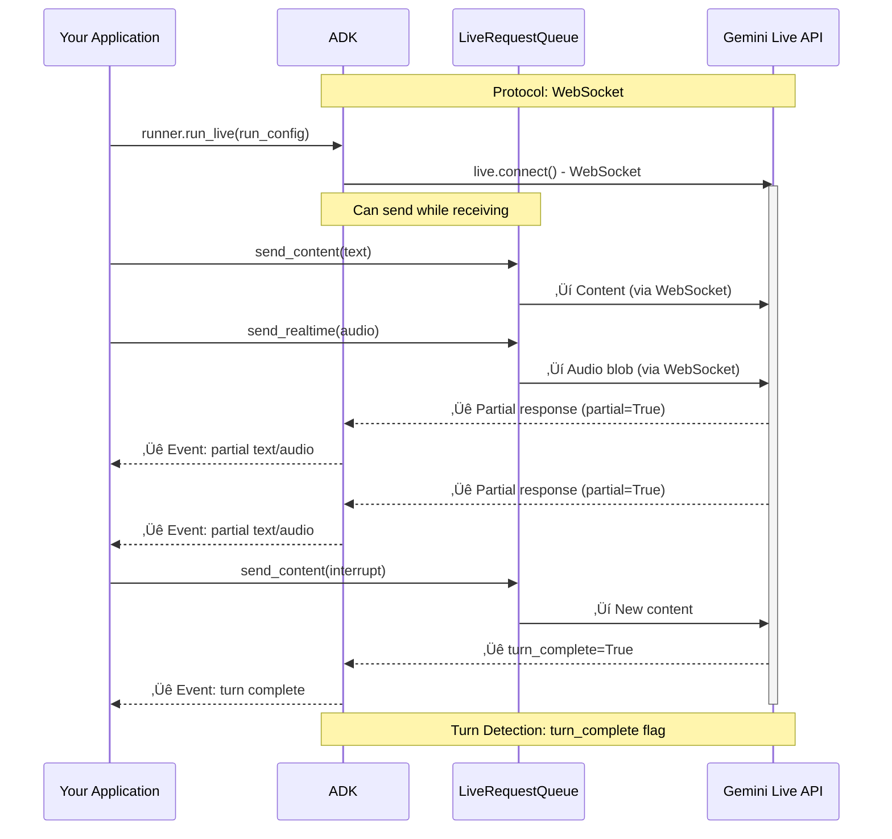
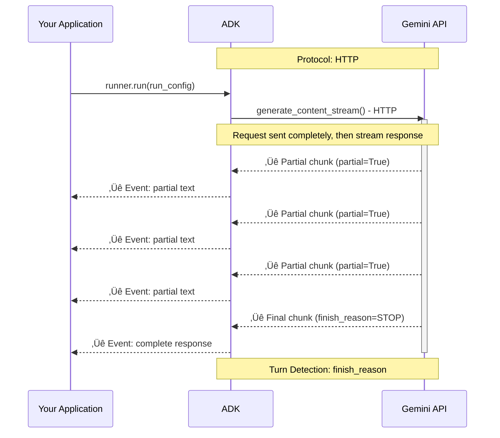

# Part 4: Understanding RunConfig

> 📖 **Source Reference**: [`run_config.py`](https://github.com/google/adk-python/blob/main/src/google/adk/agents/run_config.py)

RunConfig is how you configure the behavior of `run_live()` sessions. It unlocks sophisticated capabilities like multimodal interactions, intelligent proactivity, session resumption, and cost controls—all configured declaratively without complex implementation.

## Model Compatibility

Understanding which features are available on which models is crucial for configuring `RunConfig` correctly. ADK's approach to model capabilities is straightforward: when you use `runner.run_live()`, it automatically connects to either the **Gemini Live API** (via Google AI Studio) or **Vertex AI Live API** (via Google Cloud), depending on your environment configuration.

**Key Insight:** ADK doesn't perform extensive model validation—it relies on the Live API backend to handle feature support. The Live API will return errors if you attempt to use unsupported features on a given model.

**⚠️ Disclaimer:** Model availability, capabilities, and discontinuation dates are subject to change. The information in this section represents a snapshot at the time of writing. For the most current model information, feature support, and availability:

- **Gemini Live API**: Check the [official Gemini Live API documentation](https://ai.google.dev/gemini-api/docs/live)
- **Vertex AI Live API**: Check the [official Vertex AI Live API documentation](https://cloud.google.com/vertex-ai/generative-ai/docs/live-api)

Always verify model capabilities and preview/discontinuation timelines before deploying to production.

### Understanding Audio Architectures

Both the Gemini Live API and Vertex AI Live API support two distinct audio generation architectures, each optimized for different use cases:

- **Native Audio**: A fully integrated end-to-end audio architecture where the model processes audio input and generates audio output directly, without intermediate text conversion. This approach enables more natural speech patterns, emotion awareness, and context-aware audio generation but currently has limited tool use support.

- **Half-Cascade (Cascaded)**: A hybrid architecture that combines native audio input processing with text-to-speech (TTS) output generation. Audio input is processed natively, but responses are first generated as text then converted to speech. This separation provides better reliability and more robust tool execution in production environments.

### Gemini Live API Models (Google AI Studio)

The [Gemini Live API](https://ai.google.dev/gemini-api/docs/live) accessed via Google AI Studio offers the following models:

**1. Native Audio Architecture**

Model: [`gemini-2.5-flash-native-audio-preview-09-2025`](https://ai.google.dev/gemini-api/docs/live)

Optimized for conversational quality with advanced capabilities:

- **Most natural speech generation**: Superior voice quality and naturalness
- **Better multilingual performance**: Enhanced support for non-English languages
- **Emotion-aware dialogue**: Detects and adapts to user emotional state ([affective dialog](https://ai.google.dev/gemini-api/docs/live-guide#affective-dialog))
- **Proactive audio response**: Model can initiate responses without explicit prompts
- **Thinking capabilities**: Built-in reasoning with configurable "thinking budget"
- **Context window**: 128k tokens (4x larger than half-cascade models)

**2. Half-Cascade Audio Architecture**

Models:

- [`gemini-live-2.5-flash-preview`](https://ai.google.dev/gemini-api/docs/live) (recommended for production)
- [`gemini-2.0-flash-live-001`](https://ai.google.dev/gemini-api/docs/live)

Optimized for production reliability:

- **Better production performance**: More stable and reliable in high-traffic scenarios
- **More reliable with tool use**: Enhanced [function calling](https://ai.google.dev/gemini-api/docs/live-tools) and tool execution
- **Context window**: 32k tokens

### Vertex AI Live API Models (Google Cloud)

The [Vertex AI Live API](https://cloud.google.com/vertex-ai/generative-ai/docs/live-api) provides enterprise-grade access with additional Google Cloud features.

**Half-Cascade Architecture**

Model: [`gemini-live-2.5-flash`](https://cloud.google.com/vertex-ai/generative-ai/docs/live-api) (Private GA - Production Ready)

Optimized for production reliability:

- **Enhanced reliability and stability** for enterprise deployments
- **Supports all core Live API features**
- **Context window**: 32k tokens (configurable 5k-128k)
- **Best for**: Production applications requiring enterprise SLAs

**Vertex AI-Specific Features:**

- **Provisioned Throughput**: Reserved capacity for predictable performance
- **Up to 1,000 concurrent sessions** per Google Cloud project
- **24-hour session resumption window** (vs. 2 hours for Gemini API)
- **Enhanced monitoring and logging** via Google Cloud Console
- **Integration with Google Cloud services**: IAM, Cloud Logging, Cloud Monitoring
- **Enterprise support and SLAs**
- **Regional deployment options** for data residency requirements

**Audio/Video Specifications:**

- Input audio: 16-bit PCM, 16kHz
- Output audio: 16-bit PCM, 24kHz
- Video: 1 frame per second (recommended 768x768 resolution)

**Billing Differences:**

- Usage tracked via Google Cloud project billing
- Proactive audio: Input audio tokens charged while listening; output audio tokens only charged when model responds
- Provisioned Throughput available for cost predictability

**When to Use Vertex AI Live API:**

- Production deployments requiring enterprise SLAs
- Applications needing >100 concurrent sessions
- Compliance requirements for data residency
- Integration with existing Google Cloud infrastructure
- Cost management via Google Cloud billing controls
- Access to Provisioned Throughput for guaranteed capacity

### Feature Support Matrix

Different Live API models support different feature sets when used with ADK. Understanding these differences helps you choose the right model for your use case:

**Model Naming Convention:**
- **Gemini API** (via Google AI Studio): Uses model IDs like `gemini-2.5-flash-native-audio-preview-09-2025`
- **Vertex AI** (via Google Cloud): Uses model IDs like `gemini-live-2.5-flash`

| Feature | Native Audio<br>(Gemini: `gemini-2.5-flash-native-audio-preview-09-2025`) | Half-Cascade<br>(Gemini: `gemini-live-2.5-flash-preview`<br>Vertex: `gemini-live-2.5-flash`) | Half-Cascade<br>(Gemini: `gemini-2.0-flash-live-001`) | ADK Configuration |
|---------|:---:|:---:|:---:|:---:|
| **Audio input/output** | ✅ | ✅ | ✅ | `response_modalities=["AUDIO"]` |
| **Audio transcription** | ✅ | ✅ | ✅ | `input_audio_transcription`, `output_audio_transcription` |
| **Voice Activity Detection (VAD)** | ✅ | ✅ | ✅ | `realtime_input_config.voice_activity_detection` |
| **Bidirectional streaming** | ✅ | ✅ | ✅ | `runner.run_live()` |
| **Emotion-aware dialogue** | ✅ | ❌ | ❌ | `enable_affective_dialog=True` |
| **Proactive audio response** | ✅ | ❌ | ❌ | `proactivity=ProactivityConfig(enabled=True)` |
| **Session resumption** | ✅ | ✅ | ✅ | `session_resumption=SessionResumptionConfig(mode="transparent")` |
| **Function calling** | ✅ | ✅ | ✅ | Define tools on `Agent` |
| **Built-in tools** (Search, Code Execution) | ✅ | ✅ | ✅ | ADK tool definitions |
| **Context window** | 128k tokens | 32k-128k tokens (Vertex configurable) | 32k tokens | Model property |
| **Provisioned Throughput** | Vertex AI only | Vertex AI only | ❌ | Google Cloud feature |

### Session Limits and Constraints

Live API models have session duration limits that vary by platform and modality:

**Gemini Live API (via Google AI Studio):**

| Session Type | Maximum Duration | Notes |
|-------------|-----------------|-------|
| **Audio-only sessions** | 15 minutes | Includes text + audio interactions |
| **Audio + video sessions** | 2 minutes | When video input is used |
| **Connection lifetime** | ~10 minutes | WebSocket connection auto-terminates |
| **Session resumption window** | 2 hours | Resumption tokens valid for 2 hours after session termination |

See the [Gemini API session management guide](https://ai.google.dev/gemini-api/docs/live-session) for complete details.

**Vertex AI Live API (via Google Cloud):**

| Session Type | Maximum Concurrent | Notes |
|-------------|-----------------|-------|
| **Concurrent sessions** | Up to 1,000 | Per Google Cloud project |
| **Session resumption window** | 24 hours | Resumption tokens valid for 24 hours (vs. 2 hours for Gemini API) |
| **Audio-only sessions** | 15 minutes | Similar to Gemini API |
| **Audio + video sessions** | 2 minutes | Similar to Gemini API |

See the [Vertex AI Live API documentation](https://cloud.google.com/vertex-ai/generative-ai/docs/live-api/streamed-conversations) for complete details.

**Managing Session Limits:**

- **[Context Window Compression](https://ai.google.dev/gemini-api/docs/live-session#context-window-compression)**: Enable sliding-window compression to extend session duration beyond connection limits
- **[Session Resumption](https://ai.google.dev/gemini-api/docs/live-session#session-resumption)**: Use resumption tokens to reconnect after WebSocket resets without losing conversation state
- **[GoAway Signals](https://ai.google.dev/gemini-api/docs/live-session#connection-termination)**: Handle connection termination warnings to save state before disconnection

```python
# Enable session resumption in RunConfig
run_config = RunConfig(
    session_resumption=SessionResumptionConfig(mode="transparent")
)
```

### Standard Gemini Models (1.5 series)

For comparison, standard Gemini 1.5 models accessed via SSE streaming have different capabilities:

**Models:**
- `gemini-1.5-pro`
- `gemini-1.5-flash`

**Supported:**
- ✅ Text input/output (`response_modalities=["TEXT"]`)
- ✅ SSE streaming (`StreamingMode.SSE`)
- ✅ Function calling with automatic execution
- ✅ Large context windows (up to 2M tokens for 1.5-pro)

**Not Supported:**
- ❌ Live audio features (audio I/O, transcription, VAD)
- ❌ Bidirectional streaming via `run_live()`
- ❌ Proactivity and affective dialog
- ❌ Video input

## Response Modalities

Response modalities control how the model generates output—as text, audio, or both. **Support varies significantly between platforms**, so understanding these differences is crucial for correct configuration.

### Platform-Specific Support

#### Gemini Live API (Google AI Studio)

**Limitation:** Only **one response modality** per session.

```python
# ✅ Valid: Text-only responses
run_config = RunConfig(
    response_modalities=["TEXT"],
    streaming_mode=StreamingMode.BIDI
)

# ✅ Valid: Audio-only responses
run_config = RunConfig(
    response_modalities=["AUDIO"],
    streaming_mode=StreamingMode.BIDI
)

# ❌ Invalid: Both modalities - results in config error
run_config = RunConfig(
    response_modalities=["TEXT", "AUDIO"],  # ERROR on Gemini Live API
    streaming_mode=StreamingMode.BIDI
)
```

**Key constraints:**
- You must choose either `TEXT` or `AUDIO` at session start
- Cannot switch between modalities mid-session
- Setting both `["TEXT", "AUDIO"]` results in a config error
- **Official source:** [Gemini Live API capabilities guide](https://ai.google.dev/gemini-api/docs/live-guide) states: *"You can only set one response modality (TEXT or AUDIO) per session"* and *"Setting both results in a config error message"*

#### Vertex AI Live API (Google Cloud)

**Capability:** Supports **multiple response modalities simultaneously**.

```python
# ✅ Valid: Both text and audio simultaneously
run_config = RunConfig(
    response_modalities=["TEXT", "AUDIO"],  # ✅ Works on Vertex AI
    streaming_mode=StreamingMode.BIDI
)

# ✅ Valid: Text-only responses
run_config = RunConfig(
    response_modalities=["TEXT"],
    streaming_mode=StreamingMode.BIDI
)

# ✅ Valid: Audio-only responses
run_config = RunConfig(
    response_modalities=["AUDIO"],
    streaming_mode=StreamingMode.BIDI
)
```

**Key capabilities:**
- Can receive both text and audio in the same session
- Model generates synchronized text and audio streams
- Enables rich multimodal experiences (e.g., voice assistants with visual displays)
- Cannot switch modalities mid-session, but can configure both at start
- **Official source:** [Vertex AI Live API documentation](https://cloud.google.com/vertex-ai/generative-ai/docs/live-api/streamed-conversations) shows configuration examples with `"response_modalities": ["TEXT", "AUDIO"]`

## StreamingMode: BIDI or SSE

**This guide focuses on `StreamingMode.BIDI`**, which is required for real-time audio/video interactions and Live API features. However, it's worth understanding the difference between BIDI mode and the legacy SSE mode to choose the right approach for your use case.

ADK supports two distinct streaming modes that control **how ADK communicates with the Gemini API**. These modes are independent of your application's client-facing architecture (you can build WebSocket servers, REST APIs, or any other architecture with either mode).

### Understanding the Terminology

**Important:** `StreamingMode.BIDI` and `StreamingMode.SSE` refer to the **ADK-to-Gemini API communication protocol**, not your server's client-facing protocol:

- `StreamingMode.BIDI`: ADK uses WebSocket to connect to Gemini Live API
- `StreamingMode.SSE`: ADK uses HTTP streaming to connect to Gemini API

Your application can use either mode regardless of whether you're building a WebSocket server, SSE server, REST API, or any other architecture for your clients.

### Protocol and Implementation Differences

**StreamingMode.BIDI - Bidirectional WebSocket Communication:**



**StreamingMode.SSE - Unidirectional HTTP Streaming:**



**BIDI (Bidirectional Streaming):**

- **ADK-to-Gemini Protocol**: WebSocket-based full-duplex communication
- **Gemini API Method**: `live.connect()` - establishes persistent bidirectional connection with Gemini
- **Communication Pattern**: ADK can send/receive simultaneously with the Gemini model
- **Use Case**: Real-time voice/video interactions, Live API features
- **ADK Implementation**: Uses `LiveRequestQueue` for sending data to the model while receiving responses
- **Turn Detection**: Relies on `turn_complete` flag to mark conversation boundaries
- **Gemini Models**: Requires Live API-compatible models (e.g., `gemini-2.0-flash-live-001`, `gemini-2.5-flash-native-audio-preview-09-2025`)

**SSE (Server-Sent Events):**

- **ADK-to-Gemini Protocol**: HTTP-based unidirectional streaming (Gemini to ADK)
- **Gemini API Method**: `generate_content_stream()` - standard streaming request/response
- **Communication Pattern**: ADK sends complete request, Gemini streams response chunks
- **Use Case**: Text-based streaming responses, standard chat interactions
- **ADK Implementation**: Standard request/response - no LiveRequestQueue needed (request is sent completely before streaming begins)
- **Turn Detection**: Relies on `finish_reason` to signal completion
- **Gemini Models**: Works with standard Gemini models (e.g., `gemini-1.5-pro`, `gemini-1.5-flash`)
- **Note**: The experimental `support_cfc=True` feature uses SSE but internally switches to Live API with LiveRequestQueue

### Configuration

```python
from google.adk.agents.run_config import RunConfig, StreamingMode

# BIDI streaming for real-time audio/video
run_config = RunConfig(
    streaming_mode=StreamingMode.BIDI,
    response_modalities=["AUDIO"]  # Supports audio/video modalities
)

# SSE streaming for text-based interactions
run_config = RunConfig(
    streaming_mode=StreamingMode.SSE,
    response_modalities=["TEXT"]  # Text-only modality
)
```

### Text Streaming Semantics

While both modes stream text incrementally, they differ in how partial chunks are handled:

**BIDI Streaming:**

- Partial text chunks arrive as WebSocket messages with `partial=True`
- Chunks are aggregated until `turn_complete=True` is received
- Final merged text event emitted at turn boundaries
- Enables interruption and real-time turn-taking

**SSE Streaming:**

- Partial text chunks arrive as server-sent events with `partial=True`
- Chunks are aggregated until `finish_reason` is present (e.g., `STOP`, `MAX_TOKENS`)
- Final aggregated response emitted when stream completes
- Request-response model with complete turn separation

### When to Use Each Mode

**Use BIDI when:**

- Building voice/video applications with real-time interaction
- Need bidirectional communication (send while receiving)
- Require Live API features (audio transcription, VAD, proactivity, affective dialog)
- Supporting interruptions and natural turn-taking
- Implementing live streaming tools or real-time data feeds

**Use SSE when:**

- Building text-based chat applications
- Standard request/response interaction pattern
- Using Gemini 1.5 models (Pro, Flash)
- Simpler deployment without WebSocket requirements
- Need larger context windows (up to 2M tokens)

### Architecture Example

**Example: Building a WebSocket server for voice chat**

```python
# Your FastAPI WebSocket endpoint
@app.websocket("/ws/{user_id}")
async def websocket_endpoint(websocket: WebSocket, user_id: str):
    # Your client connects via WebSocket
    await websocket.accept()

    # ADK uses BIDI mode to talk to Gemini (separate WebSocket)
    run_config = RunConfig(
        streaming_mode=StreamingMode.BIDI,  # ADK ←WebSocket→ Gemini Live API
        response_modalities=["AUDIO"]
    )

    # Your application architecture:
    # Browser ←WebSocket→ Your Server ←WebSocket→ Gemini Live API
```

**Example: Building a REST API with streaming responses**

```python
# Your FastAPI streaming endpoint
@app.post("/chat/stream")
async def chat_stream(request: ChatRequest):
    # Your client connects via HTTP

    # ADK can use either mode to talk to Gemini:

    # Option 1: SSE mode (ADK uses HTTP streaming with Gemini)
    run_config = RunConfig(
        streaming_mode=StreamingMode.SSE  # ADK ←HTTP→ Gemini API
    )

    # Option 2: BIDI mode (ADK uses WebSocket with Gemini)
    run_config = RunConfig(
        streaming_mode=StreamingMode.BIDI  # ADK ←WebSocket→ Gemini Live API
    )

    # Your application architecture:
    # Browser ←HTTP→ Your Server ←SSE or WebSocket→ Gemini API
```

### Key Takeaways

In both modes, partial events have `partial=True`, and consumers should either:

1. Merge partial chunks incrementally for streaming UX
2. Wait for the final non-partial event for complete, stable text

The main differences:

- **Transport protocol (ADK ↔ Gemini)**: WebSocket (BIDI) vs. HTTP (SSE)
- **Communication pattern**: Bidirectional (BIDI) vs. Unidirectional (SSE)
- **Feature availability**: Live API features (audio, VAD, proactivity) require BIDI mode
- **Client-facing architecture**: Independent of StreamingMode - build whatever architecture suits your application

## Audio Transcription

Enable automatic transcription of audio streams without external services:

```python
run_config = RunConfig(
    # Transcribe user's spoken input
    input_audio_transcription=AudioTranscriptionConfig(enabled=True),

    # Transcribe model's spoken output
    output_audio_transcription=AudioTranscriptionConfig(enabled=True)
)
```

**Use cases:**

- **Accessibility**: Provide captions for hearing-impaired users
- **Logging**: Store text transcripts of voice conversations
- **Analytics**: Analyze conversation content without audio processing
- **Debugging**: Verify what the model heard vs. what it generated

The transcriptions are delivered through the same streaming event pipeline as `input_transcription` and `output_transcription` fields in LlmResponse objects.

**Troubleshooting:** If audio is not being transcribed, ensure `input_audio_transcription` (and/or `output_audio_transcription`) is enabled in `RunConfig`, and confirm audio MIME type and chunking are correct (`audio/pcm`, short contiguous chunks).

## Voice Activity Detection (VAD)

Configure real-time detection of when users are actively speaking:

```python
run_config = RunConfig(
    realtime_input_config=RealtimeInputConfig(
        voice_activity_detection=VoiceActivityDetectionConfig(enabled=True)
    )
)
```

**How it works:**

When VAD is enabled, Gemini Live API automatically analyzes incoming audio streams to detect:
- Speech start (user begins speaking)
- Speech end (user finishes speaking)
- Silence periods (pauses between words)

This enables the model to intelligently respond:
- Wait for natural pauses before responding
- Avoid interrupting mid-sentence
- Detect when the user has finished their thought

VAD is crucial for natural voice interactions, eliminating the need for "push-to-talk" buttons or manual turn-taking.

## Live Audio Best Practices

- Prefer PCM audio (`mime_type="audio/pcm"`) with consistent sample rate across chunks.
- Send short, contiguous chunks (e.g., tens to hundreds of milliseconds) to reduce latency and preserve continuity.
- Use `send_activity_start()` when the user begins speaking and `send_activity_end()` when they finish to help the model time its responses.
- If `input_audio_transcription` is not enabled, ADK may use its own transcription path; enable it in `RunConfig` for end‑to‑end model transcription.
- For multimodal output, enable both `TEXT` and `AUDIO` in `response_modalities` (Vertex AI only; Gemini Live API supports only one modality per session).

## Proactivity and Affective Dialog

Enable the model to be proactive and emotionally aware:

```python
run_config = RunConfig(
    # Model can initiate responses without explicit prompts
    proactivity=ProactivityConfig(enabled=True),

    # Model detects and adapts to user emotions
    enable_affective_dialog=True
)
```

**Proactivity:**

When enabled, the model can:
- Offer suggestions without being asked
- Provide follow-up information proactively
- Ignore irrelevant or off-topic input
- Anticipate user needs based on context

**Affective Dialog:**

The model analyzes emotional cues in voice tone and content to:
- Detect user emotions (frustrated, happy, confused, etc.)
- Adapt response style and tone accordingly
- Provide empathetic responses in customer service scenarios
- Adjust formality based on detected sentiment

## Session Resumption

Enable transparent reconnection without losing conversation context:

```python
run_config = RunConfig(
    session_resumption=SessionResumptionConfig(
        mode="transparent"  # Only mode currently supported
    )
)
```

**How it works:**

When session resumption is enabled:

1. Gemini Live API provides a `live_session_resumption_handle` in session updates
2. ADK stores this handle in InvocationContext
3. If the WebSocket connection drops, ADK can reconnect using the handle
4. The model resumes from exactly where it left off—no context loss

This is critical for production deployments where network reliability varies and long conversations should survive temporary disconnections.

Advanced: Example reconnection flow (conceptual):

```python
attempt = 1
while True:
    try:
        # If available, attach InvocationContext.live_session_resumption_handle
        # to llm_request.live_connect_config.session_resumption.handle
        async with llm.connect(llm_request) as conn:
            # Start concurrent send/receive tasks
            await handle_stream(conn)
        break  # Clean close
    except ConnectionClosed:
        attempt += 1
        # Retry with updated handle provided by model updates
        continue
```

## Cost and Safety Controls

Protect against runaway costs and ensure conversation boundaries:

```python
run_config = RunConfig(
    # Limit total LLM calls per invocation
    max_llm_calls=500,  # Default: 500, 0 or negative = unlimited

    # Save audio artifacts for debugging/compliance
    save_live_audio=True  # Default: False
)
```

**max_llm_calls:**

Enforced by InvocationContext's `_invocation_cost_manager`, which increments a counter on each LLM call and raises `LlmCallsLimitExceededError` when the limit is exceeded. This prevents:
- Infinite loops in agent workflows
- Runaway costs from buggy tools
- Excessive API usage in development

**save_live_audio:**

When enabled, ADK persists audio streams to:
- **Session service**: Conversation history includes audio references
- **Artifact service**: Audio files stored with unique IDs

Useful for:
- Debugging voice interaction issues
- Compliance and audit trails
- Training data collection
- Quality assurance

## Compositional Function Calling (Experimental)

Enable advanced function calling patterns:

```python
run_config = RunConfig(
    support_cfc=True,  # Compositional Function Calling
    streaming_mode=StreamingMode.SSE
)
```

**⚠️ Warning:** This feature is experimental and only works with `StreamingMode.SSE`.

**ADK Validation:**

CFC is the **only explicitly validated feature** in ADK. ADK checks that your model name starts with `gemini-2` when `support_cfc=True`. This is enforced in `runners.py:1060-1066`.

**Additional constraints enforced by ADK:**

- Only supported on `gemini-2*` models.
- Requires the built-in code executor; ADK injects `BuiltInCodeExecutor` when CFC is enabled.

CFC enables complex tool use patterns like:
- Calling multiple tools in parallel
- Chaining tool outputs as inputs to other tools
- Conditional tool execution based on results

Only available through Gemini Live API, which ADK automatically uses when `support_cfc=True`.

<!-- Example block removed: local Part 2 sample files have been removed. -->
