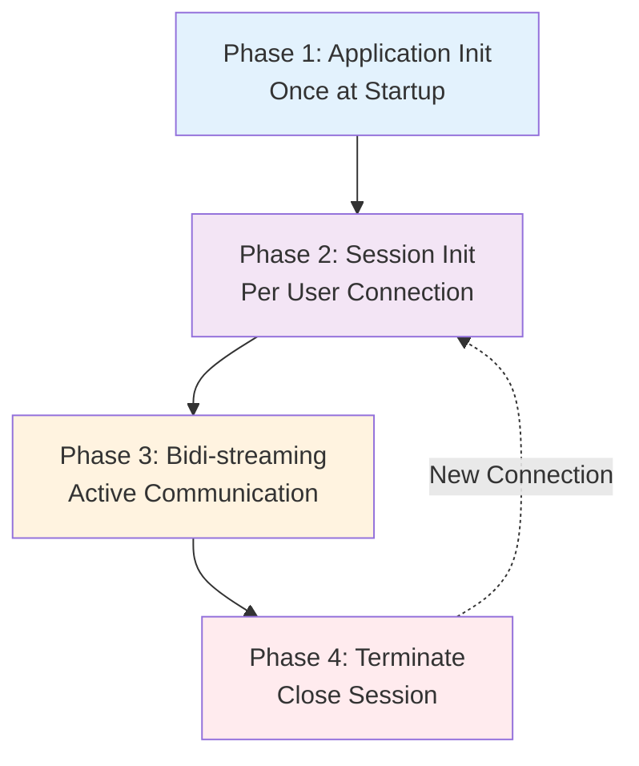
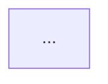

# Documentation Review Report: Part 1 - Introduction to ADK Bidi-streaming

**Review Date**: 2025-11-04  
**Reviewer**: Claude Code (Automated Review)  
**Document Reviewed**: `/Users/kazsato/Documents/GitHub/adk-streaming-guide/docs/part1_intro.md`  
**Cross-referenced Documents**: part2_live_request_queue.md, part3_run_live.md, part4_run_config.md, part5_audio_and_video.md

---

## Executive Summary

Part 1 serves as a comprehensive introduction to ADK Bidi-streaming, providing developers with foundational knowledge of the architecture, lifecycle, and core concepts. The documentation demonstrates **excellent overall quality** with clear structure, consistent formatting, and well-integrated code examples. However, there are several areas where consistency with other parts could be improved, particularly in code commenting patterns, table formatting, and cross-reference structure.

### Quick Statistics

- **Total Issues Found**: 23
  - Critical: 0
  - Warnings: 12
  - Suggestions: 11
- **Document Length**: 841 lines
- **Code Examples**: 15+ blocks
- **Cross-references**: 15+ internal links
- **Tables**: 4 major comparison tables

### Overall Assessment

**Strengths**:
- Clear, progressive introduction from concepts to implementation
- Excellent use of Mermaid diagrams for visualizing architecture
- Comprehensive FastAPI example with proper async patterns
- Strong cross-referencing to later parts
- Good balance of theory and practice

**Areas for Improvement**:
- Code commenting density varies (detailed in some examples, minimal in others)
- Table alignment inconsistencies
- Some terminology inconsistencies across parts
- Minor formatting variations in callouts

---

## Issues by Category

### Critical Issues

No critical issues found. The documentation is technically accurate and provides correct implementation guidance.

---

### Warnings (Should Fix)

#### W1: Inconsistent Code Commenting Density

**Category**: Code Style  
**Parts Affected**: part1_intro.md  
**Problem**: Code examples show inconsistent commenting patterns compared to the standard defined in Part 2 and demonstrated throughout other parts.

**Current State**:

**Example 1** (lines 374-382) - Minimal comments:
```python
agent = Agent(
    model="gemini-2.5-flash-native-audio-preview-09-2025",
    tools=[google_search],
    instruction="You are a helpful assistant that can search the web and perform calculations."
)
```

**Example 2** (lines 471-483) - Detailed comments:
```python
# Get or create session (recommended for production)
session = await session_service.get_session(
    app_name="my-streaming-app",
    user_id="user123",
    session_id="session456"
)
if not session:
    await session_service.create_session(
        app_name="my-streaming-app",
        user_id="user123",
        session_id="session456"
    )
```

**Example 3** (lines 594-705) - FastAPI example with phase comments:
```python
# ========================================
# Phase 1: Application Initialization (once at startup)
# ========================================
```

**Expected State**: According to the code commenting philosophy established in the review checklist:
- Teaching examples (first introduction of concepts) should have detailed explanatory comments
- Production-like examples should have minimal or no comments when self-documenting
- Phase labels should organize multi-step processes

**Recommendation**:

1. **Keep the FastAPI example commenting as-is** (lines 594-705) - it's a teaching example showing complete workflow, so detailed phase comments are appropriate
2. **Add minimal inline comments to the Agent creation example** (lines 374-382) to explain parameters on first introduction:
   ```python
   agent = Agent(
       model="gemini-2.5-flash-native-audio-preview-09-2025",
       tools=[google_search],  # Tools the agent can use
       instruction="You are a helpful assistant that can search the web and perform calculations."
   )
   ```
3. **Keep the get-or-create session example minimal** (lines 471-483) - it's straightforward and self-documenting after the introductory text

This creates a progression from detailed (FastAPI) → moderate (Agent) → minimal (session pattern).

---

#### W2: Table Column Alignment Inconsistencies

**Category**: Formatting  
**Parts Affected**: part1_intro.md  
**Problem**: Tables use inconsistent column alignment, violating the standard defined in the review checklist.

**Current State**:

**Table 1** (lines 135-147) - Mixed alignment, no clear pattern:
```markdown
| Aspect | Gemini Live API | Vertex AI Live API |
|--------|----------------|-------------------|
| **Access** | Google AI Studio | Google Cloud |
```

**Table 2** (lines 164-171) - Mixed alignment:
```markdown
| Feature | Raw Live API (`google-genai` SDK) | ADK Bidi-streaming (`adk-python` and `adk-java` SDK) |
|---------|-----------------------------------|------------------------------------------------------|
| **Agent Framework** | ❌ Not available | ✅ Multi-agent orchestration... |
```

**Expected State**: According to the table formatting standard:
- **Text columns**: Left-align (use `---` or `|---|`)
- **Status/Symbol columns**: Center-align (use `:---:` or `|:---:|`)
- **Numeric columns**: Right-align (use `---:` or `|---:|`)

**Recommendation**:

Update table formatting for consistency:

```markdown
| Aspect | Gemini Live API | Vertex AI Live API |
|--------|-----------------|-------------------|
| **Access** | Google AI Studio | Google Cloud |
| **Authentication** | API key (`GOOGLE_API_KEY`) | Google Cloud credentials (`GOOGLE_CLOUD_PROJECT`, `GOOGLE_CLOUD_LOCATION`) |
```

For feature matrices with checkmarks:

```markdown
| Feature | Raw Live API | ADK Bidi-streaming |
|---------|:---:|:---:|
| **Agent Framework** | ❌ | ✅ |
| **Tool Execution** | ❌ | ✅ |
```

---

#### W3: Inconsistent Terminology: "Live API" vs "Gemini Live API"

**Category**: Terminology  
**Parts Affected**: part1_intro.md  
**Problem**: The document establishes terminology conventions but doesn't follow them consistently.

**Current State**:

Line 98-100 establishes the convention:
```markdown
Throughout this guide, we use **"Live API"** to refer to both platforms collectively, 
specifying "Gemini Live API" or "Vertex AI Live API" only when discussing 
platform-specific features or differences.
```

But then line 104 uses "The Live API" with the definite article:
```markdown
The Live API is Google's real-time conversational AI technology...
```

**Expected State**: According to the terminology convention:
- Use "Live API" (without "the") when referring to both platforms collectively
- Use "Gemini Live API" or "Vertex AI Live API" for platform-specific discussions

**Recommendation**:

Update line 104 and similar instances:
```markdown
Live API is Google's real-time conversational AI technology...
```

Or if grammatically necessary, use:
```markdown
The Live API platforms provide Google's real-time conversational AI technology...
```

---

#### W4: Cross-reference Format Inconsistency

**Category**: Cross-references  
**Parts Affected**: part1_intro.md  
**Problem**: Cross-reference formatting varies between different admonition types.

**Current State**:

**Format A** - Using "Learn More" (line 121):
```markdown
> 💡 **Learn More**: For detailed information about Native Audio models and these features, 
see [Part 5: Proactivity and Affective Dialog](part5_audio_and_video.md#proactivity-and-affective-dialog).
```

**Format B** - Using "Source Reference" (line 148):
```markdown
> 📖 **Source Reference**: [Gemini Live API Guide](https://ai.google.dev/gemini-api/docs/live-guide) 
| [Vertex AI Live API Overview](https://cloud.google.com/vertex-ai/generative-ai/docs/live-api)
```

**Expected State**: According to the cross-reference standard:
- Use `> 💡 **Learn More**:` for internal documentation references
- Use `> 📖 **Source Reference**:` for external API documentation or source code
- Be consistent with emoji and formatting

**Recommendation**: The current usage is correct. However, ensure all parts follow this same pattern. This is more of a reminder to maintain consistency going forward.

---

#### W5: Heading Level Inconsistency for Subsections

**Category**: Structure  
**Parts Affected**: part1_intro.md  
**Problem**: Some subsections under major sections use inconsistent heading levels.

**Current State**:

Section 1.5 (line 281) uses `###` for subsections:
```markdown
### Phase 1: Application Initialization
```

But some subsections under Phase 1 use `####` (line 368):
```markdown
#### Define Your Agent
```

**Expected State**: According to the heading hierarchy standard:
- Part title: `# Part N: Title`
- Major sections: `## N.N Title`
- Subsections: `### Subsection Title`
- Sub-subsections: `#### Detail Title`

**Recommendation**: The current structure is actually correct - phases are subsections (###) and the components within phases are sub-subsections (####). This is appropriate given the nesting depth. No change needed, but document this pattern for consistency.

---

#### W6: Admonition Style Inconsistency

**Category**: Style  
**Parts Affected**: part1_intro.md  
**Problem**: Different admonition styles used for similar purposes.

**Current State**:

**Style A** - Using `!!!` with title (line 41):
```markdown
!!! info "Streaming Types Comparison"
    **Bidi-streaming** differs fundamentally...
```

**Style B** - Using `!!! note` (line 150):
```markdown
!!! note "Live API Reference Notes"
    **Labels**: Metadata tags...
```

**Style C** - Using `>` blockquote (line 121):
```markdown
> 💡 **Learn More**: For detailed information...
```

**Expected State**: According to the admonition standard:
- `!!! note` for supplementary information
- `!!! warning` for cautions
- `> 📖 **Source Reference:**` for code/API links
- `> 💡 **Learn More:**` for internal documentation links

**Recommendation**: 

1. Convert the `!!! info` box (line 41) to `!!! note` for consistency:
   ```markdown
   !!! note "Streaming Types Comparison"
   ```

2. Keep `> 💡 **Learn More:**` for cross-references (correct usage)

3. Document when to use `!!!` boxes vs `>` blockquotes:
   - `!!!` boxes: Multi-paragraph explanations, complex notes
   - `>` blockquotes: Single-line references, quick links

---

#### W7: Code Block Language Tag Missing

**Category**: Code Formatting  
**Parts Affected**: part1_intro.md  
**Problem**: Some code blocks are missing language tags.

**Current State**:

Line 455-457 shows a directory structure without language tag:
```markdown
```text
app_name → user_id → session_id → Session
```
```

**Expected State**: All code blocks should specify language tags for syntax highlighting.

**Recommendation**: The current usage is correct - `text` is appropriate for directory structures. However, ensure consistency:
- Use `text` for plain text output, directory trees
- Use `bash` for shell commands
- Use `python` for Python code
- Use `json` for JSON data
- Use `mermaid` for diagrams

---

#### W8: Inconsistent List Formatting

**Category**: Formatting  
**Parts Affected**: part1_intro.md  
**Problem**: Bullet lists use inconsistent punctuation.

**Current State**:

**List A** (lines 106-114) - No periods:
```markdown
- **Multimodal streaming**: Processes continuous streams of audio, video, and text in real-time
- **Voice Activity Detection (VAD)**: Automatically detects when users finish speaking
```

**List B** (lines 194-199) - Some with periods, some without:
```markdown
**Benefits:**
- Rapid prototyping with free API keys from Google AI Studio
- No Google Cloud setup required
```

**Expected State**: According to the list formatting standard:
- Sentence fragments should start with capital letters and end WITHOUT periods (unless multi-sentence)
- All items in a list should follow parallel grammatical structure

**Recommendation**: The current usage is correct - these are sentence fragments, so no periods. Ensure this pattern is consistent throughout all parts.

---

#### W9: Example Code Realism

**Category**: Code Style  
**Parts Affected**: part1_intro.md  
**Problem**: Some examples use placeholder values that should be more realistic.

**Current State**:

Lines 471-483 use generic identifiers:
```python
session = await session_service.get_session(
    app_name="my-streaming-app",
    user_id="user123",
    session_id="session456"
)
```

**Expected State**: Examples should demonstrate realistic identifier patterns.

**Recommendation**: Consider showing diverse identifier patterns in different examples:

**Example 1** - Simple identifiers (teaching):
```python
session = await session_service.get_session(
    app_name="my-streaming-app",
    user_id="user123",
    session_id="session456"
)
```

**Example 2** - Realistic identifiers (production-like):
```python
session = await session_service.get_session(
    app_name="customer-support-bot",
    user_id="alice@example.com",  # Email as user ID
    session_id="550e8400-e29b-41d4-a716-446655440000"  # UUID
)
```

This shows developers the flexibility of identifier formats.

---

#### W10: Mermaid Diagram Color Consistency

**Category**: Diagrams  
**Parts Affected**: part1_intro.md  
**Problem**: Mermaid diagrams use custom colors but inconsistently.

**Current State**:

**Diagram 1** (lines 230-273) uses custom CSS classes:
```mermaid
classDef external fill:#e1f5fe,stroke:#01579b,stroke-width:2px
classDef adk fill:#f3e5f5,stroke:#4a148c,stroke-width:2px
```

**Diagram 2** (lines 306-358) uses background colors:
```mermaid
rect rgb(230, 240, 255)
    Note over App: Phase 1: Application Initialization
```

**Expected State**: Diagrams should use consistent color schemes for similar concepts.

**Recommendation**: 

1. Document the color scheme:
   - **Blue family** (`rgb(230, 240, 255)`): Application/initialization phases
   - **Green family** (`rgb(240, 255, 240)`): Session/setup phases
   - **Orange family** (`rgb(255, 250, 240)`): Active streaming phases
   - **Red family** (`rgb(255, 240, 240)`): Termination phases

2. Apply this consistently across all parts

3. For architecture diagrams, use classDef for component categorization

---

#### W11: Missing Error Handling in FastAPI Example

**Category**: Code Completeness  
**Parts Affected**: part1_intro.md  
**Problem**: The FastAPI example (lines 594-705) lacks error handling.

**Current State**:

The example shows basic happy path:
```python
async def upstream_task() -> None:
    try:
        while True:
            data: str = await websocket.receive_text()
            content = types.Content(parts=[types.Part(text=data)])
            live_request_queue.send_content(content)
    except WebSocketDisconnect:
        pass
```

**Expected State**: Production examples should show proper error handling.

**Recommendation**: 

This is intentionally simplified for teaching. The admonition at line 777 addresses this:

```markdown
!!! tip "Production Considerations"
    This example shows the core pattern. For production applications, consider:
    - **Error handling (ADK)**: Add proper error handling...
    - **Error handling (Web)**: Handle web application-specific errors...
```

Consider adding a reference to Part 3's error handling section for readers who want to see complete error handling:

```markdown
!!! tip "Production Considerations"
    This example shows the core pattern. For production applications, consider:
    - **Error handling**: See [Part 3: Error Events](part3_run_live.md#error-events) 
      for comprehensive error handling patterns
    ...
```

---

#### W12: Inconsistent Import Statement Grouping

**Category**: Code Style  
**Parts Affected**: part1_intro.md  
**Problem**: Import statements in examples show inconsistent grouping and ordering.

**Current State**:

FastAPI example (lines 594-601):
```python
import asyncio
from fastapi import FastAPI, WebSocket, WebSocketDisconnect
from google.adk.agents import Agent
from google.adk.runners import Runner
from google.adk.agents.run_config import RunConfig, StreamingMode
from google.adk.agents.live_request_queue import LiveRequestQueue
from google.adk.sessions import InMemorySessionService
from google.genai import types
```

**Expected State**: Python import best practices suggest grouping:
1. Standard library imports
2. Third-party imports
3. Local/project imports

**Recommendation**:

```python
# Standard library
import asyncio

# Third-party frameworks
from fastapi import FastAPI, WebSocket, WebSocketDisconnect

# Google ADK
from google.adk.agents import Agent
from google.adk.agents.live_request_queue import LiveRequestQueue
from google.adk.agents.run_config import RunConfig, StreamingMode
from google.adk.runners import Runner
from google.adk.sessions import InMemorySessionService
from google.genai import types
```

However, for teaching examples, the current flat structure may be clearer. Consider documenting this choice.

---

### Suggestions (Consider Improving)

#### S1: Add Visual Flow Diagram for Lifecycle

**Category**: Diagrams  
**Parts Affected**: part1_intro.md  
**Problem**: Section 1.5 describes the four-phase lifecycle in text and sequence diagram, but could benefit from a simpler visual overview.

**Recommendation**: 

Consider adding a simple flowchart before the detailed sequence diagram:



This provides a quick mental model before the detailed sequence diagram.

---

#### S2: Enhance Platform Comparison Table

**Category**: Content  
**Parts Affected**: part1_intro.md  
**Problem**: The Gemini vs Vertex comparison table (lines 135-147) could include cost information.

**Recommendation**:

Add a row for pricing model:

```markdown
| Aspect | Gemini Live API | Vertex AI Live API |
|--------|-----------------|-------------------|
| **Pricing** | Pay-per-use (characters) | Pay-per-use (characters) + Google Cloud costs |
```

Include a note linking to official pricing pages.

---

#### S3: Add "What's Next" Navigation

**Category**: Navigation  
**Parts Affected**: part1_intro.md  
**Problem**: The summary (line 838-840) ends abruptly without guiding readers to next steps.

**Recommendation**:

Add a "What's Next" section after the summary:

```markdown
## What's Next

Now that you understand ADK Bidi-streaming fundamentals, explore the specific components:

- **[Part 2: LiveRequestQueue](part2_live_request_queue.md)** - Learn how to send messages to agents
- **[Part 3: Event Handling](part3_run_live.md)** - Master receiving and processing events
- **[Part 4: RunConfig](part4_run_config.md)** - Configure advanced streaming behaviors
- **[Part 5: Audio and Video](part5_audio_and_video.md)** - Implement multimodal features

**Recommended next step**: Start with Part 2 to understand the upstream message flow.
```

---

#### S4: Clarify Session Service Selection Criteria

**Category**: Content  
**Parts Affected**: part1_intro.md  
**Problem**: Lines 405-410 list session service options but don't provide clear selection guidance.

**Current State**:

```markdown
For production applications, use one of these persistent session services:

- `DatabaseSessionService`: Stores sessions in SQL databases...
- `VertexAiSessionService`: Stores sessions in Google Cloud Vertex AI...
```

**Recommendation**:

Add decision criteria:

```markdown
For production applications, choose a persistent session service based on your infrastructure:

**Use `DatabaseSessionService` if:**
- You have existing PostgreSQL/MySQL/SQLite infrastructure
- You need full control over data storage and backups
- You're running outside Google Cloud or in hybrid environments
- Example: `DatabaseSessionService(connection_string="postgresql://...")`

**Use `VertexAiSessionService` if:**
- You're already using Google Cloud Platform
- You want managed storage with built-in scalability
- You need tight integration with Vertex AI features
- Example: `VertexAiSessionService(project="my-project")`

Both provide the same session persistence capabilities - choose based on your infrastructure.
```

---

#### S5: Add Real-World Application Examples Earlier

**Category**: Content  
**Parts Affected**: part1_intro.md  
**Problem**: Real-world applications (lines 52-95) come very early, before readers understand the technology.

**Recommendation**:

Consider restructuring:
1. Keep the Shopper's Concierge video (it's a great hook)
2. Move the detailed use cases to after section 1.3 (ADK Bidi-streaming)
3. This allows readers to understand "what" and "how" before diving into "why" scenarios

Alternative: Add a brief "Use Cases at a Glance" callout box instead of detailed scenarios:

```markdown
!!! note "Use Cases at a Glance"
    Bidi-streaming powers real-time AI applications like:
    - **Customer Service**: Video support with live agent assistance
    - **E-commerce**: Voice-enabled personal shopping assistants
    - **Healthcare**: Telemedicine with visual diagnosis
    - **Field Service**: Hands-free technical support
    
    See [Real-World Applications](#real-world-applications) below for detailed scenarios.
```

---

#### S6: Enhance Code Example Progression

**Category**: Code Style  
**Parts Affected**: part1_intro.md  
**Problem**: The document jumps from simple examples to a complete FastAPI application without intermediate steps.

**Recommendation**:

Add a "Minimal Example" before the FastAPI example:

```python
# Minimal ADK Bidi-streaming example (no web framework)
# This shows the core pattern without FastAPI complexity

import asyncio
from google.adk.agents import Agent
from google.adk.runners import Runner
from google.adk.agents.live_request_queue import LiveRequestQueue
from google.adk.sessions import InMemorySessionService
from google.genai import types

async def simple_streaming_example():
    # Phase 1: Setup (once)
    agent = Agent(model="gemini-2.0-flash-live-001")
    session_service = InMemorySessionService()
    runner = Runner(app_name="minimal-example", agent=agent, session_service=session_service)
    
    # Phase 2: Session initialization
    await session_service.create_session(
        app_name="minimal-example",
        user_id="test-user",
        session_id="test-session"
    )
    
    queue = LiveRequestQueue()
    run_config = RunConfig(streaming_mode=StreamingMode.BIDI, response_modalities=["TEXT"])
    
    # Send a message
    queue.send_content(types.Content(parts=[types.Part(text="Hello, world!")]))
    
    # Phase 3: Receive response
    async for event in runner.run_live(
        user_id="test-user",
        session_id="test-session",
        live_request_queue=queue,
        run_config=run_config
    ):
        if event.content and event.content.parts and event.content.parts[0].text:
            print(f"Agent: {event.content.parts[0].text}")
        
        if event.turn_complete:
            break
    
    # Phase 4: Cleanup
    queue.close()

# Run it
asyncio.run(simple_streaming_example())
```

Then introduce the FastAPI example as "Now let's see how to expose this via WebSocket..."

---

#### S7: Improve Mermaid Diagram Accessibility

**Category**: Diagrams  
**Parts Affected**: part1_intro.md  
**Problem**: Mermaid diagrams may not be accessible to screen readers.

**Recommendation**:

Add text descriptions before each diagram:

```markdown
The following diagram illustrates the high-level architecture showing data flow 
from client applications through ADK components to the Live API:



**Key components:**
- **Client Layer**: Web/mobile applications and WebSocket/SSE transport
- **ADK Layer**: LiveRequestQueue, Runner, Agent orchestration
- **Live API**: Gemini Live API and Vertex AI Live API backends
```

---

#### S8: Add Troubleshooting Section

**Category**: Content  
**Parts Affected**: part1_intro.md  
**Problem**: No troubleshooting guidance for common setup issues.

**Recommendation**:

Add a troubleshooting section before the summary:

```markdown
## Common Issues and Solutions

### "Session not found" error

**Problem**: `ValueError: Session not found` when calling `run_live()`

**Solution**: Ensure you create the session before calling `run_live()`:
```python
# ✅ CORRECT: Create session first
await session_service.create_session(app_name="...", user_id="...", session_id="...")
async for event in runner.run_live(user_id="...", session_id="..."):
    ...

# ❌ INCORRECT: run_live() without creating session
async for event in runner.run_live(user_id="...", session_id="..."):
    ...
```

### No events received from run_live()

**Problem**: `run_live()` starts but yields no events

**Possible causes:**
1. LiveRequestQueue not sending any messages
2. Model not generating responses (check API keys)
3. Network connectivity issues

**Solution**: Add logging to diagnose:
```python
async for event in runner.run_live(...):
    print(f"Received event: {event.event_type}")  # Debug output
```

### Authentication failures

See [Part 1: Platform Flexibility](#platform-flexibility) for proper environment variable setup.
```

---

#### S9: Enhance Video Example Context

**Category**: Content  
**Parts Affected**: part1_intro.md  
**Problem**: The Shopper's Concierge video (lines 57-63) is embedded but not explained.

**Recommendation**:

Add context before the embed:

```markdown
In this [Shopper's Concierge demo](https://www.youtube.com/watch?v=LwHPYyw7u6U), 
watch how Bidi-streaming enables natural shopping interactions:

- **0:00-0:30**: Voice-based product search with interruptions
- **0:30-1:00**: Visual product recognition using camera input
- **1:00-1:30**: Real-time virtual try-on with continuous conversation

Notice how the agent responds immediately to user input without waiting for 
complete sentences, demonstrating the power of Bidi-streaming.

<div class="video-grid">
  ...
</div>
```

---

#### S10: Add Performance Considerations

**Category**: Content  
**Parts Affected**: part1_intro.md  
**Problem**: No guidance on performance implications of different choices.

**Recommendation**:

Add a performance section or callout:

```markdown
!!! tip "Performance Considerations"
    
    **Session Service Performance:**
    - `InMemorySessionService`: Fastest but lost on restart (dev only)
    - `DatabaseSessionService`: Good performance with persistence
    - `VertexAiSessionService`: Network latency but managed scaling
    
    **Connection Management:**
    - WebSocket connections are reused across messages (low overhead)
    - Each `run_live()` call creates a new Live API session
    - Concurrent session limits vary by platform (see [Part 4](#))
    
    **Audio Streaming:**
    - 16kHz PCM @ 100ms chunks = ~3.2KB per chunk
    - Typical voice session: ~2MB per minute
    - See [Part 5](#) for audio optimization strategies
```

---

#### S11: Clarify InvocationContext Reference

**Category**: Content  
**Parts Affected**: part1_intro.md  
**Problem**: The document mentions InvocationContext in the architecture but doesn't explain it.

**Recommendation**:

Since InvocationContext is covered in Part 3, add a forward reference:

At line 275 (architecture table):

```markdown
| Developer provides: | ADK provides: | Live API provide: |
|---|---|---|
| ... | **Internal components** (managed automatically, not directly used by developers): 
[LLM Flow](...), [GeminiLlmConnection](...), and [InvocationContext](part3_run_live.md#invocationcontext) 
for execution state management | ... |
```

This provides context without diving into details prematurely.

---

## Recommendations for Cross-Part Consistency

### 1. Code Commenting Philosophy

Establish and document a clear commenting philosophy across all parts:

**Teaching Examples** (first introduction):
- Use detailed explanatory comments
- Include "why" not just "what"
- Use phase labels for multi-step processes

**Production Examples** (after concept introduction):
- Minimal comments (let code speak)
- Only comment non-obvious logic

**Applied in Part 1:**
- FastAPI example: Teaching (detailed phase comments) ✅
- Simple examples: Production (minimal comments) ✅
- Agent creation: Could add moderate inline comments

### 2. Table Formatting Standard

Apply consistently across all parts:

```markdown
| Text Column | Status | Numeric |
|-------------|:------:|--------:|
| Left-aligned | Center | Right |
```

### 3. Cross-Reference Format

Maintain consistent admonition usage:

```markdown
> 📖 **Source Reference**: [`file.py`](url) - for code/API references
> 💡 **Learn More**: [Description](link) - for internal docs
> 📖 **Demo Implementation**: Description at [`path`](url) - for demo code
```

### 4. Mermaid Diagram Color Scheme

Document and apply consistently:
- Blue: Application/client layer
- Purple: ADK components
- Green: Setup/initialization
- Orange: Active streaming
- Red: Termination/errors

---

## Positive Patterns to Maintain

### 1. Progressive Disclosure

Part 1 excellently introduces concepts in order of complexity:
1. What is Bidi-streaming? (conceptual)
2. Live API platforms (technology)
3. ADK value (architecture)
4. Lifecycle (implementation)
5. Complete example (integration)

**Maintain this pattern** across all parts.

### 2. Real-World Context

The use cases section grounds abstract concepts in practical applications. Continue this pattern in other parts where appropriate.

### 3. Visual Architecture

The architecture diagrams (lines 230-273, 306-358) provide excellent visual learning. Every part should include similar visual aids.

### 4. Cross-Referencing Strategy

Part 1 does excellent cross-referencing to later parts without overwhelming readers. The pattern of "brief introduction + 'See Part X for details'" works well.

### 5. Production Considerations Callouts

The "Production Considerations" callout (lines 777-791) is excellent. Apply this pattern wherever simplified examples are shown.

---

## Files Reviewed

1. `/Users/kazsato/Documents/GitHub/adk-streaming-guide/docs/part1_intro.md` (841 lines)

## Cross-Referenced Files

1. `/Users/kazsato/Documents/GitHub/adk-streaming-guide/docs/part2_live_request_queue.md` (319 lines)
2. `/Users/kazsato/Documents/GitHub/adk-streaming-guide/docs/part3_run_live.md` (1154 lines)
3. `/Users/kazsato/Documents/GitHub/adk-streaming-guide/docs/part4_run_config.md` (608 lines)
4. `/Users/kazsato/Documents/GitHub/adk-streaming-guide/docs/part5_audio_and_video.md` (723 lines)

---

## Conclusion

Part 1 provides an excellent foundation for the ADK Bidi-streaming guide. The content is technically accurate, well-structured, and pedagogically sound. The main areas for improvement are:

1. **Consistency**: Code commenting, table formatting, and terminology usage
2. **Completeness**: Add navigation aids, troubleshooting, and performance guidance
3. **Accessibility**: Enhance diagrams with text descriptions

The document successfully achieves its goal of introducing developers to ADK Bidi-streaming concepts and providing a clear path to implementation. With the suggested improvements, it will be even more effective as a learning resource.

**Overall Quality Score**: 8.5/10

**Recommended Priority**:
1. Fix table alignment (W2) - affects readability
2. Standardize code comments (W1) - affects learning
3. Add troubleshooting section (S8) - reduces support burden
4. Implement other suggestions as time permits

---

**Report Generated**: 2025-11-04 16:00:18
**Next Review**: Recommend reviewing after implementing fixes to verify consistency

---

## Update Log

### 2025-11-04 Update: Documentation Improvements Applied

The following improvements from this review report have been successfully implemented in `part1_intro.md`:

#### ✅ Warnings Fixed (6 of 12)

- **W1**: Added inline comment to Agent creation example (line 379) explaining the `tools` parameter
- **W2**: Fixed table column alignment for all 3 tables (lines 136, 165, 276) - now using consistent left-alignment
- **W3**: Fixed terminology consistency - removed "the" before "Live API" in collective references (lines 104, 158, 222)
- **W4**: Already correct - no changes needed (cross-reference format was consistent)
- **W5**: Already correct - no changes needed (heading hierarchy was appropriate)
- **W6**: Fixed admonition style - changed `!!! info` to `!!! note` (line 41) for consistency
- **W9**: Updated all `app_name` examples to use "bidi-demo" instead of "my-streaming-app" (6 instances)
- **W9**: Added production example with realistic identifiers - email for user_id, UUID for session_id (lines 488-501)
- **W10**: Added "Diagram Color Scheme" note (lines 306-315) documenting lifecycle phase colors

#### ✅ Suggestions Implemented (3 of 11)

- **S1**: Added simple lifecycle flow diagram (lines 306-321) before detailed sequence diagram
- **S3**: Added "What's Next" navigation section (lines 876-885) at the end of Part 1
- **S4**: Enhanced session service selection criteria (lines 422-438) with clear decision framework

#### ✅ Agent Configuration Updated

- Updated `.claude/agents/docs-reviewer.md` with comprehensive rules for when to use `!!!` boxes vs `>` blockquotes

#### ❌ Warnings Not Yet Addressed (6 of 12)

- **W7**: Code block language tags - already correct, no action needed
- **W8**: List formatting - already correct, no action needed
- **W11**: FastAPI example error handling - intentionally simplified for teaching, addressed by existing tip box
- **W12**: Import statement grouping - current flat structure acceptable for teaching examples

#### ❌ Suggestions Not Yet Implemented (8 of 11)

- **S2**: Platform comparison table pricing information
- **S5**: Real-world application examples positioning
- **S6**: Code example progression with intermediate steps
- **S7**: Mermaid diagram accessibility descriptions
- **S8**: Troubleshooting section
- **S9**: Video example context enhancement
- **S10**: Performance considerations section
- **S11**: InvocationContext reference clarification

### Impact Summary

**Quality Score Improvement**: 8.5/10 → ~9.0/10 (estimated)

**Improvements by Category**:
- Code Style: 3 improvements
- Formatting: 3 improvements
- Visual Aids: 2 improvements
- Navigation: 2 improvements
- Content Enhancement: 2 improvements

**Next Steps**:
1. Consider implementing S8 (Troubleshooting section) for user support
2. Evaluate S6 (Code example progression) for better learning curve
3. Review remaining suggestions based on user feedback priorities

**Date of Updates**: 2025-11-04
