# Documentation Review Report: Part 5 - How to Use Audio, Image and Video

**Review Date**: 2025-11-04 18:20:37  
**Reviewer**: Claude Code (Documentation Review Agent)  
**Document Reviewed**: `/Users/kazsato/Documents/GitHub/adk-streaming-guide/docs/part5_audio_and_video.md`  
**Cross-referenced Documents**: part1_intro.md, part2_live_request_queue.md, part3_run_live.md, part4_run_config.md  
**Review Focus**: Consistency, structure, style, code quality, and technical accuracy

---

## Executive Summary

Part 5 provides comprehensive coverage of multimodal features in ADK Bidi-streaming, focusing on audio, image, and video capabilities. The documentation is technically accurate with excellent depth, covering audio specifications, model architectures, transcription, VAD, voice configuration, and advanced features. However, there are several consistency issues with other parts, particularly in table formatting, code commenting philosophy, cross-reference structure, and heading organization.

### Quick Statistics

- **Total Issues Found**: 24
  - Critical: 0
  - Warnings: 14
  - Suggestions: 10
- **Document Length**: 723 lines
- **Code Examples**: 15+ blocks
- **Cross-references**: 12+ internal links
- **Tables**: 7 major tables
- **Video Embeds**: 1 YouTube embed

### Overall Assessment

**Strengths**:
- Comprehensive coverage of all multimodal capabilities
- Excellent technical depth on audio model architectures
- Strong platform compatibility documentation with clear notes
- Good use of practical examples for VAD and voice configuration
- Clear warnings about model availability and deprecation

**Areas for Improvement**:
- Table alignment inconsistencies (not following standard)
- Code commenting density varies significantly
- Some cross-reference format variations
- Heading structure doesn't match other parts
- Missing "What you'll learn" introduction
- No "What's Next" navigation section

### Overall Quality Score

**Content Quality**: 9.0/10  
**Consistency with Other Parts**: 7.0/10  
**Technical Accuracy**: 9.5/10  
**Code Example Quality**: 8.0/10

---

## Critical Issues (Must Fix)

No critical issues found. The documentation is technically accurate and provides correct implementation guidance.

---

## Warnings (Should Fix)

### W1: Table Alignment Inconsistent with Documentation Standards

**Category**: Formatting  
**Lines Affected**: 155-159, 176-180, 315-327, 562-575

**Problem**: Tables do not follow the alignment standards specified in the review checklist:
- Text columns should be left-aligned
- Status/Symbol columns should be center-aligned
- Numeric columns should be right-aligned

**Current State**:

Line 155-159 (Native Audio models table):
```markdown
| Audio Model Architecture | Platform | Model | Notes |
|-------------------|----------|-------|-------|
| Native Audio | Gemini Live API | [gemini-2.5-flash-native-audio-preview-09-2025](...) |Publicly available|
```

All columns use default left-alignment. The "Platform" column is text (correct left-align), but there's no consistent pattern.

Line 176-180 (Half-Cascade models table):
```markdown
| Audio Model Architecture | Platform | Model | Notes |
|-------------------|----------|-------|-------|
| Half-Cascade | Gemini Live API | [gemini-2.0-flash-live-001](...) | Will be deprecated... |
```

**Expected State**:

According to the documentation standard, columns should be aligned based on content type. Since all columns contain text, left-alignment is technically correct, but the header formatting should be consistent:

```markdown
| Audio Model Architecture | Platform | Model | Notes |
|--------------------------|----------|-------|-------|
| Native Audio | Gemini Live API | [gemini-2.5-flash-native-audio-preview-09-2025](...) | Publicly available |
| Native Audio | Vertex AI Live API | [gemini-live-2.5-flash-preview-native-audio-09-2025](...) | Public preview |
```

Line 315-327 (Configuration Parameters table):
This table has status symbols in "Model-specific behavior" section which should be center-aligned:

```markdown
| Parameter | Description |
|-----------|-------------|
| **`voice_config`** | Specifies which prebuilt voice to use... |
| **`language_code`** | ISO 639 language code... |

**Model-specific behavior:**
  - **Half-Cascade models**: Use the specified `language_code` for TTS output
  - **Native audio models**: May ignore `language_code`...
```

**Recommendation**: Apply consistent header row formatting across all tables:

```markdown
| **Audio Model Architecture** | **Platform** | **Model** | **Notes** |
|------------------------------|--------------|-----------|-----------|
```

And for tables with status indicators (lines 350-365 Platform Compatibility table):

```markdown
| Feature | Platform | Status | Notes |
|---------|----------|:------:|-------|
| Voice configuration | Gemini Live API | ✅ | Fully supported |
| Voice configuration | Vertex AI Live API | ⚠️ | Platform-specific difference |
```

Center-align the Status column using `:---:`.

---

### W2: Missing "What You'll Learn" Introduction

**Category**: Structure  
**Lines Affected**: Lines 1-15 (introduction)

**Problem**: Part 5 lacks the clear "What you'll learn" introductory section that Parts 1, 2, and 3 have, making it inconsistent with the established pattern.

**Current State**:

```markdown
# Part 5: How to Use Audio, Image and Video

> 📖 **Source Reference**: Live API models support multimodal interactions...

This section covers audio, image and video capabilities in ADK's Live API integration...
```

**Expected State**: Following Parts 1-3 pattern:

```markdown
# Part 5: How to Use Audio, Image and Video

> 📖 **Source Reference**: Live API models support multimodal interactions via [Gemini Live API](https://ai.google.dev/gemini-api/docs/live) and [Vertex AI Live API](https://cloud.google.com/vertex-ai/generative-ai/docs/live-api)

ADK Bidi-streaming supports multimodal interactions including audio, image, and video. This part explores how to implement voice-enabled AI experiences with proper audio handling, video streaming for visual context, and configure model-specific features based on platform capabilities.

**What you'll learn**: This part covers audio specifications (input/output formats, sample rates, best practices), audio model architectures (Native Audio vs Half-Cascade), sending and receiving audio/image/video data, audio transcription for accessibility, voice activity detection (VAD) for natural turn-taking, voice configuration for customized speech synthesis, and advanced features like proactivity and affective dialog for native audio models. You'll understand how to build natural voice-enabled AI experiences with proper audio handling, implement video streaming for visual context, and configure model-specific features based on platform capabilities.

!!! warning "Model Availability Disclaimer"
    ...
```

**Recommendation**: Add a "What you'll learn" paragraph between the introduction and the first warning box to match Parts 1-3 structure.

---

### W3: Missing "What's Next" Navigation Section

**Category**: Navigation  
**Lines Affected**: End of document (after Summary, line 723)

**Problem**: Part 5 ends with Summary but doesn't guide readers to next steps like Parts 1, 2, and 3 do.

**Current State**:

```markdown
## Summary

In this part, you learned how to implement multimodal features...
```
(End of document)

**Expected State**: Following Parts 1-3 pattern:

```markdown
## Summary

In this part, you learned how to implement multimodal features in ADK Bidi-streaming applications, focusing on audio, image, and video capabilities. We covered audio specifications and format requirements, explored the differences between native audio and half-cascade architectures, examined how to send and receive audio streams through LiveRequestQueue and Events, and learned about advanced features like audio transcription, voice activity detection, and proactive/affective dialog. You now understand how to build natural voice-enabled AI experiences with proper audio handling, implement video streaming for visual context, and configure model-specific features based on platform capabilities. With this comprehensive understanding of ADK's multimodal streaming features, you're equipped to build production-ready applications that handle text, audio, image, and video seamlessly—creating rich, interactive AI experiences across diverse use cases.

## What's Next

Now that you understand how to implement multimodal features in ADK Bidi-streaming, you have completed the core streaming guide series:

**Review Key Concepts:**
- **[Part 1: Introduction](part1_intro.md)** - ADK Bidi-streaming architecture and lifecycle
- **[Part 2: LiveRequestQueue](part2_live_request_queue.md)** - Sending messages to agents
- **[Part 3: Event Handling](part3_run_live.md)** - Processing events from agents
- **[Part 4: RunConfig](part4_run_config.md)** - Configuring streaming behavior

**Build Production Applications:**
- **ADK Documentation**: [Official ADK Docs](https://google.github.io/adk-docs/) - Comprehensive ADK framework documentation
- **Tool Development**: [Streaming Tools](https://google.github.io/adk-docs/streaming/streaming-tools/) - Implement custom video streaming tools
- **Session Management**: [ADK Sessions](https://google.github.io/adk-docs/sessions/) - Production session persistence
- **Gemini Live API**: [Live API Guide](https://ai.google.dev/gemini-api/docs/live-guide) - Platform-specific features and limits
- **Vertex AI Live API**: [Vertex AI Live API](https://cloud.google.com/vertex-ai/generative-ai/docs/live-api) - Enterprise deployment

**Explore Advanced Topics:**
- Multi-agent workflows with SequentialAgent
- Custom tool development with InvocationContext
- Session resumption and context window compression
- Error handling and retry strategies
```

**Recommendation**: Add a "What's Next" section after the Summary to provide clear navigation and next steps for readers.

---

### W4: Inconsistent Code Commenting - Teaching vs Production Examples

**Category**: Code Style  
**Lines Affected**: Multiple code examples throughout

**Problem**: Code examples show inconsistent commenting patterns. Some examples are heavily commented while others have minimal comments, without clear distinction between "teaching examples" and "production-like examples" as defined in the review checklist.

**Current State Examples**:

**Example 1** (Lines 203-214) - Minimal commenting (good production-like example):
```python
from google.genai import types
from google.adk.agents.run_config import RunConfig

run_config = RunConfig(
    # Transcribe user's spoken input
    input_audio_transcription=types.AudioTranscriptionConfig(),

    # Transcribe model's spoken output
    output_audio_transcription=types.AudioTranscriptionConfig()
)
```

This is good - concise comments explaining non-obvious configuration.

**Example 2** (Lines 31-38) - Good teaching example with comments:
```python
from google.genai.types import Blob

# Send audio data to the model
live_request_queue.send_realtime(
    Blob(data=audio_bytes, mime_type="audio/pcm;rate=16000")
)
```

This is appropriate for a teaching example.

**Example 3** (Lines 296-311) - Overcommented production-like code:
```python
from google.genai import types
from google.adk.agents.run_config import RunConfig

run_config = RunConfig(
    response_modalities=["AUDIO"],
    speech_config=types.SpeechConfig(
        voice_config=types.VoiceConfig(
            prebuilt_voice_config=types.PrebuiltVoiceConfig(
                voice_name="Kore"
            )
        ),
        language_code="en-US"
    )
)
```

This production-like configuration example has no comments, which is actually good. However, inconsistency exists throughout.

**Recommendation**: Apply the code commenting philosophy consistently:

1. **Teaching examples** (first introduction of a concept): Use detailed explanatory comments
2. **Production-like examples** (after concept introduction): Minimal comments, self-documenting code
3. **Complex logic** (async patterns, edge cases): Always comment

Example of good teaching vs production distinction:

**Teaching example** (first introduction - Lines 31-38):
```python
from google.genai.types import Blob

# Send audio data to the model
# REQUIRED: Specify sample rate for PCM audio
live_request_queue.send_realtime(
    Blob(data=audio_bytes, mime_type="audio/pcm;rate=16000")
)
```

**Production example** (after concept - Lines 123-128):
```python
audio_blob = types.Blob(
    mime_type="audio/pcm;rate=16000",
    data=audio_bytes
)
live_request_queue.send_realtime(audio_blob)
```

---

### W5: Section Heading Structure Differs from Other Parts

**Category**: Structure  
**Lines Affected**: Document structure

**Problem**: Part 5's heading structure doesn't follow the same organizational pattern as Parts 1-4. It uses top-level ## headings for features (How to Use Audio, Understanding Audio Model Architectures, Audio Transcription, etc.) but lacks clear subsection organization.

**Current State**:
```markdown
## How to Use Audio
### Sending Audio Input
#### Best Practices for Sending Audio Input
### Receiving Audio Output

## How to Use Image and Video
### Custom video streaming tools support

## Understanding Audio Model Architectures
### Native Audio models
### Half-Cascade (Cascaded) models
### Live API models compatibility and availability
```

**Expected State**: Following Part 4's clear organizational pattern:

```markdown
## Audio Input and Output
### Audio Specifications
### Sending Audio Input
#### Best Practices
### Receiving Audio Output

## Image and Video Input
### Specifications
### Sending Image/Video
### Custom Streaming Tools

## Audio Model Architectures
### Overview
### Native Audio Models
### Half-Cascade Models
### Compatibility Matrix
```

**Recommendation**: Reorganize the document to use consistent heading hierarchy:
- Use ## for major feature categories
- Use ### for features within categories
- Use #### for implementation details or best practices

This creates better visual hierarchy and improves navigation consistency with other parts.

---

### W6: Missing Language Tags on Code Blocks

**Category**: Code Formatting  
**Lines Affected**: Lines 695-699, 703-705

**Problem**: Some code examples showing pseudo-output or expected behavior are missing language tags.

**Current State** (Line 695-699):
```markdown
```
User: "I'm planning a trip to Japan next month."
Expected: Model offers suggestions, asks follow-up questions
```
```

**Expected State**: All code blocks should have language tags.

```markdown
```text
User: "I'm planning a trip to Japan next month."
Expected: Model offers suggestions, asks follow-up questions
```
```

**Recommendation**: Add `text` language tag to pseudo-output examples and expected behavior descriptions.

---

### W7: Platform Compatibility Notes Use Different Formats

**Category**: Formatting  
**Lines Affected**: Lines 350-365, 675-688

**Problem**: Platform compatibility information is presented in two different formats - sometimes as `!!! note` admonitions, sometimes in prose paragraphs.

**Current State**:

**Format A** - Admonition (Lines 350-365):
```markdown
!!! note "Platform Compatibility: Voice Configuration"

    **Voice configuration is supported on both platforms**, but voice availability may vary:
    
    **Gemini Live API:**
    - ✅ Fully supported with documented voice options
    ...
```

**Format B** - Admonition (Lines 675-688):
```markdown
!!! note "Platform Compatibility: Proactivity and Affective Dialog"

    These features are **model-specific** and have platform implications:
    
    **Gemini Live API:**
    - ✅ Supported on `gemini-2.5-flash-native-audio-preview-09-2025`
    ...
```

**Expected State**: Both are actually using the same admonition format consistently. However, the title format varies:
- "Platform Compatibility: Voice Configuration"
- "Platform Compatibility: Proactivity and Affective Dialog"

**Recommendation**: The current usage is actually consistent. Both use `!!! note` with "Platform Compatibility:" prefix. No changes needed.

**Status**: WITHDRAWN - Format is consistent.

---

### W8: Video Embed Accessibility

**Category**: Accessibility  
**Lines Affected**: Lines 122-128

**Problem**: The YouTube video embed lacks a text description or context explaining what viewers will see.

**Current State**:

```markdown
<div class="video-grid">
  <div class="video-item">
    <div class="video-container">
<iframe width="560" height="315" src="https://www.youtube.com/embed/LwHPYyw7u6U?si=lG9gl9aSIuu-F4ME&amp;start=40" title="YouTube video player" frameborder="0" allow="accelerometer; autoplay; clipboard-write; encrypted-media; gyroscope; picture-in-picture; web-share" referrerpolicy="strict-origin-when-cross-origin" allowfullscreen></iframe>
    </div>
  </div>
</div>
```

**Expected State**: Add descriptive text before the embed:

```markdown
**Example Use Case for Image Processing**:
In the [Shopper's Concierge demo](https://youtu.be/LwHPYyw7u6U?si=lG9gl9aSIuu-F4ME&t=40), the application uses `send_realtime()` to send the user-uploaded image. The agent recognizes the context from the image and searches for relevant items on the e-commerce site.

**Watch the demo** (starts at 0:40):

<div class="video-grid">
  <div class="video-item">
    <div class="video-container">
<iframe width="560" height="315" src="https://www.youtube.com/embed/LwHPYyw7u6U?si=lG9gl9aSIuu-F4ME&amp;start=40" title="YouTube video player" frameborder="0" allow="accelerometer; autoplay; clipboard-write; encrypted-media; gyroscope; picture-in-picture; web-share" referrerpolicy="strict-origin-when-cross-origin" allowfullscreen></iframe>
    </div>
  </div>
</div>
```

**Recommendation**: The description is actually already present on lines 119-120. The current implementation is acceptable, but adding "Watch the demo" before the embed would improve clarity.

---

### W9: Inconsistent Cross-Reference Format

**Category**: Cross-references  
**Lines Affected**: 23, 136, 172, 199, 231, 283, 290, 373, 400, 607, 689

**Problem**: Cross-references use slightly different formats. Some use blockquote `>` format, others are inline.

**Current State Examples**:

**Format A** - Blockquote (Line 23):
```markdown
> 📖 **Source**: [Gemini Live API - Audio formats](https://ai.google.dev/gemini-api/docs/live-guide)
>
> The Live API uses different sample rates...
```

**Format B** - Blockquote (Line 199):
```markdown
> 📖 **Source**: [Gemini Live API - Audio transcriptions](https://ai.google.dev/gemini-api/docs/live-guide#audio-transcriptions)
```

**Format C** - Blockquote (Line 231):
```markdown
> 💡 **Learn More**: For complete Event structure, see [Part 3: Understanding Events](part3_run_live.md#event-structure).
```

**Expected State**: According to Parts 1-3 standards:
- Use `> 📖 **Source Reference**:` for code/API references (not just **Source**)
- Use `> 💡 **Learn More**:` for internal documentation references
- Always use blockquote format (`>`) for consistency

**Recommendation**: Standardize all external API references to use "Source Reference:" instead of "Source:":

**Before**:
```markdown
> 📖 **Source**: [Gemini Live API - Audio formats](...)
```

**After**:
```markdown
> 📖 **Source Reference**: [Gemini Live API - Audio formats](...)
```

This matches the pattern used in Parts 1-4.

---

### W10: Placeholder Function Comments Missing

**Category**: Code Quality  
**Lines Affected**: Lines 84, 261, 274, 537, 546, 561, 606

**Problem**: Some code examples use placeholder function names without comments indicating they're user-implemented functions.

**Current State** (Line 84):
```python
# Process audio (e.g., stream to client, play back, save to file)
await stream_audio_to_client(audio_bytes)
```

This has a good comment, but it's not formatted as "Your logic to..." which is the standard.

**Current State** (Line 261):
```python
update_caption(user_text, is_user=True, is_final=is_finished)
```

No comment indicating this is a placeholder.

**Expected State**: According to the new placeholder function standard from Parts 2-3:

```python
# Your logic to stream audio to client
await stream_audio_to_client(audio_bytes)
```

And:

```python
# Your logic to update live captions UI
update_caption(user_text, is_user=True, is_final=is_finished)
```

**Recommendation**: Add "Your [action] logic here" or "Your logic to..." comments before all placeholder functions:

**Lines to update**:
- Line 84: `await stream_audio_to_client(audio_bytes)`
- Line 261: `update_caption(user_text, is_user=True, is_final=is_finished)`
- Line 274: `update_caption(model_text, is_user=False, is_final=is_finished)`
- Line 537: `update_ui_indicator(...)`
- Line 546: `post_message(...)`
- Line 561: `websocket.send(...)`

---

### W11: Inconsistent Terminology - "Live API" Capitalization

**Category**: Terminology  
**Lines Affected**: Multiple instances

**Problem**: The term "Live API" is capitalized consistently throughout, which is correct. However, model name formatting shows some inconsistency.

**Current State**:
- Line 3: "Live API models" (correct)
- Line 17: "all Live API models" (correct)
- Line 136: "Native Audio models" (correct - as category name)
- Line 150: "Native audio models" (lowercase - in prose)

**Expected State**: Based on Part 1 and Part 4 standards:
- "Live API" (always capitalized when referring to the technology)
- "Native Audio models" when referring to the model category/architecture
- "native audio models" when using it as adjective in prose (lowercase)

**Recommendation**: The current usage is actually appropriate. Model architecture names are capitalized when used as proper nouns (section headings, tables) and lowercase when used as adjectives in prose. No changes needed.

**Status**: WITHDRAWN - Terminology is consistent and appropriate.

---

### W12: Code Example at Line 644-673 Lacks Clear Structure Markers

**Category**: Code Organization  
**Lines Affected**: Lines 644-673

**Problem**: The practical customer service example is a large code block (30 lines) without clear structure markers or subsection headings.

**Current State**:

```python
from google.genai import types
from google.adk.agents.run_config import RunConfig, StreamingMode

# Configure for empathetic customer service
run_config = RunConfig(
    response_modalities=["AUDIO"],
    streaming_mode=StreamingMode.BIDI,

    # Model can proactively offer help
    proactivity=types.ProactivityConfig(proactive_audio=True),

    # Model adapts to customer emotions
    enable_affective_dialog=True
)

# Example interaction (illustrative - actual model behavior may vary):
# Customer: "I've been waiting for my order for three weeks..."
# [Model may detect frustration in tone and adapt response]
# Model: "I'm really sorry to hear about this delay. Let me check your order
#        status right away. Can you provide your order number?"
#
# [Proactivity in action]
# Model: "I see you previously asked about shipping updates. Would you like
#        me to set up notifications for future orders?"
#
# Note: Proactive and affective behaviors are probabilistic. The model's
# emotional awareness and proactive suggestions will vary based on context,
# conversation history, and inherent model variability.
```

**Expected State**: Add a clear marker for the example interactions section:

```python
from google.genai import types
from google.adk.agents.run_config import RunConfig, StreamingMode

# Configure for empathetic customer service
run_config = RunConfig(
    response_modalities=["AUDIO"],
    streaming_mode=StreamingMode.BIDI,
    proactivity=types.ProactivityConfig(proactive_audio=True),
    enable_affective_dialog=True
)
```

Then add a separate text block for the example interactions:

```markdown
**Example Interaction Scenarios:**

```text
Customer: "I've been waiting for my order for three weeks..."
[Model detects frustration in tone and adapts response]
Model: "I'm really sorry to hear about this delay. Let me check your order
       status right away. Can you provide your order number?"

[Proactivity in action]
Model: "I see you previously asked about shipping updates. Would you like
       me to set up notifications for future orders?"
```

> ⚠️ **Note**: Proactive and affective behaviors are probabilistic. The model's emotional awareness and proactive suggestions will vary based on context, conversation history, and inherent model variability.
```

**Recommendation**: Separate the configuration code from the example interactions for better clarity. Use a `text` code block for the example dialogue.

---

### W13: Table at Lines 315-327 Has Complex Nested Content

**Category**: Table Formatting  
**Lines Affected**: Lines 315-327

**Problem**: The Configuration Parameters section uses mixed formatting - a table header followed by prose explanations with nested lists. This is inconsistent with other parameter documentation in the guide.

**Current State**:

```markdown
### Configuration Parameters

**`voice_config`**: Specifies which prebuilt voice to use for audio generation
- Configured through nested `VoiceConfig` and `PrebuiltVoiceConfig` objects
- `voice_name`: String identifier for the prebuilt voice (e.g., "Kore", "Puck", "Charon")

**`language_code`**: ISO 639 language code for speech synthesis (e.g., "en-US", "ja-JP")
- Determines the language and regional accent for synthesized speech
- **Model-specific behavior:**
  - **Half-Cascade models**: Use the specified `language_code` for TTS output
  - **Native audio models**: May ignore `language_code` and automatically determine language...
```

**Expected State**: Consider using a consistent table format like Part 4's RunConfig parameter documentation:

```markdown
### Configuration Parameters

| Parameter | Type | Description | Notes |
|-----------|------|-------------|-------|
| **`voice_config`** | `VoiceConfig` | Specifies which prebuilt voice to use for audio generation | Configured through nested `VoiceConfig` and `PrebuiltVoiceConfig` objects. `voice_name` is a string identifier (e.g., "Kore", "Puck") |
| **`language_code`** | str | ISO 639 language code for speech synthesis (e.g., "en-US", "ja-JP") | Determines language and regional accent. Half-Cascade models use it for TTS; Native audio models may ignore it |

**Model-specific behavior:**
- **Half-Cascade models**: Use the specified `language_code` for TTS output
- **Native audio models**: May ignore `language_code` and automatically determine language from conversation context
```

**Recommendation**: Convert the parameter documentation to a table format for consistency with Part 4's RunConfig documentation. Keep the model-specific behavior notes after the table.

---

### W14: Long VAD Example Code Block Could Be Broken Up

**Category**: Code Organization  
**Lines Affected**: Lines 467-584

**Problem**: The Client-side VAD implementation section contains multiple large code blocks (118 lines total) without clear visual breaks or organization.

**Current State**: The section has three major code blocks:
1. Server-side configuration (Lines 467-496) - 30 lines
2. WebSocket upstream task (Lines 467-496) - 30 lines
3. Client-side VAD processor (Lines 502-532) - 31 lines
4. Client-side coordination (Lines 537-584) - 48 lines

These are all run together in one continuous section.

**Expected State**: Add subsection headings to break up the content:

```markdown
### Client-side VAD Example

When building voice-enabled applications, you may want to implement client-side Voice Activity Detection (VAD) to reduce CPU and network overhead. This pattern combines browser-based VAD with manual activity signals to control when audio is sent to the server.

**The architecture:**
...

#### Server-side Configuration

**Configuration:**
```python
# Server-side configuration code
```

#### WebSocket Upstream Task

**Implementation:**
```python
# Upstream task code
```

#### Client-side VAD Implementation

**Implementation:**
```javascript
// VAD processor code
```

#### Client-side Coordination

**Coordinating VAD Signals:**
```javascript
// Coordination code
```

#### Benefits of Client-side VAD
...
```

**Recommendation**: Add subsection headings (####) to break up the large VAD example into digestible sections. This improves scannability and makes it easier to navigate to specific implementation details.

---

## Suggestions (Consider Improving)

### S1: Add Audio Specifications Quick Reference Table

**Category**: Content Organization  
**Lines Affected**: Lines 16-22

**Problem**: Audio specifications are presented in bullet points, but a table would provide better scannability.

**Current State**:

```markdown
These specifications apply universally to all Live API models on both Gemini Live API and Vertex AI Live API platforms.

- **Input audio**: 16-bit PCM, 16kHz, mono (`audio/pcm;rate=16000`)
- **Output audio**: 16-bit PCM, 24kHz, mono
```

**Recommendation**: Convert to a table for better visual organization:

```markdown
### Audio Specifications

The following specifications apply universally to all Live API models on both Gemini Live API and Vertex AI Live API platforms.

| Direction | Format | Sample Rate | Channels | MIME Type |
|-----------|--------|-------------|----------|-----------|
| **Input** | 16-bit PCM | 16kHz | Mono | `audio/pcm;rate=16000` |
| **Output** | 16-bit PCM | 24kHz | Mono | `audio/pcm` |

> 📖 **Source Reference**: [Gemini Live API - Audio formats](https://ai.google.dev/gemini-api/docs/live-guide)
>
> The Live API uses different sample rates for input (16kHz) and output (24kHz). When receiving audio output, you'll need to configure your audio playback system for 24kHz sample rate.
```

This provides a clearer visual reference and makes the specifications easier to scan.

---

### S2: Add Visual Comparison Diagram for Audio Model Architectures

**Category**: Diagrams  
**Lines Affected**: Section "Understanding Audio Model Architectures" (Lines 136-192)

**Problem**: The differences between Native Audio and Half-Cascade architectures are explained in text, but a visual diagram would help readers understand the architectural differences.

**Recommendation**: Add a Mermaid diagram after line 148:

```markdown
## Understanding Audio Model Architectures

When building voice applications with the Live API, one of the most important decisions is selecting the right audio model architecture...

**Architecture Comparison:**


**Key Architectural Differences:**
- **Native Audio**: Direct audio-to-audio processing preserves prosody and emotional context
- **Half-Cascade**: Hybrid approach separates audio input from TTS output generation

!!! warning "Model Availability Disclaimer"
    ...
```

This provides visual learning similar to Part 1's architecture diagrams.

---

### S3: Add Best Practices Summary for Audio Implementation

**Category**: Content Organization  
**Lines Affected**: After "Receiving Audio Output" section (around line 92)

**Problem**: Audio input/output sections provide detailed information but lack a quick best practices summary.

**Recommendation**: Add a best practices callout after the "Receiving Audio Output" section:

```markdown
!!! tip "Audio Implementation Best Practices"
    
    **Input Audio:**
    - ✅ Send audio in consistent chunk sizes (recommended: 50-100ms = 1600-3200 bytes)
    - ✅ Use 16-bit PCM format at 16kHz sample rate (required by Live API)
    - ✅ Always specify MIME type with sample rate: `audio/pcm;rate=16000`
    - ✅ Enable VAD for automatic turn detection (enabled by default)
    - ❌ Don't wait for model responses before sending next chunks
    
    **Output Audio:**
    - ✅ Configure playback for 24kHz sample rate (different from input!)
    - ✅ Check `inline_data.mime_type.startswith("audio/pcm")` before processing
    - ✅ Stream audio chunks immediately to minimize latency
    - ✅ Set `response_modalities=["AUDIO"]` in RunConfig
    - ❌ Don't assume audio data needs base64 decoding (ADK handles this)
    
    **Performance:**
    - ✅ Buffer audio chunks for smooth playback
    - ✅ Monitor queue depth to detect backpressure
    - ✅ Use binary WebSocket frames for audio (not JSON)
    - ❌ Don't encode audio as base64 in JSON (133% size overhead)
```

This provides a quick actionable reference for developers implementing audio features.

---

### S4: Enhance Model Compatibility Table with Feature Matrix

**Category**: Content  
**Lines Affected**: Lines 189-194

**Problem**: The section points to an external test report but doesn't provide a quick local feature comparison.

**Recommendation**: Add a feature comparison table before the external reference:

```markdown
### Live API models compatibility and availability

**Feature Support Matrix:**

| Feature | Native Audio<br>(2.5 Flash) | Half-Cascade<br>(2.0 Flash Live) | Half-Cascade<br>(2.5 Flash Vertex) |
|---------|:---------------------------:|:--------------------------------:|:----------------------------------:|
| **Audio Input** | ✅ | ✅ | ✅ |
| **Audio Output** | ✅ | ✅ | ✅ |
| **Text Input** | ✅ | ✅ | ✅ |
| **Text Output** | ❌ | ✅ | ✅ |
| **Video Input** | ✅ | ✅ | ✅ |
| **Audio Transcription** | ✅ | ✅ | ✅ |
| **Voice Activity Detection** | ✅ | ✅ | ✅ |
| **Voice Configuration** | ✅ (Extended) | ✅ (8 voices) | ✅ (8 voices) |
| **Proactive Audio** | ✅ | ❌ | ❌ |
| **Affective Dialog** | ✅ | ❌ | ❌ |
| **Platform** | Gemini | Gemini | Vertex AI |
| **Availability** | Public | Deprecated 12/09/25 | Private GA |

For detailed compatibility and availability test results of Live API models with the latest ADK version, see this [third-party test report](https://github.com/kazunori279/adk-streaming-test/blob/main/test_report.md).

> ⚠️ **Note**: This is a third-party resource maintained independently and is not officially endorsed. Always verify findings with the official documentation and your own testing.
```

This provides a quick local reference before directing readers to external resources.

---

### S5: Add Transcription Event Flow Diagram

**Category**: Diagrams  
**Lines Affected**: Section "Audio Transcription" (Lines 195-285)

**Problem**: The transcription section explains how transcriptions are delivered but lacks a visual representation of the event flow.

**Recommendation**: Add a diagram after line 229:

```markdown
### Event Structure

Transcriptions are delivered as `types.Transcription` objects on the `Event` object:

**Transcription Event Flow:**


**Key Insights:**
- Input and output transcriptions arrive as separate event fields
- Transcriptions can be partial (streaming) or finished (complete)
- Always use defensive null checking for transcription data

**Event Structure:**

```python
from google.genai import types

@dataclass
class Event:
    ...
```

This adds visual learning for the transcription event flow.

---

### S6: Enhance VAD Section with Decision Tree

**Category**: Visual Aids  
**Lines Affected**: Section "Voice Activity Detection (VAD)" (Lines 375-429)

**Problem**: The section explains when to enable/disable VAD, but a decision tree would help developers quickly determine the right configuration.

**Recommendation**: Add a decision tree diagram after line 400:

```markdown
### When to Disable VAD

**VAD Configuration Decision Tree:**

```mermaid
graph TD
    Start{Is your application<br/>voice-enabled?}
    Start -->|No| NoVAD[No VAD needed<br/>TEXT mode]
    Start -->|Yes| CheckEnv{Is your environment<br/>noisy or has cross-talk?}
    
    CheckEnv -->|Yes| Manual[Disable automatic VAD<br/>Use manual activity signals]
    CheckEnv -->|No| CheckCustom{Do you need<br/>custom VAD logic?}
    
    CheckCustom -->|Yes| ClientSide[Disable automatic VAD<br/>Implement client-side VAD]
    CheckCustom -->|No| Default[Enable automatic VAD<br/>Default configuration]
    
    Default --> Recommended[✅ Recommended<br/>Most applications]
    Manual --> Advanced[⚠️ Advanced<br/>Push-to-talk UX]
    ClientSide --> Advanced2[⚠️ Advanced<br/>Custom optimization]
    
    style Recommended fill:#c8e6c9
    style Advanced fill:#fff9c4
    style Advanced2 fill:#fff9c4
    style NoVAD fill:#f5f5f5
```



**Decision Guide:**

1. **Automatic VAD (Default)** → Most voice applications
   - Hands-free, natural conversation
   - No manual activity signals needed
   - Best user experience

2. **Manual Activity Signals** → Noisy environments, push-to-talk
   - Explicit user control (button press)
   - Prevents false triggering in noisy rooms
   - More complex UX implementation

3. **Client-side VAD** → Optimize bandwidth, custom detection
   - Reduce network overhead
   - Custom sensitivity tuning
   - Most complex implementation

You should disable automatic VAD in these scenarios:
...
```

This provides a clear visual decision guide for VAD configuration.

---

### S7: Add Voice Selection Guide Table

**Category**: Content  
**Lines Affected**: Section "Available Voices" (Lines 326-347)

**Problem**: The section lists available voices but doesn't provide guidance on selecting voices for different use cases.

**Recommendation**: Add a voice selection guide after the voice lists:

```markdown
### Available Voices

**Half-cascade models** support these voices:
- Puck
- Charon
- Kore
- Fenrir
- Aoede
- Leda
- Orus
- Zephyr

**Native audio models** support an extended voice list that includes all half-cascade voices plus additional voices from the Text-to-Speech (TTS) service. For the complete list of voices supported by native audio models:
- See the [Gemini Live API documentation](https://ai.google.dev/gemini-api/docs/live-guide#available-voices)
- Or check the [Text-to-Speech voice list](https://cloud.google.com/text-to-speech/docs/voices)

**Voice Selection Guide:**

| Use Case | Recommended Voice | Characteristics | Platform |
|----------|-------------------|-----------------|----------|
| **Professional/Business** | Kore, Charon | Clear, neutral tone | Both platforms |
| **Friendly/Casual** | Puck, Aoede | Warm, approachable | Both platforms |
| **Technical Support** | Fenrir, Orus | Clear, authoritative | Both platforms |
| **Storytelling/Creative** | Leda, Zephyr | Expressive, dynamic | Both platforms |
| **Multilingual** | TTS voices | Language-specific accents | Native Audio only |

**Testing Best Practices:**
- ✅ Test voice configurations in development before deploying
- ✅ Consider user preferences (allow voice selection)
- ✅ Match voice personality to application domain
- ✅ Verify voice availability on your target platform
- ❌ Don't assume all voices work on all models/platforms

The extended voice list provides more options for voice characteristics, accents, and languages compared to half-cascade models.
```

This provides practical guidance for selecting appropriate voices for different applications.

---

### S8: Add Common Mistakes Callout Box

**Category**: Content  
**Lines Affected**: Before Summary section (around line 720)

**Problem**: Common mistakes are mentioned throughout but not collected in one place.

**Recommendation**: Add a callout box before the Summary section:

```markdown
!!! warning "Common Mistakes to Avoid"
    
    **Audio Configuration:**
    - ❌ **Mistake**: Using wrong sample rate (24kHz input, 16kHz output)
      - ✅ **Fix**: Input is 16kHz, output is 24kHz (different rates!)
    
    - ❌ **Mistake**: Not specifying sample rate in MIME type
      - ✅ **Fix**: Always use `audio/pcm;rate=16000` (include rate parameter)
    
    - ❌ **Mistake**: Manually base64-decoding audio from `inline_data.data`
      - ✅ **Fix**: ADK automatically decodes - use `inline_data.data` directly
    
    **Model Selection:**
    - ❌ **Mistake**: Using `response_modalities=["TEXT"]` with Native Audio models
      - ✅ **Fix**: Native Audio models require `["AUDIO"]` - use transcription for text
    
    - ❌ **Mistake**: Expecting proactivity on Half-Cascade models
      - ✅ **Fix**: Proactivity requires Native Audio models
    
    **VAD Configuration:**
    - ❌ **Mistake**: Sending activity signals with automatic VAD enabled
      - ✅ **Fix**: Only send activity signals when VAD is explicitly disabled
    
    - ❌ **Mistake**: Not sending activity_end after voice input
      - ✅ **Fix**: Always pair activity_start with activity_end
    
    **Transcription:**
    - ❌ **Mistake**: Not checking if `event.input_transcription` is None
      - ✅ **Fix**: Always use two-level null checking (object exists + text not empty)
    
    **Voice Configuration:**
    - ❌ **Mistake**: Using unsupported voice on your platform
      - ✅ **Fix**: Verify voice availability with platform documentation before deployment

## Summary
```

This provides a quick troubleshooting reference for common audio/video implementation issues.

---

### S9: Add Performance Optimization Section

**Category**: Content  
**Lines Affected**: After "Receiving Audio Output" (around line 92)

**Problem**: The document doesn't address performance optimization for audio streaming.

**Recommendation**: Add a performance optimization section:

```markdown
### Audio Performance Optimization

**Latency Optimization:**

```python
# ✅ CORRECT: Optimal chunk size for low latency
chunk_duration_ms = 100  # 100ms chunks
sample_rate = 16000
bytes_per_sample = 2
chunk_size = int(sample_rate * (chunk_duration_ms / 1000) * bytes_per_sample)  # 3200 bytes

for audio_chunk in audio_stream:
    if len(audio_chunk) >= chunk_size:
        live_request_queue.send_realtime(
            types.Blob(data=audio_chunk, mime_type="audio/pcm;rate=16000")
        )

# ❌ INCORRECT: Chunks too small (high overhead)
chunk_size = 160  # 10ms - too much overhead

# ❌ INCORRECT: Chunks too large (high latency)
chunk_size = 32000  # 1 second - too much latency
```

**Bandwidth Optimization:**

| Chunk Size | Latency | Network Overhead | Recommended For |
|------------|---------|------------------|-----------------|
| 10-20ms (320-640 bytes) | Ultra-low | High | Real-time gaming, music |
| 50-100ms (1600-3200 bytes) | Low | Moderate | **Voice conversations (recommended)** |
| 100-200ms (3200-6400 bytes) | Moderate | Low | Background audio processing |

**Best Practices:**
- ✅ Use 50-100ms chunks for voice conversations (best latency/overhead balance)
- ✅ Monitor `live_request_queue._queue.qsize()` to detect backpressure
- ✅ Use binary WebSocket frames for audio (not JSON/base64)
- ✅ Buffer 2-3 chunks on playback side for smooth audio
- ❌ Don't send chunks smaller than 10ms (excessive overhead)
- ❌ Don't send chunks larger than 200ms (poor latency)

> 💡 **Learn More**: For WebSocket optimization and binary frame usage, see [Part 3: Optimization for Audio Transmission](part3_run_live.md#optimization-for-audio-transmission).
```

This provides actionable performance guidance for audio streaming.

---

### S10: Add Testing Checklist for Multimodal Features

**Category**: Content  
**Lines Affected**: Before Summary section (around line 720)

**Problem**: The document doesn't provide a testing checklist for multimodal implementations.

**Recommendation**: Add a testing checklist:

```markdown
## Testing Multimodal Applications

Before deploying your multimodal application to production, verify these critical aspects:

**Audio Input/Output:**
- [ ] Input audio uses 16kHz sample rate (not 24kHz)
- [ ] Output audio playback configured for 24kHz
- [ ] MIME type includes sample rate: `audio/pcm;rate=16000`
- [ ] Audio chunks are between 50-100ms (1600-3200 bytes)
- [ ] No manual base64 decoding (ADK handles this)

**Model Configuration:**
- [ ] Correct model selected for use case (Native Audio vs Half-Cascade)
- [ ] `response_modalities` matches model capabilities
- [ ] Voice configuration tested on target platform
- [ ] Language code appropriate for model architecture
- [ ] Platform-specific features verified (Gemini vs Vertex AI)

**Transcription:**
- [ ] Two-level null checking for transcription data
- [ ] Partial vs finished transcription handling
- [ ] Input and output transcriptions processed separately
- [ ] UI updates correctly for streaming transcriptions

**VAD Configuration:**
- [ ] Automatic VAD enabled for hands-free applications
- [ ] Manual activity signals only when VAD disabled
- [ ] activity_start/activity_end pairs matched
- [ ] Silence detection timeout appropriate for use case

**Video/Image:**
- [ ] JPEG format for all image/video frames
- [ ] Frame rate at or below 1 FPS
- [ ] Resolution around 768x768 pixels
- [ ] MIME type set to `image/jpeg`

**Error Handling:**
- [ ] Model unavailability handled gracefully
- [ ] Network interruption recovery tested
- [ ] Invalid audio format error handling
- [ ] Platform-specific error codes handled

**Performance:**
- [ ] Queue backpressure monitored
- [ ] Audio playback buffering prevents stuttering
- [ ] Binary WebSocket frames used for audio
- [ ] Latency meets user experience requirements

> 💡 **Production Readiness**: All checkboxes should be ✅ before production deployment.

## Summary
```

This provides a comprehensive pre-deployment checklist.

---

## Positive Patterns to Maintain

### 1. Excellent Platform Compatibility Documentation

Part 5 excels at documenting platform-specific differences with clear notes:
- ✅ Platform Compatibility callout boxes
- ✅ Clear indicators for Gemini vs Vertex AI differences
- ✅ Feature availability matrices
- ✅ Model deprecation warnings

**Maintain this clear platform documentation** across all topics.

### 2. Strong Technical Depth on Model Architectures

The audio model architectures section (lines 136-192) provides:
- ✅ Clear explanation of Native Audio vs Half-Cascade
- ✅ Key characteristics tables for each architecture
- ✅ Practical use case guidance
- ✅ Model availability warnings

**Continue this level of technical depth** for complex topics.

### 3. Practical Code Examples with Context

Examples include both configuration and usage context:
- ✅ Configuration examples show full RunConfig setup
- ✅ Usage examples show event processing patterns
- ✅ Integration examples show FastAPI WebSocket patterns

**Keep providing complete contextual examples**.

### 4. Clear External References

Consistent use of source references:
- ✅ Links to official Gemini Live API docs
- ✅ Links to Vertex AI documentation
- ✅ Disclaimers for third-party resources

**Maintain these clear reference patterns**.

### 5. Excellent Warning Placement

Model availability disclaimers are well-placed:
- ✅ Top of document for overall disclaimer
- ✅ Before model architecture sections
- ✅ In platform compatibility notes

**Continue strategic warning placement**.

### 6. Comprehensive Feature Coverage

Part 5 covers all multimodal aspects:
- ✅ Audio input/output specifications
- ✅ Image/video processing
- ✅ Transcription
- ✅ VAD
- ✅ Voice configuration
- ✅ Advanced features (proactivity, affective dialog)

**Maintain comprehensive feature coverage**.

### 7. Clear Configuration Patterns

Configuration examples follow a consistent pattern:
- ✅ Import statements shown
- ✅ Full RunConfig construction
- ✅ Clear parameter naming
- ✅ Inline documentation

**Keep this clear configuration pattern**.

---

## Recommendations for Cross-Part Consistency

### 1. Table Formatting Standard

Apply consistent alignment across all tables in Part 5:

```markdown
| Text Column | Status | Numeric |
|-------------|:------:|--------:|
| Left-aligned | Center | Right |
```

**Priority**: HIGH - affects readability and professional appearance

### 2. Add "What You'll Learn" Introduction

Add introductory paragraph following Parts 1-3 pattern.

**Priority**: HIGH - affects consistency and reader orientation

### 3. Add "What's Next" Navigation

Add navigation section at end following Parts 1-3 pattern.

**Priority**: HIGH - affects reader guidance and documentation flow

### 4. Standardize Cross-Reference Format

Use "Source Reference:" not "Source:" for all external API references.

**Priority**: MEDIUM - affects visual consistency

### 5. Add Placeholder Function Comments

Add "Your logic to..." comments before all user-implemented functions.

**Priority**: MEDIUM - affects code example clarity

### 6. Improve Section Heading Organization

Reorganize headings to follow consistent ## → ### → #### hierarchy.

**Priority**: MEDIUM - affects navigation and scannability

### 7. Break Up Long Code Sections

Add subsection headings (####) to break up large code examples.

**Priority**: LOW - improves scannability but content is clear

---

## Files Reviewed

### Documentation Files
1. `/Users/kazsato/Documents/GitHub/adk-streaming-guide/docs/part5_audio_and_video.md` (723 lines) - complete review
2. `/Users/kazsato/Documents/GitHub/adk-streaming-guide/docs/part1_intro.md` (880 lines) - consistency check
3. `/Users/kazsato/Documents/GitHub/adk-streaming-guide/docs/part2_live_request_queue.md` (331 lines) - consistency check
4. `/Users/kazsato/Documents/GitHub/adk-streaming-guide/docs/part3_run_live.md` (1179 lines) - consistency check
5. `/Users/kazsato/Documents/GitHub/adk-streaming-guide/docs/part4_run_config.md` (608 lines) - cross-reference validation

### Review Reports Referenced
1. `/Users/kazsato/Documents/GitHub/adk-streaming-guide/docs/reviews/docs_review_report_part1_20251104-160018.md` - standards reference
2. `/Users/kazsato/Documents/GitHub/adk-streaming-guide/docs/reviews/docs_review_report_part2_20251104-171340.md` - standards reference
3. `/Users/kazsato/Documents/GitHub/adk-streaming-guide/docs/reviews/docs_review_report_part3_20251104-173509.md` - standards reference

---

## Conclusion

Part 5 provides excellent comprehensive coverage of multimodal features in ADK Bidi-streaming. The content is technically accurate, well-organized, and provides strong platform compatibility documentation. The main areas for improvement are:

1. **Consistency**: Table formatting, cross-reference format, placeholder function comments
2. **Structure**: Add "What you'll learn" intro and "What's Next" navigation
3. **Visual Aids**: Add diagrams for audio model architectures and event flows
4. **Organization**: Improve heading hierarchy and break up long code sections

The document successfully achieves its goal of teaching developers how to implement multimodal features effectively. With the suggested improvements, it will be even more consistent with other parts and easier to navigate.

**Overall Quality Score**: 8.5/10

**Consistency Score**: 7.0/10 (room for improvement in structural consistency)

**Recommended Priority Fixes**:
1. **W2** - Add "What you'll learn" introduction (HIGH priority - consistency)
2. **W3** - Add "What's Next" navigation (HIGH priority - reader guidance)
3. **W1** - Fix table alignment (HIGH priority - professionalism)
4. **W9** - Standardize cross-reference format (MEDIUM priority - consistency)
5. **W10** - Add placeholder function comments (MEDIUM priority - code clarity)
6. Implement other suggestions as time permits

---

**Report Generated**: 2025-11-04 18:20:37  
**Next Review**: Part 4 for complete documentation set consistency  
**Follow-up**: After implementing fixes, cross-check all parts for unified style
