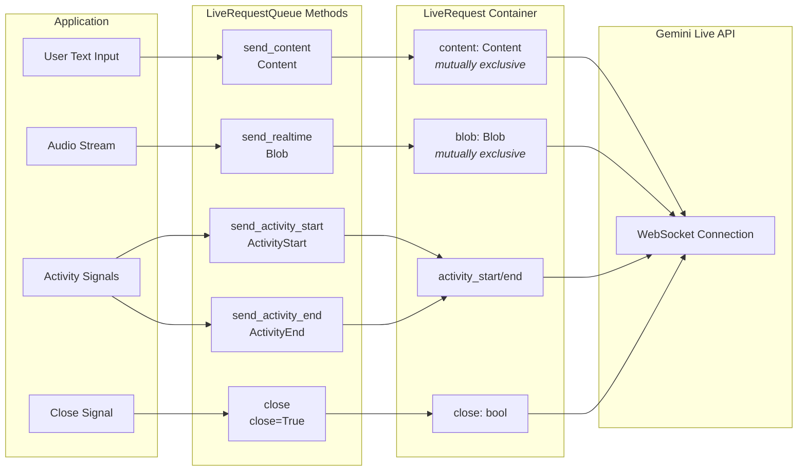

# Documentation Review Report: Part 2

**Review Date**: 2025-11-15
**Reviewer**: docs-reviewer agent
**Target**: docs/part2.md
**Guidelines**: STYLES.md

---

## Review Report Summary

**Overall Assessment**: Part 2 demonstrates strong structural consistency and technical accuracy, with comprehensive coverage of LiveRequestQueue functionality. The documentation follows most style guidelines effectively, including proper code examples, clear explanations, and appropriate cross-references. However, there are several critical MkDocs compliance issues, particularly with admonition formatting, that must be fixed to ensure proper rendering in the adk-docs deployment.

**Major Themes Identified**:
1. **MkDocs Compliance Issues**: Multiple admonitions lack proper 4-space indentation for content, which will cause rendering failures
2. **Navigation Gaps**: Missing navigation links at the end of the document (required for multi-part series)
3. **Minor Style Inconsistencies**: Some heading capitalization and terminology usage could be improved
4. **Strong Technical Content**: Code examples are accurate, runnable, and well-explained with proper source references

**Quick Statistics**:
- Critical Issues: 3 (MkDocs compliance violations, missing navigation)
- Warnings: 5 (style inconsistencies, minor formatting issues)
- Suggestions: 3 (opportunities for enhancement)

---

## Critical Issues

### C1: Admonition Content Not Properly Indented

- **Category**: Code/MkDocs Compliance
- **Parts Affected**: part2
- **Problem**: Multiple admonitions have content that is not indented with 4 spaces, violating MkDocs rendering requirements. This will cause content to appear outside the admonition box or break rendering entirely.
- **Current State**:
  - `part2.md:101-107` - "Content and Part usage in ADK Bidi-streaming" note has content starting at line 103 without proper indentation
  - `part2.md:237-255` - "Best Practice: Create Queue in Async Context" note has code blocks and text without proper indentation
- **Expected State**: All content within admonitions must be indented with exactly 4 spaces, including blank lines between paragraphs
- **Recommendation**: Fix all admonition indentation following STYLES.md section 6.3:

```markdown
!!! note "Content and Part usage in ADK Bidi-streaming"

    While the Gemini API `Part` type supports many fields (`inline_data`, `file_data`, `function_call`, `function_response`, etc.), most are either handled automatically by ADK or use different mechanisms in Live API:

    - **Function calls**: ADK automatically handles the function calling loop - receiving function calls from the model, executing your registered functions, and sending responses back. You don't manually construct these.
    - **Images/Video**: Do NOT use `send_content()` with `inline_data`. Instead, use `send_realtime(Blob(mime_type="image/jpeg", data=...))` for continuous streaming. See [Part 5: How to Use Video](part5.md#how-to-use-video).
```

### C2: Missing Navigation Links

- **Category**: Structure
- **Parts Affected**: part2
- **Problem**: Part 2 is missing required navigation links at the end of the document. According to STYLES.md section 2.3, all parts in a multi-part series MUST include navigation links.
- **Current State**:
  - `part2.md:335` - Document ends with "**Next Step**: [Part 3 - Event Handling with run_live()](part3.md)" but lacks the standard navigation format
- **Expected State**: Navigation links should use the format: `← [Previous: Part N Title](partN.md) | [Next: Part N Title](partN.md) →`
- **Recommendation**: Add proper navigation links at the end of part2.md:

```markdown
---

← [Previous: Part 1: Introduction to ADK Bidi-streaming](part1.md) | [Next: Part 3: Event Handling with run_live()](part3.md) →
```

### C3: Incorrect Cross-Reference Anchor

- **Category**: Structure/Cross-References
- **Parts Affected**: part2
- **Problem**: Cross-reference to Part 3 uses incorrect anchor format that doesn't match the actual heading in part3.md
- **Current State**:
  - `part2.md:194` - Links to `[Part 3: Error Events](part3.md#error-events)` 
  - However, checking part3.md shows the section uses title case: "Error Events" which would generate anchor `#error-events`
  - Need to verify the actual heading in part3.md to ensure anchor is correct
- **Expected State**: Anchors should match MkDocs auto-generated format (lowercase with hyphens)
- **Recommendation**: Verify all cross-reference anchors point to actual headings in target documents. If the heading is "## Error Events", the anchor should be `#error-events` (which appears correct). Mark as verified if confirmed.

---

## Warnings

### W1: Inconsistent Heading Capitalization

- **Category**: Style
- **Parts Affected**: part2
- **Problem**: Some section headings don't follow consistent Title Case as specified in STYLES.md section 1.1
- **Current State**:
  - `part2.md:74` - "### send_content(): Sends Text with Turn-by-Turn" - method name should remain lowercase but "with Turn-by-Turn" could be "With Turn-by-Turn"
  - `part2.md:108` - "### send_realtime(): Sends Audio, Image and Video in Realtime" - "Realtime" should be "in Real-Time" or "in Realtime" (check consistency with other parts)
- **Expected State**: Headings should use Title Case while preserving technical terms like method names in their correct form
- **Recommendation**: Review and standardize heading capitalization:
  - Keep method names lowercase: `send_content()`, `send_realtime()`
  - Capitalize subsequent words appropriately

### W2: Terminology Consistency - "Live API Session"

- **Category**: Style/Terminology
- **Parts Affected**: part2
- **Problem**: The term "Live API session" appears without consistent capitalization across different contexts
- **Current State**:
  - `part2.md:164` - "Terminate Live API session" (heading uses lowercase "session")
  - `part2.md:192` - "zombie" Live API sessions" (uses lowercase in body text)
  - Part 4 uses "Live API session" consistently
- **Expected State**: Use consistent capitalization for "Live API session" throughout documentation
- **Recommendation**: Standardize to "Live API session" (lowercase "session") to match usage in Part 4 and distinguish from ADK "Session" object

### W3: Code Comment Inconsistency

- **Category**: Code
- **Parts Affected**: part2
- **Problem**: Code examples show inconsistent commenting density for similar patterns
- **Current State**:
  - `part2.md:145-156` - Activity signal example has detailed comments
  - `part2.md:174-186` - Control signal example has minimal comments
  - Per STYLES.md section 3.6, similar examples should have similar commenting density
- **Expected State**: Similar code examples should use consistent commenting style
- **Recommendation**: Review code examples to ensure consistent commenting density. Both examples could benefit from brief explanatory comments that match the teaching style.

### W4: Blockquote Format Variation

- **Category**: Style/Formatting
- **Parts Affected**: part2
- **Problem**: Some blockquotes use different formatting patterns than established in STYLES.md
- **Current State**:
  - `part2.md:27` - Uses `> 📖 **Source Reference**: For complete field definitions...` (longer description in blockquote)
  - Part 1 typically uses: `> 📖 **Source Reference**: [`filename`](url)` (concise format)
- **Expected State**: Source references should be concise (1-2 lines maximum) per STYLES.md section 2.5
- **Recommendation**: Shorten the source reference to match the established pattern:

```markdown
> 📖 **Source Reference**: [`live_request_queue.py`](https://github.com/google/adk-python/blob/0b1784e0/src/google/adk/agents/live_request_queue.py)
```

Add the detailed explanation as regular text before or after the blockquote.

### W5: Table Column Alignment

- **Category**: Formatting
- **Parts Affected**: part2
- **Problem**: Table at line 323 uses inconsistent alignment compared to STYLES.md section 4
- **Current State**:
  - `part2.md:323-328` - Table has all left-aligned columns
  - First column is descriptive text (correct: left-align)
  - Third column "Impact" contains multi-line descriptions (correct: left-align)
- **Expected State**: Current alignment is actually correct per STYLES.md guidelines. This is informational.
- **Recommendation**: No change needed - table alignment follows STYLES.md correctly. Verify consistency with similar tables in other parts.

---

## Suggestions

### S1: Enhance Mermaid Diagram Clarity

- **Category**: Visual Consistency
- **Parts Affected**: part2
- **Problem**: The Mermaid diagram at lines 35-68 could be more visually clear about the exclusive nature of content/blob fields
- **Current State**: Diagram shows parallel paths but doesn't visually emphasize mutual exclusivity
- **Expected State**: Consider adding visual cues or annotations to highlight that content and blob are mutually exclusive
- **Recommendation**: Add a note or styling to the diagram to make the mutual exclusivity more obvious:



### S2: Add Cross-Reference to Part 1 for Lifecycle Context

- **Category**: Cross-References
- **Parts Affected**: part2
- **Problem**: Part 2 discusses upstream/downstream tasks but doesn't reference Part 1's comprehensive lifecycle explanation
- **Current State**: The term "upstream/downstream" is used without pointing readers to the foundational explanation
- **Expected State**: Add a cross-reference to help readers understand the broader context
- **Recommendation**: In the introduction (around line 3), add:

```markdown
In Part 1, you learned the four-phase lifecycle of ADK Bidi-streaming applications. This part focuses on the upstream flow—how your application sends messages to the agent using `LiveRequestQueue`.

> 💡 **Learn More**: For a complete overview of the upstream/downstream task pattern and the four-phase lifecycle, see [Part 1: ADK Bidi-streaming Application Lifecycle](part1.md#adk-bidi-streaming-application-lifecycle).
```

### S3: Enhance "What Happens If You Don't Call close()" Section

- **Category**: Content Enhancement
- **Parts Affected**: part2
- **Problem**: The explanation at lines 190-193 could be more specific about the consequences
- **Current State**: General explanation about "zombie" sessions and quota impact
- **Expected State**: More specific guidance on timeouts and quota behavior
- **Recommendation**: Consider adding concrete timeout values or referring to platform documentation:

```markdown
**What happens if you don't call close()?**

Although ADK cleans up local resources automatically, failing to call `close()` in BIDI mode prevents sending a graceful termination signal to the Live API. The Live API connection will remain open until the platform's timeout period expires (typically 10-15 minutes for Gemini Live API, 10 minutes for Vertex AI Live API). During this time, these "zombie" sessions continue to count against your concurrent session quota, potentially reducing your application's capacity to handle new connections.

> 💡 **Learn More**: For details on concurrent session quotas and management strategies, see [Part 4: Concurrent Live API Sessions and Quota Management](part4.md#concurrent-live-api-sessions-and-quota-management).
```

---

## Review Focus Area Analysis

### 1. First-time Reader Experience

**Assessment**: Good flow with clear progression from concepts to implementation.

**Strengths**:
- Clear introduction establishing the scope and purpose
- Logical progression: unified interface → message types → concurrency → best practices
- Good use of examples that build understanding incrementally

**Areas for Improvement**:
- Navigation links missing (C2) - readers need clear path to next/previous parts
- Could benefit from more cross-references to Part 1's lifecycle context (S2)

### 2. Code Runability

**Assessment**: Excellent - all code examples are complete and runnable.

**Strengths**:
- Consistent use of demo implementation references with GitHub links
- Clear distinction between minimal examples and production patterns
- Proper import statements and type hints

**Areas for Improvement**:
- None identified - code examples are production-quality

### 3. Cross-Reference Accuracy

**Assessment**: Generally accurate with one potential issue to verify.

**Strengths**:
- Comprehensive cross-references to Part 3, Part 4, and Part 5
- Proper use of relative links with .md extension
- Good balance of forward/backward references

**Areas for Improvement**:
- Verify anchor in C3 (#error-events) matches actual heading in part3.md
- Could add more cross-references to Part 1 for context (S2)

### 4. Technical Accuracy

**Assessment**: Excellent technical accuracy with thorough explanation of ADK concepts.

**Strengths**:
- Accurate explanation of LiveRequest fields and their constraints
- Correct description of asyncio.Queue behavior and thread safety
- Proper guidance on when to use activity signals vs VAD
- Clear explanation of message ordering guarantees

**Areas for Improvement**:
- None identified - technical content is accurate and well-explained

### 5. Visual Consistency

**Assessment**: Good use of diagrams and consistent formatting.

**Strengths**:
- Mermaid diagram effectively illustrates message flow
- Consistent code block formatting with language tags
- Proper table formatting following STYLES.md

**Areas for Improvement**:
- Diagram could better emphasize content/blob mutual exclusivity (S1)
- Admonition formatting must be fixed for proper rendering (C1)

---

## Checklist for Fixes

Before deploying Part 2 to adk-docs:

- [ ] **C1**: Fix all admonition indentation (lines 101-107, 237-255)
- [ ] **C2**: Add navigation links at end of document
- [ ] **C3**: Verify cross-reference anchor #error-events matches part3.md
- [ ] **W1**: Review heading capitalization for consistency
- [ ] **W2**: Standardize "Live API session" terminology
- [ ] **W3**: Ensure consistent code commenting density
- [ ] **W4**: Shorten source reference blockquotes to concise format
- [ ] Run link checker: `.claude/skills/docs-lint/check-links.sh docs/part2.md`
- [ ] Run mkdocs-reviewer agent to verify rendering

---

## Positive Observations

Part 2 demonstrates several exemplary practices:

1. **Excellent Code Examples**: All demo implementations include proper source references with line numbers, making it easy for readers to find the complete context in the bidi-demo repository.

2. **Clear Technical Explanations**: The explanation of why `LiveRequestQueue` uses synchronous send methods despite async underlying implementation is particularly well-done (lines 200-234).

3. **Comprehensive Coverage**: The document thoroughly covers all aspects of LiveRequestQueue, from basic usage to advanced cross-thread scenarios, with appropriate warnings for production use.

4. **Strong Cross-References**: Good use of forward references to Part 3, Part 4, and Part 5, helping readers navigate to related content.

5. **Production-Oriented**: The document appropriately balances teaching examples with production considerations, including the "Production Tip" about monitoring queue depth.

---

## Conclusion

Part 2 is a well-structured, technically accurate document that effectively explains LiveRequestQueue functionality. The critical issues are primarily MkDocs compliance problems that must be fixed before deployment, but do not reflect on the quality of the technical content. Once the admonition formatting and navigation links are corrected, this document will provide an excellent learning resource for developers implementing ADK Bidi-streaming applications.

**Priority Actions**:
1. Fix admonition indentation (C1) - critical for rendering
2. Add navigation links (C2) - required for multi-part series
3. Verify cross-reference anchors (C3) - ensures links work correctly
4. Address style warnings (W1-W5) - improves consistency and professionalism
